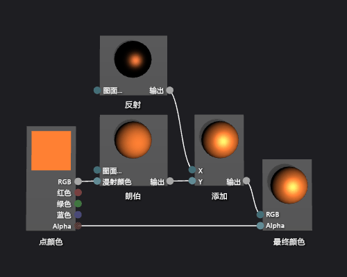

# 如何：创建基本 Phong 着色器
[!INCLUDE[vs2017banner](../code-quality/includes/vs2017banner.md)]

本文档演示如何使用着色器设计器和定向关系图着色器语言 \(DGSL\) 来创建实现典型 Phong 照明模型的照明着色器。  
  
 本文档演示这些活动：  
  
-   将节点的添加到着色器关系图  
  
-   断开节点  
  
-   连接节点  
  
## Phong 照明模型  
 Phong 照明模型扩展了朗伯照明模型，包括模拟图面的反映属性的反射高光。  该反射组件提供用于朗伯照明模型的同一定向光源的其他照明，但其对最终颜色的基值处理方式不同。  镜像显示在场景影响每个不同的图面，基于视图定向光源、一个方向和图面的方向之间的关系。  它是反射色的产品、光泽度和图面的方向，和颜色，光强度和光源的方向。  图面以反映光源直接在该浏览器接收的最大镜面基值和图面反映离开该浏览器的光源不接收基值。  在 Phong 照明模型下，组合一个或多个反射组件以确定对象上的每个点的反射高光的深度，然后将它们添加到朗伯照明模型的结果以产生最终像素颜色。  
  
 有关朗伯照明模型的更多信息，请参见 [如何：创建基本朗伯着色器](../designers/how-to-create-a-basic-lambert-shader.md)。  
  
 在开始之前，请确保显示**“属性”**窗口和**“工具箱”**。  
  
#### 创建 Phong 着色器  
  
1.  创建朗伯着色器，如 [如何：创建基本朗伯着色器](../designers/how-to-create-a-basic-lambert-shader.md)所述。  
  
2.  从 **最终颜色** 节点断开 **朗伯** 节点。  选择 **朗伯** 节点的终端 **RGB**，然后选择 **断开链接**。  这为在下一步中添加的节点腾出空间。  
  
3.  添加一个 **添加** 节点到关系图。  在**“算术”**下的**“工具箱”**中，选择**“添加”**并将其移动到设计图面。  
  
4.  添加一个**“反射”**节点到关系图中。  在**“实用工具”**下的**“工具箱”**中，选择**“反射”**并将其移动到设计图面。  
  
5.  添加反射量。  将**“高光”**节点的**“输出”**终端移到**“添加”**节点的**“X”**终端，然后将**“朗伯”**节点的**“输出”**终端移到**“添加”**节点的**“Y”**节点。  这些连接合并总计像素的漫射、放射颜色基值。  
  
6.  连接计算的颜色值到最终颜色。  将**“添加”**节点的**“输出”**终端移到**“最终颜色”**节点的**“RGB”**终端。  
  
 下图显示了完整的着色器关系图和应用于茶壶模型的着色器的预览。  
  
> [!NOTE]
>  通过使用着色器的 **MaterialDiffuse** 参数，指定此图的橙色颜色，更好地演示着色器效果，使用 **MaterialSpecular** 和 **MaterialSpecularPower**，并指定金属参数已完成。  材料有关参数的信息，请参阅章节Previewing Shaders [着色器设计器](../designers/shader-designer.md)。  
  
   
  
 某些形状可能为某些着色器提供更好的预览。  有关如何预览将着色器的设计器着色器的更多信息，请参见Previewing Shaders [着色器设计器](../designers/shader-designer.md)  
  
 下图显示了文档中描述的着色器，该着色器应用于三维模型。  **MaterialSpecular**属性设置为 \(1.00, 0.50, 0.20, 0.00\)，以及其**MaterialSpecularPower**属性设置为 16。  
  
> [!NOTE]
>  **“MaterialSpecular”**属性确定图面材料的明显完成。  高光泽度图面（如玻璃或塑料）往往具有是明亮的白色底纹的反射颜色。  金属图面往往具有接近其漫射颜色的反射色。  光泽完成图面往往具有是暗灰色阴影的一个反射颜色。  
>   
>  **“MaterialSpecularPower”**属性确定反射光泽的强烈程度。  高光泽度模拟更暗淡、更本地化的突出显示。  非常滴的光泽度模拟程度，可以使图面颜色超饱和或隐身图面的颜色的清除高亮颜色操作。  
  
   
  
 有关如何将着色器应用于三维模型的信息的更多信息，请参见 [如何：向三维模型应用着色器](../designers/how-to-apply-a-shader-to-a-3-d-model.md)。  
  
## 请参阅  
 [如何：向三维模型应用着色器](../designers/how-to-apply-a-shader-to-a-3-d-model.md)   
 [如何：导出着色器](../designers/how-to-export-a-shader.md)   
 [如何：创建基本朗伯着色器](../designers/how-to-create-a-basic-lambert-shader.md)   
 [着色器设计器](../designers/shader-designer.md)   
 [着色器设计器节点](../designers/shader-designer-nodes.md)