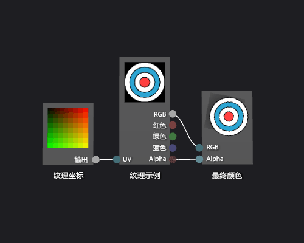

# 如何：创建基本纹理着色器
[!INCLUDE[vs2017banner](../code-quality/includes/vs2017banner.md)]

本文档演示如何使用着色器设计器和定向关系图着色器语言 \(DGSL\) 来创建单个纹理着色器。  此着色器将最终颜色直接设置为 RGB 以及从纹理中采样的 alpha 值。  
  
 本文档演示这些活动：  
  
-   移除着色器图中的节点  
  
-   将节点的到关系图  
  
-   设置着色器参数  
  
-   设置参数可见性  
  
-   连接节点  
  
## 创建基本纹理着色器  
 您可以通过直接写入纹理示例的颜色和 alpha 值到最终输出颜色实现基本的单纹理着色器。  
  
 在开始之前，请确保显示**“属性”**窗口和**“工具箱”**。  
  
#### 创建基本纹理着色器  
  
1.  创建要使用的 DGSL 着色器。  有关如何向项目中添加 DGSL 着色器的信息，请参见[着色器设计器](../designers/shader-designer.md)中的“入门”部分。  
  
2.  删除**“点颜色”**节点。  在**“选择”**模式下，选择**“点颜色”**节点，然后在菜单栏上，选择**“编辑”**，**“删除”**。  这为在下一步中添加的节点腾出空间。  
  
3.  添加一个**“纹理示例”**节点到关系图中。  在**“纹理”**下的**“工具箱”**中，选择**“纹理示例”**并将其移动到设计图面。  
  
4.  添加一个**“纹理坐标”**节点到关系图中。  在**“纹理”**下的**“工具箱”**中，选择**“纹理坐标”**并将其移动到设计图面。  
  
5.  选择应用纹理。  在 **选择** 模式中，选择 **纹理示例** 节点，然后在 **属性** 窗口，通过使用 **文件名** 属性，指定要使用的纹理。  
  
6.  使纹理公开可访问。  选择**“纹理示例”**节点，然后在**“属性”**窗体中，将**“访问”**属性为**“公开”**设置。  现在您可以从其他工具设置纹理，例如**“模型编辑器”**。  
  
7.  连接纹理坐标到纹理示例。  在**“选择”**模式下，移动**“纹理坐标”**节点的**“输出”**终端到**“纹理示例”**节点的**“UV”**终端。  此连接采样指定坐标处的纹理。  
  
8.  连接纹理示例到最终颜色。  将**“纹理示例”**节点的**“RGB”**终端移到**“最终颜色”**节点的**“RGB”**终端，然后将**“纹理示例”**节点的**“Alpha”**终端移到**“最终颜色”**节点的**“Alpha”**终端。  
  
 下图显示了完整的着色器关系图和应用于多维数据集的着色器的预览。  
  
> [!NOTE]
>  在此插图，指定为预览形状和纹理平面，更好地演示着色器的效果。  
  
   
  
 某些形状可能为某些着色器提供更好的预览。  有关如何在着色器设计器中预览着色器的更多信息，请参见 [着色器设计器](../designers/shader-designer.md)  
  
## 请参阅  
 [如何：向三维模型应用着色器](../designers/how-to-apply-a-shader-to-a-3-d-model.md)   
 [图像编辑器](../designers/image-editor.md)   
 [着色器设计器](../designers/shader-designer.md)   
 [着色器设计器节点](../designers/shader-designer-nodes.md)