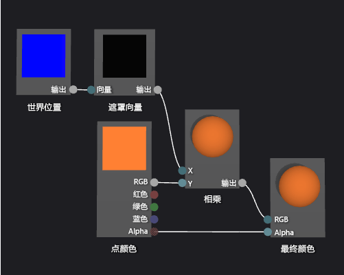

# 如何：创建基于几何图形的渐变着色器
[!INCLUDE[vs2017banner](../code-quality/includes/vs2017banner.md)]

本文档演示如何使用着色器设计器和定向关系图着色器语言来创建基于几何图形的渐变着色器。  此着色器按全局昆建内的对象的各点高度缩放常数 RGB 颜色值。  
  
 本文档演示这些活动：  
  
-   将节点的添加到着色器关系图  
  
-   设置节点属性  
  
-   断开节点  
  
-   连接节点  
  
## 创建基于几何图形渐变着色器  
 您可以合并“像素”位置到您的着色器实现基于几何图形的着色器。  在隐藏语言，在2\-D 的屏幕，像素相对于其颜色和位置包含更多信息。  像素—或在其他系统中称为*片段*—描述对应图面像素值的集合。  此文档中描述的着色器利用世界空间中三维对象的每个像素高度，影响该片段的最终输出颜色。  
  
 在开始之前，请确保显示**“属性”**窗口和**“工具箱”**。  
  
#### 创建基于几何图形渐变着色器  
  
1.  创建要使用的 DGSL 着色器。  有关如何向项目中添加 DGSL 着色器的信息，请参见[着色器设计器](../designers/shader-designer.md)中的“入门”部分。  
  
2.  从 **最终颜色** 节点断开 **点颜色** 节点。  选择 **点颜色** 节点的终端 **RGB**，然后选择 **断开链接**。  这为在下一步中添加的节点腾出空间。  
  
3.  添加一个**“乘”**节点到关系图中。  在**“算术”**下的**“工具箱”**中，选择**“乘法”**并将其移动到设计图面。  
  
4.  添加一个**“遮罩向量”**节点到关系图中。  在**“实用工具”**下的**“工具箱”**中，选择**“掩码向量”**并将其移动到设计图面。  
  
5.  为**“掩码向量”**节点指定掩码值。  在**“选择”**模式下，选择**“掩码向量”**节点，然后在**“属性”**窗口中，将**“绿色 \/ Y”**属性设置为**“True”**，然后将**“红色 \/ X”**、**“蓝色 \/ Z”**和**“Alpha \/ W”**属性设置为**“False”**。  在此示例中，**“红色 \/ X”**、**“绿色 \/ Y”**和**“蓝色 \/ Z”**属性对应于**“世界位置”**节点的 x、y 和 z 元素，并且，不使用**“Alpha \/ W”**。  由于仅**“绿色 \/ Y”**设置为**“真”**，因此，它被遮盖后，只有输入矢量的 y 元素保留。  
  
6.  添加一个**“世界位置”**节点到关系图中。  在**“常量”**下的**“工具箱”**，选择**“世界位置”**并将其移动到设计图面。  
  
7.  掩饰该片段在世界空间内的位置。  在**“选择”**模式下，移动**“世界位置”**节点的**“输出”**终端到**“掩码向量”**节点的**“向量”**终端。  此连接掩饰了该片段的位置以便忽略 x 和 z 组件。  
  
8.  将 RGB 颜色常数乘以掩码自然空间位置。  将**“点颜色”**节点的**“RGB”**终端移到**“乘法”**节点的**“Y”**终端，然后将**“掩码向量”**节点的**“输出”**终端移到**“乘法”**节点的**“X”**节点。  此连接按全局空间中的像素的高度缩放颜色值。  
  
9. 连接缩放的颜色值到最终颜色。  将**“多样”**节点的**“输出”**终端移到**“最终颜色”**节点的**“RGB”**终端。  
  
 下图显示了完整的着色器关系图和应用于球体的着色器的预览。  
  
> [!NOTE]
>  在此图示中，橙色颜色指定为了更好地演示着色器的效果，但是，因为预览形状没有在全局空间的位置，则着色器在着色器设计器中不能完全预览。  该着色器必须在实际场景中预览，演示完整的效果。  
  
   
  
 某些形状可能为某些着色器提供更好的预览。  有关如何在着色器设计器中预览着色器的更多信息，请参见 **Previewing shaders** in [着色器设计器](../designers/shader-designer.md)  
  
 下图显示了文档中描述的着色器，该着色器应用于三维场景，该场景在 [如何：构建三维地形模型](../designers/how-to-model-3-d-terrain.md) 中进行说明。  颜色的深度随着世界中点的高度增加。  
  
   
  
 有关如何将着色器应用于三维模型的信息的更多信息，请参见 [如何：向三维模型应用着色器](../designers/how-to-apply-a-shader-to-a-3-d-model.md)。  
  
## 请参阅  
 [如何：向三维模型应用着色器](../designers/how-to-apply-a-shader-to-a-3-d-model.md)   
 [如何：导出着色器](../designers/how-to-export-a-shader.md)   
 [如何：构建三维地形模型](../designers/how-to-model-3-d-terrain.md)   
 [如何：创建灰度纹理着色器](../designers/how-to-create-a-grayscale-texture-shader.md)   
 [着色器设计器](../designers/shader-designer.md)   
 [着色器设计器节点](../designers/shader-designer-nodes.md)