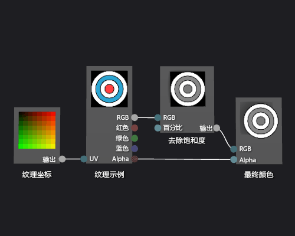

# 如何：创建灰度纹理着色器
本文档演示如何使用着色器设计器和有向图着色器语言 (DGSL) 创建灰度纹理着色器。 此着色器将修改纹理样本的 RGB 颜色值，然后将其与未修改的 Alpha 值一起用于设置最终颜色。  
  
## 创建灰度纹理着色器  
 可以通过在将纹理样本写入最终输出颜色之前修改纹理样本的颜色值来实现灰度纹理着色器。  
  
 开始前，请确保显示“属性”窗口和“工具箱”。  
  
#### 创建灰度纹理着色器  
  
1.  按[如何：创建基本纹理着色器](../designers/how-to-create-a-basic-texture-shader.md)中所述创建基本纹理着色器。  
  
2.  从“最终颜色”节点的“RGB”终端断开“纹理示例”节点的“RGB”终端。 在“选择”模式中，选择“纹理示例”节点的“RGB”终端，然后选择“断开链接”。 这为在下一步中添加的节点腾出空间。  
  
3.  向图添加“去除饱和度”节点。 在“工具箱”中的“文件”，选择“去除饱和度”，然后将其移到设计图面。  
  
4.  使用“去除饱和度”节点计算灰度值。 在“选择”模式中，将“纹理样示例”节点的“RGB”终端移到“去除饱和度”节点的“RGB”终端。  
  
    > [!NOTE]
    >  默认情况下，“去除饱和度”节点完全去除输入颜色的饱和度，并使用标准亮度权重进行灰度转换。 可以通过更改“亮度”属性的值或仅部分去除输入颜色的饱和度来更改“去除饱和度”节点的行为方式。 若要部分去除输入颜色的饱和度，请向“去除饱和度”节点的“百分比”终端提供 [0,1) 范围中的标量值。  
  
5.  将灰度颜色值连接到最终颜色。 将“去除饱和度”节点的“输出”终端移到“最终颜色”节点的“RGB”终端。  
  
 下图显示了已完成的着色器关系图和应用于立方体的着色器预览。  
  
> [!NOTE]
>  在此插图中，飞机用作预览形状，并且已指定一个纹理以更好地演示着色器的效果。  
  
   
  
 某些形状可能会增强某些着色器的预览效果。 有关在着色器设计器中预览着色器的详细信息，请参阅[着色器设计器](../designers/shader-designer.md)  
  
## 另请参阅  
 [如何：向三维模型应用着色器](../designers/how-to-apply-a-shader-to-a-3-d-model.md)   
 [如何：导出着色器](../designers/how-to-export-a-shader.md)   
 [图像编辑器](../designers/image-editor.md)   
 [着色器设计器](../designers/shader-designer.md)   
 [着色器设计器节点](../designers/shader-designer-nodes.md)