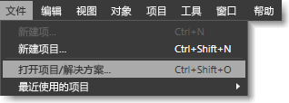
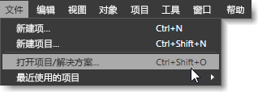

# 键盘快捷方式和修改键
[!INCLUDE[vs2017banner](../code-quality/includes/vs2017banner.md)]

通过使用键盘快捷方式，你需要多次单击鼠标按钮完成的操作只需按一次键盘快捷方式即可完成，从而可加快你的工作速度。  [!INCLUDE[blend_first](../debugger/includes/blend_first_md.md)] 中的键盘快捷方式分为以下两种类别：  
  
-   **访问键** 你可以使用访问键，即通过按键盘上的特定键来访问菜单命令或对话框中的某个区域。  访问键由当前选定命令或对话框中显示的下划线标识。  
  
     若要使用访问键，请先按 Alt 或 F10 以显示下划线，然后按特定菜单项或对话框项的对应字母。  或者，你可以通过使用 Tab 键或箭头键在菜单或对话框中导航。  例如，如果在 [!INCLUDE[blend_subs](../debugger/includes/blend_subs_md.md)] 中按 Alt，则“文件”菜单中的字母“F”下会出现下划线，以将其标识为访问键。  若要打开项目，你可以按住 Alt，按 F，然后按 O。  
  
       
按 Alt 后显示的带下划线的访问键  
  
-   **快捷键** 你可以使用快捷键，通过按键盘快捷方式来执行操作（例如选择菜单命令或修改工具的行为）。  
  
     大多数键盘快捷方式都可以轻松地在 [!INCLUDE[blend_subs](../debugger/includes/blend_subs_md.md)] 的用户界面中确定；它们显示在菜单命令的右边。  例如，在“文件”菜单上，“打开项目”菜单命令包括键盘快捷键 Ctrl\+Shift\+O。  若要查看“工具”面板中的工具的快捷键，请将鼠标指针悬停在工具的上方。  
  
       
显示在具有快捷方式的菜单项旁边的快捷键  
  
 有关辅助功能和其他功能的详细信息，请参阅 [Microsoft 辅助功能](http://go.microsoft.com/fwlink/?LinkId=75069)。  
  
## 修改键  
 某些键盘快捷方式没有关联的菜单项，这意味着你无法使用 [!INCLUDE[blend_subs](../debugger/includes/blend_subs_md.md)] 用户界面来发现这些键盘快捷方式。  以下主题列出了用于修改工具行为或修改操作（例如重设对象大小）的快捷方式：  
  
-   [“美工板”修改键](../designers/artboard-modifier-keys-in-blend.md)  
  
-   [“笔”工具修改键](../designers/pen-tool-modifier-keys-in-blend.md)  
  
-   [“路径选择”工具修改键](../designers/direct-selection-tool-modifier-keys-in-blend.md)