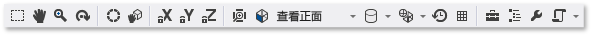

# 模型编辑器
[!INCLUDE[vs2017banner](../code-quality/includes/vs2017banner.md)]

本文档介绍如何使用 [!INCLUDE[vsprvs](../code-quality/includes/vsprvs_md.md)] 模型编辑器查看、创建和修改三维模型。  
  
 你可以使用模型编辑器从头开始创建基本的三维模型，或查看和修改使用全功能三维建模工具创建的更为复杂的三维模型。  模型编辑器支持用于 DirectX 应用程序开发的若干三维模型格式。  
  
## 支持的格式  
 模型编辑器支持以下模型格式：  
  
|格式名称|文件扩展名|支持的操作（查看、编辑、创建）|  
|----------|-----------|---------------------|  
|Autodesk FBX 交换文件|.fbx|查看、编辑、创建|  
|Collada DAE 文件|.dae|查看、编辑（通过使用 FBX 格式保存对 Collada DAE 文件的修改）。|  
|OBJ|.obj|查看、编辑（通过使用 FBX 格式保存对 OBJ 文件的修改）。|  
  
## 入门  
 本节描述如何将三维模型添加到你的 [!INCLUDE[vsprvs](../code-quality/includes/vsprvs_md.md)] 项目并提供开始工作所需的基本信息。  
  
#### 向你的项目添加三维模型  
  
1.  在**“解决方案资源管理器”**中，打开要添加图像的项目的快捷菜单，然后选择**“添加”**\-\>**“新项”**。  
  
2.  在**“添加新项”**对话框中的**“已安装”**下，选择**“图形”**，然后选择**“3D 场景\(.fbx\)”**。  
  
3.  指定模型文件的**“名称”**和需要的创建**“位置”**。  
  
4.  选择**“添加”**按钮。  
  
### 轴方向  
 [!INCLUDE[vsprvs](../code-quality/includes/vsprvs_md.md)] 支持三维轴的每个方向，并从支持它的模型文件格式中加载轴方向信息。  如果未指定轴方向，则 [!INCLUDE[vsprvs](../code-quality/includes/vsprvs_md.md)] 默认使用右手坐标系。  **“轴指示器”**在设计图面右下角显示当前轴方向。  在**“轴指示器”**上，红色表示 x 轴，绿色表示 y 轴，蓝色表示 z 轴。  
  
### 开始建立三维模型  
 在模型编辑器中，每个新对象最初都是一个内置到模型编辑器中的基本三维形状，或称为“基元”。  若要创建新的唯一对象，先将基元添加到场景中，然后通过修改其顶点更改形状。  对于复杂形状，先使用延伸或细分添加更多顶点，然后修改它们。  有关如何向场景中添加基元对象的信息，请参阅[创建和导入三维对象](#Adding3DObjects)。  有关如何向对象中添加更多顶点的信息，请参阅[修改对象](#ModifyingObjects)。  
  
## 使用模型编辑器  
 以下几节描述如何使用模型编辑器处理三维模型。  
  
### 模型编辑器工具栏  
 模型编辑器工具栏包含有助于处理三维模型的命令。  
  
 影响模型编辑器状态的命令位于 [!INCLUDE[vsprvs](../code-quality/includes/vsprvs_md.md)] 主窗口的**“模型编辑器模式”**工具栏上。  建模工具和脚本命令位于模型编辑器设计图面中的**“模型编辑器”**工具栏上。  
  
 以下是**“模型编辑器模式”**工具栏：  
  
   
  
 下表描述**“模型编辑器模式”**工具栏上的项目，按其从左至右的显示顺序列出。  
  
|工具栏项|说明|  
|----------|--------|  
|**选择**|基于活动的选择模式，选择场景中的点、边、面或对象。|  
|**平移**|相对于窗口框架移动三维场景。  若要进行平移，请选择场景中的一个点，然后将其四处移动。   在**“选择”**模式下，你可以按住 Ctrl 键来暂时激活**“平移”**模式。|  
|**缩放**|相对于窗口框架显示较多或较少的场景详细信息。  在**“缩放”**模式下，选择场景中的一个点，然后将其向右或向下移动可放大，向左或向上移动可缩小。   在**“选择”**模式下，你可以按住 Ctrl 键同时使用鼠标滚轮来放大或缩小。|  
|**轨迹**|将视图定位在围绕选定对象的圆形路径上。  如果未选中对象，则路径以场景原点为中心。 **Note:**  启用**“正交”**投影时，此模式不起作用。|  
|**世界本地**|启用此项时，对选定对象的转换将在世界空间中进行。  否则，对选定对象的转换将在本地空间中进行。|  
|**透视模式**|启用此项时，转换会影响选定对象的中心点的位置和方向（中心点定义转换、缩放和旋转操作的中心。）否则，转换将影响对象的几何图形相对于中心点的位置和方向。|  
|**锁定 X 轴**|将对象操纵限制到 x 轴。  仅当你使用操控器小组件的中心部分时应用。|  
|**锁定 Y 轴**|将对象操纵限制到 y 轴。  仅当你使用操控器小组件的中心部分时应用。|  
|**锁定 Z 轴**|将对象操纵限制到 z 轴。  仅当你使用操控器小组件的中心部分时应用。|  
|**框选对象**|框选选定的对象，以使之位于视图的中心。|  
|**视图**|设置视图方向。  以下是可用方向：   **正面**  将视图定位在场景的正面。   **背面**  将视图定位在场景的背面。   **左侧**  将视图定位在场景的左侧。   **右侧**  将视图定位在场景的右侧。   **顶部**  将视图定位在场景的顶面。   **底部**  将视图定位在场景的底面。 **Note:**  启用**“正交”**投影时，这是更改视图方向的唯一方式。|  
|**投影**|设置用于绘制场景的投影类型。  以下是可用的投影：   **透视**  在透视投影中，远离视点的对象看起来较小，并最终在远处会聚为一个点。   **正交**  在正交投影中，不管对象与视点间的距离如何，对象的大小看上去是相同的。  不显示会聚现象。  启用**“正交”**投影时，不能使用**“轨迹”**模式来定位视图。|  
|**绘制样式**|设置对象在场景中的呈现方式。  以下是可用的样式：   **透明框架**  启用时，对象呈现为透明框架。   **过度绘制**  启用时，通过使用附加混合呈现对象。  使用此工具可以直观显示场景中的过度绘制程度。   **平面着色**  启用时，通过使用基本的平面着色照明模型呈现对象。  使用此工具可以更轻松地看到对象的各个面。   如果这些选项都没启用，则使用应用于自身的材料呈现每个对象。|  
|**实时呈现模式**|启用实时呈现时，即使没有执行用户操作，[!INCLUDE[vsprvs](../code-quality/includes/vsprvs_md.md)] 也将重绘设计图面。  此模式用于处理随时间变化的着色器。|  
|**切换网格**|启用此项时，将显示网格。  否则，不显式网格。|  
|**工具箱**|交替显示或隐藏**“工具箱”**。|  
|**文档大纲**|交替显示或隐藏**“文档大纲”**窗口。|  
|**属性**|交替显示或隐藏**“属性”**窗口。|  
|**高级**|包含高级命令和选项。   **图形引擎**   **用 D3D11 呈现**  使用 Direct3D 11 呈现模型编辑器设计图面。   **用 D3D11WARP 呈现**  使用 Direct3D 11 Windows 高级光栅化平台 \(WARP\) 呈现模型编辑器设计图面。   **场景管理**   **导入**  从另一个三维模型文件向当前场景导入对象。   **附加到父级**  将多个选定对象中的第一个设为剩余选定对象的父级。   **从父级分离**  从父级分离选定的对象。  选定的对象将成为场景中的根对象。  根对象没有父对象。   **创建组**  将选定的对象编组为同级对象。   **合并对象**  将选定的多个对象合并为一个对象。   **从多边形选择创建新的对象**  从当前对象中删除选定面并将包含这些面的新对象添加到场景中。   **工具**   **翻转多边形绕组**  翻转选定的多边形，使其绕组序列和图面法向反转。   **移除所有动画**  移除对象中的动画数据。   **三角化**  将选定对象转换为三角形。   **视图**   隐面消除  启用或禁用隐面消除。   **帧速率**  在设计图面的右上角显示帧速率。  帧速率为每秒绘制的帧数。   当你启用**“实时呈现模式”**选项时，此选项才有用。   **全部显示**  显示场景中的所有对象。  此选项将每个对象的**“隐藏”**属性重置为**“False”**。   **显示面法向**  显示每个面的法向。   **显示缺失材料**  在没有指派材料的对象上显示特殊纹理。   **显示中心点**  显示或隐藏活动选择项的中心点上的三维轴标记。   **显示占位符节点**  显示占位符节点。  为对象分组时将创建占位符节点。   **显示顶点法向**  显示每个顶点的法向。 **Tip:**  你可以选择**“脚本”**按钮再次运行上一个脚本。|  
  
 以下是**“模型编辑器”**工具栏：  
  
   
  
 下个表描述**“模型编辑器”**工具栏上的项目，按其从上到下的显示顺序列出。  
  
|工具栏项|说明|  
|----------|--------|  
|**转换**|移动选定对象。|  
|**缩放**|更改选定对象的大小。|  
|**旋转**|旋转选定对象。|  
|**选择点**|设置**“选择模式”**可选择对象上的各个点。|  
|**选择边**|设置**“选择模式”**可选择对象上的一个边（两个顶点间的一条线）。|  
|**选择面**|设置**“选择模式”**可选择对象上的一个面。|  
|**选择对象**|设置**“选择模式”**可选择整个对象。|  
|**延伸**|创建其他面并将其连接到选定的面。|  
|**细分**|将每个选定的面划分为多个面。  若要创建新面，需添加新顶点（原始面中心的一个点，每条边中间的一个点），然后将其与原始顶点结合起来。  添加的面数与原始面中的边数相等。|  
  
### 控制视图  
 三维场景基于视图呈现，该视图可视为具有位置和方向的虚拟照相机。  若要更改位置和方向，请使用**“模型编辑器模式”**工具栏上的视图控件。  
  
 下表描述主要视图控件。  
  
|视图控件|说明|  
|----------|--------|  
|**平移**|相对于窗口框架移动三维场景。  若要进行平移，请选择场景中的一个点，然后将其四处移动。   在**“选择”**模式下，你可以按住 Ctrl 键来暂时激活**“平移”**模式。|  
|**缩放**|相对于窗口框架显示较多或较少的场景详细信息。  在**“缩放”**模式下，选择场景中的一个点，然后将其向右或向下移动可放大，向左或向上移动可缩小。   在**“选择”**模式下，你可以按住 Ctrl 键同时使用鼠标滚轮来放大或缩小。|  
|**轨迹**|将视图定位在围绕选定对象的圆形路径上。  如果未选中对象，则路径以场景原点为中心。 **Note:**  启用**“正交”**投影时，此模式不起作用。|  
|**框选对象**|框选选定的对象，以使之位于视图的中心。|  
  
 视图由虚拟照相机建立，但也由投影定义。  投影将定义视图中的形状和对象如何转换为设计图面上的像素。  在**“模型编辑器”**工具栏上，你可以选择**“透视”**或**“正交”**投影。  
  
|投影|说明|  
|--------|--------|  
|**透视**|在透视投影中，远离视点的对象看起来较小，并最终在远处会聚为一个点。|  
|**正交**|在正交投影中，不管对象与视点间的距离如何，对象的大小看上去是相同的。  不显示会聚现象。  启用**“正交”**投影时，不能使用**“轨迹”**模式来随意定位视图。|  
  
 你可能会发现从已知位置和角度查看三维场景很有用处，例如，你希望比较两个相似的场景时。  对于此情形，模型编辑器提供了若干预定义的视图。  若要使用预定义的视图，请在**“模型编辑器模式”**工具栏上，选择**“视图”**，然后选择你所需的预定义视图 \- 正面、背面、左侧、右侧、顶部或底部。  在这些视图中，虚拟照相机直视场景的原点。  例如，选择**“查看顶部”**时，虚拟照相机直接从场景上方查看其原点。  
  
### 查看其他几何详细信息  
 为更好地了解三维对象或场景，你可以查看其他几何详细信息，例如每个顶点的法向、每个面的法向、活动选择项的中心点和其他详细信息。  若要启用或禁用它们，请在**“模型编辑器”**工具栏上，选择**“脚本”**\-\>**“查看”**，然后根据需要选择一个。  
  
###   创建和导入三维对象  
 若要向场景中添加预定义的三维形状，请在**“工具箱”**中，选择需要的一个形状，然后将其移动到设计图面。  新形状定位在场景的原点。  模型编辑器提供七种形状：**“圆锥体”**、**“立方体”**、**“圆柱体”**、**“圆盘”**、**“平面”**、**“球体”**和**“茶壶体”**。  
  
 若要从文件导入三维对象，请在**“模型编辑器”**工具栏上，选择**“高级”**\-\>**“场景管理”**\-\>**“导入”**，然后指定要导入的文件。  
  
### 转换对象  
 你可以通过更改对象的**“旋转”**、**“缩放”**和**“平移”**属性转换对象。  “旋转”通过围绕由中心点定义的 x 轴、y 轴和 z 轴应用连续的旋转操作，来确定对象的方向。  每个旋转规范有三个分量 x、y 和 z，并以度数按此顺序指定分量。  **“缩放”**通过沿以中心点为中心的一个或多个轴按照指定系数拉伸对象，来调整其大小。  “平移”相对于对象的父级（而非其中心点）在三维空间中定位对象。  
  
 你可以使用建模工具或通过设置属性来转换对象。  
  
##### 使用建模工具转换对象  
  
1.  在**“选择”**模式下，选择要转换的对象。  显示透明框架时指示对象已选中。  
  
2.  在**“模型编辑器”**工具栏上，选择**“平移”**、**“缩放”**或**“旋转”**工具。  此时将显示选定对象的平移、缩放或旋转操控器。  
  
3.  使用操控器执行转换。  对于平移和缩放转换，操控器为轴指示器。  你可以一次更改一个轴，也可以使用指示器中心的白立方体同时更改所有轴。  对于旋转，操控器是按颜色编码的圆所构成的球体，每个圆分别对应 x 轴（红色）、y 轴（绿色）和 z 轴（蓝色）。  你必须分别更改每个轴才能创建你需要的旋转。  
  
##### 通过设置属性来转换对象  
  
1.  在**“选择”**模式下，选择要转换的对象。  显示透明框架时指示对象已选中。  
  
2.  在**“属性”**窗口中，为**“旋转”**、**“缩放”**和**“平移”**属性指定值。  
  
    > [!IMPORTANT]
    >  对于**“旋转”**属性，请分别指定绕每一个轴旋转的度数。  旋转将按顺序应用，因此请确保先按 x 轴旋转，然后再按 y 轴、z 轴旋转，以此制定旋转计划。  
  
 通过使用建模工具，你可以快速创建转换，但不精确。  通过设置对象属性，你可以精确指定转换，但速度不快。  我们建议你使用建模工具来获取“足够接近”你的需求的转换，然后微调属性值。  
  
 如果你不想使用操控器，可以启动自由模式。  在**“模型编辑器”**工具栏上，依次选择**“脚本”**\-\>**“工具”**\-\>**“自由操纵”**，可启用（或禁用）自由模式。  在自由模式下，你可以从设计图面上的任意点（而非操控器上的点）开始操纵。  在自由模式下，你可以通过锁定你不希望更改的轴来限制对某些轴的更改。  在**“模型编辑器模式”**工具栏上，选择**“锁定 X”**、**“锁定 Y”**和**“锁定 Z”**按钮的任意组合。  
  
 你可能会发现在处理对象时，网格线对齐很有用处。  在**“模型编辑器模式”**工具栏上，选择**“对齐”**可启用（或禁用）网格线对齐。  启用网格线对齐时，平移、旋转和缩放转换将受预定义增量的约束。  
  
### 使用中心点  
 对象的中心点定义其旋转和缩放的中心。  你可以更改对象的中心点，以更改旋转和缩放转换对它的影响。  在**“模型编辑器模式”**工具栏上，选择**“透视模式”**可启用（或禁用）透视模式。  启用透视模式时，选定对象的中心点上将显示一个小的轴指示器。  然后，你可以使用**“平移”**和**“旋转”**工具操纵中心点。  
  
 有关如何使用中心点的演示，请参阅[如何：修改三维模型的透视点](../designers/how-to-modify-the-pivot-point-of-a-3-d-model.md)。  
  
### 世界和本地模式  
 平移和旋转可发生在对象的本地坐标系（或本地参考系）中，或世界坐标系（或世界参考系）中。  世界参考系与对象的旋转无关。  默认为本地模式。  若要启用（或禁用）世界模式，请在**“模型编辑器模式”**工具栏上，选择**“WorldLocal”**按钮。  
  
###   修改对象  
 你可以通过移动或删除三维对象的顶点、边和面来更改其形状。  默认情况下，模型编辑器处于对象模式，因此你可以选择并转换整个对象。  若要选择点、边或面，请选择适当的选择模式。  在**“模型编辑器模式”**工具栏上，选择**“选择模式”**，然后选择所需的模式。  
  
 你可以通过延伸或细分来创建其他顶点。  延伸将复制面的顶点（共面顶点集），该面仍由复制后的顶点连接。  细分将添加顶点，在以前只有一个面的地方创建多个面。  若要创建新面，需添加新顶点（原始面中心的一个点，每条边中间的一个点），然后将其与原始顶点结合起来。  添加的面数与原始面中的边数相等。  在这两种情况下，你可以平移、旋转和缩放新的顶点来更改对象的几何图形。  
  
##### 从对象延伸面  
  
1.  在面选择模式下，选择要延伸的面。  
  
2.  在**“模型编辑器”**工具栏上，依次选择**“脚本”**\-\>**“工具”**\-\>**“延伸”**。  
  
##### 细分面  
  
1.  在面选择模式下，选择要细分的面。  由于细分会创建新边数据，所以当多个面相邻时，同时细分所有面将得到更一致的结果。  
  
2.  在**“模型编辑器”**工具栏上，依次选择**“脚本”**\-\>**“工具”**\-\>**“细分”**。  
  
 你还可以三角化面、合并对象和将多边形选定项转换为新对象。  三角化将创建其他边，以便将非三角形面转换为最优数目的三角形；但是，它不提供其他几何详细信息。  合并可将选定的对象组合为一个对象。  可从多边形选定项创建新对象。  
  
##### 三角化面  
  
1.  在面选择模式下，选择要三角化的面。  
  
2.  在**“模型编辑器”**工具栏上，依次选择**“脚本”**\-\>**“工具”**\-\>**“三角化”**。  
  
##### 合并对象  
  
1.  在对象选择模式下，选择要合并的对象。  
  
2.  在**“模型编辑器”**工具栏上，依次选择**“脚本”**\-\>**“工具”**\-\>**“合并对象”**。  
  
##### 从多边形选定项创建对象  
  
1.  在面选择模式下，选择要从中创建新对象的面。  
  
2.  在**“模型编辑器”**工具栏上，依次选择**“脚本”**\-\>**“工具”**\-\>**“从多边形选择创建新的对象”**。  
  
### 使用材料和着色器  
 对象的外观取决于场景中照明的交互和对象的材料。  材料的定义取决于描述不同类型光源下图面的反应的属性，还有基于照明信息、纹理贴图、法线贴图和其他数据计算对象图面上每个像素的最终颜色的着色器程序。  
  
 模型编辑器提供以下默认材料：  
  
|材料|说明|  
|--------|--------|  
|不发光|不使用任何模拟照明呈现图面。|  
|朗伯|使用模拟的环境照明和漫射照明呈现图面。|  
|Phong|使用模拟的环境照明、漫射照明和反射高光呈现图面。|  
  
 其中每种材料都会向对象图面应用一种纹理。  你可以为使用材料的每个对象设置不同的纹理。  
  
 若要修改特定对象在场景中的不同光源下的反应，你可以更改材料的照明属性，而不影响使用该材料的其他对象。  下表描述常见的照明属性：  
  
|照明属性|说明|  
|----------|--------|  
|环境|描述环境照明对图面的影响。|  
|漫射|描述平行光和点光对图面的影响。|  
|放射|描述图面如何发光，与其他照明无关。|  
|反射|描述图面如何反射平行光和点光。|  
|反射力|描述反射高光的范围和强度。|  
  
 根据材料支持的方面，你可以更改其照明属性、纹理和其他数据。  在**“选择”**模式下，选择需要更改材料的对象，然后在**“属性”**窗口中，更改**“MaterialAmbient”**、**“MaterialDiffuse”**、**“MaterialEmissive”**、**“MaterialSpecular”**、**“MaterialSpecularPower”**，或其他可用的属性。  材料可以最多显示八种纹理，其属性按顺序从**“纹理 1”**到**“纹理 8”**依次命名。  
  
 若要从对象中删除所有材料，请在**“模型编辑器”**工具栏上，依次选择**“脚本”**\-\>**“材料”**\-\>**“删除材料”**。  
  
 你可以使用**“着色器设计器”**，创建可应用于你的三维场景中的对象的自定义着色器材料。  有关如何创建自定义着色器材料的信息，请参阅[着色器设计器](../designers/shader-designer.md)。  有关如何将自定义着色器材料应用于对象的信息，请参阅[如何：向三维模型应用着色器](../designers/how-to-apply-a-shader-to-a-3-d-model.md)。  
  
### 场景管理  
 你可以将场景作为对象的层次结构进行管理。  多个对象排列在层次结构中时，父节点的任何平移、缩放或旋转也影响其子级。  你要从较为基本的对象构造复杂对象或场景时，这种方法很有用处。  
  
 你可以使用**“文档大纲”**窗口查看场景的层次结构并选择场景节点。  当你在大纲中选择节点时，可以使用**“属性”**窗口来修改其属性。  
  
 你可以通过两种方法构造对象的层次结构：将一个对象设为其他对象的父级；将对象分组为同级，用占位符节点充当其父级。  
  
##### 创建具有父对象的层次结构  
  
1.  在**“选择”**模式下，选择两个或多个对象。  所选的第一个将成为父对象。  
  
2.  在**“模型编辑器”**工具栏上，依次选择**“脚本”**\-\>**“场景管理”**\-\>**“附加到父级”**。  
  
##### 创建同级对象的层次结构  
  
1.  在**“选择”**模式下，选择两个或多个对象。  占位符对象将创建并成为其父对象。  
  
2.  在**“模型编辑器”**工具栏上，依次选择**“脚本”**\-\>**“场景管理”**\-\>**“创建组”**。  
  
 模型编辑器使用白色透明框架标识第一个选定的对象，它将成为父级。  选择的其他对象具有蓝色透明框架。  默认情况下，不显示占位符节点。  若要显示占位符节点，请在**“模型编辑器”**工具栏上，依次选择**“脚本”**\-\>**“场景管理”**\-\>**“显示占位符节点”**。  你可以处理占位符节点，就像处理非占位符的对象一样。  
  
 若要删除两个对象之间的父子关联，请选择子对象，然后在**“模型编辑器”**工具栏上，依次选择**“脚本”**\-\>**“场景管理”**\-\>**“从父级分离”**。  将父级与子对象分离时，子对象将成为场景中的根对象。  
  
## 键盘快捷键  
  
|命令|键盘快捷键|  
|--------|-----------|  
|切换到**“选择”**模式|Ctrl\+G、Gtrl\+Q   S|  
|切换到**“缩放”**模式|Ctrl\+G、Ctrl\+Z   Z|  
|切换到**“平移”**模式|Ctrl\+G、Ctrl\+P   K|  
|全选|Ctrl\+A|  
|删除当前选定内容|删除|  
|取消当前选择|Esc 键|  
|放大|向前滚动鼠标滚轮   Ctrl\+向前滚动鼠标滚轮   Shift\+向前滚动鼠标滚轮   Ctrl\+PageUp   加号 \(\+\)|  
|缩小|向后滚动鼠标滚轮   Ctrl\+向后滚动鼠标滚轮   Shift\+向后滚动鼠标滚轮   Ctrl\+PageDown   减号 \(\-\)|  
|向上平移照相机|PageDown|  
|向下平移照相机|PageUp|  
|向左平移照相机|向左滚动鼠标滚轮   Ctrl\+PageDown|  
|向右平移照相机|向右滚动鼠标滚轮   Ctrl\+PageDown|  
|查看模型顶部|Ctrl\+L、Ctrl\+T   T|  
|查看模型底部|Ctrl\+L、Ctrl\+U|  
|查看模型左侧|Ctrl\+L、Ctrl\+L|  
|查看模型右侧|Ctrl\+L、Ctrl\+R|  
|查看模型正面|Ctrl\+L、Ctrl\+F|  
|查看模型背面|Ctrl\+L、Ctrl\+B|  
|框选窗口中的对象|F|  
|切换透明框架模式|Ctrl\+L、Ctrl\+W|  
|切换网格线对齐|Ctrl\+G、Ctrl\+N|  
|切换透视模式|Ctrl\+G、Ctrl\+V|  
|切换 x 轴限制|Ctrl\+L、Ctrl\+X|  
|切换 y 轴限制|Ctrl\+L、Ctrl\+Y|  
|切换 z 轴限制|Ctrl\+L、Ctrl\+Z|  
|切换到平移模式|Ctrl\+G、Ctrl\+W   W|  
|切换到缩放模式|Ctrl\+G、Ctrl\+E   E|  
|切换到旋转模式|Ctrl\+G、Ctrl\+R   R|  
|切换到点选择模式|Ctrl\+L、Ctrl\+1|  
|切换到边选择模式|Ctrl\+L、Ctrl\+2|  
|切换到面选择模式|Ctrl\+L、Ctrl\+3|  
|切换到对象选择模式|Ctrl\+L、Ctrl\+4|  
|切换到轨迹（照相机）模式|Ctrl\+G、Ctrl\+O|  
|选择场景中的下一对象|Tab 键|  
|选择场景中的上一对象|Shift\+Tab|  
|基于当前工具操纵选定的对象。|方向键|  
|停用当前操控器|Q|  
|旋转照相机|Alt\+按住鼠标左键拖动|  
  
## 相关主题  
  
|标题|说明|  
|--------|--------|  
|[为游戏和应用程序使用三维资产](../designers/working-with-3-d-assets-for-games-and-apps.md)|概述你可以用来处理图形资产（例如纹理和图像、三维模型和着色器效果）的 [!INCLUDE[vsprvs](../code-quality/includes/vsprvs_md.md)] 工具。|  
|[图像编辑器](../designers/image-editor.md)|描述如何使用 [!INCLUDE[vsprvs](../code-quality/includes/vsprvs_md.md)] 图像编辑器处理纹理和图像。|  
|[着色器设计器](../designers/shader-designer.md)|描述如何使用 [!INCLUDE[vsprvs](../code-quality/includes/vsprvs_md.md)] 着色器设计器处理着色器。|