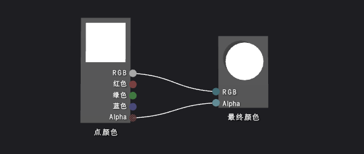
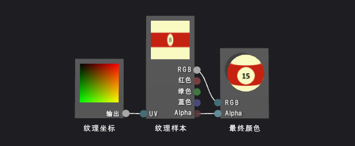
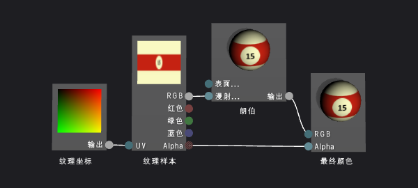
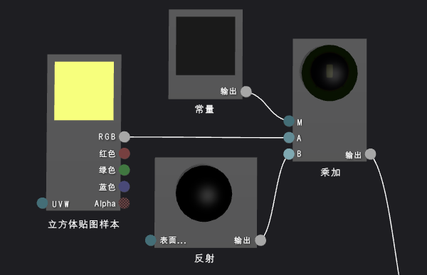
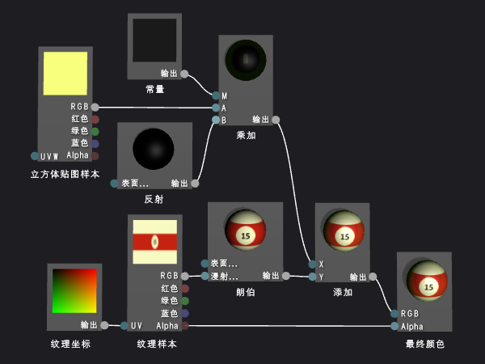

# 演练：创建真实的三维撞球
本演练演示如何使用 [!INCLUDE[vsprvs](../code-quality/includes/vsprvs_md.md)] 中的着色器设计器和图像编辑器创建真实的三维台球。 将几个着色技术与合适的纹理资源合并，实现台球的三维效果。  
  
 本文档演示了这些活动：  
  
-   使用形状和纹理创建台球的基本外观。  
  
-   使用朗伯照明模型添加深度。  
  
-   使用反射高光增强基本外观。  
  
-   通过反射环境创造空间感。  
  
## 先决条件  
 需以下组件和技能来完成本演练：  
  
-   用于将纹理组合成立方体贴图的工具，例如 2010 年 6 月的 DirectX SDK 中包含的 DirectX 纹理工具。  
  
-   熟悉 [!INCLUDE[vsprvs](../code-quality/includes/vsprvs_md.md)] 中的图像编辑器。  
  
-   熟悉 [!INCLUDE[vsprvs](../code-quality/includes/vsprvs_md.md)] 中的着色设计器。  
  
## 使用形状和纹理创建基本外观  
 在计算机图形中，外观的最基本元素是形状和颜色。 在计算机模拟中，通常使用三维模型来表示真实世界物体的形状。 然后使用纹理贴图将颜色细节应用到模型表面。  
  
 通常情况下，可能需要让艺术家创建一个可使用的三维模型，但是由于台球形状很常见（球体），所以着色器设计器内置有合适的模型。  
  
 着色器设计器中默认预览形状为球体；如果正使用其他形状预览着色器，请切换回球体。  
  
#### 使用球体预览着色器  
  
-   在着色器设计器工具栏上，选择“用球体预览”。  
  
 下一步，将创建一个将纹理应用到模型的着色器程序，但在此之前必须先创建一个可使用的纹理。 本演练演示如何使用 [!INCLUDE[vsprvs](../code-quality/includes/vsprvs_md.md)] 中的图像编辑器创建纹理，但你可以使用任何能够以适当格式保存纹理的图像编辑器。  
  
 请确保显示“属性”窗口和“工具箱”。  
  
#### 使用图像编辑器创建台球纹理  
  
1.  创建要使用的纹理。 有关如何向项目中添加纹理的信息，请参阅[图像编辑器](../designers/image-editor.md)中的“入门”部分。  
  
2.  设置图像尺寸，将宽度设置为高度的两倍；这一步必不可少，因为要考虑将纹理映射到台球球面的方式。 若要调整图像大小，请在“属性”窗口为“宽度”和“高度”属性指定新值。 例如，将宽度设置为 512，高度设置为 256。  
  
3.  绘制台球的纹理，请记住将纹理映射到球体的方式。  
  
     纹理应如下所示：  
  
       
  
4.  或者，可能会希望减少此纹理的存储要求。 可根据纹理高度减小其宽度来实现此操作。 这会压缩宽度上的纹理，但是由于纹理映射到球体的方式，当呈现台球时，会展开纹理。 重新设置大小后，纹理应如下所示：  
  
       
  
 现可创建一个将该纹理应用于模型的着色器。  
  
#### 创建基本纹理着色器  
  
1.  创建要使用的 DGSL 着色器。 若要了解如何向项目添加 DGSL 着色器，请参阅[着色器设计器](../designers/shader-designer.md)中的“入门”部分。  
  
     默认情况下，着色器图如下所示：  
  
       
  
2.  修改默认着色器，将纹理样本的值应用于当前像素。 着色器图应如下所示：  
  
       
  
3.  通过配置纹理属性，应用在上一个过程中创建的纹理。 将“纹理样本”节点的“纹理”属性的值设置为“纹理 1”，然后使用同一属性窗口中的“纹理 1”属性组的“文件名”属性指定纹理文件。  
  
 有关如何在着色器中应用纹理的详细信息，请参阅[如何：创建基本纹理着色器](../designers/how-to-create-a-basic-texture-shader.md)。  
  
 台球现应如下所示：  
  
   
  
## 使用朗伯照明模型创建深度  
 到目前为止，已创建一个易于辨认的台球。 但它看起来扁平无趣，更像是台球卡通图片，而不是仿真复制品。 过于简单的着色器产生扁平的外观，就好像台球表面的每个像素接收到同样多的光照。  
  
 在现实世界中，直接面向光源的表面上的光线最亮，与光源成倾角的表面上的光线稍暗。 这是因为表面直接面向光源时，光线中的能量在表面上的分布面积最小。 表面不直接面向光源时，相同的能量在表面上的分布面积变大。 背向光源的表面完全不接收光线能量，所以出现黑暗面。 物体表面的亮度差异是重要的视觉提示，有助于表示物体形状；没有亮度差异，物体就没有立体感。  
  
 在计算机图形中，“照明模型”简化了模拟复杂真实的照明互动，可用于复制真实照明。 朗伯照明模型改变了物体表面漫反射光照量，如上一段所述。 可将朗伯照明模型添加到着色器中，使台球的三维外观更加逼真。  
  
#### 将朗伯照明添加到着色器  
  
-   修改着色器，根据朗伯照明值调整纹理样本值。 着色器图应如下所示：  
  
       
  
-   或者也可通过配置着色器图的 MaterialDiffuse 属性来调整照明的呈现方式。 若要访问着色器图的属性，请选择设计表面的空白区域，然后在“属性”窗口中找到要访问的属性。  
  
 有关如何在着色器中应用朗伯照明的详细信息，请参阅[如何：创建基本朗伯着色器](../designers/how-to-create-a-basic-lambert-shader.md)。  
  
 使用朗伯照明后，台球应如下所示：  
  
   
  
## 使用反射高光增强基本外观  
 朗伯照明模型提供形状和维度感，在仅有纹理的着色器中无法实现这一点。 但此时台球外表仍较暗淡。  
  
 真正的桌球表面通常具有光泽，可反射照在其上的部分光线。 这些反射光线产生反射高光，模拟表面的反射属性。 根据表面的属性，高亮可以是局部的或广泛的，也可以是强烈的或细微的。 根据光源、表面方向和相机位置之间的关系为镜面反射建模，也就是说，当表面方向直接将光源反射到相机时，高光最强；间接反射时，高光则较弱。  
  
 冯氏照明模型建立在朗伯照明模型的基础上，包含上一段所述的反射高光。 可将冯氏照明模型添加到着色器，赋予台球模拟的表面效果，使外观更有趣。  
  
#### 将反射高光添加到着色器  
  
1.  使用添加混合修改着色器以包含反射部分。 着色器图应如下所示：  
  
       
  
2.  或者也可配置着色器图的反射属性（“MaterialSpecular”和“MaterialSpecularPower”），调整反射高光的呈现方式。 若要访问着色器图的属性，请选择设计表面的空白区域，然后在“属性”窗口中找到要访问的属性。  
  
 有关如何在着色器中应用反射高光的详细信息，请参阅[如何：创建基本冯氏着色器](../designers/how-to-create-a-basic-phong-shader.md)。  
  
 应用反射照明后，台球应如下所示：  
  
   
  
## 通过反射环境创造空间感  
 应用反射高光后，台球看起来很逼真。 形状、漆面和表面效果都恰到好处。 但还有一种技术可使台球与环境融为一体。  
  
 如果仔细观察真正的台球，就会看到其光亮的表面不仅仅呈现反射高光，而且还会隐约地反映周围的影像。 通过将环境影像作为纹理与模型自身纹理相结合，确定每个像素最终的颜色，可以模拟此反射。 你可以适当的反射纹理与着色器的其余部分结合，具体取决于希望得到哪种类型的表面效果。 例如，如果着色器模拟像镜子一样的高度反光的表面，则可能只使用反射纹理；但如果着色器模拟像桌球一样比较轻微的反射，则可能要将一小部分反射纹理值与着色器计算的其余部分相结合。  
  
 当然，不能仅仅照搬应用模型的纹理映射的方式将反射贴图应用到模型。 如果这样做，环境的反射就会随台球一起移动，就像粘在台球上一样。 由于发出反射的方向不定，因此需要能够提供各个角度的反射贴图值，并能够根据环境保持反射贴图朝向。 若要满足这些要求，可使用一种名为“立方体贴图”的特殊纹理贴图，该纹理贴图有 6 种纹理，可排列构成立方体的各个面。 可从此立方体内部指向任意方向，找出纹理值。 如果立方体每个面的纹理都包含环境影像，则可对立方体表面的适当位置进行采样，模拟反射。 通过将立方体与环境对准，即可获得准确的环境反射。 若要确定立方体上的采样位置，只需计算相机向量从物体表面的反射，然后将其用作三维纹理坐标。 以这种方式使用立方体贴图是一种常见的技术，该技术称为“环境映射”。  
  
 如之前段落所述，环境映射高效地模拟了真实反射。 你可以将环境映射的反射混合到着色器中，赋予台球模拟的表面效果，使台球更好地融入场景。  
  
 第一步，创建立方体贴图纹理。 在许多应用中，立方体贴图的内容无需绝对有效，特别是当反射较轻微时，或未占据屏幕的大部分空间时。 例如，许多游戏使用预先计算的立方体贴图进行环境映射，且仅使用最接近每个反光物体的贴图，尽管这意味着反射并不正确。 即使是粗略模拟通常也足以实现逼真的效果。  
  
#### 使用图像编辑器为环境映射创建纹理  
  
1.  创建要使用的纹理。 有关如何向项目中添加纹理的信息，请参阅[图像编辑器](../designers/image-editor.md)中的“入门”部分。  
  
2.  设置图像尺寸，使其宽度等于其高度，尺寸为二的幂次方；这一步必不可少，因为要考虑索引立方体贴图的方式。 若要调整图像大小，请在“属性”窗口为“宽度”和“高度”属性指定新值。 例如，可将“宽度”和“高度”属性的值设置为 256。  
  
3.  使用纯色填充纹理。 此纹理将位于立方体贴图的底部，对应台球桌表面。 记住下一纹理要使用的颜色。  
  
4.  创建第二个纹理，大小与第一个纹理相同。 此纹理在立方体贴图的四面重复使用，对应台球桌的表面和侧面以及台球桌周围的区域。 务必在此纹理中使用与底部纹理相同的颜色绘制台球桌表面。 纹理应如下所示：  
  
       
  
     请记住，反射贴图即使不如照片般逼真也能奏效；例如，本文中用于创建图像的立方体贴图只包含四个球带而非六个。  
  
5.  创建第三个纹理，大小与其他两个纹理相同。 此纹理将位于立方体贴图的顶部，对应台球桌上方的天花板。 为使这部分反射更为有趣，可绘制一个顶灯，加强在上一个过程中添加到着色器的反射高光。 纹理应如下所示：  
  
       
  
 现已为立方体贴图各个面创建了单独的纹理，可使用工具将其组合到可存储在单个 .dds 纹理中的立方体贴图中。 可使用任意程序创建立方体贴图，只要该程序能将立方体贴图另存为 .dds 纹理格式即可。 本演练演示如何使用 2010 年 6 月的 DirectX SDK 中的 DirectX 纹理工具创建纹理。  
  
#### 使用 DirectX 纹理工具组合立方体贴图  
  
1.  在 DirectX 纹理工具中的主菜单上，选择“文件”，“新建纹理”。 随机显示“新建纹理”对话框。  
  
2.  在“纹理类型”组中，选择“立方体贴图纹理”。  
  
3.  在“维度”组中，输入正确的“宽度”和“高度”值，然后选择“确定”。 随机显示新的纹理文档。 默认情况下，第一个在纹理文档中显示的纹理对应于“正 X”立方体面。  
  
4.  将为纹理立方体侧面创建的纹理加载到立方体面。 在主菜单中，选择“文件”，“打开到此立方体贴图面”，选择为立方体侧面创建的纹理，然后选择“打开”。  
  
5.  为“负 X”、“正 Z”和“负 Z”立方体面重复步骤 4。 若要执行此操作，必须查看想要加载的面。 若要查看其他立方体贴图面，请在主菜单上选择“查看”，“立方体贴图面”，然后选择要查看的面。  
  
6.  对于“正 Y”立方体面，请加载为纹理立方体顶部创建的纹理。  
  
7.  对于“负 Y”立方体面，请加载为纹理立方体底部创建的纹理。  
  
8.  保存纹理。  
  
 可将立方体贴图设想为具有如下布局：  
  
   
  
 顶部的图像是正 Y(+Y) 立方体面；中间，从左到右分别是是 -X、+Z、+X 和 -Z 立方体面；底部是 -Y 立方体面。  
  
 现可修改着色器，将立方体贴图样本与着色器的其余部分混合。  
  
#### 将环境映射添加到着色器  
  
1.  使用添加混合修改着色器以包含环境映射部分。 着色器图应如下所示：  
  
       
  
     请注意，可使用“乘加”节点来简化着色器图。  
  
     以下是实现环境映射的着色器节点的更详细的视图：  
  
       
  
2.  通过配置立方体贴图的纹理属性，应用在上一个过程中创建的纹理。 将“立方体贴图样本”节点的“纹理”属性的值设置为“纹理 2”，然后使用“纹理 2”属性组的“文件名”属性指定纹理文件。  
  
3.  或者也可通过配置“常量”节点的“输出”属性来调整台球的反射率。 若要访问节点的属性，请选择该节点，然后在“属性”窗口中找到要访问的属性。  
  
 应用环境映射后，台球应如下所示：  
  
   
  
 在此最终图像中，请注意为创建逼真台球组合所添加效果的方式。 形状、纹理和照明构造三维物体的基本外观，反射高光和反射使得台球更加有趣，使其与环境融为一体。  
  
## 另请参阅  
 [如何：导出着色器](../designers/how-to-export-a-shader.md)   
 [如何：向三维模型应用着色器](../designers/how-to-apply-a-shader-to-a-3-d-model.md)   
 [着色器设计器](../designers/shader-designer.md)   
 [图像编辑器](../designers/image-editor.md)   
 [着色器设计器节点](../designers/shader-designer-nodes.md)
