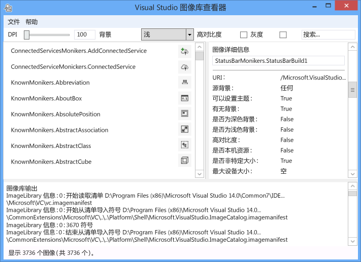
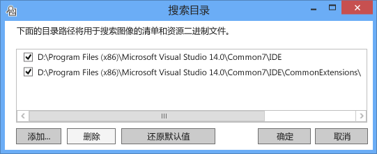
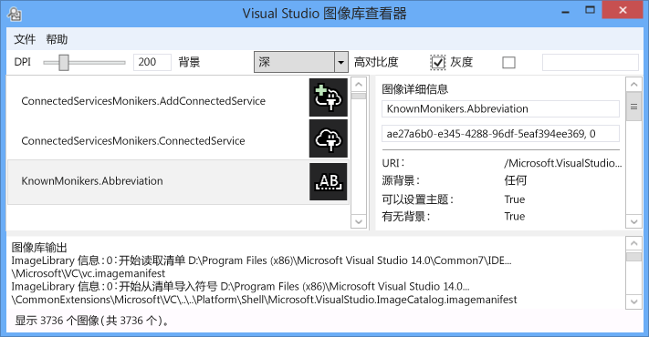
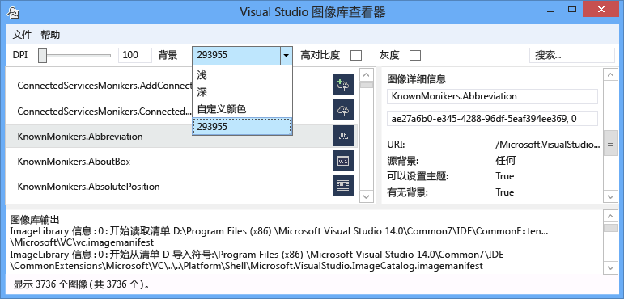
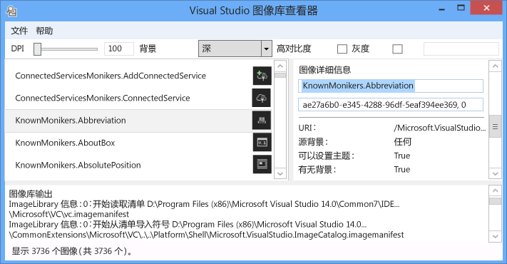
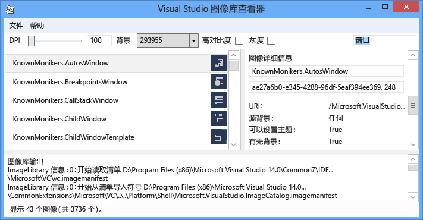
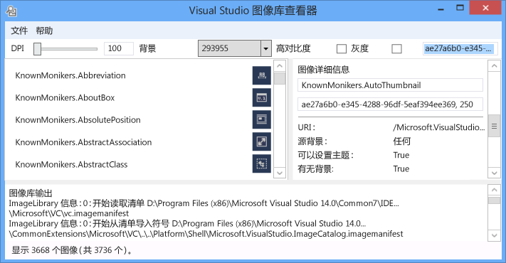
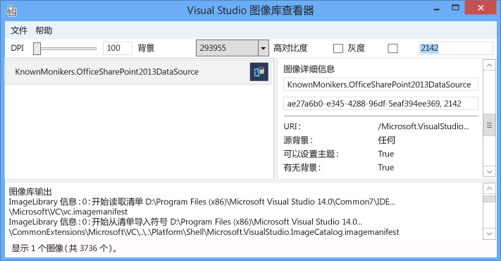

# <a name="image-library-viewer"></a>图像库查看器
Visual Studio 图像库查看器工具可以加载和搜索图像的清单，这样就允许用户与 Visual Studio 将相同的方式对其进行处理。 用户可以更改背景、 大小、 DPI、 高对比度和其他设置。 该工具还显示每个图像清单加载信息，并显示图像清单中的每个图像的源信息。 此工具可用于：  
  
1.  诊断错误  
  
2.  确保特性可在自定义图像的清单正确设置  
  
3.  搜索在 Visual Studio 映像目录中的映像，以便 Visual Studio 扩展可以使用适合的 Visual Studio 风格的映像  
  
   
  
 **映像名字对象**  
  
 图像名字对象 （或简称名字对象） 是唯一标识的图像资产或映像库中的图像列表资产的 guid: id 对。  
  
 **图像清单文件**  
  
 图像清单 (.imagemanifest) 文件是定义一组的图像资产，表示这些资产的实际图像或表示每个资产的映像的名字对象的 XML 文件。 图像的清单可以定义独立图像或图像列表以支持旧版 UI。 此外，还有可以进行设置的资产上或在每个资产后面的单独映像来更改何时以及如何显示这些资产的属性。  
  
 **图像清单架构**  
  
 完成映像清单如下所示：  
  
```xml  
<ImageManifest>  
      <!-- zero or one Symbols elements -->  
      <Symbols>  
        <!-- zero or more Guid, ID, or String elements -->  
      </Symbols>  
      <!-- zero or one Images elements -->  
      <Images>  
        <!-- zero or more Image elements -->  
      </Images>  
      <!-- zero or one ImageLists elements -->  
      <ImageLists>  
        <!-- zero or more ImageList elements -->  
      </ImageLists>  
</ImageManifest>  
```  
  
 **符号**  
  
 如提高可读性并维护帮助，则图像清单可以使用特性值的符号。 符号定义如下：  
  
```xml  
<Symbols>  
      <Import Manifest="manifest" />  
      <Guid Name="ShellCommandGuid" Value="8ee4f65d-bab4-4cde-b8e7-ac412abbda8a" />  
      <ID Name="cmdidSaveAll" Value="1000" />  
      <String Name="AssemblyName" Value="Microsoft.VisualStudio.Shell.UI.Internal" />  
</Symbols>  
```  
  
|||  
|-|-|  
|**子元素**|**定义**|  
|导入|导入当前清单中使用的给定清单文件的符号。|  
|Guid|符号表示一个 GUID，并且必须匹配 GUID 的格式设置。|  
|Id|符号表示 ID，并且必须为非负整数。|  
|字符串|符号表示任意字符串值。|  
  
 符号是区分大小写，并引用使用 $(symbol-name) 语法：  
  
```xml  
<Image Guid="$(ShellCommandGuid)" ID="$(cmdidSaveAll)" >  
      <Source Uri="/$(AssemblyName);Component/Resources/image.xaml" />  
</Image>  
```  
  
 为所有清单预定义了某些符号。 这些绑定可以使用的 Uri 特性中\<源 > 或\<导入 > 到本地计算机上的引用路径的元素。  
  
|||  
|-|-|  
|**符号**|**描述**|  
|CommonProgramFiles|%Commonprogramfiles%环境变量的值|  
|LocalAppData|%Localappdata%环境变量的值|  
|ManifestFolder|包含清单的文件的文件夹|  
|我的文档|当前用户的我的文档文件夹的完整路径|  
|ProgramFiles|%Programfiles%环境变量的值|  
|系统|Windows\System32 文件夹|  
|WinDir|%Windir%环境变量的值|  
  
 **Image**  
  
 \<映像 > 元素定义可由标记引用的映像。 GUID 和 ID 综上所述窗体的图像标记。 为图像标记必须是唯一的整个图像库。 如果多个映像具有给定名字对象，生成库时遇到的第一个是保留的一个。  
  
 它必须包含至少一个源。 虽然非特定大小源将跨各种大小提供的最佳结果，这些内容并非必需。 如果服务要求中未定义的大小的图像\<映像 > 元素和没有任何非特定于大小的源，则服务将选择最佳的大小特定源并将其缩放到所请求的大小。  
  
```xml  
<Image Guid="guid" ID="int" AllowColorInversion="true/false">  
      <Source ... />  
      <!-- optional additional Source elements -->  
</Image>  
```  
  
|||  
|-|-|  
|**特性**|**定义**|  
|Guid|[必需]映像名字对象的 GUID 部分|  
|Id|[必需]图像标记 ID 部分|  
|AllowColorInversion|[可选的默认为 true]指示映像是否可以有在深色背景上使用时以编程方式反转其颜色。|  
  
 **源**  
  
 \<源 > 元素定义单个映像源资产 （XAML 和 PNG）。  
  
```xml  
<Source Uri="uri" Background="background">  
      <!-- optional NativeResource element -->  
 </Source>  
```  
  
|||  
|-|-|  
|**特性**|**定义**|  
|URI|[必需]一个 URI，定义可以从加载映像的位置。 它可以是以下项之一：<br /><br /> -A[包 URI](http://msdn.microsoft.com/en-US/library/aa970069\(v=vs.100\).aspx)使用应用程序: / / 机构<br /><br /> -An 绝对组件资源引用<br /><br /> 的包含本机资源的文件路径|  
|背景|[可选]指示什么类型的后台源旨在一起使用。<br /><br /> 它可以是以下项之一：<br /><br /> - *Light*： 可以在浅色背景上使用了源。<br /><br /> - *深色*： 可以深背景上使用了源。<br /><br /> - *高对比度*： 可以在高对比度模式中的任何背景上使用了源。<br /><br /> - *HighContrastLight*： 可以在高对比度模式中浅色背景上使用了源。<br /><br /> -*HighContrastDark*： 可以深在高对比度模式中背景上使用了源。<br /><br /> 如果**后台**省略属性，可以在任何背景上使用了源。<br /><br /> 如果**后台**是*Light*，*深色*， *HighContrastLight*，或*HighContrastDark*，永远不会反转源的颜色。 如果**后台**是省略还是设置为*高对比度*，由图像的控制的源的颜色反转**AllowColorInversion**属性。|  
  
 A\<源 > 元素可以具有完全的以下的可选子元素之一：  
  
||||  
|-|-|-|  
|**元素**|**属性 （所有所需）**|**定义**|  
|\<大小 >|值|源将用于给定的大小 （以设备为单位） 的映像。 图像将正方形。|  
|\<SizeRange >|MinSize，最大大小|源将可用于映像从 MinSize 到最大大小 （以设备为单位） （含）。 图像将正方形。|  
|\<维度 >|宽度、 高度|源将用于给定的宽度和高度 （以设备为单位） 的映像。|  
|\<DimensionRange >|MinWidth，MinHeight，<br /><br /> MaxWidth MaxHeight|源将用于从最小宽度/高度最大宽度/高度 （以设备为单位） 的映像 （含）。|  
  
 A\<源 > 元素可能还包含一个可选\<NativeResource > 子元素，它定义\<源 >，从本机程序集，而不是托管程序集加载。  
  
```xml  
<NativeResource Type="type" ID="int" />  
```  
  
|||  
|-|-|  
|**特性**|**定义**|  
|类型|[必需]本机资源，XAML 或 PNG 的类型|  
|Id|[必需]本机资源的整数 ID 部分|  
  
 **ImageList**  
  
 \<ImageList > 元素定义一个可以在单个的条带中返回的映像的集合。 根据需要将点播情况下，生成的条带。  
  
```xml  
<ImageList>  
      <ContainedImage Guid="guid" ID="int" External="true/false" />  
      <!-- optional additional ContainedImage elements -->  
 </ImageList>  
```  
  
|||  
|-|-|  
|**特性**|**定义**|  
|Guid|[必需]映像名字对象的 GUID 部分|  
|Id|[必需]图像标记 ID 部分|  
|外部|[可选的默认为 false]指示映像名字对象是否引用当前清单中的图像。|  
  
 包含映像的名字对象没有以引用当前的清单中定义的映像。 如果在映像库中找不到包含的图像，则将在该处使用空白占位符图像。  
  
## <a name="how-to-use-the-tool"></a>如何使用该工具  
 **验证自定义映像清单**  
  
 若要创建自定义清单，我们建议你使用自动生成清单 ManifestFromResources 工具。 若要验证自定义清单，启动图像库查看器，并选择文件 >...设置路径，以打开搜索目录对话框。 此工具将使用搜索目录加载图像的清单，但它还将使用该它们以找到包含在清单中，图像的.dll 文件因此请确保要包含在此对话框中的清单和 DLL 目录。  
  
   
  
 单击**添加...**以选择新的搜索目录以便搜索的清单和其相应的 Dll。 该工具将请记住这些搜索目录，并且它们可以打开或关闭通过选中或取消选中一个目录。  
  
 默认情况下，该工具将尝试查找 Visual Studio 安装目录并将这些目录添加到搜索目录列表。 你可以手动添加找不到该工具的目录。  
  
 所有清单都加载后，该工具可以用于切换**后台**颜色， **DPI**，**高对比度**，或**grayscaling**为映像，以便用户可以直观地检查以验证它们正在正确呈现的各种设置的图像资产。  
  
   
  
 可以为浅色、 深色或自定义值设置的背景色。 选择"自定义颜色"将打开颜色选择对话框，并将该自定义颜色添加到便于重新调用更高版本的背景组合框的底部。  
  
   
  
 选择映像名字对象在右侧的图像详细信息窗格中显示每个真实映像在该标记后面的信息。 窗格中还允许用户按名称或原始 guid: id 值将复制一个名字对象。  
  
   
  
 为每个映像源显示的信息，包括哪种类型的背景以显示，指示是否可为主题也支持高对比度，它是有效的何种大小或它是否非特定大小，以及是否映像来自本机程序集。  
  
   
  
 在验证图像清单时，我们建议你部署清单和映像在其实际位置的 DLL。 这将验证正常工作的任何相对路径以及映像库可以查找和加载的清单和映像 DLL。  
  
 **映像目录 KnownMonikers 搜索**  
  
 若要更好地匹配 Visual Studio 样式，Visual Studio 扩展可以使用 Visual Studio 映像目录而不是创建和使用其自己的映像。 这样无需维护这些映像的好处，并保证该映像将具有高 DPI 后备映像，因此其外观应在 Visual Studio 支持的所有 DPI 设置正确。  
  
 图像库查看器允许清单要在其中搜索，以便用户可以查找表示图像资产的名字对象，并在代码中使用该标记。 若要搜索的映像，在搜索框中输入所需的搜索词，然后按 Enter。 在底部的状态栏将显示多少个匹配项的总的映像外找到所有清单中。  
  
   
  
 当搜索时在现有清单中的映像名字对象，我们建议你搜索，然后使用仅 Visual Studio 映像目录的名字对象、 其他有意公开访问的名字对象或你自己的自定义名字对象。 如果使用非公共的名字对象，自定义 UI 可能已损坏或其映像以意想不到的方式是否时更改这些非公共的名字对象和映像已更改或更新。  
  
 此外，通过 GUID 进行搜索很可能。 此类型的搜索可用于筛选到单个清单中，列表中向下或单个子部分的清单，如果该清单包含多个 Guid。  
  
   
  
 最后，按 ID 搜索可能也为。  
  
   
  
## <a name="notes"></a>说明  
  
-   默认情况下，该工具会中拉入多个图像的清单出现在 Visual Studio 安装目录中。 具有公开可耗用名字对象只有一个投入**Microsoft.VisualStudio.ImageCatalog**清单。 GUID: ae27a6b0-e345-4288-96df-5eaf394ee369 (不要**不**重写此自定义清单中的 GUID) 类型： KnownMonikers  
  
-   该工具尝试启动加载图像中的所有清单可以找到，因此，可能需要几秒钟要实际出现的应用程序。 这也可能是加载清单时速度较慢或者无响应。  
  
## <a name="sample-output"></a>示例输出  
 此工具不生成任何输出。