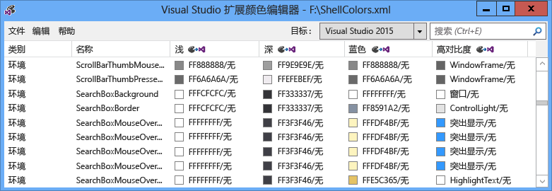
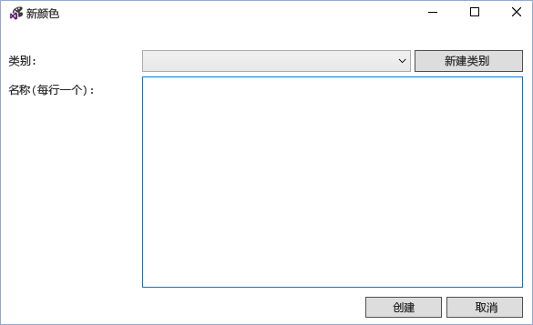
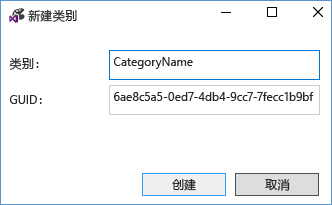
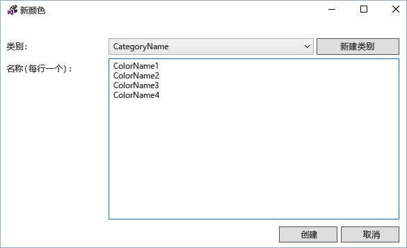
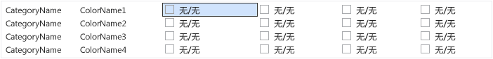
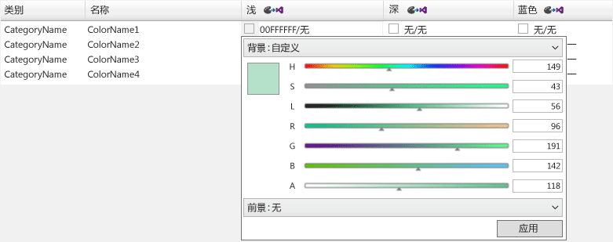
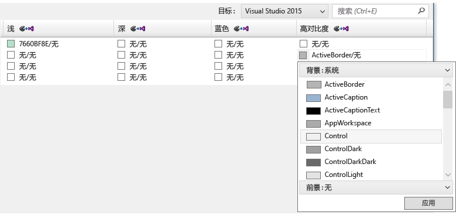
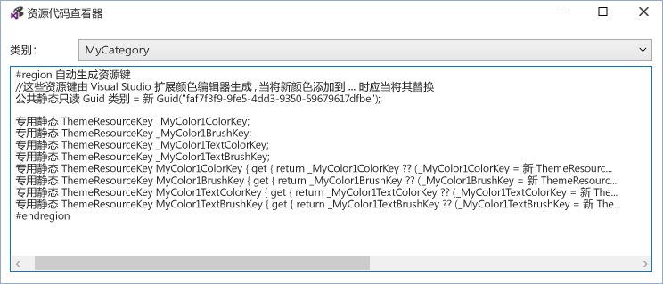
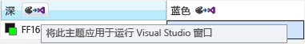

# <a name="vsix-color-editor"></a>VSIX 颜色编辑器
Visual Studio 扩展颜色编辑器工具可以创建和编辑自定义颜色的 Visual Studio。 该工具还可以生成主题的资源键，以便可以在代码中使用的色。 此工具可用于使支持主题设置的 Visual Studio 扩展颜色。 此工具可以打开.pkgdef 和.xml 文件。 通过更改文件扩展名为.xml，visual Studio 主题 （.vstheme 文件） 可以使用与 Visual Studio 扩展颜色编辑器。 此外，可以将.vstheme 文件导入当前的.xml 文件。  
  
   
  
 **包定义文件**  
  
 包定义 (.pkgdef) 文件是定义主题的文件。 颜色本身存储在主题颜色.xml 文件，被编译成一个.pkgdef 文件。 .Pkgdef 文件部署到 Visual Studio 可搜索位置、 在运行时，处理和合并，以定义主题。  
  
 **颜色标记**  
  
 颜色标记由四个元素组成：  
  
-   **类别名称：**一组的颜色的逻辑分组。 如果已有特定于所需的 UI 元素或组的 UI 元素的颜色，请使用现有的类别名称。  
  
-   **标记名称：**的颜色标记和令牌集的描述性名称。 设置包括背景和前景 （文本） 标记名称，以及所有其状态，以及这些应如何命名，因此很容易地识别对，并且它们适用于的状态。  
  
-   **颜色值 （或色调）：**所需的每个彩色的主题。 始终创建背景和文本颜色值成对。 颜色配对的背景/前景以便始终对在其绘制的背景色可读文本 （前台） 颜色。 这些颜色链接且将在 UI 中一起使用。 如果不能用文本的背景，未定义前景色。  
  
-   **系统颜色名称：**在高对比度显示中使用。  
  
## <a name="how-to-use-the-tool"></a>如何使用该工具  
 尽可能多地，并在适当的情况而不是进行新的应重复使用现有的 Visual Studio 颜色。 但是，在其中定义没有适当的颜色的情况下，自定义颜色应为创建以保留扩展主题兼容。  
  
 **创建新的颜色标记**  
  
 若要创建自定义使用 Visual Studio 扩展颜色编辑器的颜色，请按照下列步骤：  
  
1.  确定的类别名称和标记名称的新的颜色标记。  
  
2.  选择 UI 元素将用于为每个主题和的系统颜色高对比度色调。  
  
3.  使用颜色编辑器来创建新的颜色标记。  
  
4.  在 Visual Studio 扩展中使用的颜色。  
  
5.  在 Visual Studio 中测试所做的更改。  
  
 **步骤 1： 确定的类别和新的颜色标记的标记名称。**  
  
 VSColor 为首选的命名方案**[类别] [UI 类型] [状态]**。 不要 VSColor 名称，使用 word"color"，因为它是冗余。  
  
 类别名称提供逻辑分组，并且应定义为较窄越好。 例如，单个工具窗口的名称可能是类别名称，但不是整个业务单元或项目团队的名称。 分组到类别中的条目有助于防止具有相同名称的颜色之间产生混淆。  
  
 元素类型的情况下或"状态，"将为其应用颜色，必须清楚地指示标记名称。 例如，活动数据提示的**[UI 类型]**可以命名为"**数据提示**"和**[状态]**可以命名为"**Active**，"导致颜色名称的"**DataTipActive**。" 由于数据提示中有文本，前景色和背景色需要定义。 通过使用背景/前景配对，颜色编辑器将自动创建颜色"**DataTipActive**"的背景和"**DataTipActiveText**"前景。  
  
 如果用户界面的段都具有只有一个状态**[状态]**可以省略名称的一部分。 例如，如果搜索框中有一个边框，并且没有没有状态更改时，会影响边框的颜色，然后边框的颜色标记的名称可以只需调用"**SearchBoxBorder**。"  
  
 一些常见的状态名称包括：  
  
-   活动  
  
-   非活动状态  
  
-   MouseOver  
  
-   MouseDown  
  
-   已选定  
  
-   已设定焦点  
  
 几个标记名称的列表项控件部分的示例：  
  
-   ListItem  
  
-   ListItemBorder  
  
-   ListItemMouseOver  
  
-   ListItemMouseOverBorder  
  
-   ListItemSelected  
  
-   ListItemSelectedBorder  
  
-   ListItemDisabled  
  
-   ListItemDisabledBorder  
  
 **步骤 2： 选择 UI 元素将用于为每个主题和的系统颜色高对比度色调。**  
  
 在自定义颜色选择的用户界面时，选择一个类似的现有用户界面元素，并为基础使用其颜色。 机箱中 UI 元素的颜色已进行检查和测试，以便它们将查找适当并在所有主题中的正确行为。  
  
 **步骤 3： 使用颜色编辑器创建新的颜色标记。**  
  
 启动颜色编辑器和打开或创建新的自定义主题颜色.xml 文件。 选择**编辑 > 新颜色**从菜单。 这将打开一个用于指定类别的对话框和为该类别中颜色条目的一个或多个名称：  
  
   
  
 选择现有类别，或选择**新类别**若要创建新类别。 将打开另一个对话框，并创建一个新的类别名称：  
  
   
  
 新类别然后将变为可用在**新颜色**类别下拉列表菜单。 选择后类别，输入每个新的颜色标记每行一个名称并选择"创建"完成后：  
  
   
  
 与"None"，该值指示尚未定义颜色背景/前景对列出颜色值。 注意： 如果颜色不具有文本颜色/背景颜色对，然后只有背景需要定义。  
  
   
  
 若要编辑颜色标记，请选择该令牌的主题 （列） 的颜色条目。 8 位 ARGB 格式键入十六进制颜色值，该单元格中，输入系统颜色名称或使用下拉菜单来选择所需的颜色通过一组颜色滑块或系统颜色的列表，以添加颜色值。  
  
   
  
   
  
 对于不需要显示文本的组件，请输入只能有一个颜色值： 的背景色。 否则，为文本和背景色，由正斜杠分隔输入值。  
  
 当为高对比度输入值，输入有效的 Windows 系统颜色名称。 不要输入硬编码 ARGB 值。 可以通过从颜色值下拉列表菜单中选择"背景:: 系统"或"前景:: 系统"来查看有效的系统颜色名称的列表。 创建包含文本组件的元素时，使用正确的背景文本系统颜色对或文本可能是不可读。  
  
 当你完成创建、 设置，和编辑的颜色标记时，将它们保存到所需的.xml 或.pkgdef 格式。 既不背景的颜色标记也不前景集将保存为.xml 格式的空颜色，但在.pkgdef 格式中被丢弃。 如果你尝试将空颜色保存到一个.pkgdef 文件，对话框将警告您颜色丢失。  
  
 **步骤 4： 使用 Visual Studio 扩展中的颜色。**  
  
 定义新的颜色后，"生成操作"设置为"内容"，在项目文件中的标记，包括.pkgdef 和"包括在 VSIX"设置为"True"。  
  
   
  
 在 Visual Studio 扩展颜色编辑器中，选择文件 > 基于 WPF 的 UI 进行查看资源代码查看用于访问自定义的代码着色。  
  
   
  
 在静态类在项目中包括此代码。 对引用**Microsoft.VisualStudio.Shell。\<VSVersion >.0.dll**需要添加到项目以使用**ThemeResourceKey**类型。  
  
```csharp  
namespace MyCustomColors  
{  
    public static class MyCategory  
    {  
        #region Autogenerated resource keys  
        // These resource keys are generated by Visual Studio Extension Color Editor, and should be replaced when new colors are added to this category.  
        public static readonly Guid Category = new Guid("faf7f3f9-9fe5-4dd3-9350-59679617dfbe");  
  
        private static ThemeResourceKey _MyColor1ColorKey;  
        private static ThemeResourceKey _MyColor1BrushKey;  
        private static ThemeResourceKey _MyColor1TextColorKey;  
        private static ThemeResourceKey _MyColor1TextBrushKey;  
        public static ThemeResourceKey MyColor1ColorKey { get { return _MyColor1ColorKey ?? (_MyColor1ColorKey = new ThemeResourceKey(Category, "MyColor1", ThemeResourceKeyType.BackgroundColor)); } }  
        public static ThemeResourceKey MyColor1BrushKey { get { return _MyColor1BrushKey ?? (_MyColor1BrushKey = new ThemeResourceKey(Category, "MyColor1", ThemeResourceKeyType.BackgroundBrush)); } }  
        public static ThemeResourceKey MyColor1TextColorKey { get { return _MyColor1TextColorKey ?? (_MyColor1TextColorKey = new ThemeResourceKey(Category, "MyColor1", ThemeResourceKeyType.ForegroundColor)); } }  
        public static ThemeResourceKey MyColor1TextBrushKey { get { return _MyColor1TextBrushKey ?? (_MyColor1TextBrushKey = new ThemeResourceKey(Category, "MyColor1", ThemeResourceKeyType.ForegroundBrush)); } }  
        #endregion  
    }  
}  
```  
  
 这使用户可以访问 XAML 代码中的颜色，并允许 UI 的主题更改进行响应。  
  
```xaml  
<UserControl x:Class="NewTestProject.TestPackageControl" Name="MyToolWindow"  
             xmlns="http://schemas.microsoft.com/winfx/2006/xaml/presentation"  
             xmlns:x="http://schemas.microsoft.com/winfx/2006/xaml"  
             xmlns:ns="clr-namespace:MyCustomColors">  
  <Grid>  
    <TextBlock Background="{DynamicResource {x:Static ns:MyCategory.MyColor1BrushKey}}"  
               Foreground="{DynamicResource {x:Static ns:MyCategory.MyColor1TextBrushKey}}"  
      >Sample Text</TextBlock>  
  
  </Grid>  
</UserControl>  
```  
  
 **步骤 5： 在 Visual Studio 中测试所做的更改。**  
  
 颜色编辑器可以暂时将颜色标记应用于运行的 Visual Studio 来查看实时更改颜色，而无需重新生成扩展包的实例。 为此，请单击"将此主题应用于运行 Visual Studio windows"上的按钮的标头的主题中的每一列。 VSIX 颜色编辑器关闭时，此临时主题将消失。  
  
   
  
 若要使更改为永久，重新生成，并将新颜色添加到.pkgdef 文件和编写代码，将使用这些颜色后，重新部署 Visual Studio 扩展。 重新生成的 Visual Studio 扩展将合并到主题的其余部分的注册表值的新颜色。 然后重新启动 Visual Studio，查看 UI，并验证新颜色按预期方式显示。  
  
## <a name="notes"></a>说明  
 此工具旨在用于创建自定义颜色为预先存在的 Visual Studio 主题，或编辑自定义 Visual Studio 主题的颜色。 若要创建完整的自定义 Visual Studio 主题，下载[Visual Studio 颜色主题编辑器扩展](http://visualstudiogallery.msdn.microsoft.com/6f4b51b6-5c6b-4a81-9cb5-f2daa560430b)从 Visual Studio 扩展库。  
  
## <a name="sample-output"></a>示例输出  
 **XML 颜色输出**  
  
 由工具生成的.xml 文件将类似于此：  
  
```xml  
<Themes>  
  <Theme Name="Light" GUID="{de3dbbcd-f642-433c-8353-8f1df4370aba}">  
    <Category Name="CategoryName" GUID="{eee9d521-dac2-48d9-9a5e-5c625ba2040c}">  
      <Color Name="ColorName1">  
        <Background Type="CT_RAW" Source="FFFFFFFF" />  
      </Color>  
      <Color Name="ColorName2">  
        <Background Type="CT_RAW" Source="FFFFFFFF" />  
        <Foreground Type="CT_RAW" Source="FF000000" />  
      </Color>  
      <Color Name="ColorName3">  
        <Background Type="CT_RAW" Source="FFFF0000" />  
      </Color>  
      <Color Name="ColorName4">  
        <Background Type="CT_RAW" Source="FF000088" />  
        <Foreground Type="CT_RAW" Source="FFFFFFFF" />  
      </Color>  
    </Category>  
  </Theme>  
  <Theme Name="Dark" GUID="{1ded0138-47ce-435e-84ef-9ec1f439b749}">...</Theme>  
  <Theme Name="Blue" GUID="{a4d6a176-b948-4b29-8c66-53c97a1ed7d0}">...</Theme>  
  <Theme Name="HighContrast" GUID="{a5c004b4-2d4b-494e-bf01-45fc492522c7}">...</Theme>  
</Themes>  
  
```  
  
 **PKGDEF 颜色输出**  
  
 由工具生成.pkgdef 文件将类似于以下内容：  
  
```  
[$RootKey$\Themes\{de3dbbcd-f642-433c-8353-8f1df4370aba}\CategoryName]  
"Data"=hex:78,00,00,00,0b,00,00,00,01,00,00,00,21,d5,e9,ee,c2,da,d9,48,9a,5e,5c,62,5b,a2,04,0c,04,00,00,00,0a,00,00,00,43,6f,6c,6f,72,4e,61,6d,65,31,01,ff,ff,ff,ff,00,0a,00,00,00,43,6f,6c,6f,72,4e,61,6d,65,32,01,ff,ff,ff,ff,01,00,00,00,ff,0a,00,00,00,43,6f,6c,6f,72,4e,61,6d,65,33,01,ff,00,00,ff,00,0a,00,00,00,43,6f,6c,6f,72,4e,61,6d,65,34,01,00,00,88,ff,01,ff,ff,ff,ff  
[$RootKey$\Themes\{1ded0138-47ce-435e-84ef-9ec1f439b749}\CategoryName]  
"Data"=hex:...  
[$RootKey$\Themes\{a4d6a176-b948-4b29-8c66-53c97a1ed7d0}\CategoryName]  
"Data"=hex:...  
[$RootKey$\Themes\{a5c004b4-2d4b-494e-bf01-45fc492522c7}\CategoryName]  
"Data"=hex:...  
  
```  
  
 **C# 资源密钥包装器**  
  
 由工具生成的颜色资源键将难以类似于此：  
  
```csharp  
namespace MyNamespace  
{  
    public static class MyColors  
    {  
        #region Autogenerated resource keys  
        // These resource keys are generated by Visual Studio Extension Color Editor, and should be replaced when new colors are added to this category.  
  
        public static string ColorName1ColorKey { get { return "ColorName1ColorKey"; } }  
        public static string ColorName1BrushKey { get { return "ColorName1BrushKey"; } }  
  
        public static string ColorName2ColorKey { get { return "ColorName2ColorKey"; } }  
        public static string ColorName2BrushKey { get { return "ColorName2BrushKey"; } }  
        public static string ColorName2TextColorKey { get { return "ColorName2TextColorKey"; } }  
        public static string ColorName2TextBrushKey { get { return "ColorName2TextBrushKey"; } }  
  
        public static string ColorName3ColorKey { get { return "ColorName4ColorKey"; } }  
        public static string ColorName3BrushKey { get { return "ColorName4BrushKey"; } }  
        public static string ColorName3TextColorKey { get { return "ColorName4TextColorKey"; } }  
        public static string ColorName3TextBrushKey { get { return "ColorName4TextBrushKey"; } }  
        #endregion  
    }  
}  
```  
  
 **WPF 资源字典包装器**  
  
 颜色**ResourceDictionary**由工具生成的密钥将类似于此：  
  
```xaml  
<ResourceDictionary xmlns="http://schemas.microsoft.com/winfx/2006/xaml/presentation"  
        xmlns:x="http://schemas.microsoft.com/winfx/2006/xaml"  
        xmlns:colors="clr-namespace:MyNamespace">  
  
  <SolidColorBrush x:Key="{x:Static colors:MyColors.ColorName1BrushKey}" Color="#FFFFFFFF" />  
  <Color x:Key="{x:Static colors:MyColors.ColorName1ColorKey}" A="255" R="255" G="255" B="255" />  
  
  <SolidColorBrush x:Key="{x:Static colors:MyColors.ColorName2BrushKey}" Color="#FFFFFFFF" />  
  <Color x:Key="{x:Static colors:MyColors.ColorName2ColorKey}" A="255" R="255" G="255" B="255" />  
  <SolidColorBrush x:Key="{x:Static colors:MyColors.ColorName2TextBrushKey}" Color="#FF000000" />  
  <Color x:Key="{x:Static colors:MyColors.ColorName2TextColorKey}" A="255" R="0" G="0" B="0" />  
  
  <SolidColorBrush x:Key="{x:Static colors:MyColors.ColorName3BrushKey}" Color="#FFFF0000" />  
  <Color x:Key="{x:Static colors:MyColors.ColorName3ColorKey}" A="255" R="255" G="0" B="0" />  
  
  <SolidColorBrush x:Key="{x:Static colors:MyColors.ColorName4BrushKey}" Color="#FF000088" />  
  <Color x:Key="{x:Static colors:MyColors.ColorName4ColorKey}" A="255" R="0" G="0" B="136" />  
  <SolidColorBrush x:Key="{x:Static colors:MyColors.ColorName4TextBrushKey}" Color="#FFFFFFFF" />  
  <Color x:Key="{x:Static colors:MyColors.ColorName4TextColorKey}" A="255" R="255" G="255" B="255" />  
</ResourceDictionary>  
```