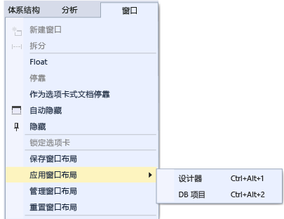

# 在 Visual Studio 中自定义窗口布局
在 Visual Studio 中，你可以自定义窗口的位置、大小和行为，以为各种开发工作流创建最佳窗口布局。 自定义布局时，IDE 会记住它。 例如，如果你更改了 **“解决方案资源管理器”** 的停靠位置然后关闭 Visual Studio，则下次启动时（即使在另一台计算机上工作）， **“解决方案资源管理器”** 将停靠在相同位置。 还可以为自定义布局命名并将其保存，并通过单个命令在各布局间切换。 例如，可以创建一个用于编辑的布局和另一个用于调试的布局，并通过使用“窗口”|“应用窗口布局”菜单命令在二者之间切换。  

## 窗口类型  

### 工具窗口和文档窗口  
 IDE 提供两种基本窗口类型，即 *“工具窗口”* 和 *“文档窗口”*。 工具窗口包括解决方案资源管理器、服务器资源管理器、输出窗口、错误列表、设计器、调试器窗口等。 文档窗口包含源代码文件、任意文本文件、配置文件等。 可以在标题栏处对工具窗口进行重设大小和拖动。 可以在选项卡处拖动文档窗口。 右键单击选项卡或标题栏，以设置窗口上的其他选项。  

 **“窗口”** 菜单显示用于在 IDE 中停靠、浮动和隐藏窗口的选项。 右键单击窗口选项卡或标题栏，以了解该特定窗口的其他选项。 可以一次同时显示特定工具窗口的多个实例。 例如，可以显示多个 Web 浏览器窗口，还可以通过选择 **“窗口”** 菜单上的 **“新建窗口”** ，创建某些工具窗口的其他实例。  

### “预览”选项卡（文档窗口）  
 在“预览”选项卡中，可以在不打开文件的情况下，在编辑器中查看它们。 在单步执行文件（通过“转到定义”）时进行调试的过程中以及在浏览搜索结果时，可以通过在 **“解决方案资源管理器”**中选择文件来预览文件。 预览文档选项井右侧的选项卡中显示的文件。 如果你修改了文件或选择了 **“打开”**，文件将打开以便编辑。  

### 选项卡组  
 当你在 IDE 中使用两个或多个打开的文档时，选项卡组可扩展管理有限工作区的能力。 可以将多个文档窗口和工具窗口组织为垂直或水平选项卡组，并可以随机变换文档在不同选项卡组中的位置。  

### 拆分窗口  
 如果需要在文档中一次查看或编辑两个位置，可以拆分窗口。 若要将文档划分为两个独立滚动部分，请单击 **“窗口”** 菜单上的 **“拆分”** 。 单击 **“窗口”** 菜单上的 **“取消拆分”** 还原为单一视图。  

### 工具栏  
 可以通过拖动或通过使用 **“自定义”** 对话框排列工具栏。 有关如何定位和自定义工具栏的详细信息，请参阅[如何：自定义菜单和工具栏](../ide/how-to-customize-menus-and-toolbars-in-visual-studio.md)。  

## 排列和停靠窗口  
 文档窗口和工具窗口都可以 *“停靠”*，以便其在 IDE 窗口框架中具有位置或大小，或作为独立于 IDE 的单独窗口而浮动。 工具窗口可停靠在 IDE 框架内任意位置，某些工具窗口可作为选项卡式窗口停靠在编辑器框架中。 文档窗口可以停靠在编辑器框架内，且可按选项卡顺序固定到其当前位置。 可以停靠多个窗口，使其共同浮动在 IDE 上方或外部的同一个“筏”中。 也可以隐藏或最小化工具窗口。  

 可以通过以下方式排列窗口：  

-   将文档窗口固定到选项卡井左侧。  

-   将窗口以选项卡形式停靠到编辑框。  

-   将工具窗口停靠到 IDE 中的框架边缘。  

-   在 IDE 的上方或外部浮动文档窗口或工具窗口。  

-   沿 IDE 的边缘隐藏工具窗口。  

-   在不同监视器上显示窗口。  

-   窗口位置重置为默认布局或已保存的自定义布局。  

 可以通过拖动、使用 **“窗口”** 菜单上的命令或右键单击待排列窗口的标题栏，来排列工具窗口和文档窗口。  

> [!NOTE]
>  以下说明中的某些 Visual Studio 用户界面元素在计算机上出现的名称或位置可能会不同。 这些元素取决于你所使用的 Visual Studio 版本和你所使用的设置。 有关详细信息，请参阅[个性化设置 Visual Studio IDE](../ide/personalizing-the-visual-studio-ide.md)。  

### 停靠窗口  
 单击和拖动工具窗口的标题栏或文档窗口的选项卡时，将显示一个菱形引导标记。 进行拖动操作时，当鼠标光标悬停在菱形中的一个箭头之上时，将出现一个阴影区域，显示如果现在释放鼠标按钮，窗口将停靠的位置。  

 若要移动可停靠窗口而不将其对齐到位，请在拖动窗口时选择 Ctrl 键。  

 若要将工具窗口或文档窗口返回到其时间上最近的停靠位置，请在按 **“CTRL”** 的同时双击该窗口的标题栏或选项卡。  

 下图显示文档窗口（仅可停靠在编辑框内）的菱形引导标记：  

   

 工具窗口可固定到 IDE 中框架的一侧或固定到编辑框内。 当将工具窗口拖动到另一个位置时，会显示一个菱形引导标记，以帮助你轻松地重新停靠窗口。  

 工具窗口的菱形引导标记  

   

 下图显示将解决方案资源管理器停靠到新位置（用蓝色阴影区域显示）：  

   

### 关闭和自动隐藏工具窗口  
 可以通过单击标题栏右上角的 X 关闭工具窗口；若要重新打开该窗口，可使用其键盘快捷方式或菜单命令。 工具窗口支持一个名为“自动隐藏”的功能，这可导致窗口在你使用其他窗口时滑开。 窗口自动隐藏时，其名称将显示在 IDE 边缘的选项卡上。 若要再次使用该窗口，请指向该选项卡，使该窗口滑回视野。  

   

> [!NOTE]
>  若要设置“自动隐藏”是单独针对工具窗口执行还是作为停靠组执行，请选中或清除 **“选项”** 对话框中的 **“自动隐藏按钮仅影响活动工具窗口”** 。 有关详细信息，请参阅 [General, Environment, Options Dialog Box](../ide/reference/general-environment-options-dialog-box.md)。  

> [!NOTE]
>  当窗口处于使用状态时，启用了“自动隐藏”的工具窗口可能会暂时滑入视野。 若要再次隐藏该窗口，请选择位于当前窗口之外的项。 当窗口不处于使用状态时，它将滑出视野。  

### 指定第二个监视器  
 如果你还有一个监视器，并且操作系统支持，你可以选择在任一监视器上显示窗口。 甚至可以将多个窗口组合到其他监视器上的“筏”中。  

> [!TIP]
>  可以创建 **“解决方案资源管理器”** 的多个实例，并将它们移动到另一个监视器。 右键单击窗口，并选择 **“新建解决方案资源管理器视图”**。 可以通过在选择 Ctrl 键的同时双击，使所有窗口返回到原监视器。  

### 重置、命名窗口布局，以及在各布局间切换  
 使用 **“重置窗口布局”** 命令，可将 IDE 恢复到原窗口布局以用于设置集合。 运行此命令时，将出现以下操作：  

-   所有 windows 都移动到其默认位置。  

-   默认窗口布局中关闭的所有窗口都关闭。  

-   默认窗口布局中打开的所有窗口都打开。  

### 创建和保存自定义布局  
 Visual Studio 使你可以保存最多 10 个自定义窗口布局，并在这些布局之间快速切换。 以下步骤展示如何创建、保存、调用和管理自定义布局，这些布局利用带有停靠工具窗口和浮动工具窗口的多个监视器。  

 首先，创建一个具有两个项目的测试解决方案，每个项目具有不同的最佳布局。  

##### 创建 UI 项目，自定义布局  

1.  在 **“新项目”** 对话框中，创建一个 Visual C# WPF 桌面应用程序并对其任意命名。 假设这是我们将开发其用户界面的项目，我们想最大化设计器窗口的空间并将其他工具窗口移开。  

2.  如果有多个监视器，可将 **“解决方案资源管理器”** 窗口和 **“属性”** 窗口拉到第二个监视器旁。 在单监视器系统中，尝试关闭除设计器以外的所有其他窗口。  

3.  按 **“Ctrl + Alt + X”** ，显示工具箱。 如果窗口停靠，则拖动窗口，使它浮动在想使其在各监视器上定位的某个位置处。  

4.  按 F5，将 Visual Studio 设置为调试模式。 根据需要调整“自动”、“调用堆栈”和“输出”调试窗口的位置。 你即将创建的布局将应用于编辑模式和调试模式。  

5.  如果调试模式和编辑模式中的布局如你所需，则在主菜单中选择“窗口”>“保存窗口布局”。 将此布局命名为“设计器”。  

     请注意：新布局分配了来自保留列表 Ctrl + Alt + 1...0 的下一个	键盘快捷方式。  

##### 创建数据库项目和布局  

1.  将新的 **“SQL Server 数据库”** 项目添加到解决方案。  

2.  在解决方案资源管理器中右键单击新项目，然后选择 **“在对象资源管理器中查看”**。 这将显示 **“SQL Server 对象资源管理器”** 窗口，可在该窗口中访问你的数据库中的表格、视图和其他对象。 可使此窗口浮动或停靠。 根据需要调整其他工具窗口。 如果要增强真实性，可添加实际数据库，但本演练不必这样做。  

3.  如果布局满足你的要求，在主菜单中选择“窗口”>“保存窗口布局”。 将此布局命名为“DB 项目”。 （此项目不涉及调试模式布局。）  

##### 在布局之间切换  

1.  要在布局之间切换，可使用键盘快捷键，或者在主菜单中选择“窗口”>“应用窗口布局”。  

       

     应用 UI 布局后，请注意此布局在编辑模式和调试模式中的保存方式。  

     如果在工作地点设置了多个监视器，在家里设置了一个单监视器笔记本电脑，则可创建为每个计算机优化的布局。  

     请注意：如果在单监视器系统上应用多监视器布局，放置在第二个监视器上的浮动窗口将隐藏在 Visual Studio 窗口后。 可按 Alt + Tab 将这些窗口前置。 如果稍后打开带多个监视器的 Visual Studio，则可通过重新应用布局将这些窗口恢复到其指定的位置。  

##### 管理和漫游你的布局  

1.  可通过选择“窗口”>“管理窗口布局”来删除、重命名或重新排列自定义布局。 如果移动布局，则键绑定自动调整以反映列表中的新位置。 绑定不能以其他方式修改，因此一次可存储最多 10 个布局。  

       

     要提醒自己哪个键盘快捷键分配给了哪个布局，可选择“窗口”>“应用窗口布局”。  

     这些布局自动在 Visual Studio 版本之间、单独计算机上的 Blend 实例之间以及从 Express Edition 到其他 Express 组织漫游。 但，布局不跨 Visual Studio、Blend 和 Express 漫游。  

## 相关主题  

[如何：在 IDE 中移动](../ide/how-to-move-around-in-the-visual-studio-ide.md)

