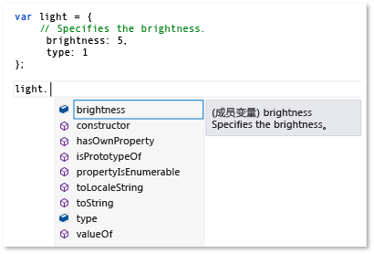
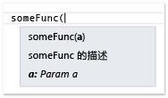

# 扩展 JavaScript IntelliSense
[!INCLUDE[vs2017banner](../code-quality/includes/vs2017banner.md)]

JavaScript IntelliSense 扩展性功能使您可以自定义在 JavaScript 编辑器中的 IntelliSense 结果第三方库的。  这可以改善使用这些库开发人员的体验。  
  
 JavaScript 语言服务添加到项目的第三方 JavaScript 库提供 IntelliSense 功能。  对于大多数库，语句完成的语言服务自动提供。  下图显示了语句完成的示例：  
  
   
  
 如果您的库在标准 JavaScript 注释标记包含变量的声明，函数和对象 \(\/\)，则从 IntelliSense 扩展性功能自动受益，默认情况下，提供在弹出框的描述性信息在完成的元素右侧显示列表中，或者，在中键入时的左括号函数调用。  在弹出框中键入注释包含成员的说明。  下面的示例演示完成的弹出框列表。  
  
   
  
 进一步改进开发人员体验，您可能希望提供类型信息对弹出框的开发人员。  可以提供类型信息通过使用 JavaScript [XML 文档注释](../ide/xml-documentation-comments-javascript.md) 而不是标准注释标记。  您添加 XML 文档注释将使用三斜杠注释标记 \(\/\) 和一组已定义的 XML 元素。  
  
 或者，可以使用 JavaScript IntelliSense 扩展性，可以提供类型信息。  此功能使您可以通过创建 JavaScript 扩展并将其添加自定义 IntelliSense 结果到脚本上下文。  在扩展中，是 JavaScript 文件，可以订阅由语言服务的 `intellisense` 对象公开的事件。  JavaScript IntelliSense 扩展性是库的首选解决方案，如果一个行为模式在库中防止 JavaScript 语言服务提供 IntelliSense 所需的优先级级别，支持，并且，如果对于声明 XML 文档注释外还需要。  通过自定义 IntelliSense 因此，您可以创建一个一流的 IntelliSense 体验，无论可能限制语言服务的默认值函数的所有性能上的模式。  有关更多信息，请参见[适用于标识符的语句结束](../ide/statement-completion-for-identifiers.md)。  
  
## 将扩展到脚本上下文  
 对于 IntelliSense 扩展要执行的，它需要添加到当前脚本上下文。  此扩展可自动添加到脚本上下文自动发现机制，也可以添加扩展到脚本上下文通过使用手动引用组或引用指令。  
  
 自动发现机制使语言服务自动查找遵循文件命名约定 *libraryname*.intellisense.js，因此，位于目录和库相同该扩展应用的扩展。  例如，jQuery 库的有效的扩展名为 jQuery.intellisense.js。  对于更严格的 jQuery 扩展，则可以使用文件名例如 jQuery\-1.7.1.intellisense.js \(一个特定于版本的扩展\) 或 jQuery.ui.intellisense.js \(一个范围 jQuery 库的扩展\)。  该扩展的最严格的版本，如果多个扩展为特定库，找到使用。  
  
 如果要为您的所有 JavaScript 项目文件使用该扩展，则可以选择添加扩展到引用组。  有多种类型的引用组，要么包括隐式引用，这些包括私有的辅助引用的标记。  若要添加扩展，则通常需要添加文件作为隐式引用组，任何 **隐式 \(Windows\)**，**隐式 \(Web\)**。  隐式引用在代码编辑器中打开的每个 .js 文件的大小。  当您使用此方法时，需要添加扩展和该扩展添加的文件。  
  
 使用 **选项** 对话框的 **IntelliSense** 页添加扩展作为引用组。  通过选择 **工具**可以访问 **IntelliSense** 页上，在菜单栏上的，然后选择 **文本编辑器**的 **选项**，**JavaScript**，**IntelliSense**，**引用**。  有关的更多信息，请参见引用组 [JavaScript IntelliSense](../ide/javascript-intellisense.md) 和 [选项，文本编辑器，JavaScript，IntelliSense](../ide/reference/options-text-editor-javascript-intellisense.md)。  
  
 如果要在特定使用扩展设置文件，请使用引用指令。  在使用此策略时，需要引用该扩展，该扩展添加的文件。  有关使用引用指令的信息，请参见 [JavaScript IntelliSense](../ide/javascript-intellisense.md)。  
  
## 处理 IntelliSense 事件  
 扩展性功能使您可以订阅自定义 IntelliSense 结果为诸如语言服务 `intellisense` 对象的 `statementcompletion` 事件。  下面的示例演示语言服务用于隐藏成员从语句完成的一个下划线开头的一个简单的扩展。  此代码在 underscorefilter.js 包含在 \\\\*Visual Studio 安装路径*\\JavaScript\\References"文件夹。  
  
```javascript  
intellisense.addEventListener('statementcompletion', function (event) {  
    if (event.targetName === "this") return;  
  
    var filterRegex;  
  
    if (event.target === undefined || event.target === window)  
        filterRegex = /^_.*\d{2,}/;  
    else  
        filterRegex = /^_.*/;  
  
    event.items = event.items.filter(function (item) {  
        return !filterRegex.test(item.name);  
    });  
});  
```  
  
 在上面的代码中，该扩展检查 `statementcompletion` 事件对象的 [targetName 属性](#TargetName) 和 [目标属性](#Target) 属性排除对象 \(如 `this` 和 `window`，并确保活动语句完成列表中标识。  如果完成列表中标识，该扩展通过筛选以下划线开头的成员更新语句完成 [项目属性](#Items) 集合。  
  
 有关其他示例，在 \\\\*Visual Studio 安装路径*\\JavaScript\\引用的外观文件夹。  此文件夹的 showPlainComments.js 文件提供示例其他事件提供默认值 IntelliSense 为标准 JavaScript 注释标记支持 \(\/\)。  与 underscorefilter.js，showPlainComments.js 已提供了作为工作的扩展，因此，您可以为变量、函数和对象时看到发生的 IntelliSense 信息，当使用注释标记在您的代码。  有关其他示例，请参见[代码示例](#CodeExamples)。  
  
> [!WARNING]
>  如果修改扩展文件包含在 Visual Studio，则可以禁用 JavaScript IntelliSense 或该扩展支持的功能。  
  
 使用 `addEventListener`，在扩展代码，您可以创建以下类型的事件处理程序：  
  
-   `statementcompletion`，添加语句完成事件的处理程序。  语句完成出现的特定类型的成员列表，在键入一个特殊字符 \(例如句点 \(.\) 后，或标识符列表显示，在键入时，或者当您按 CTRL \+ J. 时。  处理程序接收类型 `CompletionEvent`事件对象，支持以下成员：[项目属性](#Items)、[目标属性](#Target)、[targetName 属性](#TargetName)和 [范围的属性](#Scope)。  
  
-   `signaturehelp`，添加 IntelliSense 参数的信息处理程序。  参数信息提供有关函数所需的参数数目、名称和类型的信息。  处理程序接收类型 `SignatureHelpEvent`事件对象，支持以下成员：[目标属性](#Target)，[parentObject 属性](#ParentObject)，[functionComments 属性](#FunctionComments)，[functionHelp 属性](#FunctionHelp)。  
  
-   `statementcompletionhint`，添加 IntelliSense 的快速信息处理程序。  快速信息弹出框中的代码显示标识符的完整声明。  处理程序接收类型 `CompletionHintEvent`事件对象，支持以下成员：[completionItem 属性](#CompletionItem)和 [symbolHelp 属性](#SymbolHelp)。  
  
 有关演示 IntelliSense 功能 \(如语句完成、参数信息并快速信息的示例，请参见 [使用 IntelliSense](../ide/using-intellisense.md)。  
  
> [!NOTE]
>  在 JavaScript，快速信息是指在完成右侧显示列表的弹出框。  无法手动调用快速信息的。  
  
##  <a name="intellisenseObject"></a> intellisense 对象  
 下表显示了 `intellisense` 对象可用的功能。  `intellisense` 对象仅可在设计时。  
  
|功能|描述|  
|--------|--------|  
|`addEventListener(type, handler);`|添加 IntelliSense 事件的事件处理程序。<br /><br /> `type` 是字符串值。  有效值包括 `statementcompletion`、`signaturehelp`和 `statementcompletionhint`。<br /><br /> `handler` 是接收事件对象以下类型之一的事件处理程序功能：<br /><br /> -   `CompletionEvent`，用于 `statementcompletion` 事件。<br />-   `SignatureHelpEvent`，用于 `signaturehelp` 事件。<br />-   `CompletionHintEvent`，用于 `statementcompletionhint` 事件。<br /><br /> 有关使用此函数的示例，请参见 [代码示例](#CodeExamples)。|  
|`annotate(obj, doc);`|指定对象文档通过将对象的文档注释。另一个对象。<br /><br /> `obj` 指定复制文档的对象。<br /><br /> `doc` 指定复制文档的对象。<br /><br /> 有关演示如何使用此功能，请参见 [添加 IntelliSense 批注](#Annotations)的示例。|  
|`getFunctionComments(func);`|返回指定函数的注释。<br /><br /> `func` 指定注释返回的函数。<br /><br /> 使用 `completionItem.value`，可以设置 `func` 参数。<br /><br /> 返回的 `functionComments` 对象包括以下成员：`above`、`inside`和 `paramComment`。  有关更多信息，请参见 [functionComments 属性](#FunctionComments) 属性。<br /><br /> `getFunctionComments` 只能调用依据 `addEventListener`注册一个事件处理程序内部。<br /><br /> 有关演示如何使用此功能，请参见 \\\\*Visual Studio 安装路径*\\JavaScript\\References\\showPlainComments.js。|  
|`logMessage(msg);`|诊断消息发送到输出窗口。<br /><br /> `msg` 是包含消息的字符串。<br /><br /> 有关演示如何使用此功能，请参见 [将消息发送到输出窗口](#Logging)的示例。|  
|`nullWithCompletionsOf(value);`|返回完成列表中 `value` 参数传递的对象所依赖的特定 null 值。<br /><br /> `value` 确定完成为返回的值列表。  `value` 可以是任何类型。<br /><br /> 返回 null 值是看待空在设计时，但是，完成对返回值列表是完成 `value` 参数列表的相同。<br /><br /> 此函数使用作为返回值提供 IntelliSense，则返回类型为可预测的运行时，但是，返回值是 `null` 在设计时。|  
|`redirectDefinition(func, definition);`|当参数帮助或 **转到定义** 请求时，指示 IntelliSense 使用提供的定义功能而不是原始功能。<br /><br /> `func` 指定目标功能。<br /><br /> `definition` 指定要使用的函数而不是目标功能对于参数信息和 **转到定义**。|  
|`setCallContext(func, thisArg);`|设置调用上下文或范围，则为指定的功能。<br /><br /> `func` 指定可以设置范围的功能。<br /><br /> `thisArg` 是 `this` 关键字只能引用，为成员指定新范围的对象标识符。  在此参数，例如，`intellisense.setCallContext(func, { thisArg: "", args: [23,2] });`""，}\);可以包括参数。<br /><br /> `setCallContext` 提供行为类似于 `Function.prototype.bind`，除此之外，为设计时 IntelliSense 仅使用的支持。  可以使用 `setCallContext` 设置功能范围，如果需要模拟调用到非否则可访问的代码，因此，当您调用函数时，函数调用将包含正确的大小和参数。|  
|`undefinedWithCompletionsOf(value);`|返回完成列表中 `value` 参数传递的对象所依赖的特定未定义值。<br /><br /> `value` 确定完成为返回的值列表。  `value` 可以是任何类型。<br /><br /> 未定义返回值视为无定义在设计时，但是，完成对返回值列表是完成 `value` 参数列表的相同。<br /><br /> 此函数使用作为返回值提供 IntelliSense，则返回类型为可预测的运行时，但是，返回值是未定义在设计时。|  
|`version()`|返回 Visual Studio 版本。|  
  
## 事件成员  
 以下各节描述以下事件的事件对象公开的成员：`statementcompletion`、`signaturehelp`和 `statementcompletionhint`。  
  
###  <a name="CompletionItem"></a> completionItem 属性  
 返回该标识符，即完成项，一种快速信息弹出框请求。  此属性可用于 `statementcompletionhint` 事件对象以及 `statementcompletion` 事件对象的 [项目属性](#Items) 属性。  
  
 返回值：`completionItem` 对象  
  
 以下 `completionItem` 对象的成员：  
  
-   `name`.  读取\/写入，当在 `items` 集合；否则，是只读的。  返回确定完成项的字符串。  
  
-   `kind`.  读取\/写入，当在 `items` 集合；否则，是只读的。  返回表示完成项类型的字符串。  可能的值是方法，字段，特性，参数，和变量保留。  
  
-   `glyph`.  读取\/写入，当在 `items` 集合；否则，是只读的。  返回表示图标在完成中所显示的字符串。  `glyph` 的可能值使用以下格式：为：*glyphType*，其中 *glyphType* 对应于 <xref:Microsoft.VisualStudio.Language.Intellisense.StandardGlyphGroup> 枚举的与语言无关的成员。  例如，`vs:GlyphGroupMethod` 是 `glyph`的可能值。  当 `glyph` 没有设置时，`kind` 属性确定默认值图标。  
  
-   `parentObject`.  只读。  返回父对象。  
  
-   `value`.  只读。  返回表示完成项的值。  
  
-   `comments`.  只读。  返回包含注释在字段或变量的字符串。  
  
-   `scope`.  只读。  返回完成项的大小。  可能的值为全局，本地，参数和成员。  
  
###  <a name="Items"></a> 项目属性  
 获取或设置一些语句完成项。  该数组中的每个元素是 [completionItem 属性](#CompletionItem) 对象。  `items` 属性。`statementcompletion` 事件对象可用。  
  
 返回值：数组  
  
###  <a name="FunctionComments"></a> functionComments 属性  
 返回函数的注释。  此属性可为 `signaturehelp` 事件对象可用。  
  
 返回值：`comments` 对象  
  
 以下 `comments` 对象的成员：  
  
-   `above`.  返回在函数上的注释。  
  
-   `inside`.  返回在函数内的注释，通常是为了 VSDoc 格式。  
  
-   `paramComments`.  返回表示每个参数的数组注释在函数。  数组的成员包括：  
  
    -   `name`.  返回表示参数名称的字符串。  
  
    -   `comment`.  返回包含参数注释的字符串。  
  
###  <a name="FunctionHelp"></a> functionHelp 属性  
 返回函数的帮助。  此属性可为 `signaturehelp` 事件对象可用。  
  
 返回值：`functionHelp` 对象  
  
 以下 `functionHelp` 对象的成员：  
  
-   `functionName`.  读\/写。  返回包含函数名的字符串。  
  
-   `signatures`.  读\/写。  获取或设置某些函数签名。  该数组中的每个元素是 `signature` 对象。  某些 `signature` 属性，如 `locid`，对应于常规 [XML 文档注释](../ide/xml-documentation-comments-javascript.md) 属性。  
  
     `signature` 对象的成员包括：  
  
    -   `description`.  读\/写。  返回描述函数的字符串。  
  
    -   `locid`.  读\/写。  返回包含有关该函数的本地化信息的字符串标识符。  
  
    -   `helpKeyword`.  读\/写。  返回包含帮助"关键字的字符串。  
  
    -   `externalFile`.  读\/写。  返回表示文件包含成员 ID. 的字符串  
  
    -   `externalid`.  读\/写。  返回表示函数的成员 ID 的字符串。  
  
    -   `params`.  读\/写。  获取或设置函数的参数。  在参数数组的每个元素是一个包含属性对应于 [\<param\>](../ide/param-javascript.md) 元素的下列属性的 `parameter` 对象：  
  
        -   `name`.  读\/写。  返回表示参数名称的字符串。  
  
        -   `type`.  读\/写。  返回表示参数类型的字符串。  
  
        -   `elementType`.  读\/写。  如果该类型是 `Array`，返回表示元素的类型在数组中的字符串。  
  
        -   `description`.  读\/写。  返回描述参数的字符串。  
  
        -   `locid`.  读\/写。  返回包含有关该函数的本地化信息的字符串标识符。  
  
        -   `optional`.  读\/写。  返回指示的字符串该参数是可选的。  `true` 指示该参数是可选的；`false` 表示未。  
  
    -   `returnValue`.  读\/写。  获取或设置与对应于 [\<returns\>](../ide/returns-javascript.md) 元素的下列属性的属性的返回值对象：  
  
        -   `type`.  读\/写。  返回表示返回类型的字符串。  
  
        -   `elementType`.  读\/写。  如果该类型是 `Array`，返回表示元素的类型在数组中的字符串。  
  
        -   `description`.  读\/写。  返回描述返回值的字符串。  
  
        -   `locid`.  读\/写。  返回包含有关该函数的本地化信息的字符串标识符。  
  
        -   `helpKeyword`.  读\/写。  返回包含帮助"关键字的字符串。  
  
        -   `externalFile`.  读\/写。  返回表示文件包含成员 ID. 的字符串  
  
        -   `externalid`.  读\/写。  返回表示函数的成员 ID 的字符串。  
  
###  <a name="ParentObject"></a> parentObject 属性  
 返回成员函数的父对象。  例如，对于 `document.getElementByID`，`parentObject` 返回 `document` 对象。  此属性可为 `signaturehelp` 事件对象可用。  
  
 返回值：对象  
  
###  <a name="Target"></a> 目标属性  
 返回在触发器个字符表示项目，为句点的对象 \(.\)。  为函数，`target` 返回参数信息请求的功能。  此属性可为 `statementcompletion` 和 `signaturehelp` 事件对象可用。  
  
 返回值：对象  
  
###  <a name="TargetName"></a> targetName 属性  
 返回表示该目标的字符串。  例如，对于“这一点。”，`targetName` 返回“this”。  为“A.B”\(如果光标位于“B”之后\) 时，`targetName` 返回“B”。  此属性可为 `statementcompletion` 事件对象可用。  
  
 返回值：字符串  
  
###  <a name="SymbolHelp"></a> symbolHelp 属性  
 返回一个快速信息弹出框请求的完成项。  此属性可为 `statementcompletionhint` 事件对象可用。  
  
 返回值：`symbolHelp` 对象。  
  
 `symbolHelp` 对象的某些属性，例如 `locid`，对应于常规 [XML 文档注释](../ide/xml-documentation-comments-javascript.md) 属性。  
  
 以下 `symbolHelp` 对象的成员：  
  
-   `name`.  读\/写。  返回包含标识符名称的字符串。  
  
-   `symbolType`.  读\/写。  返回表示符号类型的字符串。  可能的值包括未知，boolean，数字、字符串、对象、函数、数组、日期和 Regex。  
  
-   `symbolDisplayType`.  读\/写。  返回包含类型名称显示的字符串。  如果 `symbolDisplayType` 未设置，使用 `symbolType`。  
  
-   `elementType`.  读\/写。  如果 `symbolType` 是 `Array`，返回表示元素的类型在数组中的字符串。  
  
-   `scope`.  读\/写。  返回表示符号范围的字符串。  可能的值包括全局，本地，参数和成员。  
  
-   `description`.  读\/写。  返回包含符号的声明的字符串。  
  
-   `locid`.  读\/写。  返回包含有关符号的本地化信息的字符串标识符。  
  
-   `helpKeyword`.  读\/写。  返回包含帮助"关键字的字符串。  
  
-   `externalFile`.  读\/写。  返回表示文件包含成员 ID. 的字符串  
  
-   `externalid`.  读\/写。  返回表示符号的成员 ID 的字符串。  
  
-   `functionHelp`.  读\/写。  返回 [functionHelp 属性](#FunctionHelp)，其中可能包含信息，请 `symbolType` 是功能。  
  
###  <a name="Scope"></a> 范围的属性  
 返回事件的完成范围。  完成范围的可能值包括全局和成员。  此属性可为 `statementcompletion` 事件对象可用。  
  
 返回值：字符串  
  
## 调试扩展 IntelliSense  
 不能调试扩展，但是，可以使用 [intellisense 对象](#intellisenseObject) 功能将信息发送到 Visual Studio "输出"窗口。  有关演示如何使用此功能后，请参见 [将消息发送到输出窗口](#Logging) 本主题中的示例。  为了能够的 `logMessage`，至少一个事件处理程序在扩展名必须注册。  
  
##  <a name="CodeExamples"></a> 代码示例  
 本节包含演示如何使用 IntelliSense 扩展性 API 的代码示例。  也可通过以下方式使用这些 API。  有关其他示例，请参见位于 \\\\*Visual Studio 安装路径*\\JavaScript\\References 以下文件文件夹。  这些是 JavaScript 语言服务使用的工作示例。  
  
-   underscoreFilter.js.  此代码隐藏私有成员 IntelliSense。  它包括 `statementcompletion` 事件的事件处理程序。  
  
-   showPlainComments.js.  此代码提供 IntelliSense 支持标准注释支持。  它包括 `signaturehelp` 和 `statementcompletionhint` 事件的事件处理程序。  
  
###  <a name="Annotations"></a> 添加 IntelliSense 批注  
 下面的过程演示如何提供 IntelliSense 文档中的第三方库支持，而无需直接修改库。  为此，您可以在扩展中使用 `intellisense.annotate`。  
  
 对于此示例正常工作，您需要在项目中下面的 JavaScript 文件：  
  
-   demoLib.js，是项目文件委托第三方库。  
  
-   demoLib.intellisense.js，是 IntelliSense 扩展。  此文件位于该项不需要包括，但是，它需要在文件夹和 exampleLib.js 相同。  
  
-   appCode.js，是项目文件表示 app 代码。  
  
##### 添加 IntelliSense 批注  
  
1.  将以下代码添加到 demoLib.js。  
  
    ```javascript  
    function someFunc(a) { };  
    var rectangle;  
  
    ```  
  
2.  将以下代码添加到 demoLib.intellisense.js。  
  
    ```javascript  
    intellisense.annotate(someFunc, function (a) {  
        /// <signature>  
        /// <summary>Description of someFunc</summary>  
        /// <param name="a">Param a</param>  
        /// </signature>  
    });  
  
    intellisense.annotate(window, {  
        // This is a comment on a global variable named rectangle.  
        rectangle: undefined  
    });  
    ```  
  
3.  将下列引用添加指令为 appCode.js 的第一行。  使用的路径此处指示 JavaScript 文件位于同一文件夹中。  
  
    ```javascript  
    /// <reference path="demoLib.js" />  
  
    ```  
  
4.  在 appCode.js，键入以下代码。  您将看到用作 IntelliSense 参数显示的扩展的 XML 文档注释信息。  
  
       
  
5.  在 appCode.js，键入以下代码。  在键入时，您会看到用作 IntelliSense 显示的扩展的标准注释快速信息的。  
  
       
  
###  <a name="Logging"></a> 将消息发送到输出窗口  
 下面的过程演示如何将消息发送到输出窗口。  可以发送消息来帮助调试 IntelliSense 扩展。  
  
 对于此示例正常工作，您需要在项目中下面的 JavaScript 文件：  
  
-   exampleLib.js，是项目文件委托第三方库。  
  
-   exampleLib.intellisense.js，是 IntelliSense 扩展。  此文件位于该项不需要包括，但是，它需要在文件夹和 exampleLib.js 相同。  
  
-   appCode.js，是项目文件表示 app 代码。  
  
##### 将消息发送到输出窗口  
  
1.  将以下代码添加到 exampleLib.js。  
  
    ```javascript  
    var someVar = {  
        a: 1,  
        b: 'hello'  
    };  
    ```  
  
2.  将以下代码添加到 exampleLib.intellisense.js。  
  
    ```javascript  
    intellisense.addEventListener('statementcompletion', function (e) {  
        // Prints out statement completion info: Either (1) the member   
        // list, if the trigger character was typed, or (2) the   
        // statement completion identifiers.  
        // e.target represents the object left of the trigger character.  
        intellisense.logMessage(  
            e.target ? 'member list requested, target: ' + e.targetName : 'statement completion for current scope requested');  
  
        // Prints out all statement completion items.  
        e.items.forEach(function (item) {  
            intellisense.logMessage('[completion item] ' + item.name + ', kind:' + item.kind + ', scope:' + item.scope + ', value:' + item.value);  
        });  
    });  
    ```  
  
3.  将下列引用添加指令为 appCode.js 的第一行。  使用的路径此处指示 JavaScript 文件位于同一文件夹中。  
  
    ```javascript  
    /// <reference path="exampleLib.js" />  
  
    ```  
  
4.  在输出窗口中，选择在 **显示输出来源** 的 **JavaScript 语言服务** 列表。  \(若要查看输出窗口，请从"视图"菜单中选择 **输出**。\)  
  
5.  在 appCode.js，键入以下代码。  在键入时，"输出"窗口显示从语言服务的消息。  在输出窗口的第一条消息指示当前范围内语句完成请求。  
  
    ```javascript  
    some  
    ```  
  
     下面是您应看到输出的分部视图。  
  
    ```scr  
    03:16:14.3113: statement completion for current scope requested  
    03:16:14.3113: [completion item] break, kind:reserved, scope:undefined, value:undefined  
    03:16:14.3113: [completion item] case, kind:reserved, scope:undefined, value:undefined  
    03:16:14.3113: [completion item] catch, kind:reserved, scope:undefined, value:undefined  
  
    …  
    ```  
  
6.  选择在"输出"窗口中 **全部清除** 按钮。  
  
7.  键入以下代码。  在输出窗口的第一条消息指示成员列表请求。  
  
    ```javascript  
    someVar.  
    ```  
  
     下面是您应看到输出的分部视图：  
  
    ```scr  
    03:17:43.4032: member list requested, target: someVar  
    03:17:43.4032: [completion item] a, kind:field, scope:member, value:1  
    03:17:43.4032: [completion item] b, kind:field, scope:member, value:hello  
    03:17:43.4032: [completion item] constructor, kind:method, scope:member, value:  
  
    …  
    ```  
  
###  <a name="Icons"></a> 更改 IntelliSense 图标  
 默认情况下下面的过程演示如何更改 IntelliSense 显示的图标。  当提供有关库特定概念的 IntelliSense 信息 \(如命名空间、选件类、接口和枚举时，这可能是有用。  
  
 有关可用的图标值，请参见 <xref:Microsoft.VisualStudio.Language.Intellisense.StandardGlyphGroup>。  
  
 对于此示例正常工作，您需要在项目中下面的 JavaScript 文件：  
  
-   exampleLib.js，将该项目文件 represens 第三方库。  
  
-   exampleLib.intellisense.js，是 IntelliSense 扩展。  此文件位于该项不需要包括，但是，它需要在文件夹和 exampleLib.js 相同。  
  
-   appCode.js，是项目文件表示 app 代码。  
  
##### 更改图标  
  
1.  将以下代码添加到 exampleLib.js。  
  
    ```javascript  
    function Namespace(name) {  
        this._isNamespace = true;  
        window[name] = this;  
    };  
  
    function Enum(values) {  
        var e = Object.create(values);  
        e._isEnum = true;  
        return e;  
    };  
  
    var SomeNamespace = new Namespace('SomeNamespace');  
    // A constructor function is considered a class.  
    SomeNamespace.SomeClass1 = function () { }  
    SomeNamespace.Enum1 = new Enum({ VALUE1: 0, VALUE2: 1 });  
    ```  
  
2.  将以下代码添加到 exampleLib.intellisense.js。  
  
    ```javascript  
    intellisense.addEventListener('statementcompletion', function (e) {  
        e.items.forEach(function (item) {  
            // Detect a namespace by using the _isNamespace flag.  
            if (item.value && item.value._isNamespace) {  
                item.glyph = 'vs:GlyphGroupNamespace';  
                }  
  
            if (item.parentObject && item.parentObject._isNamespace) {  
                // The item is a member of a namespace.   
  
                // All constructor functions that are part of a namespace   
                // are considered classes.   
                // A constructor function starts with  
                // an uppercase letter by convention.    
                if (typeof item.value == 'function' && (item.name[0].toUpperCase()   
                    == item.name[0])) {  
                    item.glyph = 'vs:GlyphGroupClass';  
                }  
  
                // Detect an enumeration by using the _isEnum flag.  
                if (item.value && item.value._isEnum) {  
                    item.glyph = 'vs:GlyphGroupEnum';  
                }  
            }  
        });  
    });  
  
    intellisense.addEventListener('statementcompletionhint', function (e) {  
        if (e.completionItem.value) {  
            if (e.completionItem.value._isNamespace) {  
                e.symbolHelp.symbolDisplayType = 'Namespace';  
            }  
            if (e.completionItem.value._isEnum) {  
                e.symbolHelp.symbolDisplayType = 'Enum';  
            }  
        }  
    });  
    ```  
  
3.  将下列引用添加指令为 appCode.js 的第一行。  使用的路径此处指示 JavaScript 文件位于同一文件夹中。  
  
    ```javascript  
    /// <reference path="exampleLib.js" />  
  
    ```  
  
4.  在 appCode.js，键入以下代码。  在键入时，您会看到命名空间的图标已更改为“{}”，用于 C\#。  
  
       
  
5.  在 appCode.js，键入以下代码。  在键入时，您为命名 Enum1 成员将看到新枚举图标和这个 SomeClass1 成员的新选件类图标。  
  
       
  
###  <a name="Overriding"></a> 避免使用 IntelliSense 结果的运行时效果  
 JavaScript 语言服务运行代码以动态提供 IntelliSense 信息。  因此，运行时行为可能偶尔会影响需的结果。  当运行时行为会导致不正确的 IntelliSense 时，下面的过程演示如何重写 IntelliSense 结果。  
  
 对于此示例正常工作，您需要在项目中下面的 JavaScript 文件：  
  
-   exampleLib.js，是项目文件委托第三方库。  
  
-   exampleLib.intellisense.js，是 IntelliSense 扩展。  此文件位于该项不需要包括，但是，它需要在文件夹和 exampleLib.js 相同。  
  
-   appCode.js，是项目文件表示 app 代码。  
  
##### 避免使用 IntelliSense 结果的运行时效果  
  
1.  将以下代码添加到 exampleLib.js。  
  
    ```javascript  
    function after(count, func) {  
        return function () {  
            if (--times < 1) {  
                return func.apply(this, arguments);  
            }  
        };  
    };  
    ```  
  
     在上面的代码中，该包装函数忽略初始基于 `count`的值调用，并且不返回结果。  
  
2.  将下列引用添加指令为 appCode.js 的第一行。  使用的路径此处指示 JavaScript 文件位于同一文件夹中。  
  
    ```javascript  
    /// <reference path="exampleLib.js" />  
  
    ```  
  
3.  在 appCode.js，键入以下代码。  该标识符列表将显示而不是 IntelliSense，因为该包装函数从不调用，这意味着，`throttled` 函数不返回任何结果。  
  
       
  
4.  将以下代码添加到 exampleLib.intellisense.js。  这将更改设计时行为，以便 IntelliSense 为所包装的功能显示，按预期方式工作。  
  
    ```javascript  
    window.after = function (count, func) {  
        // Just return func.   
        return func;  
    };  
    ```  
  
5.  在 appCode.js，通过键入先前键入的相同代码测试结果。  此时，IntelliSense 会提供所需信息。  
  
       
  
## 请参阅  
 [JavaScript IntelliSense](../ide/javascript-intellisense.md)   
 [适用于标识符的语句结束](../ide/statement-completion-for-identifiers.md)