# 使用 CodeLens 查找代码更改和其他历史记录
专注于你的工作并在同时了解你的代码所发生的情况 - 无需离开编辑器。 查找代码引用、代码更改、链接的 Bug、工作项、代码评审和单元测试。  
  
> [!NOTE]
>  CodeLens 仅在 Visual Studio Enterprise 和 Visual Studio Professional 版中可用。 在 Visual Studio Community 版中不可用。  
  
 了解各个部分的代码在解决方案中的使用位置和使用方式：  
  
 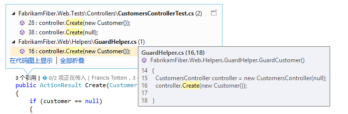  
  
 在不离开编辑器的情况下就对代码进行的更改联系你的团队：  
  
 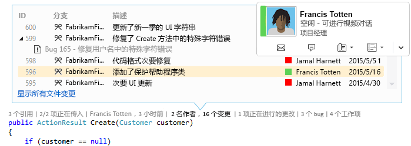  
  
 若要选择想要查看的指示器或要关闭和打开 CodeLens，请依次转到“工具”、“选项”、“文本编辑器”、“所有语言”和“CodeLens”。  
  
##  查找对代码的引用  
 你将需要：  
  
-   Visual Studio Enterprise 或 Visual Studio Professional  
  
-   Visual C# .NET 或 Visual Basic .NET 代码  
  
 选择“引用”  指示器（“Alt + 2”）。 如果看到“0 个引用” ，则没有来自 Visual C# 或 Visual Basic 代码的引用。 这不包括来自其他项（如 XAML 和 ASPX 文件）的引用。  
  
 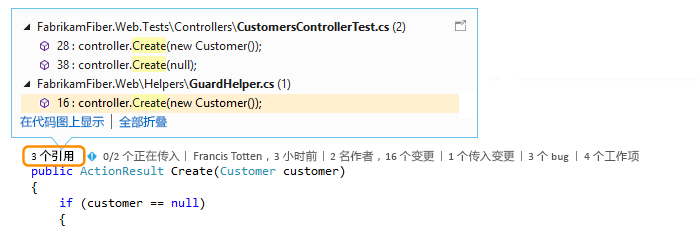  
  
 若要查看引用代码，将你的鼠标移动到引用的顶部。  
  
   
  
 若要打开包含该引用的文件，请双击该引用。  
  
 若要查看此代码与其引用之间的关系，请[创建代码图](../modeling/map-dependencies-across-your-solutions.md)并在代码图快捷菜单中选择“显示所有引用”。  
  
 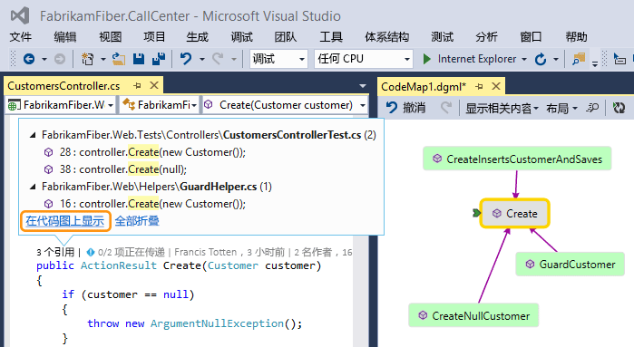  
  
##  查找代码历史记录和链接项  
 查看代码的历史记录，了解你的代码所发生的情况。 或者，在将这些更改合并到你的代码中之前查看它们，这样你可以更好地了解其他分支中的更改可能影响你的代码的方式。  
  
 你将需要：  
  
-   Visual Studio Enterprise 或 Visual Studio Professional  
  
-   Team Foundation Server 2013 或更高版本、Visual Studio Team Services 或 Git  
  
-   [Lync 2010 或更高版本、或 Skype for Business](http://technet.microsoft.com/en-us/lync)，可从代码编辑器联系你的团队  
  
 对于随 Team Foundation 版本控制 (TFVC) 或 Git 一起存储的 Visual C#.NET 或 Visual Basic.NET 代码，你可以获取类和方法级别的 CodeLens 详细信息（*代码元素级别* 指示器）。 如果你的 Git 存储库托管在 TfGit 中，则还可以获取指向 TFS 工作项的链接。  
  
   
  
 对于可在 Visual Studio 编辑器中打开的所有其他类型的文件，在窗口底部的某个位置获取整个文件的 CodeLens 详细信息（*文件级* 指示器）。  
  
   
  
 若要使用键盘来选择指示器，请按住“ALT”  键以显示相关的数字键。  
  
   
  
### 查找你的代码中的更改  
 在代码元素级指示器中，查找你的 C# 或 Visual Basic 代码的更改人员以及他们所做的更改。 这是你在 Team Foundation Server 或 Visual Studio Team Services 中使用 Team Foundation 版本控制 (TFVC) 时看到的内容。  
  
   
  
 默认时间段为最近 12 个月。 如果你的代码存储在 Team Foundation Server 中，则可以通过运行具有 [CodeIndex 命令](http://msdn.microsoft.com/en-us/94424190-3b6b-4f33-a6b6-5807f4225b62) 和 [/indexHistoryPeriod](../ide/codeindex-command.md) 标志的 **TFSConfig 命令** 来对此进行更改。  
  
 若要查看所有更改（包括一年前的更改）的详细历史记录，选择 **“显示所有文件更改”**。  
  
   
  
 这将打开变更集的历史记录窗口。  
  
   
  
 当你的文件位于 Git 存储库中并且你选择代码元素级更改指示器时，这将是你所看到的内容。  
  
   
  
 在窗口底部中的文件级别指示器中查找对整个文件（C# 和 Visual Basic 文件除外）进行的更改。  
  
 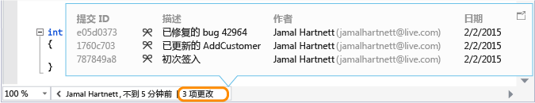  
  
 若要获得有关更改的详细信息，请右键单击该项。 根据你使用 TFVC 还是 Git，可获取一系列的选项来比较文件的版本、查看详细信息和跟踪变更集、获取文件的所选版本并向进行该更改的作者发送电子邮件。 某些详细信息会在团队资源管理器中显示。  
  
 还可以查看在某段时间内更改代码的人员。 这可以帮助发现团队更改中的模式并评估它们的影响。  
  
   
  
#### 查找当前分支中的更改  
 假设你的团队有多个分支（一个主分支和一个子开发）以降低破坏稳定代码的风险：  
  
 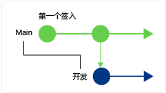  
  
 按快捷键**“Alt + 6”**可查找在主要分支中更改代码的人数和所做更改的数目：  
  
 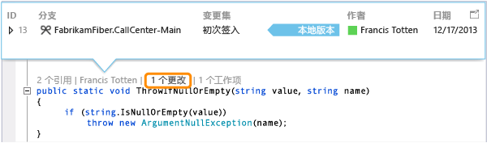  
  
#### 查找何时对你的代码进行了分支  
 转到子分支中的代码，例如此处的开发分支。 选择更改指示器（**“Alt + 6”**）：  
  
 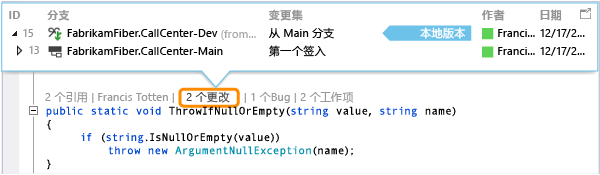  
  
#### 查找来自其他分支的传入更改  
   
  
 …类似于此处开发分支中的 Bug 修复：  
  
 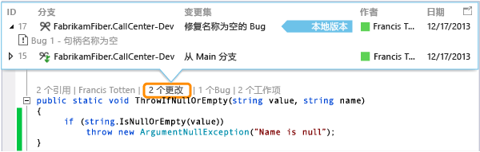  
  
 你可以在不离开当前分支（主分支）的情况下查看此更改：  
  
 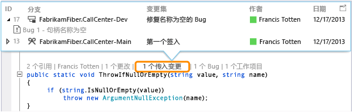  
  
#### 查找何时对更改进行了合并  
 因此你可以查看在你的分支中包括了哪些更改：  
  
 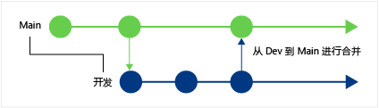  
  
 例如，主分支中的代码现在具有来自开发分支的 Bug 修复：  
  
 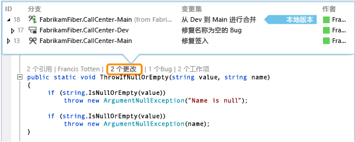  
  
#### 将传入更改与你的本地版本进行比较 (Shift + F10)  
 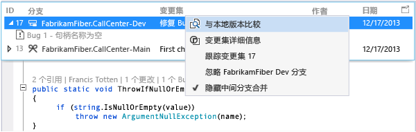  
  
 你也可以双击变更集。  
  
#### 图标代表什么？  
  
|**图标**|**更改来源于何处？**|  
|--------------|-----------------------------------------|  
||当前的分支|  
||父分支|  
||子分支|  
||对等分支|  
||比父、子或对等更进一步的分支|  
||从父分支到子分支的合并|  
||从子分支到父分支的合并|  
||来自不相关分支的合并（baseless 合并）|  
  
### 查找链接工作项  
 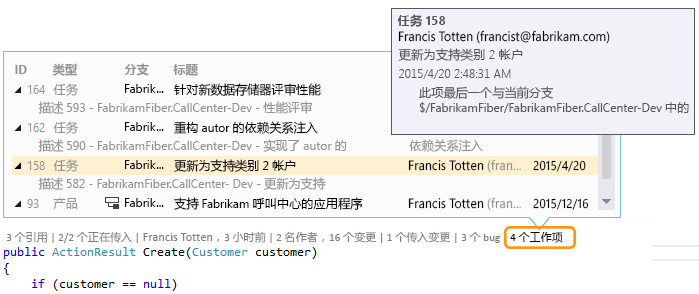  
  
### 查找链接代码评审  
 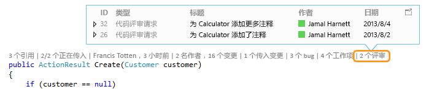  
  
### 查找链接 bug  
 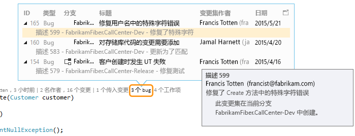  
  
### 联系项的所有者  
   
  
 打开一个项的快捷菜单来查看联系人选项。 如果安装了 Lync 或 Skype for Business，则会看到以下选项：  
  
   
  
##  查找代码的单元测试  
 了解针对你的代码的单元测试的更多信息，而无需打开测试资源管理器。 你将需要：  
  
-   Visual Studio Enterprise 或 Visual Studio Professional  
  
-   Visual C# .NET 或 Visual Basic .NET 代码  
  
-   一个 [单元测试项目](../test/unit-test-your-code.md) ，它具有针对应用程序代码的单元测试  
  
1.  转到带有单元测试的应用程序代码。  
  
2.  审查该代码的测试，请按“Alt + 3”。  
  
     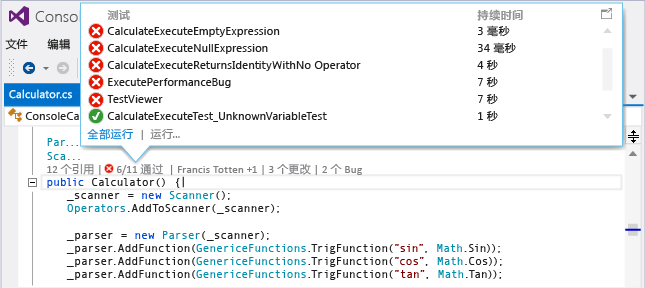  
  
3.  如果看到警告图标 ，请运行测试。  
  
     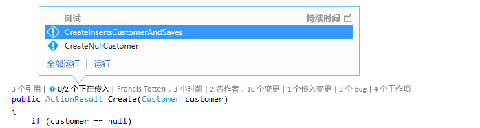  
  
4.  若要查看某个测试的定义，请双击 CodeLens 指示器窗口中的测试项，从而在编辑器中打开代码文件。  
  
     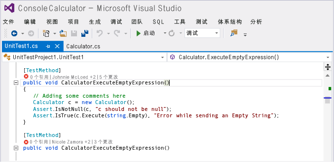  
  
5.  查看测试结果。 选择测试状态指示器（或 ），或按 **Alt+1**。  
  
     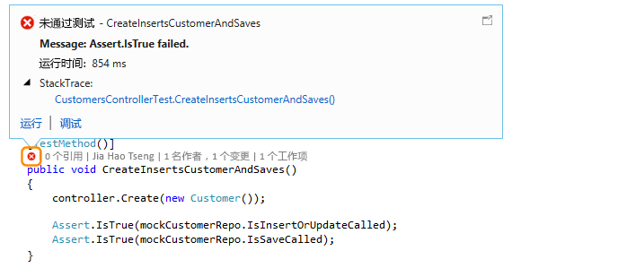  
  
6.  若要查看更改过此测试的人数、更改者或对此测试所做的更改的数量，请[查找代码的历史记录和链接的项](#FindCodeHistory)。  
  
##   问题解答  
  
###   问：如何关闭或打开 CodeLens？ 或者选择要查看的指示器？  
 **答：**  可以关闭或打开指示器，引用指示器除外。 请依次转到“工具”、“选项”、“文本编辑器”、“所有语言”和“CodeLens”。  
  
 指示器打开后，你也可以从指示器上打开“CodeLens”选项。  
  
 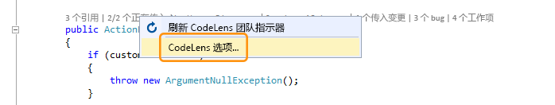  
  
 使用编辑器窗口底部的 V 形图标打开和关闭 CodeLens 文件级指示器。  
  
   
  
###  问：CodeLens 位于何处？  
 **答：** CodeLens 出现在方法、类、索引器和属性级别的 Visual C#.NET 和 Visual Basic.NET 代码中。 对于所有其他文件类型，CodeLens 出现在文件级别。  
  
-   确保 CodeLens 开启。 请依次转到“工具”、“选项”、“文本编辑器”、“所有语言”和“CodeLens”。  
  
-   如果代码存储在 TFS 中，请确保使用 [CodeIndex 命令](../ide/codeindex-command.md) 和 [TFS Config 命令](http://msdn.microsoft.com/en-us/94424190-3b6b-4f33-a6b6-5807f4225b62)打开代码索引。  
  
-   仅当工作项已链接到代码并且你有权打开链接的工作项时，才显示与 TFS 相关的指示器。 [确认你具有团队成员权限。](http://msdn.microsoft.com/en-us/f58805de-ba61-4d09-8f2d-d3ab9662ecfd)  
  
-   当应用程序代码没有单元测试时，单元测试指示器不显示。 测试状态指示器自动显示在测试项目中。 如果你知道你的应用程序代码具有单元测试，但未显示任何测试指示器，请尝试生成解决方案 (**Ctrl + Shift + B**)。  
  
### 问：为什么没有看见提交的工作项详情？  
 **问** ：可能是因为 CodeLens 无法查找到 TFS 中的工作项。 检查是否连接到具有这些工作项的团队项目，以及你是否有权限看到这些工作项。 如果提交说明中关于 TFS 中工作项 ID 的信息有误，也会出现这种情况。  
  
###   问：为什么没有看见 Lync 或 Skype 指示器？  
 **答：** 当未登录或未安装 Lync 或 Skype for Business，或者没有支持的配置时，它们不会显示。 但是你仍可以发送邮件：  
  
 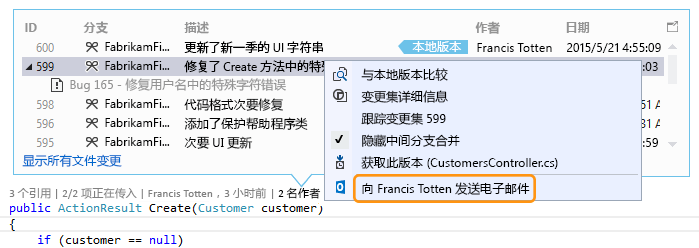  
  
 **支持哪些 Lync 和 Skype 配置？**  
  
-   Skype for Business（32 位或 64 位）  
  
-   仅 Lync 2010 或更高版本（32 位或 64 位），但不是使用 Windows 8.1 的 Lync Basic 2013  
  
 CodeLens 不支持安装不同版本的 Lync 或 Skype。 可能不会针对所有本地化版本的 Visual Studio 本地化 Lync 或 Skype。  
  
### 问：如何更改 CodeLens 的字体和颜色？  
 **答：** 转到 **“工具”**、 **“选项”**、 **“环境”**和 **“字体和颜色”**。  
  
 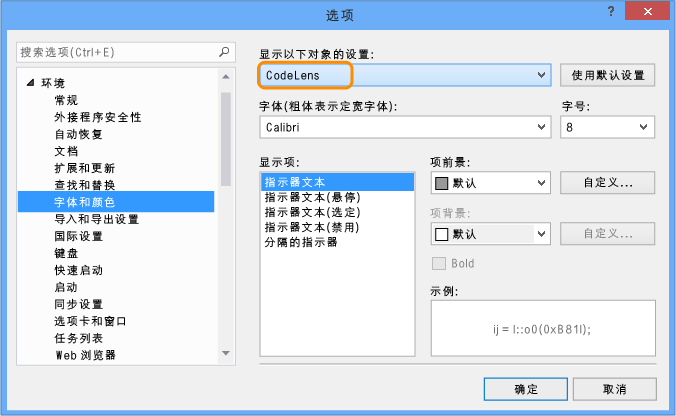  
  
 使用键盘：  
  
1.  按 **Alt + T + O** 打开 **“选项”** 框。  
  
2.  按向上键  或向下键  转到 **“环境”** 节点，然后按向左键  展开该节点。  
  
3.  按向下键  转到 **“字体和颜色”**。  
  
4.  按 **Tab** 转到 **“显示其设置”** 列表，然后按向下键  选择 **“CodeLens”**。  
  
### 问：我是否能移动 CodeLens 提醒显示？  
 **答：**是的，选择 ，将 CodeLens 停靠为窗口。  
  
   
  
   
  
### 问：如何刷新指示器？  
 **答：** 这取决于指示器：  
  
-   **引用**：代码更改时，此指示器会自动更新。 如果此指示器作为单独的窗口停靠，则在此处手动刷新指示器：  
  
     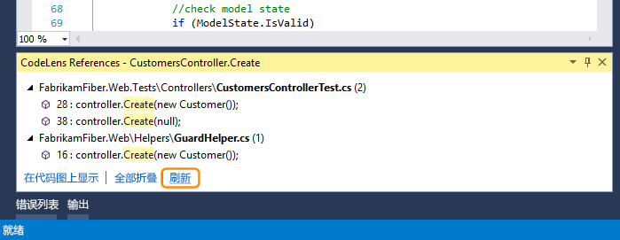  
  
-   **团队**：在此处手动刷新这些指示器：  
  
     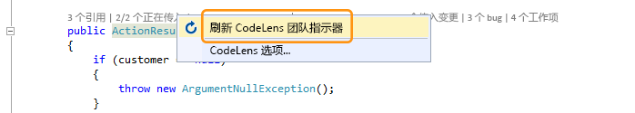  
  
-   **测试**：[查找代码的单元测试](#FindRunUnitTests)以刷新此指示器。  
  
###  问：什么是“本地版本”？  
 **答：**“本地版本”箭头指向本地版本的此文件中的最新变更集。 当服务器具有最新的变更集时，它们显示在 **“本地版本”** 箭头的上方或下方，具体取决于排列变更集的顺序。  
  
### 问：是否可以管理 CodeLens 如何处理代码以显示历史记录和链接的项？  
 **答：** 可以，如果代码位于 TFS 中，请使用 [CodeIndex 命令](../ide/codeindex-command.md) 和 [TFS Config 命令](http://msdn.microsoft.com/en-us/94424190-3b6b-4f33-a6b6-5807f4225b62)。
