# <a name="getting-started-with-c-in-visual-studio"></a>Visual Studio 中的 C++ 入门
通过完成本演练，你将熟悉在使用 Visual Studio 开发应用程序时可使用的许多工具和对话框。 了解在集成开发环境 (IDE) 中工作的更多知识后，你将可以创建简单的“Hello, World”风格的应用程序。  
  
 本主题包含以下各节：  
  
 [登录到 Visual Studio](../ide/getting-started-with-cpp-in-visual-studio.md#BKMK_Configure)  
  
 [创建简单的应用程序](../ide/getting-started-with-cpp-in-visual-studio.md#BKMK_CreateApp)  
  
 [将代码添加到应用程序](../ide/getting-started-with-cpp-in-visual-studio.md#BKMK_AddCode)  
  
 [调试并测试应用程序](../ide/getting-started-with-cpp-in-visual-studio.md#BKMK_DebugTest)  
  
 [生成应用程序的发布版本](../ide/getting-started-with-cpp-in-visual-studio.md#BKMK_BuildRelease)  
  
##  <a name="BKMK_Configure"></a> 登录到 Visual Studio  
 首次启动 Visual Studio 时，有机会使用 Live 或 Outlook 之类的 Microsoft 帐户登录。 登录允许你的设置在所有设备上同步。 有关详细信息，请参阅 [Signing in to Visual Studio](../ide/signing-in-to-visual-studio.md)。  
  
 图 1：Visual Studio IDE  
  
 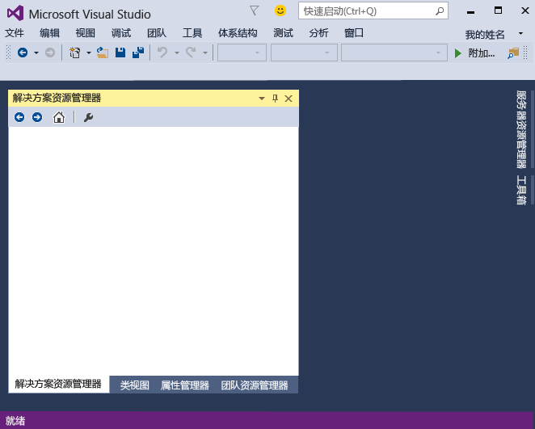  
  
 在你打开 Visual Studio 后，可查看 IDE 的三个基本部分：工具窗口、菜单和工具栏，以及主窗口空间。 工具窗口停靠在应用程序窗口的左侧和右侧，其顶部有“快速启动” 、菜单栏和标准工具栏。 应用程序窗口的中心包含“起始页” 。 当你打开解决方案或项目时，将在这里显示编辑器和设计器。 开发应用程序时，大部分时间都将用在此中心区域。  
  
##  <a name="BKMK_CreateApp"></a> 创建简单的应用程序  
 在 Visual Studio 中创建应用程序时，应首先创建项目和解决方案。 本示例将创建的是 Windows 控制台应用程序。  
  
#### <a name="to-create-a-console-app"></a>要创建控制台应用程序  
  
1.  在菜单栏上，依次选择“文件” 、“新建” 、“项目” 。  
  
     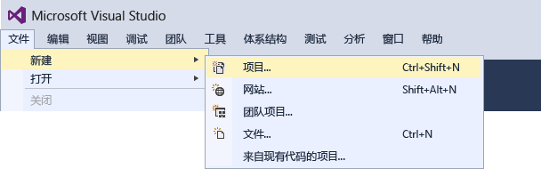  
  
2.  在“Visual C++”类别中，选择“Win32 控制台应用程序”模板，然后命名项目 `GreetingsConsoleApp`。  
  
     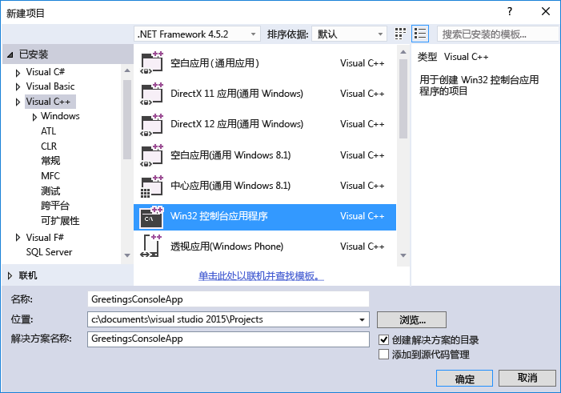  
     对话框中可能有不同的选择，具体取决于你的安装。 如果看不到 Visual C++ 项目模板，则需要返回到安装程序并安装 C++ 工作负荷。
  
3.  当 Win32 应用程序向导出现时，选择“完成”  按钮。  
  
     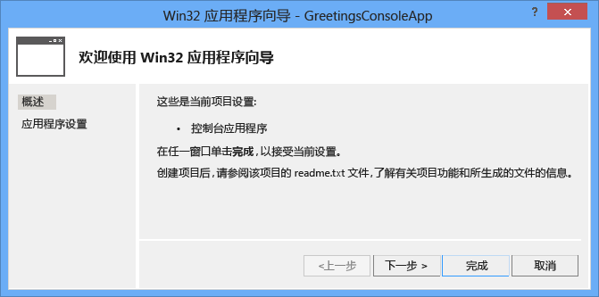  
  
 GreetingsConsoleApp 项目和解决方案与 Win32 控制台应用程序的基本文件将创建并自动加载到“解决方案资源管理器” 。 GreetingsConsoleApp.cpp 文件将在代码编辑器中打开。 “解决方案资源管理器”中显示以下项：  
  
 图 4：项目项  
  
 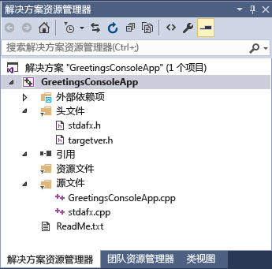  
  
##  <a name="BKMK_AddCode"></a>将代码添加到应用程序  
 接下来，你将添加代码以在控制台窗口中显示单词“Hello”。  
  
#### <a name="to-display-hello-in-the-console-window"></a>在控制台窗口中显示“Hello”  
  
1.  在 GreetingsConsoleApp.cpp 文件中，在行 `return 0;` 之前输入一个空行，然后输入以下代码：  
  
    ```  
    cout << "Hello\n";  
    ```  
  
     红色的波浪线显示在 `cout`下面。 如果你指向它，将显示一条错误消息。  
  
     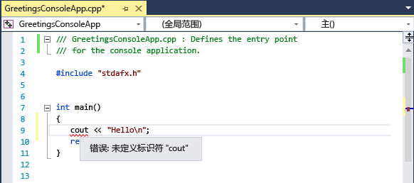  
  
     错误消息也将出现在“错误列表”  窗口中。 可以通过在菜单栏中选择“视图” 、 “错误列表”显示此窗口。  
  
     [cout](/cpp/standard-library/iostream) 包含在 \<iostream> 标头文件中。  
  
2.  若要包括 iostream 标头，请在 `#include "stdafx.h"`后面输入以下代码：  
  
    ```  
    #include <iostream>  
    using namespace std;  
    ```  
  
     当你输入代码时，你可能注意到出现了一个框，提供你输入的字符的有关建议。 此框是 C++ IntelliSense 的一部分，它提供了编码提示，包括列出类或接口的成员和参数信息。 你还可以使用代码段，它们是预定义的代码块。 有关详细信息，请参阅 [Using IntelliSense](../ide/using-intellisense.md) 和 [Code Snippets](../ide/code-snippets.md)。  
  
     修复该错误后， `cout` 下面的红色波浪线将消失。  
  
3.  保存对文件所做的更改。  
  
     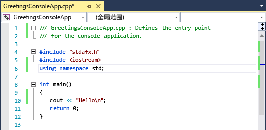  
  
##  <a name="BKMK_DebugTest"></a>调试并测试应用程序  
 你可以调试 GreetingsConsoleApp 以查看控制台窗口中是否显示单词“Hello”。  
  
#### <a name="to-debug-the-application"></a>若要调试该应用程序  
  
-   启动调试器。  
  
       
  
     调试器启动并运行代码。 在调试器停止运行时，控制台窗口（类似命令提示符的单独窗口）将显示几秒钟，但是将很快关闭。 若要查看文本，你需要设置一个断点以停止程序执行。  
  
#### <a name="to-add-a-breakpoint"></a>要添加一个断点  
  
1.  从菜单栏中在行 `return 0;`上添加一个断点。 你还可以直接单击左空白处来设置断点。  
  
     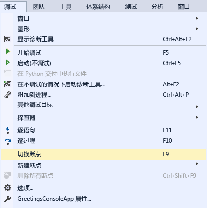  
  
     编辑器窗口最左侧边距中该代码行附近将显示一个红圈。  
  
2.  选择 F5 键开始调试。  
  
     调试器启动，控制台窗口出现并显示单词 **Hello**。  
  
     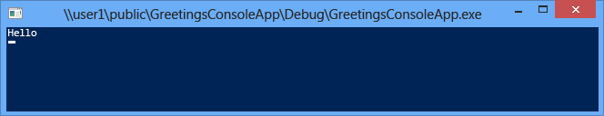  
  
3.  按下 SHIFT + F5 来停止调试。  
  
 有关详细信息，请参阅[控制台项目](../debugger/debugging-preparation-console-projects.md)。  
  
##  <a name="BKMK_BuildRelease"></a> 生成应用程序的发布版本  
 确认一切就绪后，可以准备该应用程序的发布版本。  
  
#### <a name="to-clean-the-solution-files-and-build-a-release-version"></a>要清理解决方案文件并生成发布版本  
  
1.  从菜单栏中，删除前面生成过程中创建的中间文件和输出文件。  
  
     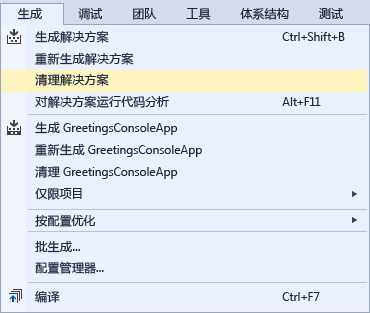  
  
2.  将 GreetingsConsoleApp 的生成配置从“调试”  更改为 “发布”。  
  
       
  
3.  生成解决方案。  
  
     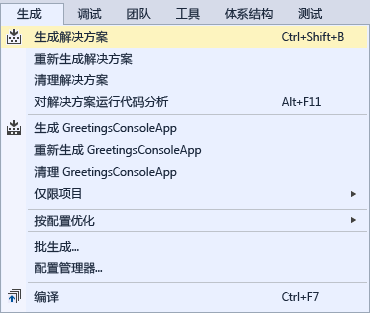  
  
 祝贺你完成本演练！ 如要了解更多示例，请参阅 [Visual Studio 示例](../ide/visual-studio-samples.md)。  
  
## <a name="see-also"></a>另请参阅  
 [使用 Visual Studio IDE 进行 C++ 桌面开发](/cpp/ide/using-the-visual-studio-ide-for-cpp-desktop-development)   
 [演练：使用 Visual C# 或 Visual Basic 创建简单应用程序](../ide/walkthrough-create-a-simple-application-with-visual-csharp-or-visual-basic.md)   
 [Visual Studio 的工作效率提示](../ide/productivity-tips-for-visual-studio.md)   
 [Visual Studio 示例](../ide/visual-studio-samples.md)   
 [Visual Studio 开发入门](../ide/get-started-developing-with-visual-studio.md)
