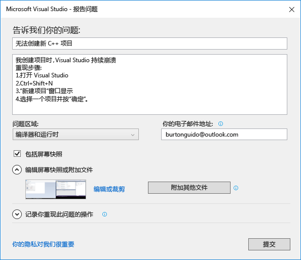
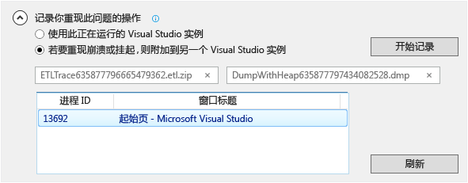

# 如何报告 Visual Studio 的问题
[!INCLUDE[vs2017banner](../code-quality/includes/vs2017banner.md)]

如果你遇到 Visual Studio 的问题，我们想要了解该问题，方便诊断和修复。  通过使用“报告问题”工具，你可以收集有关该问题的详细信息，只需单击几次按钮即可将其发送给 Microsoft。  
  
 Microsoft 尊重你的隐私。 有关我们如何处理你发送给我们的数据的信息，请参阅 [Microsoft Visual Studio 产品系列隐私声明](https://www.visualstudio.com/en-us/dn948229)。  
  
## 打开“报告问题”工具  
 在标题栏中单击“快速启动”旁边的用户反馈图标，或单击“帮助”&#124;“发送反馈”&#124;“报告问题”。  
  
   
  
## 描述此问题  
  
###    
  
1.  为此问题提供一个描述性标题，帮助我们将它发送到 Visual Studio 中的正确团队。  
  
2.  提供任何其他详细信息以及再现该问题的步骤（如有可能）。  
  
3.  从下拉列表中选择问题领域。 如果你不确定，进行最佳猜测。  
  
   
  
## 提供屏幕快照（可选）  
 选择“包括屏幕快照”，将你的当前屏幕发送给 Microsoft。 该工具可允许你裁剪图像，从而只看到显示此问题的部分屏幕。 通过单击“附加其他文件”按钮，你可以附加其他屏幕快照或其他文件。  
  
## 提供跟踪和堆转储（可选）  
  
###    
  
1.  跟踪和堆转储文件在帮助我们诊断问题方面非常有用。   如果你使用“报告问题”工具记录重现步骤并将数据发送给 Microsoft，我们非常感激。  
  
2.  单击“记录操作以重现问题”旁边的 V 形。 如果你的问题导致 Visual Studio 挂起或崩溃，则打开 Visual Studio 的另一个实例，并从列表视图中选择它。  
  
3.  单击“开始记录”并执行重现该问题的步骤。 完成后，单击浮动窗口中的“停止记录”按钮。  
  
4.  请等待几分钟时间，以便 Visual Studio 收集和打包已记录的信息。 收集过程完成后，对话框将如下所示：  
  
       
  
## 描述解决方法（如果存在）  
 如果你能够解决此问题，请在为该目的而提供的编辑框中描述解决方法。 这不仅有助于我们诊断问题，而且还可以帮助可能遇到相同问题的其他用户。  
  
## 提交报告  
 单击提交按钮发送你的报告，以及任何图像和跟踪或转储文件。 如果“提交”按钮为灰显，请确保你已提供标题和说明。  
  
## 请参阅  
 [与我们交流](../ide/talk-to-us.md)