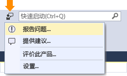

# 如何报告 Visual Studio 2017 RC 的问题
如果你遇到 Visual Studio 的问题，我们想要了解该问题，方便诊断和修复。  通过使用**报告问题**工具，可以收集有关该问题的详细信息，只需单击几次按钮即可将其发送给 Microsoft。  

 Microsoft 尊重你的隐私。 有关我们如何处理你发送给我们的数据的信息，请参阅 [Microsoft Visual Studio 产品系列隐私声明](https://www.visualstudio.com/en-us/dn948229)。  

## 打开“报告问题”工具  
 在标题栏中单击“快速启动”旁边的用户反馈图标，或单击“帮助”|“发送反馈”|“报告问题”。  

   

## 搜索类似的问题并为其投票  
###    

1.  搜索问题，并查看是否其他人已报告此问题。
2.  如果有人已报告此问题，请为其“投票”以便让我们知道。  

  

## 报告新问题
###  
1.  在 Visual Studio **报告问题**工具的左下角，单击 **+** 按钮。  
2.  为此问题创建一个描述性标题，帮助我们将其发送到正确的 Visual Studio 团队。  
3.  向我们提供任何其他详细信息，如有可能，请同时提供再现该问题的步骤。  

  

## 提供屏幕截图和附件（可选）
###  
 选择将当前屏幕发送给 Microsoft。 通过单击“附加其他文件”按钮，可以附加其他屏幕截图或其他文件。  

## 提供跟踪和堆转储（可选）  
###    

跟踪和堆转储文件在帮助我们诊断问题方面非常有用。   如果你使用**报告问题**工具记录重现步骤并将数据发送给 Microsoft，我们将非常感激。  以下是使用方法。

1.  单击“记录”选项卡。
2.  单击“开始记录”。 授予运行该工具的权限。
3.  显示**步骤记录器**工具后，执行重现问题的步骤。
4.  完成后，单击浮动窗口中的“停止记录”按钮。
5.  请等待几分钟时间，以便 Visual Studio 收集和打包已记录的信息。  完成后，将看到如下对话框。   

  

## 提交报告  
###    
 单击“提交”按钮发送报告，以及任何图像和跟踪或转储文件。 （如果“提交”按钮为灰色，请确保你已提供报告的标题和说明。）  

## 另请参阅  
 [与我们交流](../ide/talk-to-us.md)

<!--HONumber=Feb17_HO4-->

