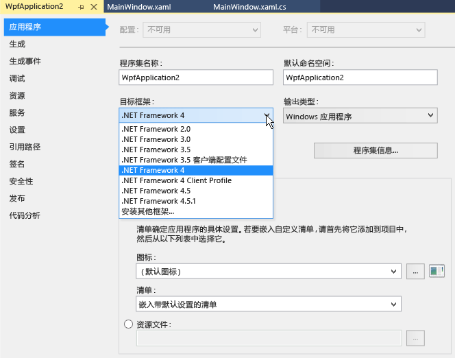

# 如何：面向 .NET Framework 的某个版本

本文档说明如何在创建项目时以 .NET Framework 版本为目标，以及如何更改现有 Visual Basic、Visual C# 或 Visual F# 项目中的目标版本。  
  
> [!IMPORTANT]
>  有关如何更改 C++ 项目目标版本的信息，请参阅[如何：修改目标框架和平台工具集](/cpp/build/how-to-modify-the-target-framework-and-platform-toolset)。  
  
 **主题内容**  
  
-   [创建项目时以某一版本为目标](../ide/how-to-target-a-version-of-the-dotnet-framework.md#bkmk_new)  
  
-   [更改目标版本](../ide/how-to-target-a-version-of-the-dotnet-framework.md#bkmk_existing)  
  
##  创建项目时以某一版本为目标  
 创建项目时，目标 .NET Framework 版本将确定可以使用的模板。  
  
> [!NOTE]
>  在 Visual Studio 速成版中，必须先创建项目，随后才能更改目标，如本主题中稍后的[更改目标版本](../ide/how-to-target-a-version-of-the-dotnet-framework.md#bkmk_existing)部分所述。  
  
#### 创建项目时以某一版本为目标
  
  
1.  在菜单栏上，依次选择“文件” 、“新建” 、“项目” 。  
  
2.  在“新建项目”对话框顶部的列表中，选择你希望项目作为目标的 .NET Framework 版本。  
  
    > [!NOTE]
    >  通常，仅随 Visual Studio 安装一个 .NET Framework 版本。 如果要以另一版本为目标，首先必须确保此版本已安装。 请参阅 [Visual Studio 多目标概述](../ide/visual-studio-multi-targeting-overview.md)。  
  
3.  在已安装模板的列表中，选择要创建的项目类型，命名项目，然后选择“确定”按钮。  
  
     模板列表仅显示你选择的 .NET Framework 版本支持的项目。  
  
##  更改目标版本  
 可以按照以下步骤，更改 Visual Basic、Visual C# 或 Visual F# 项目中的 .NET Framework 目标版本。  
  
#### 更改目标版本
  
  
1.  在“解决方案资源管理器”中，打开要更改的项目的快捷菜单，然后选择“属性”。  
  
       
  
    > [!IMPORTANT]
    >  有关如何更改 C++ 项目目标版本的信息，请参阅[如何：修改目标框架和平台工具集](/cpp/build/how-to-modify-the-target-framework-and-platform-toolset)。  
  
2.  在“属性”窗口的左列中，选择“应用程序”选项卡。  
  
       
  
    > [!NOTE]
    >  创建 Windows 应用商店应用后，无法更改 Windows 或 .NET Framework 目标版本。  
  
3.  在“目标框架”列表中，选择所需版本。  
  
4.  在显示的“验证”对话框中，选择“是”按钮。  
  
     项目将卸载。 项目重新加载时，将以你刚选择的 .NET Framework 版本为目标。  
  
    > [!NOTE]
    >  如果代码中包含对不同于目标版本的 .NET Framework 版本的引用，则在编译或运行代码时可能会显示错误消息。 若要解决这些错误，必须修改这些引用。 请参阅 [.NET Framework 目标错误疑难解答](../msbuild/troubleshooting-dotnet-framework-targeting-errors.md)。  
  
## 另请参阅
  
 [Visual Studio 多目标概述](../ide/visual-studio-multi-targeting-overview.md)   
 [面向 ASP.NET Web 项目的 .NET Framework 多目标](http://msdn.microsoft.com/Library/8b8145a9-62f6-4fc4-8a83-47b0487cbe76)   
 [.NET Framework 目标错误疑难解答](../msbuild/troubleshooting-dotnet-framework-targeting-errors.md)   
 [应用程序页、项目设计器 (C#)](../ide/reference/application-page-project-designer-csharp.md)   
 [应用程序页、项目设计器 (Visual Basic)](../ide/reference/application-page-project-designer-visual-basic.md)   
 [配置项目](http://msdn.microsoft.com/Library/a1489abb-6294-4f8f-b71f-2cb126393526)   
 [如何：修改目标框架和平台工具集](/cpp/build/how-to-modify-the-target-framework-and-platform-toolset)
