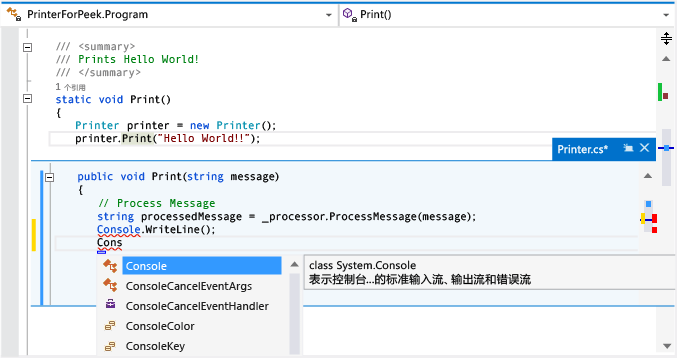

# 如何：使用查看定义查看和编辑代码 (Alt+F12)
[!INCLUDE[vs2017banner](../code-quality/includes/vs2017banner.md)]

你可使用**“查看定义”**命令来查看和编辑代码，而无需离开你在编写的代码。  **“查看定义”**和**“转到定义”**显示相同的信息，但**“查看定义”**在弹出窗口中显示，**“转到定义”**则在单独的代码窗口中显示代码。  **“转到定义”**将导致你的上下文（即活动的代码窗口、当前行和光标位置）切换到定义代码窗口。  通过使用**“查看定义”**，你无需离开原始代码文件就能查看和编辑定义，还能在定义文件内部到处移动。  
  
 你可对 C\#、Visual Basic 和 C\+\+ 代码使用**“查看定义”**。  在 Visual Basic 中，**“查看定义”**显示一个链接，指向没有定义元数据（例如内置的 .NET Framework 类型）的符号的**“对象浏览器”**。  
  
> [!IMPORTANT]
>  你不能在任何 Visual Studio 2013 Express 版本中使用此命令。  
  
## 使用“查看定义”  
  
#### 打开“查看定义”窗口  
  
1.  你可通过打开要浏览的方法的快捷菜单来查找**“查看定义”**。（键盘：Alt\+F12）  
  
     本插图显示了名为 `Print()` 的方法的**“查看定义”**窗口：  
  
       
  
     定义窗口显示在原始文件的 `printer.Print(“Hello World!”)` 行的下方。  该窗口不会隐藏原始文件中的任何代码。  跟在 `printer.Print(“Hello World!”)` 调用后的行显示在定义窗口下。  
  
2.  你可将光标移动到代码定义窗口中的不同位置。  你仍可在定义窗口上方或下方的原始代码窗口中移动。  
  
3.  可从定义窗口中复制字符串，并将其粘贴在原始代码中。  也可将字符串从定义窗口拖放到原始代码中，而不从定义窗口中删除它。  
  
4.  你可以按 Esc 键或选择定义窗口选项卡上的**“关闭”**按钮来关闭定义窗口。  
  
#### 从“查看定义”窗口内部打开另一个“查看定义”窗口  
  
-   如果**“查看定义”**窗口已打开，则可以对该窗口中的代码再次调用**“查看定义”**。  此时将打开另一个定义窗口。  一组痕迹点将显示在定义窗口选项卡旁边，可用于在定义窗口之间导航。  每个点上的工具提示显示该点表示的定义文件的文件名和路径。  
  
       
  
#### 使用“查看定义”时具有多个结果  
  
-   如果对具有超过一个定义的代码（例如，部分类）使用**“查看定义”**，则代码定义视图的右侧将显示结果列表。  你可选择列表中的任意结果来显示其定义。  
  
       
  
#### 在“查看定义”窗口中编辑  
  
-   当你在**“查看定义”**窗口中开始编辑时，你所修改的文件将在代码编辑器中自动作为单独的选项卡打开，并显示已做的更改。  你可以在**“查看定义”**窗口中继续更改、撤消更改和保存更改，该选项卡将继续显示这些更改。  即使你关闭窗口时没有保存更改，也可以在窗口中上次离开的位置继续更改、撤消更改和保存更多更改。  
  
       
  
#### 使用“查看定义”的键盘快捷键  
  
-   你可对**“查看定义”**窗口使用以下键盘快捷键：  
  
    |功能|键盘快捷键|  
    |--------|-----------|  
    |打开定义窗口|Alt\+F12|  
    |关闭定义窗口|Esc|  
    |将定义窗口提升为一个常规文档选项卡|Shift\+Alt\+Home|  
    |在定义窗口间导航|Ctrl\+Alt\+\- 和 Ctrl\+Alt\+\=|  
    |在多个结果间导航|F8 和 Shift\+F8|  
    |在代码编辑器窗口和定义窗口之间切换|Shift\+Esc|  
  
    > [!NOTE]
    >  你也可使用 Visual Studio 其他地方所用的键盘快捷键在**“查看定义”**窗口中编辑代码。  
  
## 请参阅  
 [工作效率提示](../ide/productivity-tips-for-visual-studio.md)