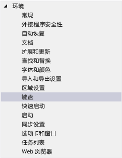
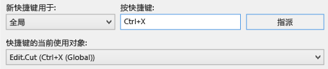
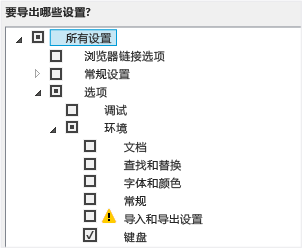
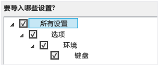

# 在 Visual Studio 中标识并自定义键盘快捷键
[!INCLUDE[vs2017banner](../code-quality/includes/vs2017banner.md)]

你可以认识 Visual Studio 命令的键盘快捷键，自定义这些快捷键并将其导出以供他人使用。  许多快捷键总是调用相同的命令，但是，快捷键的行为可能因以下条件而异：  
  
-   你首次运行 Visual Studio（例如，常规开发或 Visual C\#）时选择了哪些默认环境设置。  
  
-   你是否已自定义快捷键的行为。  
  
-   你选择快捷键时所在的上下文。  例如，你使用设置设计器时，F2 快捷键将调用“编辑.编辑单元格”命令；而你使用团队资源管理器时，则调用“文件.重命名”命令。  
  
 不管设置、自定义和上下文，你始终可以在**“选项”**对话框中找到并更改键盘快捷键。  你还可以在 [常用命令的默认键盘快捷键](../ide/default-keyboard-shortcuts-for-frequently-used-commands-in-visual-studio.md)中查找诸多命令的默认键盘快捷键，并可在 [默认键盘快捷键](../ide/default-keyboard-shortcuts-in-visual-studio.md)中查找所有默认快捷键（基于常规开发设置）的完整列表。  
  
 **主题内容**  
  
-   [认识键盘快捷键](../ide/identifying-and-customizing-keyboard-shortcuts-in-visual-studio.md#bkmk_identify)  
  
-   [自定义键盘快捷键](../ide/identifying-and-customizing-keyboard-shortcuts-in-visual-studio.md#bkmk_assign)  
  
-   [共享自定义键盘快捷键](../ide/identifying-and-customizing-keyboard-shortcuts-in-visual-studio.md#bkmk_transfer)  
  
 如果一个快捷键仅分配给全局上下文中的一个命令，则该快捷键将始终调用该命令。  但是，一个快捷键可以同时分配给全局上下文和特定上下文中的不同命令。  如果你在特定上下文中使用这个快捷键，则该快捷键将调用特定上下文中的命令，而非全局上下文中的命令。  
  
> [!NOTE]
>  你的 Visual Studio 设置和版本可能会更改对话框中显示的菜单命令和选项的名称和位置。  本主题基于**“常规开发设置”**。  
  
##   认识键盘快捷键  
  
1.  在菜单栏上，依次选择**“工具”**、**“选项”**。  
  
2.  展开**“环境”**，然后选择**“键盘”**。  
  
       
  
3.  在**“显示命令包含”**框中输入命令的完整或部分名称，不含空格。  
  
     例如，你可以查找解决方案资源管理器的命令。  
  
4.  在列表中选择正确的命令。  
  
     例如，你可以选择**“视图.解决方案资源管理器”**。  
  
5.  如果该命令有键盘快捷键，则显示在**“选定命令的快捷键”**列表中。  
  
       
  
##   自定义键盘快捷键  
  
1.  在菜单栏上，依次选择**“工具”**、**“选项”**。  
  
2.  展开**“环境”**文件夹，然后选择**“键盘”**。  
  
       
  
3.  在**“显示命令包含”**框中输入命令的完整或部分名称，不含空格。  
  
     例如，你可以查找解决方案资源管理器的命令。  
  
4.  在列表中选择要为其分配键盘快捷键的命令。  
  
5.  在**“新快捷键用于”**列表中，选择你希望使用该快捷键的功能区。  
  
     例如，如果希望快捷键适用于所有环境，可选择**“全局”**。  你可以使用没有在另一个编辑器中映射（为“全局”）的任何快捷键。  否则，编辑器将会重写快捷键。  
  
    > [!NOTE]
    >  以下键不能用于构成**“全局”**范围中的键盘快捷键：Print Scrn\/Sys Rq、Scroll Lock、Pause\/Break、Tab、Caps Lock、Insert、Home、End、Page Up、Page Down、Windows 徽标键、应用程序键、任何箭头键或 Enter；数字键盘上的 Num Lock、Delete 或 Clear；或者 Ctrl\+Alt\+Delete。  
  
6.  在**“按快捷键”**框中，输入要使用的快捷键。  
  
    > [!NOTE]
    >  你可以创建将字母与 Alt 键和\/或 Ctrl 键相结合的快捷键。  你也可以创建将 Shift 键和字母与 Alt 键和\/或 Ctrl 键相结合的快捷键。  
  
     如果快捷键已分配给另一个命令，则显示在**“快捷键的当前使用对象”**框中。  在这种情况下，按 Backspace 键删除该快捷键，然后再尝试另一个。  
  
       
  
7.  选择**“分配”**按钮。  
  
    > [!NOTE]
    >  如果为命令指定不同的快捷键，则选择**“分配”**按钮，然后选择**“取消”**按钮，对话框将关闭，但是更改不会撤消。  
  
##   共享自定义键盘快捷键  
 你可以共享你的自定义键盘快捷键，方法是将其导出到文件中，然后将文件提供给他人，以便他们导入数据。  
  
#### 仅导出键盘快捷键  
  
1.  在菜单栏上，选择**“工具”**、**“导入和导出设置”**。  
  
2.  选择**“导出选定的环境设置”**，然后选择**“下一步”**按钮。  
  
3.  在**“要导出哪些设置?”**下，清除**“所有设置”**复选框，展开**“选项”**，然后展开**“环境”**。  
  
4.  选中**“键盘”**复选框，然后选择**“下一步”**按钮。  
  
       
  
5.  在**“要如何命名你的设置文件?”**和**“在此目录中存储我的设置文件”**框中，保留默认值或指定其他值，然后选择**“完成”**按钮。  
  
     默认情况下，你的快捷键保存在 %USERPROFILE%\\Documents\\Visual Studio 2013\\Settings 文件夹下的文件中。  文件名称将反映你导出设置的日期，扩展名为 .vssettings。  
  
#### 仅导入键盘快捷键  
  
1.  在菜单栏上，选择**“工具”**、**“导入和导出设置”**。  
  
2.  选择**“导入选定的环境设置”**选项按钮，然后选择**“下一步”**按钮。  
  
3.  选择**“否，仅导入新设置，覆盖我的当前设置”**选项按钮，然后选择**“下一步”**按钮。  
  
4.  在**“我的设置”**下，选择包含要导入的快捷键的文件，或选择**“浏览”**按钮定位到正确的文件。  
  
5.  选择**“下一步”**按钮。  
  
6.  在**“要导入哪些设置?”**下，清除**“所有设置”**复选框，展开**“选项”**，然后展开**“环境”**。  
  
7.  选中**“键盘”**复选框，然后选择**“完成”**按钮。  
  
       
  
## 请参阅  
 [Visual Studio 的辅助功能](../ide/reference/accessibility-features-of-visual-studio.md)