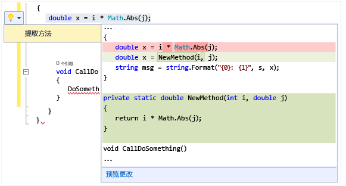

# 使用电灯泡执行快速操作
电灯泡是 Visual Studio 中的工作效率功能。 它们是出现在 Visual Studio 编辑器中的图标，你可以单击它们以执行快速操作（包括重构修复错误）。 电灯泡为单个焦点提供错误修复和重构帮助，焦点通常就位于你输入内容的行上。  

   

 在 C# 和 Visual Basic 中，如果有红色波形曲线，你将看到电灯泡，Visual Studio 针对如何解决此问题有一条建议。 例如，如果你遇到红色波形曲线指示的错误，则在可对该错误进行修复时，会显示灯泡。 在 C++ 中，将新函数添加到头文件时，将看到电灯泡会提出创建此函数的存根实现。 对于任何语言，第三方均可提供自定义诊断和建议（例如，作为 SDK 的一部分），Visual Studio 电灯泡会根据这些规则亮起。  

## 查看电灯泡  

1.  在许多情况下，灯泡会在你将鼠标指针悬停在错误点上方时，或是在你将插入点移动到存在错误的行中时在编辑器左边距处自然而然地出现。 看到红色波形曲线时，可悬停在其上方，以显示电灯泡。 使用鼠标或键盘转到问题发生的行时，也会显示电灯泡。  

2.  在行上的任意位置按“Ctrl + .” 可调用电灯泡并直接转到潜在修复列表。  

   

## 查看潜在修复  
 单击向下箭头或“显示潜在修复”链接，以显示电灯泡可执行的快速操作列表。  

   

## 进行重构  
 执行重构可通过右键单击打开上下文菜单，还可按 Ctrl + .  以显示重构选项。 在下图中， 在包含 `Math.Abs` 调用的行的某个位置按 Ctrl + . 后可提供提取方法重构：  

 

