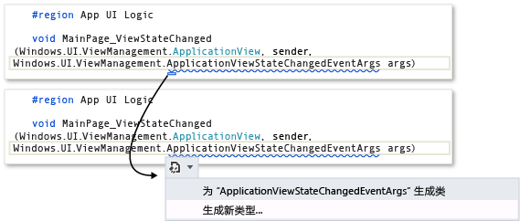
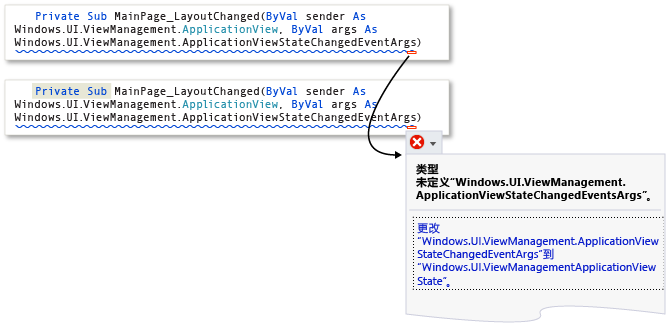
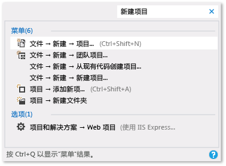

# Visual Studio 的工作效率提示
通过按照这些提示操作，可以更快速且高效地在 Visual Studio 中编写、导航和调试代码。 有关常见键盘快捷键的详细信息，请参阅[提示和技巧](../ide/tips-and-tricks-for-visual-studio.md)。 有关更完整的列表，请参阅[标识并自定义键盘快捷键](../ide/identifying-and-customizing-keyboard-shortcuts-in-visual-studio.md)和[默认的键盘快捷键](../ide/default-keyboard-shortcuts-in-visual-studio.md)。  
  
 本主题包括以下部分：  
  
 [访问 Visual Studio Tools](../ide/productivity-tips-for-visual-studio.md#BKMK_Access)  
  
 [编写代码](../ide/productivity-tips-for-visual-studio.md#BKMK_Writing)  
  
 [在代码中导航](../ide/productivity-tips-for-visual-studio.md#BKMK_Navigating)  
  
 [更快查找项](../ide/productivity-tips-for-visual-studio.md#BKMK_Finding)  
  
 [调试代码](../ide/productivity-tips-for-visual-studio.md#BKMK_Debugging)  
  
 [管理文件、工具栏和窗口](../ide/productivity-tips-for-visual-studio.md#BKMK_Managing)  
  
##  访问 Visual Studio Tools  
 如果将开发人员命令提示符或其他工具固定到“开始”屏幕或任务栏，则可以更轻松地进行访问。  
  
1.  在“开始”屏幕中，输入 `Visual Studio Tools`，然后选择 Enter 键。  
  
2.  在“文件资源管理器”中，打开所需的项的快捷菜单：  
  
    -   生成通知  
  
    -   可调试包管理器  
  
    -   VS2013 开发人员命令提示  
  
    -   Microsoft Feedback Client 2013  
  
    -   VS2013 ARM 兼容工具命令提示  
  
    -   VS2013 x64 兼容工具命令提示  
  
    -   VS2013 x64 本机工具命令提示  
  
    -   VS2013 x86 本机工具命令提示  
  
3.  选择“固定到“开始”屏幕”或“固定到任务栏”。  
  
##  编写代码  
 使用以下功能快速编写代码。  
  
-   **使用示例应用程序**。 你可以通过从 MSDN 代码库下载并安装示例应用程序来加速应用程序的开发。 还可以通过下载并探索相关领域的示例包学习特定的技术或编程概念。  
  
-   **使用 IntelliSense**。 在编辑器中输入代码时，将会显示 IntelliSense 信息，如列表成员、参数信息、快速信息，签名帮助和完整单词。 这些功能支持文本的模糊匹配；例如，列表成员的结果列表不仅包括以您输入的字符开头的条目，还包括在名称的任何位置包含字符组合的条目。 有关详细信息，请参阅[使用 IntelliSense](../ide/using-intellisense.md)。  
  
-   **输入代码时，更改 IntelliSense 选项的自动插入**。 通过将 IntelliSense 切换到建议模式，可以指定只有显式选中时才插入 IntelliSense 选项。  
  
     若要启动建议模式，请选择 Ctrl + Alt + 空格键，或者在菜单栏上依次选择“编辑”、“IntelliSense”和“切换完成模式”。  
  
-   **使用代码片段**。 您可以使用内置代码片段或创建您自己的代码片段。  
  
     若要插入一个代码片段，请在菜单栏中依次选择“编辑”、“IntelliSense”、“插入代码片段”，或者打开文件中的快捷菜单，然后选择“插入代码片段”。 有关详细信息，请参阅[代码片段](../ide/code-snippets.md)。  
  
-   **修复内联代码错误**。 智能标记以蓝色或红色框的形式显示在一行代码下。 您可以通过指向其中一个框或者通过将光标放在代码行中并选择 Ctrl+.（句点）键显示“智能标记” 选项。  
  
     蓝色框建议修复代码中的错误的方法。  
  
     图 1：错误智能标记  
  
       
  
     红色框建议重构你的代码的方法。  
  
     图 2：重构智能标记  
  
       
  
-   **显示并编辑代码元素的定义**。 你可以快速显示和编辑定义代码元素（如成员、变量或局部变量）的模块。  
  
     若要在弹出窗口中打开定义，请突出显示元素，然后选择 Alt+F12 键，或打开元素的快捷菜单，然后选择“查看定义”。 若要在单独的代码窗口中打开定义，请打开元素的快捷菜单，然后选择“转到定义”。  
  
##  在代码中导航  
 你可以使用各种技术更快地查找并移动到代码中的特定位置。  
  
-   **为代码行添加书签**。 你可以使用书签来快速浏览到文件中的特定代码行。  
  
     若要设置书签，请在菜单栏中依次选择“编辑”、“书签”和“切换书签”。 可以在“书签”窗口中查看解决方案的所有书签。 有关详细信息，请参阅[在代码中设置书签](../ide/setting-bookmarks-in-code.md)。  
  
-   **在文件中搜索符号定义**。 可在解决方案内进行搜索以查找符号定义和文件名，但搜索结果不包含命名空间或局部变量。  
  
     若要访问此功能，请在菜单栏上依次选择“编辑”和“导航到”。  
  
-   **浏览代码的整体结构**。 在“解决方案资源管理器”中，可以搜索并浏览项目中的类及其类型和成员。 还可以搜索符号，查看方法的调用层次结构，查找符号引用，以及执行其他任务。 如果在“解决方案资源管理器”中选择一个代码元素，则在“预览”选项卡中打开关联的文件，并且游标移至文件中的该元素。 有关详细信息，请参阅[查看代码的结构](../ide/viewing-the-structure-of-code.md)。  
  
##  更快查找项  
 你可以在 IDE 中搜索命令、文件和选项，还可以筛选工具窗口的内容以仅显示当前任务的相关信息。  
  
-   **筛选工具窗口的内容**。 可以搜索很多工具窗口（如“工具箱”、“属性”窗口以及“解决方案资源管理器”）的内容，但仅显示名称中包含指定的字符的项。  
  
-   **仅显示要解决的错误**。 如果选中在“错误列表”工具栏中的“筛选器”按钮，则可减少出现在“错误列表”窗口中的错误数。 您只能显示在编辑器中打开的文件中的错误、当前文件中的错误，或者当前项目中的错误。 您还可以在“错误列表”窗口中进行搜索，以查找特定错误。  
  
-   **查找对话框、菜单命令和选项**。 在[“选项”对话框 ->“环境”->“快速启动”](../ide/reference/quick-launch-environment-options-dialog-box.md)框中，输入要查找的项的关键字或短语。 例如，如果输入 `new project`，则会出现以下选项：  
  
     图 3：`new project` 的快速启动结果列表  
  
       
  
     “快速启动”显示“新项目”对话框、“添加新项”对话框、“选项”对话框中的“项目和解决方案”页的链接以及其他内容。 快速启动结果还可包括项目文件和工具窗口。  
  
##  调试代码  
 调试会消耗大量的时间，但以下提示将有助于加快这个过程。  
  
-   **在不同的浏览器中测试相同的页、应用程序或站点**。 在调试代码时，可在安装的 Web 浏览器（包括 [Page Inspector (Visual Studio)](http://msdn.microsoft.com/Library/65880969-1ad2-47be-85b9-bb12c81bf209)）之间轻松进行切换，而无需打开“浏览方式”对话框。 可使用“调试目标”列表（位于“标准”工具栏中的“启动调试”按钮旁）来快速验证在调试或查看页面时使用的浏览器。  
  
       
  
-   **设置临时断点**。 你可以在当前代码行中创建一个临时断点，同时启动调试器。 点击该行代码时，调试器进入中断模式。 有关详细信息，请参阅[使用调试器浏览代码](../debugger/navigating-through-code-with-the-debugger.md)。  
  
     若要使用此功能，请选择 Ctrl + F10 键，或打开要中断的代码行的快捷菜单，然后选择“运行到游标处”。  
  
-   **在调试过程中移动执行点**。 你可以将当前执行点移至代码的其他部分，然后从该点重新开始调试。 如果要调试一部分代码而不想重新创建到达这部分代码所需的所有步骤，此方法相当有效。 有关详细信息，请参阅[使用调试器浏览代码](../debugger/navigating-through-code-with-the-debugger.md)。  
  
     若要移动执行点，请将黄色箭头拖到同一源文件中希望设置下一条语句的位置，然后选择 F5 键继续调试。  
  
-   **获取变量的值信息**。 可以将数据提示添加至代码中的一个变量并将其固定，以便在调试完成后访问该变量的上一个已知值。 有关详细信息，请参阅[查看数据提示中的数据值](../debugger/view-data-values-in-data-tips-in-the-code-editor.md)。  
  
     若要添加数据提示，调试器必须处于中断模式。 将光标放在该变量上，然后在显示的数据提示中选择固定按钮。 调试停止时，源文件中包含该变量的代码行的旁边会显示蓝色图钉图标。 如果您指向蓝色图钉，则会显示最新调试会话中的变量的值。  
  
-   **清除即时窗口**。 可在设计时输入 `>cls` 或 `>Edit.ClearAll` 来清除[即时窗口](../ide/reference/immediate-window.md)的内容  
  
     有关其他命令的详细信息，请参阅 [Visual Studio 命令别名](../ide/reference/visual-studio-command-aliases.md)。  
  
##  管理文件、工具栏和窗口  
 当你开发应用程序时，在任何时候都可以处理多个代码文件并且在多个工具窗口之间切换。 可以利用以下提示保持条理性。  
  
-   **使常用文件在编辑器中保持可见**。 可以将文件固定在选项卡井的左侧，这样一来，无论在编辑器中打开了多少个文件，这些文件均保持可见。  
  
     若要固定某个文件，请选择此文件的选项卡，然后选择“切换固定状态”按钮。  
  
-   **将文档和窗口移到其他监视器**。 如果您开发应用软件时使用多个监视器，则可以将编辑器中打开的文件移到另一个监视器，从而更轻松地处理应用程序的各个部分。 还可以将工具窗口（如调试器窗口）移至另一个监视器，并将文档和工具窗口以选项卡形式停靠在一起以创建“竹筏”。 有关详细信息，请参阅[在 Visual Studio 中自定义窗口布局](../ide/customizing-window-layouts-in-visual-studio.md)。  
  
     还可以通过创建“解决方案资源管理器”的另一个实例并将其移至其他监视器，以便更轻松地管理文件。 若要创建“解决方案资源管理器”的另一个实例，请打开“解决方案资源管理器”中的快捷菜单，然后选择“新建解决方案资源管理器视图”。  
  
-   **自定义在 Visual Studio 中显示的字体**。 可更改 IDE 中文本所使用的字体、字号和颜色。 例如，你可以自定义编辑器中特定代码元素的颜色以及工具窗口或整个 IDE 中的字体。 有关详细信息，请参阅[如何：更改字体和颜色](../ide/how-to-change-fonts-and-colors-in-visual-studio.md)和[如何：在编辑器中更改字体和颜色](../ide/reference/how-to-change-fonts-and-colors-in-the-editor.md)。  
  
## 另请参阅  
 [常用命令的默认键盘快捷键](../ide/default-keyboard-shortcuts-for-frequently-used-commands-in-visual-studio.md)   
 [如何：自定义菜单和工具栏](../ide/how-to-customize-menus-and-toolbars-in-visual-studio.md)   
 [演练：创建简单应用程序](../ide/walkthrough-create-a-simple-application-with-visual-csharp-or-visual-basic.md)   
 [辅助功能提示和技巧](../ide/reference/accessibility-tips-and-tricks.md)
