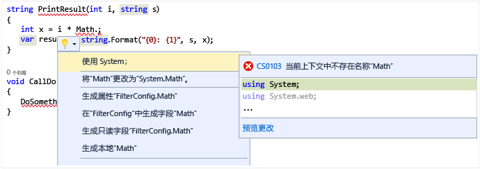

# <a name="quick-actions"></a>快速操作

通过[快速操作](refactoring-code-generation-quick-actions.md#quick-actions)，只凭单个操作便可轻松重构、生成或修改代码。 快速操作可用于 C#、[C++](/cpp/ide/writing-and-refactoring-code-cpp) 和 Visual Basic 代码文件。 某些操作特定于一种语言，而其他操作适用于所有语言。 可使用灯泡图标，或按“Ctrl”应用快速操作。 +  前提是光标位于相应的代码行上。

如果有红色波形曲线，则将看到灯泡，Visual Studio 针对如何解决此问题有一条建议。 例如，如果你遇到红色波形曲线指示的错误，则在可对该错误进行修复时，会显示灯泡。 对于任何语言，第三方均可提供自定义诊断和建议（例如，作为 SDK 的一部分），Visual Studio 电灯泡会根据这些规则亮起。

## <a name="to-see-a-light-bulb"></a>查看电灯泡

1. 在许多情况下，灯泡会在你将鼠标指针悬停在错误点上方时，或是在你将插入点移动到存在错误的行中时在编辑器左边距处自然而然地出现。 看到红色波形曲线时，可悬停在其上方，以显示电灯泡。 使用鼠标或键盘转到问题发生的行时，也会显示电灯泡。

1. 按“Ctrl” + **。** 可调用电灯泡并直接转到潜在修复列表。

   

## <a name="to-see-potential-fixes"></a>查看潜在修复

单击向下箭头或“显示潜在修复”链接，以显示电灯泡可执行的快速操作列表。



## <a name="common-quick-actions"></a>常见快速操作

下面是同时适用于 C# 和 Visual Basic 代码的一些常见快速操作。

### <a name="add-missing-casesdefault-caseboth"></a>添加缺少的 case/默认 case/二者

在 C# 中创建 `switch` 语句，或在 Visual Basic 中创建 `Select Case` 语句时，可使用代码操作自动添加缺少的 case 项、默认 case 语句或同时添加二者。  对于如下所示的空语句：

```csharp
enum MyEnum
{
    Item1,
    Item2,
    Item3
}

...

MyEnum myEnum = MyEnum.Item1;

switch(myEnum)
{
}
```

```vb
Enum MyEnum
    Item1
    Item2
    Item3
End Enum

...

Dim myEnum as MyEnum = MyEnum.Item1

Select Case myEnum
End Select
```

使用“添加两者”快速操作同时填入缺少 的 case 和默认 case 将创建以下内容：

```csharp
switch(myEnum)
{
    case MyEnum.Item1:
        break;
    case MyEnum.Item2:
        break;
    case MyEnum.Item3:
        break;
    default:
        break;
}
```

```vb
Select Case myEnum
    Case MyEnum.Item1
        Exit Select
    Case MyEnum.Item2
        Exit Select
    Case Else
        Exit Select
End Select
```

### <a name="correct-misspelled-type"></a>更正拼写错误的类型

如果在 Visual Studio 中意外拼错了一个类型，此快速操作会为你自动更正错误。  可在灯泡菜单中看到这些项显示有“‘将拼写错误的类型’更改为‘正确类型’”。  例如：

```csharp
// Before
private viod MyMethod()
{
}

// Change 'viod' to 'void'

// After
private void MyMethod()
{
}
```

```vb
' Before
Function MyFunction as Intger
End Function

' Change 'Intger' to 'Integer'

' After
Function MyFunction as Integer
End Function
```

### <a name="remove-unnecessary-cast"></a>删除不必要的 cast

如果将某类型强制转换为不需要 cast 的另一类型，则“删除不必要的 cast”快速操作将从代码中删除该 cast。

```csharp
// before
int number = (int)3;

// Remove Unnecessary Cast

// after
int number = 3;
```

```vb
' Before
Dim number as Integer = CType(3, Integer)

' Remove Unnecessary Cast

' After
Dim number as Integer = 3
```

### <a name="replace-method-with-property-or-replace-property-with-method"></a>将方法替换为属性或将属性替换为方法

这些快速操作可将方法转换为属性，反之亦然。  以下示例演示了从方法到属性的转换。  相反情况下，只需将 *Before* 和 *After* 部分颠倒过来即可。

```csharp
private int MyValue;

// Before
public int GetMyValue()
{
    return MyValue;
}

// Replace 'GetMyValue' with property

// After
public int MyValue
{
    get { return MyValue; }
}
```

```vb
Dim MyValue As Integer

' Before
Function GetMyValue() As Integer
    Return MyValue
End Function

' Replace 'GetMyValue' with property

' After
ReadOnly Property MyValue As Integer
    Get
        Return MyValue
    End Get
End Property
```

### <a name="make-method-synchronous"></a>使方法同步

在对方法使用 `async`/`Async` 关键字时，很有可能也会在该方法的内部某一位置使用 `await`/`Await` 关键字。  但是，如果不是这种情况，则会出现可通过删除 `async`/`Async` 关键字并更改返回类型以使方法同步的快速操作。  从“快速操作”菜单中使用“使方法同步”选项。

```csharp
// Before
async Task<int> MyAsyncMethod()
{
    return 3;
}

// Make method synchronous

// After
int MyAsyncMethod()
{
    return 3;
}
```

```vb
' Before
Async Function MyAsyncMethod() As Task(Of Integer)
    Return 3
End Function

' Make method synchronous

' After
Function MyAsyncMethod() As Integer
    Return 3
End Function
```

### <a name="make-method-asynchronous"></a>使方法异步

在方法内使用 `await`/`Await` 关键字时，该方法本身很有可能会标记有 `async`/`Async` 关键字。  但是，如果不是这种情况，则会出现可使方法异步的快速操作。  从“快速操作”菜单中使用“使方法/函数异步”选项。

```csharp
// Before
int MyAsyncMethod()
{
    return await Task.Run(...);
}

// Make method synchronous

// After
async Task<int> MyAsyncMethod()
{
    return await Task.Run(...);
}
```

```vb
' Before
Function MyAsyncMethod() as Integer
    Return  Await Task.Run(...)
End Function

' Make method synchronous

' After
Async Function MyAsyncMethod() As Task(Of Integer)
    Return Await Task.Run(...)
End Function
```

### <a name="remove-unnecessary-usingsimports"></a>删除不必要的 using/Import

“删除不必要的 using/Import”快速操作将删除当前文件中任何未使用的 `using` 和 `Import` 语句。  选择此项后，将立即删除未使用的命名空间导入。

### <a name="add-usingsimports-for-types-in-reference-assemblies-nuget-packages-or-other-types-in-your-solution"></a>在引用程序集、NuGet 包或解决方案的其他类型中为类型添加 using/Import

位于解决方案其他项目中的 using 类型将自动显示快速操作，但其他类型的快速操作则需要从“工具”>“选项”>“C#”或“基本”>“高级”选项卡中启用：

* 建议对引用程序集中的类型使用 using/import
* 建议对 NuGet 包中的类型使用 using/import

启用后，如果使用当前未导入但引用程序集或 NuGet 包中存在的命名空间中的类型，则会创建 using/import 语句。

```csharp
// Before
Debug.WriteLine("Hello");

// using System.Diagnostics;

// After
using System.Diagnostics;

Debug.WriteLine("Hello");
```

```vb
' Before
Debug.WriteLine("Hello")

' Imports System.Diagnostics

// After
Imports System.Diagnostics

Debug.WriteLine("Hello")
```

### <a name="convert-to-interpolated-string"></a>转换为内插字符串

类似于 **[String.Format](https://msdn.microsoft.com/library/system.string.format.aspx)** 方法，[内插字符串](/dotnet/csharp/language-reference/keywords/interpolated-strings)是使用嵌入式变量来表达字符串的一种简单方式。  此快速操作可识别何时需要将字符串连接在一起或使用 **String.Format**，然后将用法更改为内插字符串。

```csharp
// Before
int num = 3;
string s = string.Format("My string with {0} in the middle", num);

// Convert to interpolated string

// After
int num = 3;
string s = $"My string with {num} in the middle";
```

```vb
' Before
Dim num as Integer = 3
Dim s as String = String.Format("My string with {0} in the middle", num)

' Convert to interpolated string

' After
Dim num as Integer = 3
Dim s As String = $"My string with {num} in the middle"
```

### <a name="remove-merge-conflict-markers"></a>移除合并冲突标记

借助这些快速操作，可以通过“接受更改”（即移除冲突的代码和标记）解决合并冲突问题。 （仅适用于 Visual Studio 2017（版本 15.3 - 预览版）。）


### <a name="add-null-checks-for-parameters"></a>添加 null 参数检查

借助此快速操作，可以在代码中添加检查，从而指明参数是否为 null。 （仅适用于 Visual Studio 2017（版本 15.3 - 预览版）。）


### <a name="constructor-generator-improvements"></a>构造函数生成器改进

借助此快速操作，可以在创建构造函数时选择要生成的属性或字段，也可以从空白主体生成构造函数。 此外，还可以从调用站点将参数添加到现有构造函数中。 （仅适用于 Visual Studio 2017（版本 15.3 - 预览版）。）


### <a name="remove-unused-variables"></a>删除未使用的变量

借助此快速操作，可以从代码中删除已声明但从未用过的变量。 （仅适用于 Visual Studio 2017（版本 15.3 - 预览版）。）


### <a name="generate-overrides"></a>生成重写函数

借助此快速操作，可以从类或结构中的空白行创建重写函数。 使用“选取成员”对话框，可以选择要重写的成员。 （仅适用于 Visual Studio 2017（版本 15.3 - 预览版）。）


### <a name="change-base-for-numeric-literals"></a>更改数字参数的基数

借助此快速操作，可以将数字文本从一种基本数制转换成另一种。 例如，可以将数字更改为十六进制或二进制格式。 （仅适用于 Visual Studio 2017（版本 15.3 - 预览版）。）


### <a name="insert-digit-separators-into-literals"></a>将数字分隔符插入数字文本

借助此快速操作，可以将分隔符添加到数字文本值中。 （仅适用于 Visual Studio 2017（版本 15.3 - 预览版）。）


### <a name="convert-if-construct-to-switch"></a>将 **if** 构造转换成 **switch**

借助此快速操作，可以将 **if-then-else** 构造转换成 **switch** 构造。 （仅适用于 Visual Studio 2017（版本 15.3 - 预览版）。）

```csharp
// Before
if (obj is string s)
{
  Console.WriteLine("obj is a string: " + s);
}

else if (obj is int i && i > 10)
{
  Console.WriteLine("obj is an int greater than 10");
}

// Convert to switch

// After
switch (obj)
{
  case string s:
    Console.WriteLine("Obj is a string: " + s);
    break;
  case int i when i > 10:
    Console.WriteLine("obj is an int greater than 10");
    break;
}
```

```vb
' Before
If TypeOf obj Is String s Then
    Console.WriteLine("obj is a string: " + s)
Else If TypeOf obj Is Integer i And i > 10 Then
    Console.WriteLine("obj is an int greater than 10")
End If

' Convert to switch

' After
Select Case obj
  Case String s
    Console.WriteLine("Obj is a string: " + s)
    Exit Sub
  Case Integer i when i > 10
    Console.WriteLine("obj is an int greater than 10")
    Exit Sub
End Select
```

## <a name="see-also"></a>请参阅

[代码样式和快速操作](code-styles-and-quick-actions.md)  
[编写和重构代码 (C++)](/cpp/ide/writing-and-refactoring-code-cpp)
