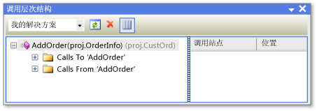

# 调用层次结构
[!INCLUDE[vs2017banner](../../code-quality/includes/vs2017banner.md)]

调用层次结构使您可以在代码可以通过显示所有对于或来自所选方法、属性或构造函数的调用。  这是如何使您能够更好地理解代码流和评估代码更改的效果为编码。  您可以检查多个代码级别查看方法调用的复杂链，并附加输入项指向代码，从而可以找到所有可能的执行路径。  
  
 调用层次结构可在设计时不同，由调试器显示的调用堆栈。  
  
## 使用调用层次结构  
 若要显示 **调用层次结构** 窗口中，右击方法，属性的名称，或构造函数调用，然后单击 **查看调用层次结构**。  
  
 成员名称会显示在 **调用层次结构** 窗口的树视图窗格中。  如果展开成员节点， **调用***成员名称* 和 **调用从***成员名称* 会出现。  下面的插图 **调用层次结构** 窗口显示这些节点。  
  
   
调用层次结构 " 窗口  
  
-   如果展开 **调用** 节点，调用选定成员的所有成员显示。  
  
-   如果展开 **调用从** 节点，由选定成员调用的所有成员显示。  
  
 然后可以展开这些子节点成员中的每一命名为 **调用** 和 **调用从** 节点。  如下图所示，这使您可以导航到调用方的堆栈，。  
  
   
调用层次结构 " 窗口  
  
 对于定义为虚拟或抽象成员的成员， **重写方法名称** 显示节点。  对于接口成员， **实现方法名称** 显示节点。  这些可展开的节点显示级别和 **调用** 和 **调用从** 节点处于相同。  
  
 在工具栏上 **搜索范围** 框包含 **我的解决方案**、 **当前项目**和 **当前文档**的选择。  
  
 当您选择 **调用层次结构** 树视图窗格的子成员:  
  
-   **调用层次结构** 详细信息窗格将显示该子成员从父成员调用的所有代码行。  
  
-   **代码定义窗口**，因此，如果打开，显示选定成员的代码。  此窗口可在 C\# 和 C\+\+。  有关此窗口的更多信息，请 [查看代码的结构](../../ide/viewing-the-structure-of-code.md)参见。  
  
> [!NOTE]
>  调用层次结构未找到方法组引用，包括将方法添加为事件处理程序或分配给委托。  若要查找对方法的所有引用，可以使用 **查找所有引用** 命令。  
  
## 快捷菜单项  
 下表描述了可用的几个快捷菜单选项，当您右击在树视图窗格中的一个节点。  
  
|上下文菜单项|说明|  
|------------|--------|  
|**添加为新根**|选定节点添加为树视图窗格中的新根节点。  这使您可以集中关注特定子树。|  
|**移除根\(&R\)**|从树视图窗格中移除选定的根节点。  此选项从根节点才可用。   还可以使用 **移除根\(&R\)** 工具栏按钮移除选定的根节点。|  
|**转到定义**|运行 " 转到在选定节点上定义命令。  这会定位到成员调用的原始定义或变量的定义。   若要运行 " 转到定义 " 命令，要在所选节点也可以双击选定节点或按 F12。|  
|**查找所有引用**|运行所有引用在选定节点上命令的外观。  这会找到引用类或成员的所有代码行在项目中。   所有引用在选定节点的命令还可以使用 shift\+f12 运行外观。|  
|**复制**|复制选定节点 \(，但不包含其\) 的内容。|  
|**刷新**|折叠选定的节点，以便再次将其展开显示当前信息。|