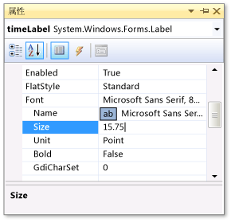
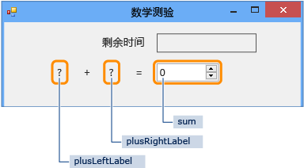
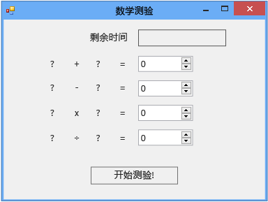

# 步骤 1：创建项目并向窗体添加标签
在开发此测验的过程中，首先应创建项目并将数个标签、一个按钮和其他控件添加到窗体。 此外还要设置已添加各个控件的属性。 项目将包含窗体、控件和代码（在本教程下文中）。 按钮用于启动测验，标签用于显示测验问题，其他控件则用于显示测验答案和完成测验所剩时间。  
  
> [!NOTE]
>  本主题是基本编码概念教程系列中的一部分。 有关本教程的概述，请参阅[教程 2：创建计时数学测验](../ide/tutorial-2-create-a-timed-math-quiz.md)。  
  
### 创建项目并设置窗体的属性  
  
1.  在菜单栏上，依次选择“文件” 、“新建” 、“项目” 。  
  
2.  在“已安装的模板”列表中选择“C#”或“Visual Basic”。  
  
3.  在模板列表中，选择“Windows 窗体应用程序”模板，将其命名为“Math Quiz”，然后选择“确定”按钮。  
  
     此时将显示名为“Form1.cs”或“Form1.vb”的窗体，具体取决于所选择的编程语言。  
  
4.  选择该窗体，然后将其“Text”属性设置为“Math Quiz”。  
  
     “属性”窗口包含窗体的各个属性。  
  
5.  将窗体大小更改为 500 像素（宽）× 400 像素（高）。  
  
     您可通过拖动窗体边缘来调整其大小，直到集成开发环境 (IDE) 的左下角显示正确的大小。 或者，你也可以更改“Size”属性的值。  
  
6.  将“FormBorderStyle”属性的值更改为“Fixed3D”，并将“MaximizeBox”属性设置为“False”。  
  
     这些值用于防止测验对象改变窗体大小。  
  
### 创建“剩余时间”框  
  
1.  从工具箱中添加一个“标签”控件，然后将其“(Name)”属性的值设置为 `timeLabel`。  
  
     此标签将变成右上角的一个框，其中显示测验的剩余秒数。  
  
2.  将“AutoSize”属性更改为“False”，这样便可以自行调整框的大小。  
  
3.  将“BorderStyle”属性更改为“FixedSingle”以在框的周围绘制线条。  
  
4.  将“Size”属性设置为“200, 30”。  
  
5.  将该标签移到窗体的右上角，此处将显示蓝色分隔线。  
  
     这些分隔线可以帮助您在窗体上对齐控件。  
  
6.  在“属性”窗口中，选择“Text”属性，然后选择 Backspace 键以清除此属性的值。  
  
7.  选择“Font”属性旁边的加号 (+)，然后将“Size”属性的值更改为 15.75。  
  
     如下图所示，您可以更改多个字体属性。  
  
       
显示字号的“属性”窗口  
  
8.  从工具箱中再添加一个“标签”控件，然后将其字号设置为 15.75。  
  
9. 将“Text”属性设置为“剩余时间”。  
  
10. 移动该标签，使之整齐排列在“timeLabel”标签的左侧。  
  
### 添加加法题的控件  
  
1.  从工具箱中添加一个“标签”控件，然后将其“Text”属性设置为“?” （问号）。  
  
2.  将“AutoSize”属性设置为“False”。  
  
3.  将“Size”属性设置为“60, 50”。  
  
4.  将字号设置为“18”。  
  
5.  将“TextAlign”属性设置为“MiddleCenter”。  
  
6.  将“Location”属性设置为“50, 75”，以便将此控件置于窗体上。  
  
7.  将“(Name)”属性设置为“plusLeftLabel”。  
  
8.  选择“plusLeftLabel”标签，然后选择 Ctrl+C 键或“编辑”菜单上的“复制”。  
  
9. 通过选择 Ctrl+V 键或“编辑”菜单上的“粘贴”，将此标签粘贴三次。  
  
10. 排列这三个新标签，使之在“plusLeftLabel”标签的右侧排成一行。  
  
     您可以使用分隔线将它们隔开并将它们排成一行。  
  
11. 将第二个标签的“Text”属性值设置为 **+**（加号）。  
  
12. 将第三个标签的“(Name)”属性值设置为“plusRightLabel”。  
  
13. 将第四个标签的“Text”属性值设置为 **=**（等于号）。  
  
14. 从工具箱添加一个“NumericUpDown”控件，将其字号设置为“18”，并将其宽度设置为“100”。  
  
     稍后您将了解到有关此类控件的详细信息。  
  
15. 将此“NumericUpDown”控件与加法题的各标签控件排成一行。  
  
16. 将“NumericUpDown”控件的“(Name)”属性值更改为“sum”。  
  
     如下图所示，您已创建了第一行。  
  
       
数学测验的第一行  
  
### 添加减法、乘法和除法题的控件  
  
1.  复制加法题的全部五个控件（四个 Label 控件和一个 NumericUpDown 控件），然后粘贴这些控件。  
  
     此窗体包含五个新控件，它们仍处于选中状态。  
  
2.  将所有控件移至某处，使之在加法控件的下方排成一行。  
  
     您可以使用分隔线在两行之间留出足够的距离。  
  
3.  将第二个标签的“Text”属性值更改为“-”（减号）。  
  
4.  将第一个问号标签命名为“minusLeftLabel”。  
  
5.  将第二个问号标签命名为“minusRightLabel”。  
  
6.  将“NumericUpDown”控件命名为“difference”。  
  
7.  将这五个控件再粘贴两次。  
  
8.  在第三行中，将第一个标签命名为“timesLeftLabel”，将第二个标签的“Text”属性更改为“×”（乘号），将第三个标签命名为“timesRightLabel”，然后将 NumericUpDown 控件命名为“product”。  
  
9. 在第四行中，将第一个标签命名为“dividedLeftLabel”，将第二个标签的“Text”属性更改为“÷”（除号），将第三个标签命名为“dividedRightLabel”，然后将 NumericUpDown 控件命名为“quotient”。  
  
    > [!NOTE]
    >  您可以复制本教程中的乘号 × 和除号 ÷，将它们粘贴到窗体中。  
  
### 添加“开始”按钮并设置 Tab 键索引顺序  
  
1.  从工具箱添加一个“按钮”控件，然后将其“(Name)”属性设置为“startButton”。  
  
2.  将“Text”属性设置为“开始测验”。  
  
3.  将字号设置为“14”。  
  
4.  将“AutoSize”属性设置为“True”，这可使此按钮自动调整大小以适合文本。  
  
5.  将此按钮置于窗体底部附近的中心位置。  
  
6.  将“startButton”控件的“TabIndex”属性值设置为“1”。  
  
    > [!NOTE]
    >  “TabIndex”属性用于设置测验对象选择 Tab 键时的控件顺序。 若要查看其工作原理，请打开任何对话框（例如，在菜单栏上，依次选择“文件”、“打开”），然后选择几次 Tab 键。 观察每次选择 Tab 键时，光标是如何从一个控件移动到另一个控件的。 程序员在创建该窗体时便已确定这一顺序。  
  
7.  将 NumericUpDown sum 控件的“TabIndex”属性值设置为“2”，将 difference 控件的此属性值设置为“3”，将 product 控件的此属性值设置为“4”，将 quotient 控件的此属性值设置为“5”。  
  
     窗体看上去应该如下图所示。  
  
       
初始数学测验窗体  
  
8.  若要验证“TabIndex”属性是否按照预期运行，请选择 F5 键或选择菜单栏上的“调试”、“启动调试”保存并运行程序，然后选择几次 Tab 键。  
  
### 继续或查看  
  
-   若要转到下一个教程，请参阅[步骤 2：创建随机加法问题](../ide/step-2-create-a-random-addition-problem.md)。  
  
-   若要返回到概述主题，请参阅[教程 2：创建计时数学测验](../ide/tutorial-2-create-a-timed-math-quiz.md)。
