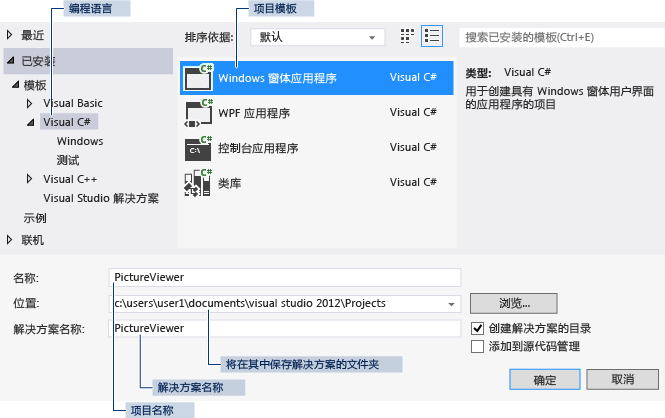

# 步骤 1：创建 Windows 窗体应用程序项目
[!INCLUDE[vs2017banner](../code-quality/includes/vs2017banner.md)]

创建图片查看器时，第一步是创建 Windows 窗体应用程序项目。  
  
  有关本主题的视频版本，请参阅[教程 1：用 Visual Basic 创建图片查看器 \- 视频 1](http://go.microsoft.com/fwlink/?LinkId=205209) 或[教程 1：用 C\# 创建图片查看器 \- 视频 1](http://go.microsoft.com/fwlink/?LinkId=205199)。  这些视频使用 Visual Studio 的早期版本，因此在一些菜单命令和其他用户界面元素上略有差异。  但是，概念和过程与当前版本的 Visual Studio 大同小异。  
  
### 创建 Windows 窗体应用程序项目  
  
1.  在菜单栏上，依次选择**“文件”**、**“新建”**、**“项目”**。  对话框应如下所示。  
  
       
“新建项目”对话框  
  
2.  在**“已安装的模板”**列表中选择**“Visual C\#”**或**“Visual Basic”**。  
  
3.  在模板列表中，选择**“Windows 窗体应用程序”**图标。  将新窗体命名为“PictureViewer”，然后选择**“确定”**按钮。  
  
     Visual Studio 将为您的程序创建解决方案。  解决方案充当程序所需全部项目和文件的容器。  本教程后面部分将详细解释这些术语。  
  
4.  下图显示了此时应在 Visual Studio 界面中看到的内容。  
  
    > [!NOTE]
    >  您的窗口布局可能与此图不完全相同。  确切的窗口布局取决于 Visual Studio 的版本、所使用的编程语言以及一些其他因素。  但是，您应验证是否显示了全部三个窗口。  
  
       
IDE 窗口  
  
     界面中包含三个窗口：主窗口、**“解决方案资源管理器”**和**“属性”**窗口。  
  
     如果缺少其中任何一个窗口，请在菜单栏中选择**“窗口”**、**“重置窗口布局”**来还原默认的窗口布局。  您还可以通过使用菜单命令来显示各个窗口。  在菜单栏上，依次选择**“视图”**、**“属性窗口”**或**“解决方案资源管理器”**。  如果任何其他窗口处于打开状态，请选择窗口右上角的**“关闭”**\(x\) 按钮将其关闭。  
  
5.  该图显示了下列窗口（从左上角沿顺时针）：  
  
    -   **主窗口** 在此窗口中，您可以完成大部分工作，如使用窗体和编辑代码。  在此图中，窗口显示了窗体编辑器中的一个窗体。  在窗口的顶部，显示有**“起始页”**选项卡和**“Form1.cs \[设计\]”**选项卡。（在 Visual Basic 中，选项卡名称以 .vb 而非 .cs 结尾。）  
  
    -   **“解决方案资源管理器” 窗口** 在此窗口中，您可以查看并导航到解决方案中的所有项。  选择某个文件时，**“属性”**窗口中的内容将发生更改。  如果打开某个代码文件（在 Visual C\# 中以 .cs 结尾，在 Visual Basic 中以 .vb 结尾），则将显示该代码文件或用于该代码文件的设计器。  设计器是一种可视化图面，您可在上面添加按钮和列表等控件。  对于 Visual Studio 窗体，设计器称为 Windows 窗体设计器。  
  
    -   **“属性” 窗口** 在此窗口中，您可更改在其他窗口中选择的项的属性。  例如，如果选择 Form1，则可以通过设置**“Text”**属性更改其标题，还可以通过设置**“Backcolor”**属性更改背景色。  
  
    > [!NOTE]
    >  **“解决方案资源管理器”**的顶部行显示**“解决方案‘PictureViewer’\(1 个项目\)”**，这意味着 Visual Studio 已为您创建了一个解决方案。  一个解决方案可以包含多个项目，但现在，您将使用只包含一个项目的解决方案。  
  
6.  在菜单栏上，依次选择**“文件”**、**“全部保存”**。  
  
     或者，在工具栏上选择**“全部保存”**按钮，如下图所示。  
  
       
“全部保存”工具栏按钮  
  
     Visual Studio 将自动填充文件夹名称和项目名称，并将项目保存在项目文件夹中。  
  
### 继续或查看  
  
-   若要转到下一个教程步骤，请参见[步骤 2：运行程序](../ide/step-2-run-your-program.md)。  
  
-   若要返回概述主题，请参见[教程 1：创建图片查看器](../ide/tutorial-1-create-a-picture-viewer.md)。