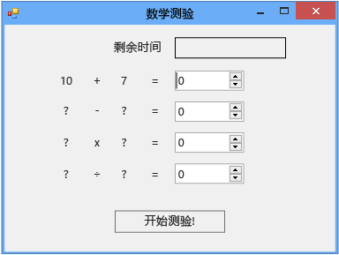

# 步骤 2：创建随机加法问题
[!INCLUDE[vs2017banner](../code-quality/includes/vs2017banner.md)]

在本教程中的第 2 部分中，您将添加几道基于随机数的数学题，从而让测验变得有挑战性。  您还将添加一个名为 `StartTheQuiz()` 的方法，此方法可填充题目并启动倒计时计时器。  在本教程的后面部分中，您将添加减法、乘法和除法问题。  
  
> [!NOTE]
>  本主题是基本编码概念教程系列中的一部分。  有关本教程的概述，请参阅[教程 2：创建计时数学测验](../ide/tutorial-2-create-a-timed-math-quiz.md)。  
  
### 创建随机加法问题  
  
1.  在窗体设计器中，选择窗体 \(Form1\)。  
  
2.  在菜单栏上，依次选择**“视图”**、**“代码”**。  
  
     此时将显示 Form1.cs 或 Form1.vb（具体取决于您所使用的编程语言），以便您查看窗体背后的代码。  
  
3.  通过在代码顶部附近添加一个 `new` 语句，从而创建一个 `Random` 对象，如下所示。  
  
     [!code-cs[VbExpressTutorial3Step2#1](../ide/codesnippet/CSharp/step-2-create-a-random-addition-problem_1.cs)]
     [!code-vb[VbExpressTutorial3Step2#1](../ide/codesnippet/VisualBasic/step-2-create-a-random-addition-problem_1.vb)]  
  
     您已向窗体中添加一个 `Random` 对象并将其命名为**“randomizer”**。  
  
     `Random` 称为对象。  您之前可能听过“对象”一词，您将在下一个教程中详细了解它在编程中的含义。  当前，只需记住您可以使用 `new` 语句创建按钮、标签、面板、OpenFileDialog、ColorDialog、SoundPlayer、Random 甚至窗体，而这些项称为对象。  当您运行程序时，将启动窗体，同时窗体背后的代码将创建一个 `Random` 对象并将其命名为**“randomizer”**。  
  
     随后，您将构建一个检查答案的方法，因此，您的测验必须使用变量来存储为每个问题生成的随机数。  请参阅 [变量](/dotnet/visual-basic/programming-guide/language-features/variables/index)或[类型](/dotnet/csharp/programming-guide/types/index)。  为正确使用变量，您必须声明这些变量，这意味着列出它们的名称和数据类型。  
  
4.  将两个整型变量添加到窗体，并将它们分别命名为**“addend1”**和**“addend2”**。  
  
    > [!NOTE]
    >  整型变量即 C\# 中的 int 或 Visual Basic 中的 Integer。  这种变量可以存储从 \-2147483648 到 2147483647 的正负数，并仅能存储整数而不能存储小数。  
  
     您应使用与添加 `Random` 对象相似的语法来添加整型变量，如下面的代码所示。  
  
     [!code-cs[VbExpressTutorial3Step2#2](../ide/codesnippet/CSharp/step-2-create-a-random-addition-problem_2.cs)]
     [!code-vb[VbExpressTutorial3Step2#2](../ide/codesnippet/VisualBasic/step-2-create-a-random-addition-problem_2.vb)]  
  
5.  添加一个名为 `StartTheQuiz()` 的方法，此方法使用 `Random` 对象的 `Next()` 方法在标签中显示随机数。  `StartTheQuiz()` 最后将填充所有题目并启动计时器，因此请添加注释。  此函数应如下所示。  
  
     [!code-cs[VbExpressTutorial3Step2#3](../ide/codesnippet/CSharp/step-2-create-a-random-addition-problem_3.cs)]
     [!code-vb[VbExpressTutorial3Step2#3](../ide/codesnippet/VisualBasic/step-2-create-a-random-addition-problem_3.vb)]  
  
     请注意，当您在代码中的 randomizer 后输入点 \(.\) 时，将打开一个 IntelliSense 窗口，并显示您可调用的 `Random` 对象的所有方法。  例如，Intellisense 将列出 `Next()` 方法，如下所示。  
  
       
Next 方法  
  
     在对象后输入点时，IntelliSense 将显示对象成员的列表，如属性、方法和事件。  
  
    > [!NOTE]
    >  当您对 `Random` 对象使用 `Next()` 方法时（例如，当您调用 `randomizer.Next(50)` 时），您将获得一个小于 50 的随机数（0 到 49）。  在此示例中，您调用了 `randomizer.Next(51)`。  您使用了 51 而不是 50，以便两个随机数相加所得的答案介于 0 到 100 之间。  如果将 50 传递给 `Next()` 方法，则此方法会选择一个介于 0 到 49 之间的数字，因此可能得到的最大答案是 98，而不是 100。  在执行此方法中的前两个语句后，这两个整型变量（`addend1` 和 `addend2`）都将保留一个 0 到 50 之间的随机数。  此屏幕快照显示了 Visual C\# 代码，但是，IntelliSense 对于 Visual Basic 将采用相同的工作方式。  
  
     详细了解这些语句。  
  
     [!code-cs[VbExpressTutorial3Step2#18](../ide/codesnippet/CSharp/step-2-create-a-random-addition-problem_4.cs)]
     [!code-vb[VbExpressTutorial3Step2#18](../ide/codesnippet/VisualBasic/step-2-create-a-random-addition-problem_4.vb)]  
  
     这些语句将设置**“plusLeftLabel”**和**“plusRightLabel”**的**“Text”**属性，以便它们显示两个随机数。  您必须使用整数的 `ToString()` 方法将数字转换为文本。（在编程中，字符串表示文本。  标签控件只显示文本，而不显示数字。  
  
6.  在设计窗口中，双击**“开始”**按钮或选择该按钮，然后选择 Enter 键。  
  
     当测验对象选择此按钮时，测验将会开始，而您刚才已添加一个用来实现该行为的 Click 事件处理程序。  
  
7.  添加下面两个语句。  
  
     [!code-cs[VbExpressTutorial3Step2#4](../ide/codesnippet/CSharp/step-2-create-a-random-addition-problem_5.cs)]
     [!code-vb[VbExpressTutorial3Step2#4](../ide/codesnippet/VisualBasic/step-2-create-a-random-addition-problem_5.vb)]  
  
     第一个语句将调用新的 `StartTheQuiz()` 方法。  第二个语句会将**“startButton”**控件的**“Enabled”**属性设置为**“False”**，从而使测验对象在测验期间不能选择此按钮。  
  
8.  保存并运行您的代码，然后选择**“开始”**按钮。  
  
     此时将显示一道随机加法题，如下图所示。  
  
       
随机加法问题  
  
     在本教程中的下一个步骤中，您将添加总和。  
  
### 继续或查看  
  
-   若要转到下一个教程步骤，请参见[步骤 3：添加一个倒计时计时器](../Topic/Step%203:%20Add%20a%20Countdown%20Timer.md)。  
  
-   若要返回上一个教程步骤，请参见[步骤 1：创建项目并向窗体添加标签](../ide/step-1-create-a-project-and-add-labels-to-your-form.md)。