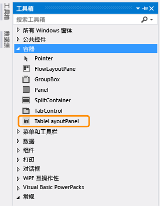
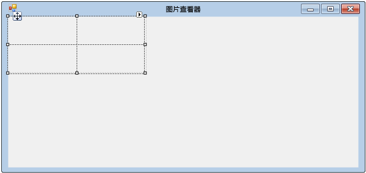
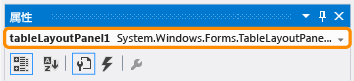
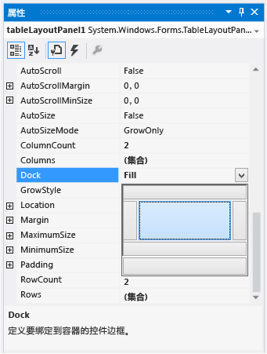
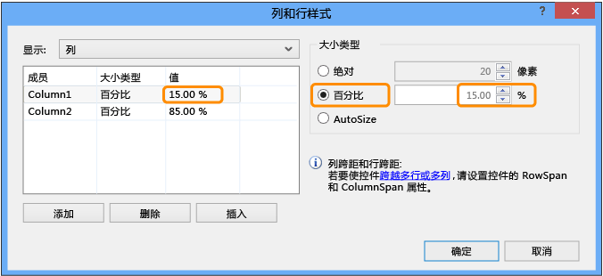
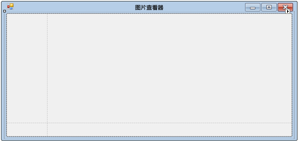

# 步骤 4：使用 TableLayoutPanel 控件设置窗体布局
[!INCLUDE[vs2017banner](../code-quality/includes/vs2017banner.md)]

在此步骤中，将向窗体中添加一个 `TableLayoutPanel` 控件。  TableLayoutPanel 可帮助在窗体中正确地对齐您稍后将添加的控件。  
  
  有关本主题的视频版本，请参阅[教程 1：用 Visual Basic 创建图片查看器 \- 视频 2](http://go.microsoft.com/fwlink/?LinkId=205211) 或[教程 1：用 C\# 创建图片查看器 \- 视频 2](http://go.microsoft.com/fwlink/?LinkId=205200)。  这些视频使用 Visual Studio 的早期版本，因此在一些菜单命令和其他用户界面元素上略有差异。  但是，概念和过程与当前版本的 Visual Studio 大同小异。  
  
### 使用 TableLayoutPanel 控件设置窗体布局  
  
1.  在 Visual Studio IDE 左侧，找到**“工具箱”**选项卡。  选择**“工具箱”**选项卡，随即将显示工具箱。（或者，在菜单栏上，依次选择**“视图”**、**“工具箱”**。）  
  
2.  选择**“容器”**组旁边的小三角形符号以打开该组，如下图所示。  
  
       
“容器”组  
  
3.  可以向窗体中添加类似按钮、复选框和标签这样的控件。  在工具箱中双击 `TableLayoutPanel` 控件。（您也可将控件从工具箱拖动到窗体上。）当执行此操作时，IDE 会将 `TableLayoutPanel` 控件添加到窗体中，如下图中所示。  
  
       
TableLayoutPanel 控件  
  
    > [!NOTE]
    >  添加 TableLayoutPanel 之后，如果窗体中出现标题为**“TableLayoutPanel 任务”**的窗口，请选择窗体内的任何位置以关闭此窗口。  在本教程后面部分，您将学习到有关此窗口的更多内容。  
  
     请注意当选择“工具箱”选项卡时工具箱是如何展开以覆盖窗体的，以及当选择工具箱外部的任何位置后它是如何关闭的。  这就是 IDE 自动隐藏功能。  通过选择窗口右上角的图钉图标在自动隐藏和就地锁定之间切换，您可为任何窗口打开或关闭工具箱。  图钉图标如下所示。  
  
       
图钉图标  
  
4.  通过选择**“TableLayoutPanel”**来确保选定它。  可以通过查看**“属性”**窗口顶部的下拉列表来验证选定哪个控件，如下图中所示。  
  
       
显示 TableLayoutPanel 控件的“属性”窗口  
  
5.  在**“属性”**窗口的工具栏上选择**“按字母顺序”**按钮。  这会导致**“属性”**窗口中的属性列表按字母顺序显示，这样更易于查找本教程中的属性。  
  
6.  控件选择器是**“属性”**窗口顶部的下拉列表。  在此示例中，它显示选定了名为 `tableLayoutPanel1` 的控件。  您可以通过在 Windows 窗体设计器中选择一个区域或者从控件选择器中进行选择来选择控件。  选择 `TableLayoutPanel` 之后，请查找**“Dock”**属性并选择**“Dock”**，此属性应设置为**“无”**。  请注意，一个下拉箭头将出现在值旁边。  选择该箭头，然后选择**“Fill”**按钮（中间的大按钮），如下图所示。  
  
       
“Fill”处于选中状态的“属性”窗口  
  
     Visual Studio 中的停靠是指 IDE 中的一个窗口附加到另一个窗口或区域的情况。  例如，“属性”窗口可以取消停靠，即在 Visual Studio 中独立地自由浮动，也可以靠近**“解决方案资源管理器”**停靠。  
  
7.  在将 TableLayoutPanel 的**“Dock”**属性设置为**“Fill”**之后，此面板将填充整个窗体。  如果再次调整窗体的大小，则 TableLayoutPanel 将保持停靠状态，并自行调整大小以适合窗体。  
  
    > [!NOTE]
    >  TableLayoutPanel 与 Microsoft Office Word 中的表类似：它具有行和列，并且个别单元格可以跨多个行和列。  每个单元格都可以存放一个控件（例如按钮、复选框或标签）。  TableLayoutPanel 将具有一个跨其整个顶部行的 `PictureBox` 控件、一个位于其左上角单元格中的 `CheckBox` 控件和四个位于其右上角单元格中的 `Button` 控件。  
  
8.  TableLayoutPanel 当前具有两个大小相等的行和两个大小相等的列。  您需要调整它们，以使顶部行和右侧列更大一些。  在 Windows 窗体设计器中选择“TableLayoutPanel”。  在右上角有一个小的黑色三角形按钮，如下所示。  
  
       
三角形按钮  
  
     此按钮指示该控件具有帮助您自动设置其属性的任务。  
  
9. 选择三角形以显示控件的任务列表，如下图所示。  
  
       
TableLayoutPanel 任务  
  
10. 选择**“编辑行和列”**任务以显示**“列和行样式”**窗口。  选择**“Column1”**，确保选中**“百分比”**按钮并在**“百分比”**框中输入 `15`，以将此控件的大小设置为 15%。（这是将在后面的教程中使用的 `NumericUpDown` 控件。）选择**“Column2”**并将其设置为 85%。  先不要选择**“确定”**按钮，因为这将关闭此窗口。（但如果这样做，您可以使用任务列表重新打开它。）  
  
       
TableLayoutPanel 列和行样式  
  
11. 从窗口顶部的**“显示”**下拉列表中选择**“行”**。  将**“Row1”**设置为 90% 并将**“Row2”**设置为 10%。  
  
12. 选择**“确定”**按钮。  现在，TableLayoutPanel 应具有一个大的顶部行、一个小的底部行、一个小的左侧列和一个大的右侧列。  您可在 TableLayoutPanel 中调整行和列的大小，方法是在窗体中选择 tableLayoutPanel1，然后拖动其行和列边框。  
  
       
调整了 TableLayoutPanel 的大小的 Form1  
  
### 继续或查看  
  
-   若要转到下一个教程步骤，请参见[步骤 5：向窗体添加控件](../Topic/Step%205:%20Add%20Controls%20to%20Your%20Form.md)。  
  
-   若要返回上一个教程步骤，请参见[步骤 3：设置窗体属性](../ide/step-3-set-your-form-properties.md)。