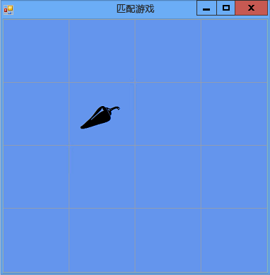

# 步骤 5：添加标签引用
该程序需要跟踪玩家选择了哪些标签控件。 现在，该程序将显示玩家选择的所有标签。 但是，我们要更改这一行为。 在选择第一个标签后，该程序应显示该标签的图标。 在选择第二个标签后，该程序应短暂显示两个图标，然后再隐藏这两个图标。 程序现将通过引用变量跟踪第一次和第二次分别选择的标签控件。  
  
### 添加标签引用  
  
1.  通过使用下面的代码向窗体中添加标签引用。  
  
     [!code-vb[VbExpressTutorial4Step5#5](../ide/codesnippet/VisualBasic/step-5-add-label-references_1.vb)]
     [!code-cs[VbExpressTutorial4Step5#5](../ide/codesnippet/CSharp/step-5-add-label-references_1.cs)]  
  
     这些引用变量看上去类似于你之前用来向窗体添加对象（如 `Timer` 对象、`List` 对象和 `Random` 对象）的语句。 但是，这些语句不会导致窗体中显示两个额外的标签控件，因为这两个语句中都没有 `new` 关键字。 没有 `new` 关键字，就不会创建对象。 这就是将 `firstClicked` 和 `secondClicked` 称为引用变量的原因：它们只跟踪（或引用）`Label` 对象。  
  
     当某变量不跟踪对象时，将设置为特殊的保留值：`null`（Visual C# 中）或 `Nothing`（Visual Basic 中）。 因此，当程序启动时，`firstClicked` 和 `secondClicked` 都设置为 `null` 或 `Nothing`，这意味着两个变量不会跟踪任何对象。  
  
2.  修改 Click 事件处理程序，以使用新的 `firstClicked` 引用变量。 移除 `label_Click()` 事件处理程序方法中的最后一个语句 (`clickedLabel.ForeColor = Color.Black;`)，并将它替换为下面的 `if` 语句。 （务必包括注释，以及整个 `if` 语句。）  
  
     [!code-vb[VbExpressTutorial4Step5#6](../ide/codesnippet/VisualBasic/step-5-add-label-references_2.vb)]
     [!code-cs[VbExpressTutorial4Step5#6](../ide/codesnippet/CSharp/step-5-add-label-references_2.cs)]  
  
3.  保存并运行程序。 选择其中一个标签控件，它的图标将显示。  
  
4.  选择下一个标签控件，发现没有任何反应。 该程序已跟踪玩家选择的第一个标签，因此 `firstClicked` 不等于 Visual C# 中的 `null` 或 Visual Basic 中的 `Nothing`。 当 `if` 语句检查 `firstClicked` 以确定它是否等于 `null` 或 `Nothing` 时，它发现它不等于，因而不会在 `if` 语句中执行语句。 因此，只有选择的第一个图标变为黑色，其他图标是不可见的，如下图所示。  
  
       
显示一个图标的匹配游戏  
  
     在教程的下一步中，将添加“计时器”控件修复此情况。  
  
### 继续或查看  
  
-   若要转到下一个教程步骤，请参阅[步骤6：添加计时器](../ide/step-6-add-a-timer.md)。  
  
-   若要转到下一个教程步骤，请参阅[步骤 4：向每个标签添加一个 Click 事件处理程序](../ide/step-4-add-a-click-event-handler-to-each-label.md)。
