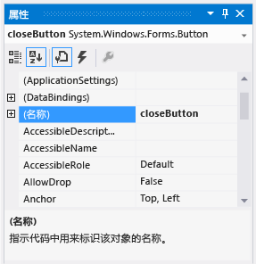

# 步骤 6：命名按钮控件
窗体上只有一个 PictureBox。 当添加此控件时，IDE 自动将其命名为“pictureBox1” 。 只有一个名为“checkBox1” 的 CheckBox。 很快，你将编写一些代码，并且这些代码将引用到上述的 CheckBox 和 PictureBox。 因为上述每种控件都只有一个控件，所以当你在代码中看到  “pictureBox1”或  “checkBox1”时，应知道其中的含义。  
  
> [!NOTE]
>  在 Visual Basic 中，任何控件名称的第一个字母默认是首字母大写，因此名称为 **“PictureBox1”**、 **“CheckBox1”**等等。  
  
 窗体上包含四个按钮，IDE 将它们分别命名为“button1” 、“button2” 、“button3” 和 “button4”。 只看这些按钮的当前名称，你并不知道哪个按钮是“关闭”  按钮，哪个按钮是“显示图片”  按钮。 这就是为按钮控件提供包含更多信息的名字会很有帮助的原因。  
  
 有关本主题的视频版本，请观看[Tutorial 1: Create a Picture Viewer in Visual Basic - Video 3](http://go.microsoft.com/fwlink/?LinkId=205213)（教程 1：用 Visual Basic 创建图片查看器 - 视频 3）或 [Tutorial 1: Create a Picture Viewer in C# - Video 3](http://go.microsoft.com/fwlink/?LinkId=205202)（教程 1：用 C# 创建图片查看器 - 视频 3）。 这些视频使用 Visual Studio 的早期版本，因此在一些菜单命令和其他用户界面元素上略有差异。 但是，概念和过程与当前版本的 Visual Studio 大同小异。  
  
### 要命名按钮控件  
  
1.  在窗体上，选择“关闭”  按钮。 （如果你仍选择了所有按钮，请选择 Esc 键取消选择。）在“属性”窗口中滚动，直到看到“(Name)”属性。 （当属性按字母顺序排列时，“(Name)”属性位于顶部附近。）将此名称更改为“closeButton”，如下图中所示。  
  
       
带有 closeButton 名称的“属性”窗口  
  
    > [!NOTE]
    >  如果尝试将按钮的名称更改为 （在单词“close”和“Button”之间有一个空格），则 IDE 将显示错误消息“属性值无效”。 控件名称中不允许使用空格和一些其他字符。  
  
2.  将其他三个按钮重命名为“backgroundButton” 、 “clearButton”和“showButton” 。 你可通过选择“属性”  窗口中的控件选择器下拉列表来验证这些名称。 新的按钮名称将出现。  
  
3.  双击窗体上的“显示图片”  按钮。 或者，选择窗体上的“显示图片”  按钮，然后选择 Enter 键。 此时，IDE 将在名为“Form1.cs”  （如果使用的是 Visual Basic，则名为“Form1.vb” ）的主窗口中打开一个附加选项卡。 此选项卡将显示窗体后面的代码文件，如下图所示。  
  
       
包含 Visual C# 代码的 Form1.cs 选项卡  
  
4.  重点考虑这一部分的代码。 （如果你要使用 Visual Basic 查看代码的 Visual Basic 版本，请选择下面的  “VB”选项卡。）  
  
     [!code-vb[VbExpressTutorial1Step6#1](../ide/codesnippet/VisualBasic/step-6-name-your-button-controls_1.vb)]
     [!code-cs[VbExpressTutorial1Step6#1](../ide/codesnippet/CSharp/step-6-name-your-button-controls_1.cs)]  
  
     你要查看名为 `showButton_Click()`的代码。 当你打开“showButton”  按钮的代码文件时，IDE 已将此代码添加到窗体的代码中。 在设计时，当你打开窗体中的某个控件的代码文件时，如果该控件没有代码，则将为该控件生成代码。 当你运行程序并选择控件（在此示例中为“显示图片” 按钮）时，该代码（称为“方法”  ）将会运行。  
  
    > [!NOTE]
    >  在本教程中，自动生成的 Visual Basic 代码进行了简化（删除了圆括号 () 之间的所有代码）。 只要出现自动生成的代码，你都可以删除相同的代码。 程序不管怎样都将工作。 对于其余教程，任何自动生成的代码都将尽可能得到简化。  
  
5.  再次选择“Windows 窗体设计器”选项卡（Visual C# 中的 “Form1.cs [设计]”，Visual Basic 中的“Form1.vb [设计]”  ），然后打开“清除图片”  按钮的代码文件以在窗体的代码中为它创建方法。 对于剩余两个按钮，重复此操作。 IDE 每次都会向窗体的代码文件添加一个新方法。  
  
6.  若要再添加一个方法，请在 Windows 窗体设计器中打开 CheckBox 控件的代码文件，以使 IDE 添加 `checkBox1_CheckedChanged()` 方法。 每当用户选中或清除此复选框时都将调用此方法。  
  
    > [!NOTE]
    >  当运行程序时，你经常要在代码编辑器和 Windows 窗体设计器之间进行移动。 有了 IDE，就能够轻松地在项目中导航。 使用“解决方案资源管理器”  通过双击 Visual C# 中的  “Form1.cs”或 Visual Basic 中的  “Form1.vb”打开“Windows 窗体设计器”，或者在菜单栏上选择 “视图”、“设计器” 。  
  
     下面显示了你在代码编辑器中看到的新代码。  
  
     [!code-vb[VbExpressTutorial1Step6#2](../ide/codesnippet/VisualBasic/step-6-name-your-button-controls_2.vb)]
     [!code-cs[VbExpressTutorial1Step6#2](../ide/codesnippet/CSharp/step-6-name-your-button-controls_2.cs)]  
  
     你所添加的五个方法称为“事件处理程序” ，原因是每当事件（如用户选择按钮或选择框）发生时程序都将调用这些方法。  
  
     当你在设计时查看 IDE 中的控件代码时，如果不存在该控件代码，则 Visual Studio 将为控件添加事件处理程序方法。 例如，双击某个按钮时，IDE 将为此按钮的 Click 事件（每当用户选择此按钮时调用）添加一个事件处理程序。 当双击某个复选框时，IDE 会为此复选框的 CheckedChanged 事件（每当用户选中或清除框时调用）添加一个事件处理程序。  
  
     在为控件添加事件处理程序后，通过双击控件或在菜单栏上选择 “视图”、 “代码”，你可以随时从 Windows 窗体设计器返回到控件。  
  
     生成程序时名称很重要，并且方法（包括事件处理程序）可以具有任何所需的名称。 使用 IDE 添加事件处理程序时，IDE 将基于控件的名称和正在处理的事件创建一个名称。 例如，名为  “showButton”的按钮的 Click 事件称为 `showButton_Click()` 事件处理程序方法。 此外，通常会在方法名称后面添加一对括号 ()，以表明正在讨论的对象是方法。 如果你决定要更改代码的变量名，请右键单击代码中的变量，然后选择 “重构”、 “重命名”。 将重命名代码中变量的所有实例。 有关详细信息，请参阅[重命名重构 (C#)](../csharp-ide/refactoring/rename.md)或[重命名重构 (Visual Basic)](../vb-ide/refactoring/rename.md)。
  
### 继续或查看  
  
-   若要转到下一个教程，请参阅[步骤 7：向窗体添加对话框组件](../ide/step-7-add-dialog-components-to-your-form.md)。  
  
-   若要返回上一个教程，请参阅[步骤 5：向窗体添加控件](../ide/step-5-add-controls-to-your-form.md)。

<!--HONumber=Feb17_HO4-->

