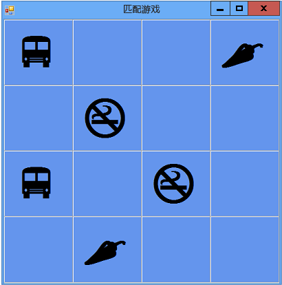

# <a name="step-7-keep-pairs-visible"></a>步骤 7：保持对可见
只要玩家仅选择不匹配的图标对，游戏即可顺畅地运行。 但是，请考虑玩家选择匹配对时发生的情况。 游戏不是通过打开计时器（使用 `Start()` 方法）来使图标消失，而应当进行重置，这样游戏就不再使用 `firstClicked` 和 `secondClicked` 引用变量跟踪任何标签，而且无需重置选择的两个标签的颜色。  
  
### <a name="to-keep-pairs-visible"></a>保持对可见  
  
1.  将下面的 `if` 语句添加到 `label_Click()` 事件处理程序方法中，紧靠启动计时器的语句上方代码的结尾处。 将代码添加到程序时，请仔细查看一下代码。 考虑代码如何运行。  
  
     [!code-csharp[VbExpressTutorial4Step7#9](../ide/codesnippet/CSharp/step-7-keep-pairs-visible_1.cs)]  [!code-vb[VbExpressTutorial4Step7#9](../ide/codesnippet/VisualBasic/step-7-keep-pairs-visible_1.vb)]  
  
     你刚添加的 `if` 语句的第一行会检查玩家选择的第一个标签中的图标是否与第二个标签中的图标相同。 如果图标相同，则程序执行 C# 中大括号之间的三个语句或 Visual Basic 中 `if` 语句内的三个语句。 前两个语句重置 `firstClicked` 和 `secondClicked` 引用变量，使它们不再跟踪任何标签。 （您可以从计时器的 Tick 事件处理程序识别这两个语句。）第三个语句是 `return` 语句，它通知程序跳过方法中的其余语句，不执行它们。  
  
     如果使用 Visual C# 编程，你可能已注意到某些代码使用单个等号 (`=`)，而其他语句使用双等号 (`==`)。 请考虑为什么在某些位置使用 `=`，但在其他位置使用 `==`。  
  
     以下是一个显示该区别的很好的示例。 请仔细查看 `if` 语句括号之间的代码。  
  
    ```vb  
    firstClicked.Text = secondClicked.Text  
    ```  
  
    ```csharp  
    firstClicked.Text == secondClicked.Text  
    ```  
  
     再仔细查看 `if` 语句后的代码块中的第一个语句。  
  
    ```vb  
    firstClicked = Nothing  
    ```  
  
    ```csharp  
    firstClicked = null;  
    ```  
  
     这两个语句中的第一句检查两个图标是否相同。 因为要比较两个值，所以 Visual C# 程序使用 `==` 相等运算符。 第二个语句实际上更改值（称为“赋值”），将 `firstClicked` 引用变量设置为等于 `null` 以重置它。 这就是使用 `=` 赋值运算符的原因。 Visual C# 使用 `=` 设置值，使用 `==` 比较值。 Visual Basic 使用 `=` 进行变量赋值和比较。  
  
2.  保存并运行程序，然后开始选择窗体上的图标。 如果选择的是不匹配的对，则将触发计时器的 Tick 事件，两个图标都会消失。 如果选择的是匹配的对，则将执行新的 `if` 语句，而 return 语句会使方法跳过启动计时器的代码，因此图标保持可见，如下图所示。  
  
       
具有可见图标对的匹配游戏  
  
### <a name="to-continue-or-review"></a>继续或查看  
  
-   若要转到下一个教程步骤，请参阅[步骤 8：添加方法以验证玩家是否获胜](../ide/step-8-add-a-method-to-verify-whether-the-player-won.md)。  
  
-   若要返回到上一个教程步骤，请参阅[步骤 6：添加计时器](../ide/step-6-add-a-timer.md)。
