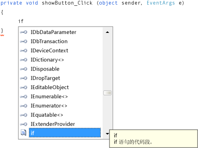

# 步骤 8：为“显示图片”按钮事件处理程序编写代码
在此步骤中，将生成按如下方式工作的“显示图片”按钮：  
  
-   用户选择此按钮时，程序将打开“打开文件”对话框。  
  
-   如果用户打开一个图片文件，则程序将在 PictureBox 中显示该图片。  
  
 IDE 提供一种名为 IntelliSense 的强大工具，可帮助您编写代码。 当您输入代码时，IDE 会打开一个框，其中显示与您所输入的部分单词对应的完整建议内容。 它尝试确定您接下来要做的事情，并自动跳到您从列表中选择的最后一项。 您可以使用向上键或向下键在列表中进行移动，也可以继续键入字母以缩小选择范围。 当您看到所需的选项时，请选择 Tab 键以将其选中。 或者，也可以忽略不需要的建议。  
  
 有关本主题的视频版本，请观看[Tutorial 1: Create a Picture Viewer in Visual Basic - Video 4](http://go.microsoft.com/fwlink/?LinkId=205215)（教程 1：用 Visual Basic 创建图片查看器 - 视频 4）或 [Tutorial 1: Create a Picture Viewer in C# - Video 4](http://go.microsoft.com/fwlink/?LinkId=205203)（教程 1：用 C# 创建图片查看器 - 视频 4）。 这些视频使用 Visual Studio 的早期版本，因此在一些菜单命令和其他用户界面元素上略有差异。 但是，概念和过程与当前版本的 Visual Studio 大同小异。  
  
### 为“显示图片”按钮事件处理程序编写代码  
  
1.  转到“Windows 窗体设计器”，并双击“显示图片”按钮。 IDE 将立即转到代码设计器，并将光标移动到您之前添加的 `showButton_Click()` 方法内。  
  
2.  在两个大括号 { } 之间的空行上键入一个 `i`。 （在 Visual Basic 中，应在 Private Sub… 与 End Sub 之间的空行上键入。）“IntelliSense”窗口随即打开，如以下图片中所示。  
  
       
包含 Visual C# 代码的 IntelliSense  
  
3.  “IntelliSense”窗口应该会突出显示“if”一词。 （如果没有，请输入小写的 `f`，它将突出显示。）注意“IntelliSense”窗口旁会显示一个小的工具提示框，其中包含说明“if 语句的代码片段”。 （在 Visual Basic 中，该工具提示还指明这是一个代码段，但用词会略有不同。）你希望使用此代码片段，因此请选择 Tab 键将“if”插入代码中。 然后再次选择 Tab 键即可使用“if”代码片段。 （如果选择其他位置后“IntelliSense”窗口消失，那么请按 Backspace 删除“i”并重新键入它，此时“IntelliSense”窗口将再次打开。）  
  
       
Visual C# 代码  
  
4.  接下来，使用 IntelliSense 输入更多代码，打开“打开文件”对话框。 如果用户选择“确定”按钮，则 PictureBox 将加载用户选择的文件。 下面的步骤演示如何输入代码，尽管步骤很多，但只需几次击键即可完成：  
  
    1.  从代码片段中的选定文本“true”开始。 键入 `op` 将其覆盖。 （在 Visual Basic 中，首字母需要大写，因此键入 `Op`。）  
  
    2.  “IntelliSense”窗口打开并显示“openFileDialog1”。 选择 Tab 键以将其选定。 （在 Visual Basic 中，因为首字母大写，所以会看到“OpenFileDialog1”。 确保“OpenFileDialog1”已选中。）  
  
         若要了解有关 `OpenFileDialog` 的详细信息，请参阅 [OpenFileDialog](http://msdn.microsoft.com/library/system.windows.forms.openfiledialog.aspx)。  
  
    3.  键入句点 (`.`)（许多程序员称此符号为点）。由于在“openFileDialog1”的后面紧接着键入了一个句点，因此“IntelliSense”窗口将打开，其中填充有“OpenFileDialog”组件的所有属性和方法。 在 Windows 窗体设计器中选择该组件时，“属性”窗口中将显示相同的属性。 您还可选择将告知组件要执行的操作（例如打开对话框）的方法。  
  
        > [!NOTE]
        >  “IntelliSense”窗口可以同时显示属性和方法。 若要确定所显示的内容，请查看“IntelliSense”窗口中每一项左侧的图标。 您将看到每种方法旁都有一个块型图片，每个属性旁都有一个扳手图片。 每个事件旁边还会有一个闪电形图标。 这些图片如下所示。  
  
           
“方法”图标  
  
           
“属性”图标  
  
           
“事件”图标  
  
    4.  开始键入 `ShowDialog`（是否大写对 IntelliSense 来说不重要）。 `ShowDialog()` 方法将显示“打开文件”对话框。 在窗口突出显示“ShowDialog”之后，请选择 Tab 键。 也可突出显示“ShowDialog”并选择 F1 键，获取有关它的帮助。  
  
         若要了解有关 `ShowDialog()` 方法的详细信息，请参阅 [ShowDialog 方法](http://msdn.microsoft.com/library/c7ykbedk.aspx)。  
  
    5.  对控件或组件使用方法（称为“调用方法”）时，需要添加圆括号。 因此请在 `ShowDialog` 中紧接着“g”之后输入左括号和右括号 `()`，现在它看起来应像“openFileDialog1.ShowDialog()”。  
  
        > [!NOTE]
        >  方法是所有程序的重要组成部分，本教程演示了方法的多种使用方式。 可以调用组件的方法告诉组件要执行的操作，这与调用“OpenFileDialog”组件的 `ShowDialog()` 方法的方式类似。 您可创建自己的方法来使程序执行操作，如您现在正构建的名为 `showButton_Click()` 方法的方法，该方法将在用户选择一个按钮时打开对话框和图片。  
  
    6.  对于 Visual C#，添加一个空格，然后添加两个等号 (`==`)。 对于 Visual Basic，添加一个空格，然后使用单个等号 (`=`)。 （Visual C# 和 Visual Basic 使用不同的相等运算符。）  
  
    7.  添加另一个空格。 一旦这样做之后，另一个“IntelliSense”窗口将打开。 开始键入 `DialogResult`，然后选择 Tab 键以进行添加。  
  
        > [!NOTE]
        >  当编写代码来调用方法时，有时代码会返回一个值。 在这种情况下，“OpenFileDialog”组件的 `ShowDialog()` 方法会返回一个 DialogResult 值。 DialogResult 是一个特殊的值，此值告诉您对话框中所发生的改变。 “OpenFileDialog”组件可让用户选择“OK”或“Cancel”，这样它的 `ShowDialog()` 方法将返回 DialogResult.OK 或 DialogResult.Cancel。  
  
    8.  键入一个点，在“IntelliSense”窗口中打开 DialogResult 值。 输入字母 `O`，然后选择 Tab 键插入“OK”。  
  
         若要了解有关 `DialogResult` 的详细信息，请参阅 [DialogResult](http://msdn.microsoft.com/library/system.windows.forms.dialogresult.aspx)。  
  
        > [!NOTE]
        >  第一行代码应会完成。 对于 Visual C#，此代码行应如下所示。  
        >   
        >  `if (openFileDialog1.ShowDialog() == DialogResult.OK)`  
        >   
        >  对于 Visual Basic，此代码行应如下所示。  
        >   
        >  `If OpenFileDialog1.ShowDialog() = DialogResult.OK Then`  
  
    9. 现在，再添加一行代码。 可以键入或者复制并粘贴此行代码，但是应考虑使用 IntelliSense 来添加代码。 您对 IntelliSense 越熟悉，您就可以越快地编写自己的代码。 最终的 `showButton_Click()` 方法如下所示。 （选择“VB”选项卡可查看代码的 Visual Basic 版本。）  
  
         [!code-cs[VbExpressTutorial1Step8#1](../ide/codesnippet/CSharp/step-8-write-code-for-the-show-a-picture-button-event-handler_1.cs)]   [!code-vb[VbExpressTutorial1Step8#1](../ide/codesnippet/VisualBasic/step-8-write-code-for-the-show-a-picture-button-event-handler_1.vb)]  
  
### 继续或查看  
  
-   若要转到下一个教程步骤，请参阅[步骤 9：评审代码、为代码添加注释和测试代码](../ide/step-9-review-comment-and-test-your-code.md)。  
  
-   若要返回上一个教程步骤，请参阅[步骤 7：向窗体添加对话组件](../ide/step-7-add-dialog-components-to-your-form.md)。
