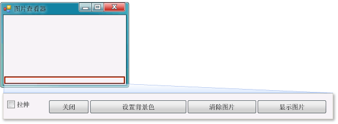

# 步骤 9：检查代码、为代码添加注释和测试代码
[!INCLUDE[vs2017banner](../code-quality/includes/vs2017banner.md)]

接下来，将向代码添加注释。  注释是一个说明，它不会更改程序的行为。  它使阅读您代码的人更容易理解代码的行为。  在代码中添加注释是一个好习惯。  在 Visual C\# 中，可用两个正斜杠 \(\/\/\) 将一行标记为一个注释。  在 Visual Basic 中，可用一个单引号 \('\) 将一行标记为一个注释。  添加注释后即可测试您的程序。  当您处理您的项目时，最好经常运行和测试代码，以便您可在代码变复杂之前尽早捕获和修复任何问题。  这称为“迭代测试”。  
  
 您刚才构建了可用的程序，虽然尚未完成，但已能够下载图片。  在向代码添加注释并测试代码之前，请先花点时间了解一些代码概念，因为您将会频繁使用这些概念：  
  
-   在双击 Windows 窗体设计器中的**“显示图片”**按钮后，IDE 会自动将一个方法添加到程序的代码中。  
  
-   方法是指组织代码的方式：它指明如何将代码组合在一起。  
  
-   大多数情况下，一个方法会按特定顺序执行少量操作，如 `showButton_Click()` 方法会显示对话框，然后加载图片。  
  
-   方法由代码语句或代码行组成。  将方法视为一种将代码语句捆绑在一起的方式。  
  
-   在执行或调用某个方法时，将按顺序依次执行该方法中的各个语句（从第一个语句开始）。  
  
     下面是一个语句示例。  
  
    ```c#  
    pictureBox1.Load(openFileDialog1.FileName);  
    ```  
  
    ```vb#  
    pictureBox1.Load(openFileDialog1.FileName)  
    ```  
  
     语句用于指示程序执行操作。  在 Visual C\# 中，语句始终以分号结束。  在 Visual Basic 中，行的结尾即为语句的结尾。（Visual Basic 中不需要使用分号。）前面的语句将告知 `PictureBox` 控件下载用户使用**“OpenFileDialog”**组件选择的文件。  
  
  有关本主题的视频版本，请参阅[教程 1：在 Visual Basic 中创建图片查看器 \- 视频 5](http://go.microsoft.com/fwlink/?LinkId=205216) 或[教程 1：在 C\# 中创建图片查看器 \- 视频 5](http://go.microsoft.com/fwlink/?LinkId=205206)。  这些视频使用 Visual Studio 的早期版本，因此在一些菜单命令和其他用户界面元素上略有差异。  但是，概念和过程与当前版本的 Visual Studio 大同小异。  
  
### 添加注释  
  
1.  将下面的注释添加到代码中。  
  
     [!code-vb[VbExpressTutorial1Step9_10#1](../ide/codesnippet/VisualBasic/step-9-review-comment-and-test-your-code_1.vb)]
     [!code-cs[VbExpressTutorial1Step9_10#1](../ide/codesnippet/CSharp/step-9-review-comment-and-test-your-code_1.cs)]  
  
    > [!NOTE]
    >  **“showButton”**按钮的 Click 事件处理程序现已完成并可正常使用。  您已开始编写代码（从 `if` 语句开始）。  `if` 语句用于告知程序“检查此项，如果为 true，请执行这些操作。”在此示例中，告知程序打开**“打开文件”**对话框，如果用户选择一个文件并选择**“确定”**按钮，则将在 PictureBox 中加载此文件。  
  
    > [!TIP]
    >  IDE 可让您轻松地编写代码，而代码片段是 IDE 为此采取的方式之一。  代码片段是一类快捷方式，它可扩展到一个小的代码块。  
    >   
    >  您可看到所有可用的代码片段。  在菜单栏上，选择**“工具”**、**“代码片段管理器”**。  对于 Visual C\#，`if` 代码片段位于**“Visual C\#”**中。  对于 Visual Basic，`if` 代码片段位于**“条件语句和循环”**、**“代码模式”**中。  可使用此管理器来浏览现有代码片段或添加自己的代码片段。  
    >   
    >  若要在键入代码时激活一个代码片段，请键入该代码片段并选择 Tab 键。  多个代码片段将出现在**“IntelliSense”**窗口中，这就是要选择 Tab 键两次的原因：第一次是从**“IntelliSense”**窗口中选择该代码片段，第二次是告知 IDE 使用该代码片段。（IntelliSense 支持 `if` 代码片段，但不支持 `ifelse` 代码片段。）  
  
2.  在运行程序之前，通过选择如下所示的**“全部保存”**工具栏按钮来保存程序。  
  
       
“全部保存”按钮  
  
     或者，若要保存程序，请在菜单栏上依次选择**“文件”**、**“全部保存”**。  最佳做法是尽早且经常保存。  
  
     当程序运行时，其外观应与下图类似。  
  
       
图片查看器  
  
### 测试程序  
  
1.  选择 F5 键或选择**“启动调试”**工具栏按钮。  
  
2.  选择**“显示图片”**按钮以运行您刚编写的代码。  首先，该程序会打开**“打开文件”**对话框。  确认在该对话框底部的**“文件类型”**下拉列表中会出现筛选器。  然后，定位到一张图片并将其打开。  通常可以在**“我的文档”**文件夹内的**“图片收藏\\示例图片”**文件夹中找到 Windows 操作系统附带的示例图片。  
  
    > [!NOTE]
    >  如果**“选择图片文件”**对话框中未显示任何图像，请确保选择了对话框右下方下拉列表中的“所有文件\(\*.\*\)”筛选器。  
  
3.  加载一张图片后，此图片会在 PictureBox 中出现。  然后尝试通过拖动窗体的边框来调整其大小。  由于已将 PictureBox 停靠在 TableLayoutPanel 内部，而 TableLayoutPanel 自身停靠在窗体内部，因此图片区域将自行调整大小，使自身的宽度与窗体的宽度相同，并占据窗体上部空间的 90%。  这就是使用 TableLayoutPanel 容器和 FlowLayoutPanel 容器的原因：当用户调整窗体的大小时，二者可以使窗体具有适当的大小。  
  
     现在，较大的图片将超出图片查看器的边框。  在下一步中，将添加代码以使图片适合窗口。  
  
### 继续或查看  
  
-   若要转到下一个教程步骤，请参见[步骤 10：编写其他按钮和复选框的代码](../Topic/Step%2010:%20Write%20Code%20for%20Additional%20Buttons%20and%20a%20Check%20Box.md)。  
  
-   若要返回上一个教程步骤，请参见[步骤 8：为“显示图片”按钮事件处理程序编写代码](../ide/step-8-write-code-for-the-show-a-picture-button-event-handler.md)。