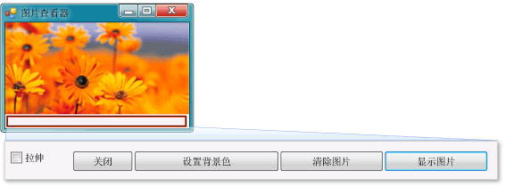

# 教程 1：创建图片查看器
[!INCLUDE[vs2017banner](../code-quality/includes/vs2017banner.md)]

在本教程中，您将生成一个从文件加载图片并将其显示在窗口中的程序。  您将学习如何拖动控件（如窗体上的按钮和图片框）、设置控件属性，以及如何使用容器来平滑地调整窗体的大小。  您还将开始编写代码。  您将学习如何：  
  
-   创建新项目。  
  
-   测试（调试）应用程序。  
  
-   向窗体中添加基本控件（如复选框和按钮）。  
  
-   使用布局在窗体上定位控件。  
  
-   向窗体中添加**“打开文件”**和**“颜色”**对话框。  
  
-   使用 IntelliSense 和代码片段编写代码。  
  
-   编写事件处理程序方法。  
  
 当您完成时，程序将类似下图所示。  
  
   
你在本教程中创建的图片  
  
 若要下载示例的完整版本，请参阅[图片查看器教程完整示例](http://code.msdn.microsoft.com/Complete-Picture-Viewer-7d91d3a8)。  
  
  有关本主题的视频版本，请参阅[如何实现：用 Visual Basic 创建图片查看器？](http://go.microsoft.com/fwlink/?LinkId=205207)或[如何实现：用 C\# 创建图片查看器？](http://go.microsoft.com/fwlink/?LinkId=205198)。  
  
> [!NOTE]
>  这些视频使用 Visual Studio 的早期版本，因此在一些菜单命令和其他用户界面元素上略有差异。  但是，概念和过程与当前版本的 Visual Studio 大同小异。  本教程中同时涉及 Visual C\# 和 Visual Basic，因此请关注特定于您所用编程语言的信息。  
>   
>  若要查看适用于 Visual Basic 的代码，请在代码块顶部选择**“VB”**选项卡，若要查看适用于 Visual C\# 的代码，请选择**“C\#”**选项卡。  如果你有兴趣了解 Visual C\+\+，请参阅 [Getting Started](../misc/getting-started-with-visual-cpp-in-visual-studio-2015.md)和 [C\+\+ 语言教程](http://www.cplusplus.com/doc/tutorial/)。  
>   
>  如果你有兴趣了解如何为 Windows 应用商店编写 Visual C\# 或 Visual Basic 应用，请参阅[使用 C\# 或 Visual Basic 创建你的第一个 Windows 应用商店应用](http://msdn.microsoft.com/library/windows/apps/hh974581.aspx)。  有关为 Windows 应用商店创建 JavaScript 应用的信息，请参阅[使用 JavaScript 创建你的第一个 Windows 应用商店应用](http://msdn.microsoft.com/library/windows/apps/br211385.aspx)。  
  
## 相关主题  
  
|标题|说明|  
|--------|--------|  
|[步骤 1：创建 Windows 窗体应用程序项目](../ide/step-1-create-a-windows-forms-application-project.md)|首先创建 Windows 窗体应用程序项目。|  
|[步骤 2：运行程序](../ide/step-2-run-your-program.md)|运行您在上一步中创建的 Windows 窗体应用程序。|  
|[步骤 3：设置窗体属性](../ide/step-3-set-your-form-properties.md)|使用**“属性”**窗口更改窗体的显示方式。|  
|[步骤 4：使用 TableLayoutPanel 控件设置窗体布局](../ide/step-4-lay-out-your-form-with-a-tablelayoutpanel-control.md)|向窗体中添加 `TableLayoutPanel` 控件。|  
|[步骤 5：向窗体添加控件](../Topic/Step%205:%20Add%20Controls%20to%20Your%20Form.md)|向窗体中添加 `PictureBox` 和 `CheckBox` 之类的控件。  向窗体中添加按钮。|  
|[步骤 6：命名按钮控件](../ide/step-6-name-your-button-controls.md)|将按钮重命名为更有意义的名称。|  
|[步骤 7：向窗体添加对话框组件](../ide/step-7-add-dialog-components-to-your-form.md)|向窗体中添加**“OpenFileDialog”**组件和**“ColorDialog”**组件。|  
|[步骤 8：为“显示图片”按钮事件处理程序编写代码](../ide/step-8-write-code-for-the-show-a-picture-button-event-handler.md)|使用 IntelliSense 工具编写代码。|  
|[步骤 9：检查代码、为代码添加注释和测试代码](../ide/step-9-review-comment-and-test-your-code.md)|检查并测试代码。  根据需要添加注释。|  
|[步骤 10：编写其他按钮和复选框的代码](../Topic/Step%2010:%20Write%20Code%20for%20Additional%20Buttons%20and%20a%20Check%20Box.md)|使用 IntelliSense 编写代码以使其他按钮和复选框工作。|  
|[步骤 11：运行程序并尝试其他功能](../Topic/Step%2011:%20Run%20Your%20Program%20and%20Try%20Other%20Features.md)|运行程序并设置背景颜色。  尝试其他功能，例如更改颜色、字体和边框。|