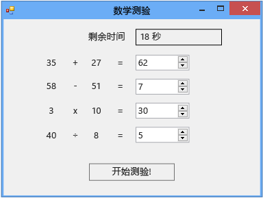

# 教程 2：创建计时数学测验
[!INCLUDE[vs2017banner](../code-quality/includes/vs2017banner.md)]

在本教程中，您将构建一个测验，在该测验中，测验对象必须在指定时间内回答四道随机算术题。  您将学习如何：  
  
-   使用 `Random` 类生成随机数。  
  
-   使用**“Timer”**控件触发事件，使之在特定时间发生。  
  
-   使用 `if else` 语句控制程序流。  
  
-   使用代码执行基本算术运算。  
  
 当您完成时，您的测验看上去与下图类似，但数字有所不同。  
  
   
您在本教程中创建的测验  
  
 若要下载测验的完整版本，请参阅[数学测验教程完整示例](http://code.msdn.microsoft.com/Complete-Math-Quiz-8581813c)。  
  
> [!NOTE]
>  本教程中同时涉及 Visual C\# 和 Visual Basic，因此请关注特定于您所用编程语言的信息。  
  
## 相关主题  
  
|标题|说明|  
|--------|--------|  
|[步骤 1：创建项目并向窗体添加标签](../ide/step-1-create-a-project-and-add-labels-to-your-form.md)|首先创建项目，更改属性并添加 `Label` 控件。|  
|[步骤 2：创建随机加法问题](../ide/step-2-create-a-random-addition-problem.md)|创建一道加法题，然后使用 `Random` 类生成随机数。|  
|[步骤 3：添加一个倒计时计时器](../Topic/Step%203:%20Add%20a%20Countdown%20Timer.md)|添加一个倒计时计时器，以便对测验进行计时。|  
|[步骤 4：添加 CheckTheAnswer\(\) 方法](../Topic/Step%204:%20Add%20the%20CheckTheAnswer\(\)%20Method.md)|添加一个方法，用于检查测验对象输入的问题答案是否正确。|  
|[步骤 5：为 NumericUpDown 控件添加 Enter 事件处理程序](../Topic/Step%205:%20Add%20Enter%20Event%20Handlers%20for%20the%20NumericUpDown%20Controls.md)|添加事件处理程序，使您的测验更易于进行。|  
|[步骤 6：添加减法问题](../ide/step-6-add-a-subtraction-problem.md)|添加一道可生成随机数的减法题，使用计时器并检查答案是否正确。|  
|[步骤 7：添加乘法和除法问题](../Topic/Step%207:%20Add%20Multiplication%20and%20Division%20Problems.md)|添加可生成随机数的乘法和除法题，使用计时器并检查答案是否正确。|  
|[第 8 步：自定义测验](../ide/step-8-customize-the-quiz.md)|尝试其他功能，例如更改颜色和添加提示。|