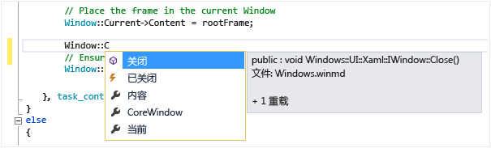

# 使用 IntelliSense
[!INCLUDE[vs2017banner](../code-quality/includes/vs2017banner.md)]

IntelliSense 是许多功能的总称：列出成员、参数信息、快速信息和完成单词。  使用这些功能，可以详细了解使用的代码、跟踪键入的参数，还可以通过轻敲几个按键来添加属性和方法调用。  
  
 IntelliSense 的许多方面只支持特定语言。  有关不同语言的 IntelliSense 的详细信息，请参阅“另请参阅”下方列出的主题。  
  
## 列表成员  
 键入触发器字符（例如，托管代码中的句点 \(`.`\) 或 C\+\+ 中的 `::`）后，显示类型（或命名空间）中的有效成员列表。  如果继续键入字符，则会筛选该列表，以只包含以这些字符开头的成员。  
  
 选择项目后，按 TAB 或键入空格可以将其插入到代码中。  如果选择一个项目并键入句点，该项目显示时后面会跟一个句点，该句点会引出另一个成员列表。  如果选择一个项目，然后插入它，则你会获得该项的快速信息。  
  
 在成员列表中，左边的图标表示成员类型，如命名空间、类、函数或变量。  有关图标的列表，请参阅[“类视图”和“对象浏览器”图标](../ide/class-view-and-object-browser-icons.md)。  该列表可能会很长，你可以按 PAGE UP 和 PAGE DOWN 上下移动列表内容。  
  
   
  
 可以通过键入 CTRL\+J、单击**“编辑\/IntelliSense\/列出成员”**或单击编辑器工具栏上的**“列出成员”**按钮，手动调用**“列出成员”**功能。  如果在空行上或可识别范围之外调用该功能，列表中会显示全局命名空间中的符号。  
  
 若要默认关闭“列出成员”（以便仅在明确调用后显示），请转到**“工具\/选项\/所有语言”**，然后取消选择**“自动列出成员”**。  如果只希望针对特定语言关闭“列出成员”，请转到该语言的**“常规”**设置。  
  
 你也可以更改为建议模式。在该模式下，只会将你键入的文本插入到代码中。  例如，如果输入不在此列表中的标识符，然后按 TAB，则在完成模式下，该输入会取代类型化标识符。  若要在完成模式与建议模式间切换，请按 CTRL\+ALT\+SPACEBAR 或单击**“编辑\/IntelliSense\/切换完成模式”**。  
  
## 参数信息  
 “参数信息”提供方法、特性泛型形参（在 C\# 中）或模板（在 C\+\+ 中）中所需的参数数目、参数名称和参数类型的相关信息。  
  
 以粗体显示的参数指示键入函数时所需的下一参数。  对于重载函数，可以使用向上和向下键查看函数重载的替代参数信息。  
  
   
  
 当用 XML 文档注释批注函数和参数时，相关注释也将显示为“参数信息”。  有关详细信息，请参阅[提供 XML 代码注释](../ide/supplying-xml-code-comments.md)。  
  
 可以通过单击**“编辑 IntelliSense\/参数信息”**、键入 CTRL\+SHIFT\+SPACE 或单击编辑器工具栏上的**“参数信息”**，手动调用“参数信息”。  
  
## 快速信息  
 “快速信息”可显示代码中任意标识符的完整声明。  
  
   
  
 从**“列出成员”**框选择成员时也会显示“快速信息”。  
  
   
  
 可以通过单击**“编辑\/IntelliSense\/快速信息”**、键入 CTRL\+I 或单击编辑器工具栏上的**“快速信息”**按钮，手动调用“快速信息”。  
  
 对于重载函数，Intellisense 可能不会显示重载的所有形式的信息。  
  
 在 C\+\+ 中，将**“工具\/选项\/文本编辑器\/C\/C\+\+\/高级\/自动快速信息”**设置为 `false` 可以关闭“快速信息”。  
  
## 完成单词  
 输入足以区分变量名、命令名或函数名的字符后，“完成单词”可以将剩余部分补充完整。  可以通过单击**“编辑\/IntelliSense\/完成单词”**、按 Ctrl\+空格键或单击编辑器工具栏上的**“完成单词”**按钮，调用“完成单词”。  
  
## IntelliSense 选项  
 IntelliSense 选项默认为启用状态。  若要关闭它们，可以单击**“工具\/选项\/文本编辑器”**并取消选择**“参数信息”**。如果不需要“列出成员”功能，可以取消选择**“自动列出成员”**。  
  
## IntelliSense 疑难解答  
 在某些情况下，IntelliSense 选项可能不会像预期那样工作。  
  
 **游标上方有代码错误。** 如果游标上方的代码中存在不完整函数或其他错误，你可能无法使用 IntelliSense，因为 IntelliSense 可能无法分析代码元素。  你可以通过注释掉相应的代码来解决此问题。  
  
 **游标位于代码注释中。** 如果游标位于源文件的注释中，你将无法使用 IntelliSense。  
  
 **游标位于字符串中。** 如果游标位于字符串周围的引号中，你将无法使用 IntelliSense，如以下示例所示：  
  
```  
MessageBox( hWnd, "String literal|") )  
```  
  
 **自动选项关闭。** 默认情况下，IntelliSense 会自动运行，但你可以禁用它。  即使禁用了自动语句完成，仍然可以调用 IntelliSense 功能。  
  
## 请参阅  
 [Visual Basic 特定的 IntelliSense](../ide/visual-basic-specific-intellisense.md)   
 [Visual C\# IntelliSense](../ide/visual-csharp-intellisense.md)   
 [JavaScript IntelliSense](../ide/javascript-intellisense.md)   
 [提供 XML 代码注释](../ide/supplying-xml-code-comments.md)