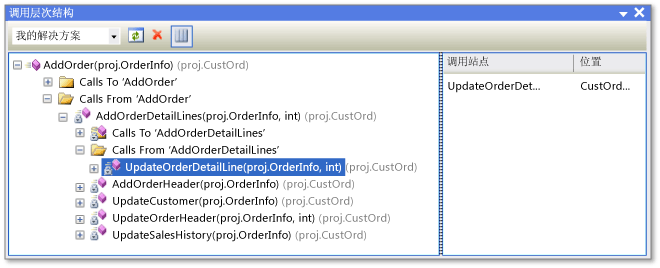

# 查看代码的结构
你可以检查 Visual Studio 项目中的对象和成员，还可以检查 .NET Framework 组件、COM 组件、动态链接库 (DLL) 和类型库 (TLB) 中的对象和成员。  
  
 本文档的以下各节介绍了不同的代码结构窗口。  
  
 [类视图（Visual Basic、C#、C++）](#BKMK_ClassView)  
  
 [调用层次结构（Visual Basic、C#、C++）](#BKMK_CallHierarchy)  
  
 [对象浏览器](#BKMK_ObjectBrowser)  
  
 [代码定义窗口（C#、C++）](#BKMK_CodeDefinition)  
  
 还可以使用“解决方案资源管理器”浏览项目中的类型和成员、搜索符号、查看方法的调用层次结构、查找符号引用及其他操作，而无需在上述列出的多个工具窗口之间进行切换。  
  
 如果你安装了 Visual Studio Enterprise，则可以使用代码图来直观显示代码的结构及其在整个解决方案中的相关性，并深入查看你感兴趣的代码部分。 有关详细信息，请参阅[映射解决方案中的依赖项](../modeling/map-dependencies-across-your-solutions.md)。  
  
> [!NOTE]
>  正在使用的 Visual Studio 版本和设置可能会影响 IDE 中的功能。 它们可能与本主题中介绍的功能有所不同。  
  
##  类视图（Visual Basic、C#、C++）  
 “类视图”显示为“解决方案资源管理器”的一部分并位于单独的窗口中。 “类视图”窗口显示应用程序的元素。 上部窗格显示命名空间、类型、接口、枚举和类，下部窗格显示属于在上部窗格中所选类型的成员。 通过使用此窗口，可以移到源代码（或“对象浏览器”，如果该元素在解决方案外部进行定义）中的成员定义。  
  
 不需要编译项目即可在“类视图”中查看其元素。 修改项目中的代码时，窗口进行刷新。  
  
 通过选择项目节点，然后选择“添加”按钮打开“添加新项”对话框，可以向项目添加代码。 在单独的文件中添加代码。  
  
 如果项目签入源代码管理，则每个“类视图”元素均显示一个指示该文件源代码状态的图标。 该元素的快捷菜单上也提供常用的源代码管理命令，如“签出”、“签入”和“获取最新版本”。  
  
### “类视图”工具栏  
 “类视图”工具栏包含以下命令。  
  
|||  
|-|-|  
|**新建文件夹**|创建虚拟文件夹或子文件夹，以便你可以组织常用的元素。 它们保存在活动解决方案 (.suo) 文件中。 重命名或删除代码中的某个元素后，它可能在虚拟文件夹中显示为一个错误节点。 若要纠正此问题，请删除错误节点。 如果重命名某个元素，你可以再次将其从项目层次结构移到文件夹。|  
|**后退**|定位到之前选择的项。|  
|**前进**|定位到下一个选定项。|  
|“查看类关系图”（仅适用于托管代码项目）|在“类视图”中选择一个命名空间或类型时，此选项变为可用。 选择一个命名空间后，类关系图显示其中的所有类型。 选择一个类型后，类关系图则仅显示该类型。|  
  
### 类视图设置  
 工具栏上的“类视图设置”按钮具有以下设置。  
  
|||  
|-|-|  
|**显示基类型**|显示基类型。|  
|**显示派生类型**|显示派生类型。|  
|**显示隐藏类型和成员**|隐藏类型和成员（不供客户端使用）以浅灰色文本显示。|  
|**显示公共成员**|显示公共成员。|  
|**显示保护成员**|显示受保护的成员。|  
|**显示私有成员**|显示私有成员。|  
|**显示其他成员**|显示其他类型的成员，包括内部（或 Visual Basic 中的 Friend）成员。|  
|**显示继承成员**|显示继承成员。|  
|**显示扩展方法**|显示扩展方法。|  
  
### “类视图”快捷菜单  
 “类视图”中的快捷菜单可能包含以下命令，具体取决于所选项目的类型。  
  
|||  
|-|-|  
|**转到定义**|如果在打开的项目中未定义该元素，请在源代码或“对象浏览器”中查找元素的定义。|  
|**浏览定义**|显示“对象浏览器”中选定的项。|  
|**查找所有引用**|查找当前选定的对象项，并在“查找结果”窗口中显示结果。|  
|**按类型筛选**（仅适用于托管代码）|仅显示选定的类型或命名空间。 可以通过选择“查找”框旁边的“清除查找”(X) 按钮删除筛选器。|  
|**复制**|复制项的完全限定名。|  
|**按字母顺序排序**|按名称的字母顺序列出类型和成员。|  
|**按成员类型排序**|根据类型按顺序列出类型和成员（确保类排在接口之前、接口排在委托之前，方法排在属性之前）。|  
|**按成员访问排序**|根据访问类型（如公共或私有）按顺序列出类型和成员。|  
|**按成员类型分组**|根据对象类型将类型和成员分组。|  
|**转到声明**（仅适用于 C++ 代码）|在源代码中显示类型或成员的声明（如果可用）。|  
|**转到定义**|在源代码中显示该类型或成员的定义（如果可用）。|  
|**转到引用**|在源代码中显示类型或成员的定义（如果可用）。|  
|**查看调用层次结构**|在“调用层次结构”窗口中显示所选的方法。|  
  
##  调用层次结构（Visual Basic、C#、C++）  
 “调用层次结构”窗口显示调用给定方法（或者属性或构造函数）的位置，并列出从该方法调用的方法。 你可以查看多个级别的调用关系图，该关系图显示指定范围内各个方法间调用方/被调用方的关系。  
  
 可以通过选择方法（或者属性或构造函数），然后再选择快捷菜单上的“查看类层次结构”，显示“调用层次结构”窗口。 显示内容应与下图相似。  
  
   
“调用层次结构”窗口  
  
 通过使用工具栏上的下拉列表，你可以指定层次结构的范围：解决方案、当前项目或当前文档。  
  
 主窗格显示来自（到）方法的调用，“调用站点”窗格显示所选调用的位置。 针对虚拟或抽象的成员，显示的是“重写方法名”节点。 针对接口成员，显示的是“实现方法名”节点。  
  
 “调用层次结构”窗口找不到方法组引用，方法组引用包括将方法添加为事件处理程序或分配给委托的位置。 若要查找这些引用，请使用“查找所有引用”命令。  
  
 “调用层次结构”窗口中的快捷菜单包含以下命令。  
  
|||  
|-|-|  
|**作为新根添加**|将所选节点作为新根添加。|  
|**移除根**|从树视图窗格中删除所选根节点。|  
|**转到定义**|定位到方法的原始定义。|  
|**查找所有引用**|在项目中查找对所选方法的所有引用。|  
|**复制**|复制所选节点（但不包括其子节点）。|  
|**刷新**|刷新信息。|  
  
##  对象浏览器  
 “对象浏览器”显示项目中的代码说明。  
  
 可以在“对象浏览器”中筛选要查看的内容。 通过使用窗口顶部的下拉列表，你可以选择下列选项之一：  
  
-   任何 .NET Framework  
  
-   Silverlight  
  
-   活动解决方案  
  
-   一组自定义组件  
  
 自定义组件可以包括托管代码可执行文件、库程序集、类型库和 .ocx 文件。 不能添加 C++ 自定义组件。 自定义设置保存在 Visual Studio 用户应用程序目录 %appdata%\roaming\microsoft\visualstudio\11.0\objbrowex.dat。  
  
 “对象浏览器”的左窗格显示物理容器，如 .NET Framework 和 COM 组件。 你可以展开容器节点以显示它们所包含的命名空间，然后展开命名空间以显示它们所包含的类型。 选择类型时，其成员（如属性和方法）在右窗格中列出。 右下窗格显示与所选项相关的详细信息。  
  
 可以通过使用窗口顶部的“搜索”框搜索特定的项。 搜索不区分大小写。 搜索结果显示在左窗格中。 若要清除搜索，请选择“搜索”框旁边的“清除搜索”(X) 按钮。  
  
 “对象浏览器”跟踪所做的选择，并且你可以通过使用工具栏上的“前进”和“后退”按钮在选项之间进行导航。  
  
 通过选择某一项（程序集、命名空间、类型或成员），然后选择工具栏上的“添加引用”按钮，可以使用“对象浏览器”将程序集引用添加到打开的解决方案。  
  
### 对象浏览器设置  
 通过使用工具栏上的“对象浏览器设置”按钮，可以指定以下视图之一。  
  
|||  
|-|-|  
|**查看命名空间**|在左窗格中显示命名空间，而不是物理容器。 合并多个物理容器中存储的命名空间。|  
|**查看容器**|在左窗格中显示物理容器，而不是命名空间。 “查看命名空间”和“查看容器”是相互排斥的设置。|  
|**显示基类型**|显示基类型。|  
|**显示派生类型**|显示派生类型。|  
|**显示隐藏类型和成员**|在浅灰色文本中显示隐藏类型和成员（不供客户端使用）。|  
|**显示公共成员**|显示公共成员。|  
|**显示保护成员**|显示受保护的成员。|  
|**显示私有成员**|显示私有成员。|  
|**显示其他成员**|显示其他类型的成员，包括内部的（或 Visual Basic 中的 Friend）成员。|  
|**显示继承成员**|显示继承成员。|  
|**显示扩展方法**|显示扩展方法。|  
  
### “对象浏览器”快捷菜单命令  
 “对象浏览器”中的快捷菜单可能包含以下命令，具体取决于所选项的类型。  
  
|||  
|-|-|  
|**浏览定义**|显示所选项的主节点。|  
|**查找所有引用**|查找当前选定的对象项，并在“查找结果”窗口中显示结果。|  
|**按类型筛选**|仅显示选定的类型或命名空间。 可以通过选择“清除搜索”按钮删除筛选器。|  
|**复制**|复制项的完全限定名。|  
|**移除**|如果范围是自定义组件集，请从该范围中删除所选组件。|  
|**按字母顺序排序**|按名称的字母顺序列出类型和成员。|  
|**按对象类型排序**|根据类型按顺序列出类型和成员（确保类排在接口之前、接口排在委托之前，方法排在属性之前）。|  
|**按对象访问排序**|根据访问类型（如公共或私有）按顺序列出类型和成员。|  
|**按对象类型分组**|根据对象类型将类型和成员分组。|  
|**转到声明**（仅适用于 C++ 项目）|在源代码中显示类型或成员的声明（如果可用）。|  
|**转到定义**|在源代码中显示该类型或成员的定义（如果可用）。|  
|**转到引用**|在源代码中显示类型或成员的定义（如果可用）。|  
|**查看调用层次结构**|在“调用层次结构”窗口中显示所选的方法。|  
  
##  代码定义窗口（C#、C++）  
 “代码定义”窗口显示活动项目中所选类型或成员的定义。 可以在代码编辑器或代码视图窗口中选择类型或成员。  
  
 尽管此窗口是只读的，但你可以在其中设置断点或书签。 若要修改显示的定义，请选择快捷菜单上的“编辑定义”。 这将在代码编辑器中打开源文件，并将插入点移到定义开始的行。  
  
### “代码定义”快捷菜单  
 “代码定义”窗口中的快捷菜单可能包含以下命令，具体取决于编程语言。  
  
|||  
|-|-|  
|**创建单元测试**|为所选元素创建单元测试。|  
|**生成序列图**|选择一种方法后，将生成序列图。|  
|**创建专用访问器**|如果解决方案中存在单元测试，则将生成测试用以访问代码的方法。|  
|**转到定义**|查找定义（或分部类的多个定义）并将它们显示在“查找结果”窗口中。|  
|**查找所有引用**|查找解决方案中对类型或成员的引用。|  
|**查看调用层次结构**|在“调用层次结构”窗口中显示方法。|  
|**显示调用测试**|如果项目中有单元测试，则显示调用所选代码的测试。|  
|**运行调用测试**|如果项目中有单元测试，则运行所选代码的测试。|  
|**断点**|插入断点（或跟踪点）。|  
|**运行到光标处**|在调试模式下将程序运行到光标位置。|  
|**复制**|复制所选行。|  
|**大纲显示**|标准大纲显示命令。|  
|**编辑定义**|将插入点移到代码窗口中的定义处。|  
|**选择编码**|打开“编码”窗口，以便设置文件的编码。|  
  
### “文档大纲”窗口  
 可以将“文档大纲”窗口与设计器视图（如 XAML 页面设计器或 Windows 窗体设计器）或 HTML 页面一起使用。 此窗口在树视图中显示元素，以便你可以查看窗体或页面的逻辑结构，并查找深度嵌入或隐藏的控件。  
  
## 另请参阅  
 [“类视图”和“对象浏览器”图标](../ide/class-view-and-object-browser-icons.md)
