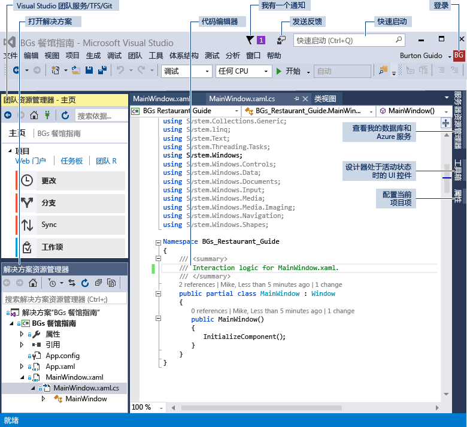
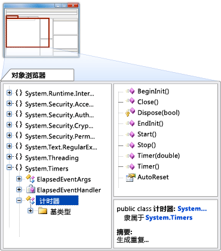
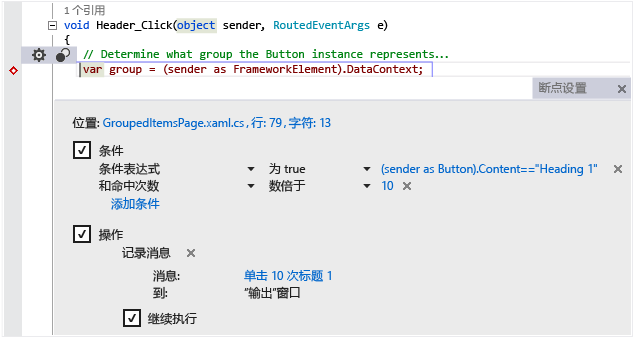
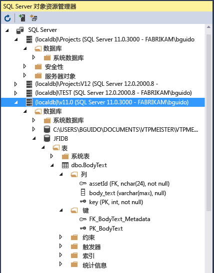

# Visual Studio IDE
Microsoft Visual Studio 2017 RC 是一套用于创建软件的工具，包括通过 UI 设计的规划阶段、编码、测试、调试、分析代码质量和性能、部署到用户以及收集使用的遥测。 这些工具旨在尽可能地无缝协同工作，并都通过 Visual Studio 集成开发环境 (IDE) 公开。  

 可使用 Visual Studio 创建很多类型的应用程序，从移动客户端的简单应用商店应用和游戏到电力企业和数据中心的大型复杂系统均可实现。 你可以创建  

 - 同时可在 Windows 上以及 Android 和 iOS 上运行的应用和游戏。

 - 基于 ASP.NET、JQuery、AngularJS 和其他常用框架的网站和 Web 服务。

 - 适用于众多平台和设备（如 Azure、Office、Sharepoint、Hololens、Kinect 和 Internet of Things 等）的应用程序。

 - 适用于各种使用 DirectX 的 Windows 设备（包括 Xbox）的游戏和图形密集型应用程序。

 默认情况下，Visual Studio 支持 C#、C 和 C++、JavaScript、TypeScript、F# 以及 Visual Basic。 Visual Studio 可与 Xamarin（通过[用于 Visual Studio 的 Xamarin](https://www.xamarin.com/visual-studio)）以及 Unity（通过 [Visual Studio Tools for Unity](../cross-platform/visual-studio-tools-for-unity.md) 扩展）和 Apache Cordova（通过 [Visual Studio Tools for Apache Cordova](../misc/get-started-with-visual-studio-tools-for-apache-cordova2.md)）等第三方应用程序配合使用并完美集成。 可利用 [Visual Studio SDK](../extensibility/visual-studio-sdk.md) 通过创建执行专门任务的自定义工具自行扩展 Visual Studio。

## 了解新增功能
 如果以前从未使用 Visual Studio，请通过[使用 Visual Studio 进行开发入门](../ide/get-started-with-visual-studio.md)了解基础知识。
若要了解 Visual Studio 2017 RC 的新增功能，请参阅 [Visual Studio 2017 中的新增功能](../ide/whats-new-in-visual-studio.md)。

## 设置 Visual Studio
 可在 [Visual Studio 产品](https://www.visualstudio.com/products/)了解最适合你的 Visual Studio 版本。

 可以通过从 [Visual Studio 下载](https://www.visualstudio.com/vs/)页面下载并安装 Visual Studio 2017 RC。 若要了解有关安装过程的详细信息，请参阅[安装 Visual Studio 2017 RC](https://go.microsoft.com/fwlink/?linkid=833223)。

## IDE 快速教程
 下图显示具有一个打开项目和几个主要工具窗口的 Visual Studio IDE。
 - [解决方案资源管理器](../ide/solutions-and-projects-in-visual-studio.md)可让你查看和导航代码文件。
 - 利用版本控制技术（如 [Git](https://git-scm.com/) 和 [Team Foundation 版本控制 (TFVC)](https://www.visualstudio.com/en-us/docs/tfvc/overview)），[团队资源管理器](https://www.visualstudio.com/en-us/docs/connect/work-team-explorer)可让你跟踪工作项并与他人共享代码。
 - [Cloud Explorer](https://azure.microsoft.com/en-us/documentation/articles/vs-azure-tools-resources-managing-with-cloud-explorer/) 可让你查看和管理 Azure 资源，如虚拟机、表格以及 SQL 数据库等。
 - [编辑器](../ide/writing-code-in-the-code-and-text-editor.md)窗口可让你查看并编辑数据源代码和设计器数据。
 - [输出](../ide/reference/output-window.md)窗口显示编译、运行、调试等输出。

   

 ### 登录
  首次启动 Visual Studio 时，可使用 Microsoft 帐户或者单位或学校帐户登录。 登录后，可跨多个设备同步设置（例如，窗口布局）并自动连接到所需的服务，如 Azure 订阅和 Visual Studio Team Services。 如果你拥有基于订阅的许可证，则需要定期登录 Visual Studio 以保持许可证令牌为最新。 如果你拥有产品密钥许可证，则无需登录，但登录后可更便捷地连接到 Visual Studio Team Services 和 Azure、Office 365、Salesforce.com 帐户。 有关详细信息，请参阅[登录 Visual Studio](../ide/signing-in-to-visual-studio.md)。

  如果你拥有多个 Visual Studio Team Services 帐户、Azure 帐户或 MSDN 订阅，则可使用单一登录进行链接并访问所有帐户中的资源和服务。 有关详细信息，请参阅[使用多个用户帐户](../ide/work-with-multiple-user-accounts.md)。

 ### 随时了解最新信息
  标题栏上角的通知图标会通知你何时提供适用于 Visual Studio 或已安装的任何相关组件的更新。 可选择关闭或处理这些通知。 有关详细信息，请参阅 [Visual Studio 通知](../ide/visual-studio-notifications.md)。

 ### 查找内容和获取帮助
  如果不知道键盘快捷键或菜单位置，可利用以下屏幕截图框红位置的[快速启动](../ide/reference/quick-launch-environment-options-dialog-box.md)窗口快速查找 Visual Studio 命令、工具和功能等。 只需键入要查找的内容，“快速启动”便会提供一个相关链接。

 

 在 Visual Studio 中，可以按 **F1** 转到活动窗口的联机帮助。 还可以在代码编辑器中按 **F1** 转到 API 或当前插入符号位置处关键字的帮助页。 例如，在 C# 文件中，将插入符号放置在 `System.String` 声明内的某处或末尾，然后按 **F1** 转到[字符串](assetId:///T:System.String?qualifyHint=False&autoUpgrade=True)的帮助页。

### 提供反馈
 可随时向我们提供对 Visual Studio 的反馈，操作简单便捷。 单击“快速启动”旁标题栏中的反馈图标  ，然后单击“报告问题”  或“提供建议” 。

 Visual Studio 的预发行版本还具有“评价此产品”  选项。 我们会查看所有这些评论，并利用它们来改进产品。 有关详细信息，请参阅[与我们交流](../ide/talk-to-us.md)。

### 个性化 IDE
 可自定义窗口布局，以适合自己的开发风格。 可以随时停靠、浮动或隐藏任何窗口，还可以在全屏模式下运行编辑器。 可以创建并保存多个自定义窗口布局，仅用于显示特定上下文所需的窗口。 例如，可以创建全屏布局，以便代码编辑器全屏显示。 还可以创建不同布局，用于调试和团队操作。 有关详细信息，请参阅[自定义窗口布局](../ide/customizing-window-layouts-in-visual-studio.md)。

 可以采用多种其他的方法来自定义 Visual Studio，并且可将设置漫游到使用的多台计算机中。 有关详细信息，请参阅[个性化 IDE](../ide/personalizing-the-visual-studio-ide.md)。

 几乎所有操作都有键盘快捷键，并且也可以对其进行自定义。 若要创建新的快捷键，请在“快速启动”中键入“Keyboard”打开“键盘”对话框。 如果需要有关选项的详细信息，请在此处按 F1 转到帮助页。 有关详细信息，请参阅 [Visual Studio 中的默认键盘键](../ide/default-keyboard-shortcuts-in-visual-studio.md)。

## 连接到 Visual Studio Team Services 和 Team Foundation Server
  Visual Studio Team Services (VSTS) 是一种基于云的服务，用于承载软件项目和启用团队中的协作。 VSTS 支持 Git 和 Team Foundation 源控件系统以及 Scrum、CMMI 和 Agile 开发方法。 Team Foundation 版本控制 (TFVC) 采用单一的集中式服务器存储库来跟踪文件和调整它的版本。 本地更改始终签入到中央服务器，其他开发人员可在此处获得最新的更改。 Team Foundation Server (TFS) 2015 是 Visual Studio 的应用程序生命周期管理中心。 它使用单个解决方案，使开发过程中涉及的所有人均可参与该开发过程。 TFS 对于管理异类团队和项目也非常有用。

  如果你的网络中已经具有 Visual Studio Team Services 帐户或 Team Foundation Server，则可通过“团队资源管理器”窗口连接。 可在此窗口中将代码签入（出）源控件、管理工作项、启动生成以及访问团队聊天室和工作区。 可从“快速启动”或者从“视图”|“团队资源管理器”或“团队”|“管理连接”的主菜单打开“团队资源管理器”。  有关 Visual Studio Team Services 的详细信息，请参阅 [www.visualstudio.com](https://www.visualstudio.com/)。 有关 Team Foundation Server 的详细信息，请参阅 [Team Foundation Server](https://www.visualstudio.com/products/tfs-overview-vs)。

  下图显示了 VSTS 中托管的解决方案的“团队资源管理器”窗格：

   

## 创建解决方案和项目
  尽管可以使用 Visual Studio 浏览单个代码文件，但更常见的是在 *项目*中进行操作。 对应用程序而言，Visual Studio 项目是一个编译为单个二进制可执行文件（例如 .exe、DLL 或 appx）的文件和资源的集合。 而对于非 ASP.NET 网站，则不生成任何可执行文件，因此项目中只包含 HTML、JavaScript 文件和图像。 因为有时可能需要创建多个二进制文件或密切相关的网站，所以 Visual Studio 提供了解决方案的概念，其中可包含多个项目和网站。 创建项目时，实际创建的是解决方案内的项目，并且以后在必要时可向此解决方案添加更多项目。 例如，如果你拥有 DLL 项目，则可以向加载和使用此 DLL 的解决方案添加 .exe 项目。

  *项目模板* 是指可快速创建特定类型应用程序的预填充代码文件和配置设置的集合。 Visual Studio 附带了很多项目模板以供选择，如果所有默认模板都不适用，也可以自行创建。 利用模板创建项目后，便可以在提供的文件或添加的新文件中将自己的代码写入项目。 有关详细信息，请参阅[解决方案和项目](../ide/solutions-and-projects-in-visual-studio.md)。 下图显示了具有适用于 ASP.NET 应用程序的项目模板的“新建项目”对话框。

   

## 编写、导航和了解代码  
 如果你是一名开发人员，则可能会在“编辑器”窗口花费大部分时间。 Visual Studio 包含对 C#、C++、Visual Basic、F#、JavaScript、TypeScript、XML、HTML 和 CSS 的内置编辑支持。 Visual Studio 还支持使用多种其他语言进行编辑和编译处理。

 可以单击“文件”|“打开”|“文件”，在文本编辑器中编辑单个文件。 若要编辑打开项目中的文件，请在“解决方案资源管理器”中选择并打开该文件名。 代码被着色，你可以通过在“快速启动”中键入“Colors”来个性化设置配色方案。 可同时打开多个文本编辑器选项卡式窗口。 可独立拆分每个窗口。 还可以在全屏模式下运行文本编辑器。  

   

 文本编辑器可实现高度交互（如果你希望如此），具有很多工作效率功能，可帮助更好更快地编写代码。 功能因语言而异，并且不必使用以上任意语言（在“快速启动”中键入“Editor”）来打开或关闭功能。一些常见的工作效率功能为：  

-  [重构](../ide/refactoring-in-visual-studio.md)包括智能重命名变量、移动选定的代码行到单独的函数、移动代码到其他位置、重新排序函数参数以及更多操作。

    

-  “IntelliSense”是一组常用功能的涵盖性术语，这些功能可用于在编辑器中直接显示代码的类型信息，并且可在某些情况下编写小段代码。 如同在编辑器中拥有了基本文档内联，从而节省了在单独帮助窗口查看类型信息的时间。 IntelliSense 功能因语言而异。 有关详细信息，请参阅 [Visual C# IntelliSense](../ide/visual-csharp-intellisense.md)、[Visual C++ Intellisense](../ide/visual-cpp-intellisense.md)、[JavaScript IntelliSense](../ide/javascript-intellisense.md) 和 [Visual Basic 特定的 IntelliSense](../ide/visual-basic-specific-intellisense.md)。 下图显示了一些处于工作状态的 IntelliSense 功能：  

       

-  “波形曲线” 实时警告键入时代码中的错误或潜在问题，这样便可以立即修复错误，而无需等到编译时或运行时才发现。 如果将鼠标悬停在波形曲线上，将看到关于此错误的其他信息。 左边距上也可能会出现一个灯泡，提供有关如何修复此错误的建议。 有关详细信息，请参阅[使用灯泡执行快速操作](../ide/perform-quick-actions-with-light-bulbs.md)。  

    

-  [书签](../ide/setting-bookmarks-in-code.md)使你能够快速导航到文件中正在主动处理的特定行。

    

-  可以在文本编辑器“上下文”菜单中对[调用层次结构](../ide/reference/call-hierarchy.md)窗口进行调用，以显示调用方法、被调用方法和插入点下的方法。

    

-  “CodeLens”能够查找代码引用、代码更改、链接错误、工作项、代码评审和单元测试，所有操作都在编辑器上进行。

    

  有关详细信息，请参阅[查找代码更改和其他历史记录](../ide/find-code-changes-and-other-history-with-codelens.md)。  

-  “查看定义”  窗口显示方法或类型的定义内联，而无需离开当前的上下文。 此窗口现在也适用于 XAML。  

    

-  “转到定义”  上下文菜单选项可直接进入其中定义函数或对象的位置。 还可以在编辑器中右键单击来获取其他导航命令。

    

- [对象浏览器](http://msdn.microsoft.com/en-us/f89acfc5-1152-413d-9f56-3dc16e3f0470)，作为相关的工具，可以检查系统上的 .NET 或 Windows 运行时程序集，以查看其中包含的类型以及这些类型包含的方法和属性。  

       

 “编辑”菜单和“视图”菜单上的大多数项都以某种方式关联代码编辑器。 关于编辑器的详细信息，请参阅[编写代码](../ide/writing-code-in-the-code-and-text-editor.md)和[编辑代码](https://www.visualstudio.com/features/ide-vs)。  

## 编译和生成代码  
 生成项目是指编译源代码并执行生成可执行文件所必需的任何步骤。 不同语言具有不同的生成操作，而常规网站根本不生成。 无论是何种项目类型，“生成”菜单都是这些命令的标准位置。 若要编译代码并通过单个击键运行，请按 F5 键。 每个编译器都可通过 IDE 完全配置。 “生成”工具栏可指定是生成程序的调试版本（启用符号和额外错误检查以支持调试器中的断点和单步执行），还是生成将最终呈现给用户的发布版本。 可在项目的属性页中配置其他生成设置和许多其他设置。 在解决方案资源管理器中选择项目节点的上下文（右键单击）菜单，然后选择属性命令。 还可以从命令行运行生成。  

 生成输出（包括错误或成功消息）将显示在“输出”窗口中。 “错误列表”（如下所示）提供有关生成错误的详细信息。  

   

## 调试代码  
 使用 Visual Studio 的先进调试器，可以调试在本地项目、远程设备或仿真程序（例如 Android 或 Windows Phone 设备的仿真程序）上运行的代码。 可以一次一个语句逐行执行代码并随时检查变量，可以逐行执行多个线程应用程序，还可以设置只在特定条件为“真”时才命中的断点。 代码运行时可以监视变量的值。 上述所有操作均可在代码编辑器中管理，因此无需离开代码的上下文。  

   

 调试器本身具有多个窗口，可用于查看和操作本地变量、调用堆栈和运行时环境的其他方面。 可以在“调试”  菜单中找到这些窗口。  

 [即时窗口](../ide/reference/immediate-window.md)使你能够在表达式中键入并立即查看其结果。

 [IntelliTrace](../debugger/intellitrace.md) 窗口会记录在运行 .NET 程序中的每个方法调用和其他事件，并可帮助快速找到问题来源位置。

 有关详细信息，请参阅[使用 Visual Studio 进行调试](../debugger/debugging-in-visual-studio.md)。  

## 测试代码  
 Visual Studio 包含一个用于托管代码 (.NET) 的单元测试框架和一个用于本机 C++ 的单元测试框架。 若要创建单元测试，只需将测试项目添加到解决方案，编写测试，然后在“测试资源管理器”窗口中运行。 有关详细信息，请参阅[单元测试代码](../test/unit-test-your-code.md)。  

   

## 分析代码质量和性能  
 Visual Studio 包含用于静态和运行时分析的强大工具。 静态分析工具帮助识别设计、全球化、互操作性、性能、安全性和其他类别中的潜在错误。 性能测试（也称为分析）涉及测量程序的运行方式。 可从“分析”  菜单中访问这些工具。 有关详细信息，请参阅[使用 Visual Studio 诊断工具提高质量](../test/improve-code-quality.md)。  

## 连接到云服务和数据库  
 Visual Studio 中的 [Cloud Explorer](https://azure.microsoft.com/en-us/documentation/articles/vs-azure-tools-resources-managing-with-cloud-explorer/) 可显示你登录的 Azure 订阅下托管的所有帐户中的 Azure 资源。 可通过安装 [Azure SDK](https://azure.microsoft.com/en-us/downloads/) 获取 Cloud Explorer。

 

 还可使用[服务器资源管理器](https://msdn.microsoft.com/en-us/library/cd2cz7yy.aspx)帮助你浏览并管理 Azure、Salesforce.com、Office 365 和网站上的 SQL Server 实例以及资产。

 Visual Studio 包括 [Microsoft SQL Server Data Tools](https://msdn.microsoft.com/en-us/data/tools.aspx) (SSDT)，使你能够构建、调试、维护和重构数据库。 可使用数据库项目，或直接使用已连接的数据库实例（本地或非本地）。  

 Visual Studio 中的 [SQL Server 对象资源管理器](https://msdn.microsoft.com/en-us/library/hh231250.aspx)提供类似于 SQL Server Management Studio 中的数据库对象。 SQL Server 对象资源管理器可以执行轻负载数据库管理和设计工作，包括使用 SQL Server 对象资源管理器右侧的上下文菜单编辑表数据、对比架构和执行查询。 SSDT 还包括特殊项目类型和工具，用于开发 SQL Server 2012 Analysis Services、Reporting Services 和 Integration Services 商业智能 (BI) 解决方案（以前称为 Business Intelligence Development Studio）。  

   

## 部署完成的应用程序  
 当应用程序可以部署到客户时，无论是部署到 Windows 应用商店还是 Sharepoint 站点，无论是通过 Installshield 还是 Windows Installer 技术进行部署，Visual Studio 都会提供实现此操作的工具。 这些都可以通过 IDE 进行访问。 有关详细信息，请参阅[部署应用程序、服务和组件](../deployment/deploying-applications-services-and-components.md)。  

## 体系结构和建模工具（仅适用于企业）  
 可以使用 Visual Studio 体系结构和建模工具来设计和建模应用程序。 这些工具可帮助实现代码的结构、行为和关系的可视化效果。 在开发过程中，可以在整个应用程序生命周期的不同详细信息级别上创建模型。 可通过将模型元素链接到 Team Foundation Server 工作项和开发计划来跟踪要求、任务、测试用例、Bug 和其他与模型关联的工作。 有关详细信息，请参阅[设计和建模应用程序](../modeling/analyze-and-model-your-architecture.md)。  

## 通过 Visual Studio SDK 扩展 Visual Studio  
 Visual Studio 是一个可扩展的平台。 Visual Studio 扩展是与 IDE 集成的自定义工具。 可以添加第三方扩展，或创建自己的扩展。 有关详细信息，请参阅[开始开发 Visual Studio 扩展](../extensibility/starting-to-develop-visual-studio-extensions.md)。  

 [Visual Studio 用户体验指南](../extensibility/ux-guidelines/visual-studio-user-experience-guidelines.md)是编写 Visual Studio 扩展的必备参考。 这些特定于平台的指南包括有关对话框设计、字体、颜色、图标、常用控件以及可使你的新增功能与 Visual Studio 无缝集成的其他交互模式的信息。  

## 另请参阅  
 [安装 Visual Studio 2017 RC](../install/install-visual-studio.md)   
 [编辑代码](https://www.visualstudio.com/features/ide-vs)   
 [Visual Studio 2017 RC 中的新增功能](../ide/whats-new-in-visual-studio.md)   
 [移植、迁移和升级 Visual Studio 项目](../porting/port-migrate-and-upgrade-visual-studio-projects.md)   
 [与我们交流](../ide/talk-to-us.md)

