# <a name="walkthrough-create-a-simple-application-with-visual-c-or-visual-basic"></a>演练：使用 Visual C# 或 Visual Basic 创建简单应用程序
通过完成本演练，你将熟悉在使用 Visual Studio 开发应用程序时可使用的许多工具、对话框和设计器。 你将创建一个简单的“Hello, World”样式的应用程序、设计 UI、添加代码并调试错误，同时会详细了解如何在集成开发环境 (IDE) 中工作。  
  
 本主题包含以下各节：  
  
 [配置 IDE](../ide/walkthrough-create-a-simple-application-with-visual-csharp-or-visual-basic.md#BKMK_ConfigureIDE)  
  
 [创建简单的应用程序](../ide/walkthrough-create-a-simple-application-with-visual-csharp-or-visual-basic.md#BKMK_CreateApp)  
  
 [调试并测试应用程序](../ide/walkthrough-create-a-simple-application-with-visual-csharp-or-visual-basic.md#BKMK_DebugTest)  
  
> [!NOTE]
>  此演练基于 Visual Studio Professional，你将使用其中提供的 WPF 应用程序模板生成用于此演练的项目。 Visual Studio Express for Windows Desktop 也提供此模板，但 Visual Studio Express for Windows 和 Visual Studio Express for Web 不提供。 有关如何使用 Visual Studio Express for Windows 的介绍性信息，请参阅 [Windows 应用商店应用开发人员中心](http://msdn.microsoft.com/windows/apps/br229519)。 有关如何使用 Visual Studio Express for Web 的介绍性信息，请参阅 [Get Started with ASP.NET](http://www.asp.net/get-started)（ASP.NET 入门）。 此外，你的 Visual Studio 版本和你使用的设置将决定某些用户界面元素的名称和位置。 请参阅[个性化设置 Visual Studio IDE](../ide/personalizing-the-visual-studio-ide.md)。  
  
##  <a name="BKMK_ConfigureIDE"></a> 配置 IDE  
 第一次启动 Visual Studio 时，Visual Studio 会提示使用 Microsoft 服务帐户 (MSA)登录， [登录到 Visual Studio](http://blogs.msdn.com/b/visualstudio/archive/2013/06/28/welcome-sign-in-to-visual-studio.aspx)。 您不需要登录，而是可以稍后登录。  
  
 在您的 Visual Studio 启动时，您接下来必须选择适用于 IDE 的一组预定义的自定义项的设置组合。 每个设置组合旨在使你更轻松地开发应用程序。  
  
 此演练假设您应用 **常规开发设置**，这样对 IDE 应用的自定义项数量最少。 如果已经选择 C# 或 Visual Basic（两者都是很好的选择），则无需更改设置。  如果您想要更改您的设置，则可以使用 **导入和导出设置向导**。 请参阅[个性化设置 Visual Studio IDE](../ide/personalizing-the-visual-studio-ide.md)。  
  
 在你打开 Visual Studio 后，可识别工具窗口、菜单和工具栏，以及主窗口空间。 工具窗口停靠在应用程序窗口的左侧和右侧，其顶部有 **“快速启动”**、菜单栏和标准工具栏。 应用程序窗口的中心是 **“起始页”**。 当您加载解决方案或项目时，编辑器和设计器将显示在 **起始页** 的空间中。 开发应用程序时，大部分时间都将用在此中心区域。  
  
 图 2：Visual Studio IDE  
  
 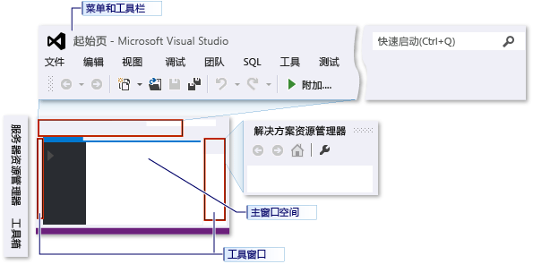  
  
 你可以通过使用 **“选项”** 对话框对 Visual Studio 进行其他自定义操作，如更改编辑器中文本的字体和字号，或者更改 IDE 的颜色主题。 根据应用的设置组合，此对话框中的一些项可能不会自动显示。 你可以通过选中 **“显示全部设置”** 复选框确保显示所有可能的选项。  
  
 图 3：“选项”对话框  
  
 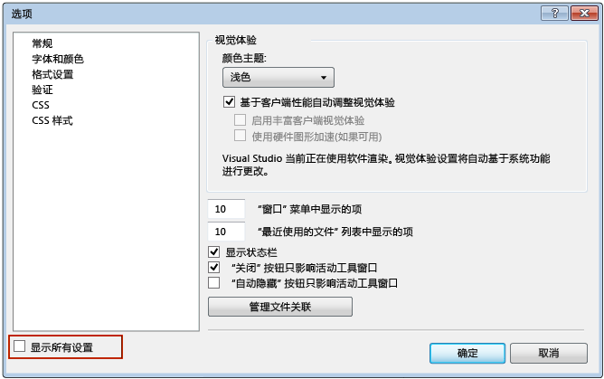  
  
 此示例会将 IDE 的颜色主题从浅色更改为深色。  如果您愿意，您可以跳到创建项目。  
  
#### <a name="to-change-the-color-theme-of-the-ide"></a>更改 IDE 的颜色主题  
  
1.  选择顶部的“工具”菜单，然后选择“选项...”项，打开“选项”对话框。  
  
       
  
2.  将 **“配色方案”** 更改为 **“深”**，然后单击 **“确定”**。  
  
     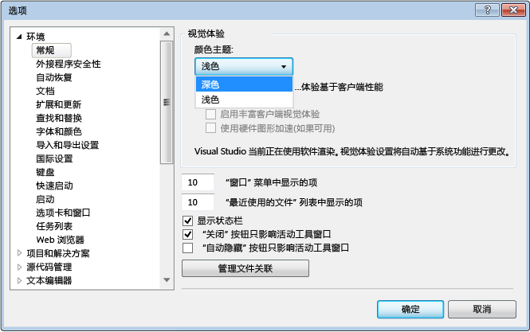  
  
 Visual Studio 的颜色应与下图相匹配：  
  
 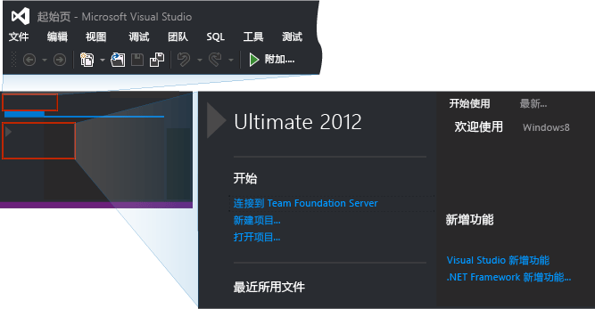  
  
 本演练剩余部分的图片使用的颜色主题是浅色主题。 有关自定义 IDE 的详细信息，请参阅[个性化设置 Visual Studio IDE](../ide/personalizing-the-visual-studio-ide.md)。  
  
##  <a name="BKMK_CreateApp"></a> 创建简单的应用程序  
  
### <a name="create-the-project"></a>创建项目  
 在 Visual Studio 中创建应用程序时，应首先创建项目和解决方案。 此示例将创建一个 Windows Presentation Foundation (WPF) 项目。  
  
##### <a name="to-create-the-wpf-project"></a>创建 WPF 项目  
  
1.  创建新项目。 在菜单栏上，依次选择“文件”、“新建”、“项目...”。  
  
       
  
     你还可以在“快速启动”  框中输入 **新项目** ，完成相同的工作。  
  
       
  
2.  例如，通过在左窗格 **已安装**、 **模板**、 **Visual C#**、 **Windows**中进行选择，然后选择中间窗格中的 WPF 应用程序，以选择 Visual Basic 或 Visual C# WPF 应用程序模板。  命名新项目对话框底部的项目 HelloWPFApp。  
  
     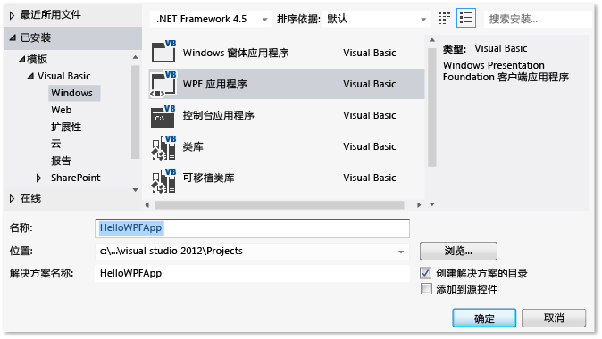  
  
     或  
  
     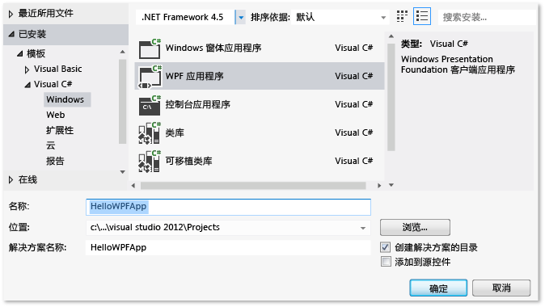  
  
 Visual Studio 将创建 HelloWPFApp 项目和解决方案， **解决方案资源管理器** 将显示各种文件。 WPF 设计器在拆分视图中显示 MainWindow.xaml 的设计视图和 XAML 视图。 您可以滑动拆分器，以显示任一视图的更多或更少部分。  您可以选择只查看可视化视图或 XAML 视图。 （有关详细信息，请参阅 [适用于 Windows 窗体开发人员的 WPF 设计器](http://msdn.microsoft.com/en-us/47ad0909-e89b-4996-b4ac-874d929f94ca)）。 **“解决方案资源管理器”**中显示以下项：  
  
 图 5：项目项  
  
   
  
 你可以在创建项目后进行自定义。 通过使用 **属性** 窗口（ **视图** 菜单上），您可以显示和更改应用程序中的项目项、控件和其他项的选项。 通过使用项目属性和属性页，可以显示和更改项目和解决方案的选项。  
  
##### <a name="to-change-the-name-of-mainwindowxaml"></a>更改 MainWindow.xaml 的名称  
  
1.  在下面的过程中，需为 MainWindow 提供更具体的名称。 在 **“解决方案资源管理器”**中，选择 MainWindow.xaml。 此时应看到“属性”窗口，如果没有，请依次选择“视图”菜单和“属性窗口”项。 将 **“文件名称”** 属性更改为 `Greetings.xaml`。  
  
       
  
     **解决方案资源管理器** 显示该文件的名称现在是 Greetings.xaml，并且如果您展开 MainWindow.xaml 的节点（通过将焦点放在该节点上并按右箭头键），您将看到 MainWindow.xaml.vb 或 MainWindow.xaml.cs 的名称现在是 Greetings.xaml.vb 或 Greetings.xaml.cs。 此代码文件被嵌套在 .xaml 文件节点下面，以显示它们的关系十分紧密。  
  
    > [!WARNING]
    >  此更改会导致错误，你在稍后的步骤中将了解如何调试和修复该错误。  
  
2.  在 **解决方案资源管理器**上，在设计器视图中打开 Greetings.xaml（通过当该节点具有焦点时按下 Enter 键），并使用鼠标选择窗口的标题栏。  
  
3.  在 **“属性”** 窗口中，将 **“标题”** 属性的值更改为 `Greetings`。  
  
 MainWindow.xaml 的标题栏现在显示“Greetings”。  
  
### <a name="design-the-user-interface-ui"></a>设计用户界面 (UI)  
 我们会将三种类型的控件添加至此应用程序：一个 TextBlock 控件、两个 RadioButton 控件和一个 Button 控件。  
  
##### <a name="to-add-a-textblock-control"></a>添加 TextBlock 控件  
  
1.  通过选择 **视图** 菜单和 **工具箱** 项打开 **工具箱** 窗口。  
  
2.  在 **“工具箱”**中，搜索 TextBlock 控件。  
  
     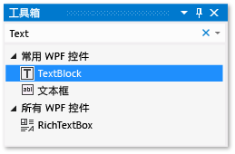  
  
3.  通过选择 TextBlock 项并将其拖到设计图面的窗口中，将 TextBlock 控件添加到设计图面中。  把控件居中到窗口的顶部附近。  
  
 你的窗口应与下图类似：  
  
 图 7：具有 TextBlock 控件的 Greetings 窗口  
  
 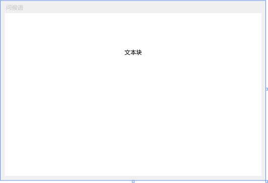  
  
 XAML 标记应类似于以下示例：  
  
```  
<TextBlock HorizontalAlignment="Center" TextWrapping="Wrap" VerticalAlignment="Center" RenderTransformOrigin="4.08,2.312" Margin="237,57,221,238"><Run Text="TextBlock"/><InlineUIContainer><TextBlock TextWrapping="Wrap" Text="TextBlock"/>  
```  
  
##### <a name="to-customize-the-text-in-the-text-block"></a>自定义文本块中的文本  
  
1.  在 XAML 视图中，找到 TextBlock 的标记并更改 Text 属性：`Text="Select a message option and then choose the Display button."`  
  
2.  如果 TextBlock 为适应设计视图而不进行扩展，请放大 TextBlock 控件（使用边上的抓取手柄），以使其显示全部文本。  
  
3.  通过按 Ctrl-s 或使用 **文件** 菜单项保存所做的更改。  
  
 接下来，向窗体添加两个 [RadioButton](/dotnet/framework/wpf/controls/radiobutton) 控件。  
  
##### <a name="to-add-radio-buttons"></a>添加单选按钮  
  
1.  在 **“工具箱”**中，搜索 RadioButton 控件。  
  
     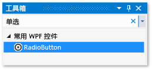  
  
2.  通过选择单选按钮项并将其移动到设计界面的窗口中两次，并移动按钮（通过选择它们并使用箭头键），以便按钮并排显示在 TextBlock 控件下面，这样可以在设计界面上添加两个单选按钮控件。  
  
     你的窗口应如下所示：  
  
     图 8：Greetings 窗口中的 RadioButton。  
  
     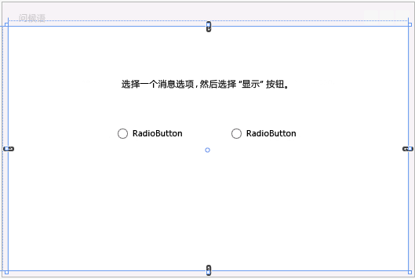  
  
3.  在左侧 RadioButton 控件的 **“属性”** 窗口中，将 **“名称”** 属性（位于 **“属性”** 窗口顶部）更改为 `RadioButton1`。  请确保您已选择了窗体中的单选按钮而不是背景网格；在名称字段下的属性窗口的类型字段应该显示单选按钮。  
  
4.  在右侧 RadioButton 控件的 **属性** 窗口中，把 **名称** 属性更改为 `RadioButton2`，然后通过按 Ctrl-s 或使用 **文件** 菜单项保存所做的更改。  请确保在更改和保存之前选择单选按钮。  
  
 你现在可以为每个 RadioButton 控件添加显示文本。 以下程序将更新 RadioButton 控件的 **“内容”** 属性。  
  
##### <a name="to-add-display-text-for-each-radio-button"></a>添加每个单选按钮的显示文本  
  
1.  在设计界面上，通过在选择 RadioButton1 时按鼠标右键打开 RadioButton1 的快捷菜单，选择 **编辑文本**，然后输入 `Hello`。  
  
2.  通过在选择 RadioButton2 时按鼠标右键打开 RadioButton2 的快捷菜单，选择 **编辑文本**，然后输入 `Goodbye`。  
  
 最后添加的 UI 元素是 [Button](/dotnet/framework/wpf/controls/button) 控件。  
  
##### <a name="to-add-the-button-control"></a>添加 Button 控件  
  
1.  在 **工具箱**中，搜索 **按钮** 控件，然后通过选择按钮并将其拖到设计视图的窗体中，将其添加到 RadioButton 控件下方的设计界面中。  
  
2.  在 XAML 视图中，将 Button 控件的 **内容** 值从 `Content="Button"` 更改为 `Content="Display"`，然后保存更改（Ctrl-s 或使用 **文件** 菜单）。  
  
     标记应与以下示例类似： `<Button Content="Display" HorizontalAlignment="Left" VerticalAlignment="Top" Width="75" Margin="215,204,0,0"/>`  
  
 你的窗口应与下图类似。  
  
 图 9：最后的 Greetings UI  
  
 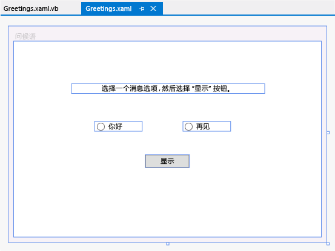  
  
### <a name="add-code-to-the-display-button"></a>向显示按钮添加代码  
 此应用程序运行时，用户首先选择单选按钮，再选择 **“显示”** 按钮之后，会显示一个消息框。 选择 Hello 将显示一个消息框，选择 Goodbye 将显示另一个。 要创建此行为，需将代码添加到 Greetings.xaml.vb 或 Greetings.xaml.cs 中的 Button_Click 事件。  
  
##### <a name="add-code-to-display-message-boxes"></a>添加代码以显示消息框  
  
1.  在设计图面上，双击 **“显示”** 按钮。  
  
     此时将打开 Greetings.xaml.vb 或 Greetings.xaml.cs，光标则位于 Button_Click 事件上。 您还可以添加一个 click 事件处理程序，如下所示（如果粘贴的代码的任何名称下有红色的波浪线，则您可能没有选择设计界面上的单选按钮控件并将其重命名）：  
  
     对于 Visual Basic，事件处理程序应类似于：  
  
    ```vb#  
    Private Sub Button_Click_1(sender As Object, e As RoutedEventArgs)  
  
    End Sub  
    ```  
  
     对于 Visual C#，事件处理程序应类似于：  
  
    ```c#  
    private void Button_Click_1(object sender, RoutedEventArgs e)  
    {  
  
    }  
    ```  
  
2.  对于 Visual Basic，请输入以下代码：  
  
    ```vb#  
    If RadioButton1.IsChecked = True Then  
        MessageBox.Show("Hello.")  
    Else RadioButton2.IsChecked = True  
        MessageBox.Show("Goodbye.")  
    End If  
  
    ```  
  
     对于 Visual C#，请输入以下代码：  
  
    ```  
    if (RadioButton1.IsChecked == true)  
    {  
        MessageBox.Show("Hello.");  
    }  
    else  
    {  
        RadioButton2.IsChecked = true;  
        MessageBox.Show("Goodbye.");  
    }  
    ```  
  
3.  保存应用程序。  
  
##  <a name="BKMK_DebugTest"></a> 调试并测试应用程序  
 接下来将调试应用程序，查找错误并测试两个消息框是否正确显示。 下面的说明介绍如何生成和启动调试器，但以后可以阅读[生成 WPF 应用程序 (WPF)](/dotnet/framework/wpf/app-development/building-a-wpf-application-wpf) 和[调试 WPF](../debugger/debugging-wpf.md) 以获取有关详细信息。  
  
### <a name="find-and-fix-errors"></a>查找并修复错误  
 在此步骤中将遇到之前因更改主窗口 XAML 文件的名称而引起的错误。  
  
##### <a name="to-start-debugging-and-find-the-error"></a>开始调试和查找错误  
  
1.  选择 **“调试”**-&gt; **“启动调试”**，启动调试器。  
  
       
  
     此时将显示对话框，指示已出现 IOException：找不到资源“mainwindow.xaml”。  
  
2.  选择 **“确定”** 按钮，然后停止调试器。  
  
     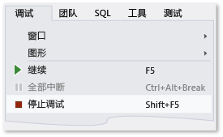  
  
 在本演练的开始部分中，我们将 Mainwindow.xaml 重命名为 Greetings.xaml，但是该代码仍然引用 Mainwindow.xaml 作为应用程序的启动 URI，因此该项目无法启动。  
  
##### <a name="to-specify-greetingsxaml-as-the-startup-uri"></a>将 Greetings.xaml 指定为启动 URI  
  
1.  在 **解决方案资源管理器**中，通过选择文件并按下回车或通过双击它在 XAML 视图中打开 App.xaml 文件（在 C# 项目中）或 Application.xaml 文件（在 Visual Basic 项目中）（不能在设计视图中打开）。  
  
2.  将 `StartupUri="MainWindow.xaml"` 更改为 `StartupUri="Greetings.xaml"`，然后按 Ctrl-s 保存更改。  
  
 再次启动调试程序 （按 F5）。 你应看到应用程序的 Greetings 窗口。  
  
### <a name="to-debug-with-breakpoints"></a>使用断点进行调试  
 通过添加一些断点，可以在调试期间测试代码。 你可以通过在主菜单上选择 **调试** 添加断点，然后 **切换断点** ，或者通过在编辑器中想要添加断点的代码行旁边的左边距中单击添加断点。  
  
##### <a name="to-add-breakpoints"></a>添加断点  
  
1.  打开 Greetings.xaml.vb 或 Greetings.xaml.cs，然后选择以下行： `MessageBox.Show("Hello.")`  
  
2.  通过选择 **“调试”**-&gt; **“切换断点”**，从菜单中添加断点。  
  
       
  
     编辑器窗口最左侧边距中该代码行附近将显示一个红圈。  
  
3.  选择以下行： `MessageBox.Show("Goodbye.")`。  
  
4.  按 F9 键添加断点，然后按 F5 键启动调试。  
  
5.  在 **“Greetings”** 窗口中，选择 **“Hello”** 单选按钮，然后选择 **“显示”** 按钮。  
  
     行 `MessageBox.Show("Hello.")` 将用黄色突出显示。 在 IDE 底部，“自动”、“本地”和“监视”窗口一起停靠在左侧，而“调用堆栈”、“断点”、“命令”、“即时”和“输出”窗口一起停靠在右侧。  
  
6.  在菜单栏上，选择 **“调试”**-> **“跳出”**。  
  
     应用程序继续执行，并将显示出带有“Hello”的消息框。  
  
7.  选择消息框上的 **“确定”** 按钮将其关闭。  
  
8.  在 **“Greetings”** 窗口中，选择 **“Goodbye”** 单选按钮，然后选择 **“显示”** 按钮。  
  
     行 `MessageBox.Show("Goodbye.")` 将用黄色突出显示。  
  
9. 按 F5 键继续调试。 当消息框出现时，选择消息框上的 **“确定”** 按钮将其关闭。  
  
10. 按 SHIFT + F5 键（先按 shift 并按住，再按 F5 键）以停止调试。  
  
11. 在菜单栏上，选择 **“调试”**-> **“禁用所有断点”**。  
  
### <a name="build-a-release-version-of-the-application"></a>生成应用程序的发布版本  
 确认一切就绪后，可以准备该应用程序的发布版本。  
  
##### <a name="to-clean-the-solution-files-and-build-a-release-version"></a>要清理解决方案文件并生成发布版本  
  
1.  在主菜单中，选择 **生成**，然后选择 **清理解决方案** ，删除上一生成过程中创建的中间文件和输出文件。  这不是必需的，但它会清理调试生成输出。  
  
       
  
2.  使用工具栏（当前显示“调试”）上的下拉列表控件把 HelloWPFApp 的生成配置从“调试”更改为“发布”。  
  
       
  
3.  通过选择 **生成**，然后是 **生成解决方案** 或按 F6 键构建解决方案。  
  
       
  
 祝贺你完成本演练！ 可在解决方案和项目目录 (...\HelloWPFApp\HelloWPFApp\bin\Release\\) 下找到生成的 .exe 文件。 如要了解更多示例，请参阅 [Visual Studio Samples](../ide/visual-studio-samples.md)。  
  
## <a name="see-also"></a>另请参阅  
 [Visual Studio 2017 中的新增功能](../ide/whats-new-in-visual-studio.md)   
 [Visual Studio 开发入门](../ide/get-started-developing-with-visual-studio.md)   
 [工作效率提示](../ide/productivity-tips-for-visual-studio.md)
