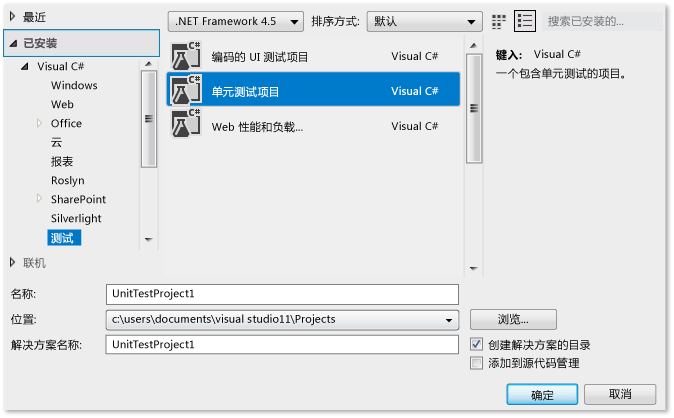
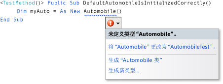
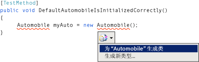
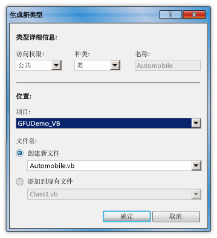
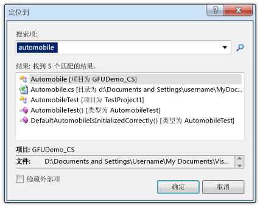
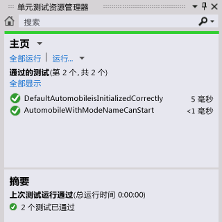

# 演练：带有“使用时生成”功能的测试先行支持
[!INCLUDE[vs2017banner](../code-quality/includes/vs2017banner.md)]

本主题演示如何利用可支持测试优先开发的 [使用时生成](/visual-cpp/misc/generate-from-usage) 功能。  
  
 *测试优先的开发*是一种软件设计的方法，其中首先基于产品规格编写单元测试，然后编写测试成功所需的源代码。 首次在测试用例中引用新类型和成员时，[!INCLUDE[vsprvs](../code-quality/includes/vsprvs_md.md)] 通过在对其进行定义之前在源代码中生成这些新类型和成员来支持测试优先的开发。  
  
 [!INCLUDE[vsprvs](../code-quality/includes/vsprvs_md.md)]生成对工作流中断次数最少的新类型和成员。 你可以创建类型、方法、属性、字段或构造函数的存根而无需从当前代码中的位置离开。 当打开一个对话框以指定类型生成的选项时，焦点会在对话框关闭时立即返回到当前打开的文件。  
  
 可用于与[!INCLUDE[vsprvs](../code-quality/includes/vsprvs_md.md)]集成的测试框架的“使用时生成”功能。 本主题中演示了 Microsoft 单元测试框架。  
  
 [!INCLUDE[note_settings_general](../data-tools/includes/note_settings_general_md.md)]  
  
### 创建一个 Windows 类库项目和测试项目  
  
1.  在 [!INCLUDE[csprcs](../data-tools/includes/csprcs_md.md)] 或 [!INCLUDE[vbprvb](../code-quality/includes/vbprvb_md.md)] 中新建一个 Windows 类库项目。 将其命名为 `GFUDemo_VB` 或 `GFUDemo_CS`，具体取决于所使用的语言。  
  
2.  在“解决方案资源管理器”中，右键单击顶部的解决方案图标，指向“添加”，然后单击“新建项目”。 在“新建项目”对话框中，在左侧的“项目类型”窗格中，单击“测试”。  
  
3.  在“模板”窗格中，单击“单元测试项目”并接受 UnitTestProject1 的默认名称。 下图显示了出现在 [!INCLUDE[csprcs](../data-tools/includes/csprcs_md.md)] 中的对话框。 在 [!INCLUDE[vbprvb](../code-quality/includes/vbprvb_md.md)] 中，对话框看起来与此类似。  
  
       
“新建项目”对话框  
  
4.  单击“确定”以关闭“新建项目”对话框。 现在，你已经可以开始编写测试  
  
### 从单元测试生成一个新类  
  
1.  测试项目包含名为 UnitTest1 的文件。 在“解决方案资源管理器”中双击此文件以在代码编辑器中打开。 已生成测试类和测试方法。  
  
2.  找到类 `UnitTest1` 的声明并将其重命名为 `AutomobileTest`。 在 C\# 中，如果存在 `UnitTest1()` 构造函数，则将其重命名为 `AutomobileTest()`。  
  
    > [!NOTE]
    >  IntelliSense 现在提供完成 IntelliSense 语句的两种模式：*完成模式*和*建议模式*。 对于先使用类和成员然后再对其进行定义的情况，采用建议模式。 当 IntelliSense 窗口打开时，可以按“CTRL\+ALT\+空格键”以实现完成模式与建议模式之间的切换。 有关更多信息，请参见[使用 IntelliSense](../ide/using-intellisense.md)。 当你在下一步键入 `Automobile` 时，建议模式将有助于完成此操作。  
  
3.  找到 `TestMethod1()` 方法并将其重命名为 `DefaultAutomobileIsInitializedCorrectly()`。 在此方法中，创建名为 `Automobile` 的类的新实例，如下图所示。 会出现波浪形下划线，指示编译时错误，并会在类型名称下出现智能标记。 智能标记的确切位置会有所不同，具体取决于使用的是 [!INCLUDE[vbprvb](../code-quality/includes/vbprvb_md.md)] 还是 [!INCLUDE[csprcs](../data-tools/includes/csprcs_md.md)]。  
  
       
Visual Basic  
  
       
Visual C\#  
  
4.  将鼠标指针悬停在智能标记上以查看错误消息，该消息陈述尚未定义名为 `Automobile` 的类型。 单击智能标记或按 CTRL\+。 按（CTRL\+句点）可打开“从使用中生成”快捷菜单，如下图所示。  
  
       
Visual Basic  
  
       
Visual C\#  
  
5.  你现在有两个选择。 可单击**“生成‘类 Automobile’”**以在测试项目中创建一个新的文件并用名为 `Automobile` 的空类填充该文件。 这是在当前项目中具有默认访问修饰符的新文件中创建一个新类的快速方法。 还可以单击“生成新类型”以打开“生成新类型”对话框。 这一操作提供的选项包括将该类放在现有文件和将该文件添加到另一个项目。  
  
     单击“生成新类型”以打开“生成新类型”对话框，如下图所示。 在“项目”列表中，单击 **GFUDemo\_VB** 或 **GFUDemo\_CS** 以指示 [!INCLUDE[vsprvs](../code-quality/includes/vsprvs_md.md)] 将文件添加到源代码项目而不是测试项目。  
  
       
“生成新类型”对话框  
  
6.  单击“确定”以关闭对话框并创建新文件。  
  
7.  在“解决方案资源管理器”中，在 GFUDemo\_VB 或 GFUDemo\_CS 项目节点下查看，以验证是否存在新的 Automobile.vb 或 Automobile.cs 文件。 在代码编辑器中，焦点仍处于 `AutomobileTest.DefaultAutomobileIsInitializedCorrectly`。 你可以继续编写测试，同时受到的中断影响会降至最低。  
  
### 生成属性存根  
  
1.  假定产品规范规定 `Automobile` 类具有两个公共属性，分别名为 `Model` 和 `TopSpeed`。 这些属性必须由默认的构造函数使用默认值 `"Not specified"` 和 `-1` 进行初始化。 下面的单元测试将验证默认构造函数将属性设置为正确的默认值。  
  
     将以下代码行添加到 `DefaultAutomobileIsInitializedCorrectly`。  
  
     [!CODE [VbTDDWalkthrough#1](../CodeSnippet/VS_Snippets_VBCSharp/vbtddwalkthrough#1)]  
  
     由于该代码引用 `Automobile` 上未定义的两个属性，所以将显示一个智能标记。 单击 `Model` 的智能标记，然后单击**生成属性存根**。 同时为 `TopSpeed` 属性生成属性存根。  
  
     在 `Automobile` 类中，从上下文正确推断出新属性的类型。  
  
     下图展示智能标记快捷菜单。  
  
       
Visual Basic  
  
       
Visual C\#  
  
### 定位源代码  
  
1.  使用“导航至”功能导航到 Automobile.cs 或 Automobile.vb 源代码文件，以便可以验证已生成新属性。  
  
     “导航至”功能使你能够快速输入文本字符串，如类型名称或部分名称，并通过单击结果列表中的元素转到所需位置。  
  
     通过单击代码编辑器打开“导航至”对话框，并按 CTRL\+,（即 CTRL \+ 逗号）。 在文本框中，键入 `automobile`。 单击列表中的 **Automobile** 类，然后单击“确定”。  
  
     下图展示“定位到”窗口。  
  
       
“定位到”窗口  
  
### 为新的构造函数生成存根  
  
1.  在此测试方法中，你将生成一个构造函数存根，该存根会将 `Model` 和 `TopSpeed` 属性初始化为具有所指定的值。 稍后，你将添加更多代码以完成测试。 将以下其他测试方法添加到你的 `AutomobileTest` 类。  
  
     [!CODE [VbTDDWalkthrough#2](../CodeSnippet/VS_Snippets_VBCSharp/vbtddwalkthrough#2)]  
  
2.  在新的类构造函数下单击智能标记，然后单击“生成构造函数存根”。 在 `Automobile` 类文件中，请注意，新的构造函数已检查构造函数调用中使用的局部变量的名称，在 `Automobile` 类中找到具有相同名称的属性，并在构造函数主体中提供代码以存储属性 `Model` 和 `TopSpeed` 中的参数。 （在 [!INCLUDE[vbprvb](../code-quality/includes/vbprvb_md.md)] 中，新的构造函数中的 `_model` 和 `_topSpeed` 字段是隐式定义的属性 `Model` 和 `TopSpeed` 的支持字段。）  
  
3.  生成新的构造函数后，在 `DefaultAutomobileIsInitializedCorrectly` 中默认构造函数的调用下出现一条波浪形下划线。 该错误消息指出 `Automobile` 类不具有不含参数的构造函数。 若要生成不带参数的显式默认构造函数，请单击智能标记，然后单击“生成构造函数存根”。  
  
### 生成一个方法的存根  
  
1.  假定该规范指明，如果新的 `Automobile` 的属性 `Model` 和 `TopSpeed` 设置为默认值以外的值，则可将其置于“运行”状态中。 向 `AutomobileWithModelNameCanStart` 方法添加以下行。  
  
     [!CODE [VbTDDWalkthrough#3](../CodeSnippet/VS_Snippets_VBCSharp/vbtddwalkthrough#3)]  
  
2.  单击 `myAuto.Start` 方法调用的智能标记，然后单击“生成方法存根”。  
  
3.  单击 `IsRunning` 属性的智能标记，然后单击“生成属性存根”。`Automobile` 类现在包含以下代码。  
  
     [!CODE [VbTDDWalkthrough#4](../CodeSnippet/VS_Snippets_VBCSharp/vbtddwalkthrough#4)]  
  
### 运行测试  
  
1.  在“单元测试”菜单上，指向“运行单元测试”，然后单击“所有测试”。 此命令运行所有测试框架中为当前解决方案编写的测试。  
  
     在本例中，存在两个测试，并如预期一样，它们都失败了。`DefaultAutomobileIsInitializedCorrectly` 测试失败，因为 `Assert.IsTrue` 条件返回了 `False`。`AutomobileWithModelNameCanStart` 测试失败，因为 `Automobile` 类中的 `Start` 方法引发异常。  
  
     下图显示了“测试结果”窗口。  
  
       
“测试结果”窗口  
  
2.  在“测试结果”窗口中，双击每个测试结果行以转到每个测试失败的位置。  
  
### 实现源代码  
  
1.  将以下代码添加到默认构造函数，以便 `Model`、`TopSpeed` 和 `IsRunning` 属性全部初始化为其正确的默认值 `"Not specified"`、`-1` 和 `True` \(`true`\)。  
  
     [!CODE [VbTDDWalkthrough#5](../CodeSnippet/VS_Snippets_VBCSharp/vbtddwalkthrough#5)]  
  
2.  当调用 `Start` 方法时，它应仅在 `Model` 或 `TopSpeed` 属性设置为其默认值以外的值时才将 `IsRunning` 标志设置为 true。 从方法主体删除 `NotImplementedException` 并添加以下代码。  
  
     [!CODE [VbTDDWalkthrough#6](../CodeSnippet/VS_Snippets_VBCSharp/vbtddwalkthrough#6)]  
  
### 再次运行测试  
  
1.  在“测试”菜单上，指向“运行”，然后单击“解决方案中的所有测试”。 这次测试通过了。 下图显示了“测试结果”窗口。  
  
       
“测试结果”窗口  
  
## 请参阅  
 [使用时生成](/visual-cpp/misc/generate-from-usage)   
 [编写代码](../ide/writing-code-in-the-code-and-text-editor.md)   
 [使用 IntelliSense](../ide/using-intellisense.md)   
 [单元测试代码](../test/unit-test-your-code.md)