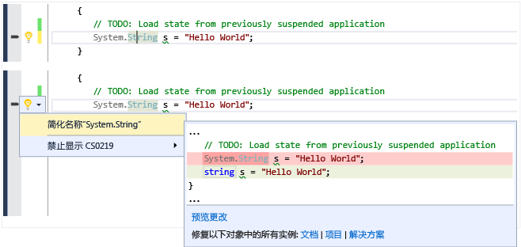

# Visual Studio 2015 中的新增功能
[!INCLUDE[vs2017banner](../code-quality/includes/vs2017banner.md)]

欢迎使用 Visual Studio 2015，这是一款由开发人员工作效率工具、云服务和扩展组成的集成套件，让你和你的团队可以创建适用于 Web、Windows 商店、桌面、Android 和 iOS 的强大的应用程序和游戏。  
  
 此页面展示了自 Visual Studio 2013 RTM 以来的一些最重要的新功能，包括首先在 Visual Studio 2013 的一个更新中推出的功能。 有关 Visual Studio 2015 中新增功能的完整列表，请参见[发行说明](https://www.visualstudio.com/news/vs2015-vs)。  
  
 若要了解有关 Visual Studio ALM 中的许多改进和新增功能的详细信息，请参阅 [Visual Studio 2015 应用程序生命周期管理的新增功能](http://msdn.microsoft.com/zh-cn/54b98a53-6083-4303-869a-8063d8fae938)。  
  
## 新的安装体验  
 [!INCLUDE[downloadvs](../ide/includes/downloadvs_md.md)]  
  
 Visual Studio 2015 安装体验已进行组件化，因此你只需要安装所需的部件。 这让涉及 .NET 或 Web 开发的许多常用方案的安装变得更加快速。 如果进行其他类型的开发（例如跨平台移动开发），或在 C\+\+ 或 F\# 中工作，则选择**“自定义”**安装，然后选择所需的组件和可选第三方 SDK。 还可以稍后再安装任何自定义组件。 例如，如果选择基本安装，并随后尝试创建一个新的 C\+\+ 项目，则系统会提示你下载 C\+\+ 开发工具。  
  
   
  
## 使用多个帐户登录  
 借助 Visual Studio 2015，全新简化的登录体验旨在大大简化对联机资源的访问，即使你拥有多个 Visual Studio 帐户也是如此。 登录到 Visual Studio 后，你会自动登录到 Visual Studio 2015 的所有实例和你计算机上的 Blend。 登录操作会自动开始为你漫游设置。 在 Visual Studio 2015 中，你的帐户跨功能共享，所以只要拥有适当令牌，就可以从“团队资源管理器”访问你的 Visual Studio Team Services 帐户，从服务器资源管理器中的 Microsoft Azure 订阅访问资源和网站。 你也将在 Application Insights 项目的“新建项目”对话框中看到你的 Azure 资源，并且在新的“添加连接的服务”对话框中看到你的 Azure 移动、Azure 存储、[Microsoft Office 365](http://msdn.microsoft.com/office/aa905340.aspx) 和 [Saleforce.com 开发人员](https://developer.salesforce.com/)帐户。  
  
 你可以随时添加多个用户帐户或通过新的帐户管理器进行添加，从而在 Visual Studio 中使用这些帐户。 然后，你可以在连接到服务或访问联机资源时在这些帐户之间即时切换。 Visual Studio 会记住你添加的帐户，因此你可从 Visual Studio 或 Blend 的任何实例使用这些帐户。 Visual Studio 还将随你的个性化帐户一起漫游帐户列表（但我们不会漫游你的重要凭据），因此你可以在另一台设备上快速地开始使用其中的一个帐户。 当然，你可以随时从“帐户设置”对话框中移除帐户。 若要开始操作，请参见 [使用多个用户帐户](../ide/work-with-multiple-user-accounts.md)。  
  
   
  
## 选择你的目标平台  
 Visual Studio 2015 支持跨平台移动设备开发。 你可以编写面向 iOS、Android 和 Windows 的应用程序和游戏以及共享通用基本代码，一切都可从 Visual Studio IDE 内执行。 你将在“文件”、“新项目”对话框中见到所有这些新项目类型。  
  
 同时当然，对语言、库和工具进行了一些改进，因而对经典桌面应用程序的支持更胜一筹。  
  
### 通过适用于 Visual Studio 的 Xamarin 用 C\# 编写的跨平台移动应用  
 Xamarin 是移动框架，通过此框架，你可以使用 C\# 编写代码，代码会在本机绑定到 iOS 和 Android API。 Microsoft 与 Xamarin 在发行 Xamarin for Visual Studio 时密切合作，这款扩展使你可以在具有共享代码的单个解决方案中针对 Android、iOS 和 Windows Phone 进行开发。 借助 Xamarin，你将使用一种语言和一个代码库，且平台间的增量可以保持最低。  Xamarin for Visual Studio 在 Visual Studio 2010 及更高版本上受到支持。 Visual Studio 2015 中包括 Xamarin 入门版。 若要开始操作，请参见 [在 Visual Studio 中使用 Xamarin 生成具有本机 UI 的应用](../cross-platform/build-apps-with-native-ui-using-xamarin-in-visual-studio.md)。  
  
### 带 Apache Cordova 的 HTML\/JavaScript 中的跨平台移动应用  
 适用于 Apache Cordova 的 Visual Studio 工具是 Microsoft 和开放源 Apache Cordova 社区紧密合作的成果。 通过这些工具，可使用 HTML、CSS 和 JavaScript（或 Typescript）进行跨平台移动开发。 你可将单一基本代码面向 Android、iOS 和 Windows，并且享受 Visual Studio IDE 的丰富功能，包括 JavaScript IntelliSense、DOM 资源管理器、JavaScript 控制台、断点、监视、局部变量、仅我的代码等等。  凭借适用于 Apache Cordova 的 Visual Studio 工具，你的应用可通过提供通用 JavaScript API 的插件使用所有平台上的原生设备功能。 若要开始操作，请参见 [Visual Studio Tools for Apache Cordova 入门](../Topic/Get%20Started%20with%20Visual%20Studio%20Tools%20for%20Apache%20Cordova1.md)。  
  
### 通过 Unity 在 C\# 中编写的跨平台移动游戏  
 Unity 是用于开发多平台 2D 和 3D 游戏的使用广泛的平台。 可以使用 C\# 编写你的游戏，并在 Android、iOS、Windows Phone 和许多其他平台上本机运行该游戏。 适用于 Unity 的 Visual Studio 工具是集成了 Unity 和 Visual Studio IDE 的扩展。 通过此扩展，你除了获得为 Unity 开发人员所设计的工作效率功能外，还可获得 Visual Studio IDE 和调试器的所有功能。 Visual Studio Tools for Unity 2.0 Preview 2 添加了对 Visual Studio 2015 的支持以及一些新功能，例如为“局部变量”和“监视”窗口中的对象提供更好的可视化效果。 Microsoft 最近收购了 SyntaxTree，这家公司是适用于 Unity 的 Visual Studio 工具的创建者。 要下载 Visual Studio Tools for Unity 2.0 Preview 2，以及获取有关 Visual Studio Tools for Unity 的详细信息，请参阅 [Visual Studio Tools for Unity 2.0](http://Aka.ms/vstu)。  
  
### 针对本机 C\+\+ 的跨平台应用程序和库  
 C\+\+ 是跨大部分移动设备本机可用的语言。 它可用于编写跨平台共享代码库，这些代码库可以针对多个移动平台目标进行生成。 甚至可以使用 C\+\+ 创建完整的移动应用。 Visual C\+\+ 为你提供编辑、生成、部署和调试跨平台代码的工具。 除适用于 Windows 应用的模板外，还可以根据适用于 Android Native Activity 应用和 iOS 应用的模板创建项目，或创建适用于多个平台的共享代码库项目，包括 Xamarin 混合应用。 借助特定于平台的 IntelliSense，可以浏览 API 以及生成针对 Android、iOS 或 Windows 目标的正确代码。 可以针对 x86 或 ARM 本机平台配置生成，并将代码部署到 iOS 模拟器、联网 Mac 上 iOS 设备或直接附加的 Android 设备，或使用高性能的 Microsoft Visual Studio Emulator for Android 进行测试。 可以在 Visual Studio 调试程序中设置断点、监视变量、查看堆栈和逐句通过 C\+\+ 代码。 可以跨多个应用平台共享除最具有平台特定性的代码之外的所有代码，并在 Visual Studio 中用一个解决方案生成所有这些代码。  
  
 若要开始使用跨平台 C\+\+，请参阅 [使用 Visual C\+\+ 生成跨平台应用](../misc/build-cross-platform-mobile-apps-with-visual-cpp.md)  
  
### 适用于任何 Windows 10 设备的通用 Windows 应用  
 使用通用 Windows 平台和我们的一项 Windows 核心，可在任何 Windows 10 设备上（从电话到桌面）运行同一应用。 使用 Visual Studio 2015 和通用 Windows 应用开发工具创建这些通用 Windows 应用。  
  
   
  
 在 Windows 10 手机、Windows 10 台式机或 Xbox 上运行应用。 它是相同的应用程序包！ 通过引入 Windows 10 的单个统一核心，一个应用程序包可以跨所有平台运行。 多个平台都具有可添加到应用以利用平台特定行为的扩展 SDK。 例如，用于移动功能的扩展 SDK 控制 Windows phone 上按下的后退按钮。 如果在项目中引用扩展 SDK，只需添加运行时检查来测试该 SDK 是否可在该平台上可用。 这就是对每个平台使用相同应用程序包的方法了！  
  
 使用 C\#、Visual Basic、C\+\+ 或 JavaScript 创建这些[通用 Windows 应用](http://msdn.microsoft.com/library/dn975273.aspx)。  
  
### Web  
 ASP.NET 5 是 MVC、WebAPI 和 SignalR 的一个重大更新，在 Windows、Mac 和 Linux 上运行。  ASP.NET 5 旨在完全为你提供可组合的精益 .NET 堆栈以便生成基于云的现代应用程序。 Visual Studio 2015 工具与常用 Web 开发工具（例如 Bower 和 Grunt）更紧密地集成。 若要开始操作，请参阅 [NET Web 开发和工具博客](http://blogs.msdn.com/b/webdev/)上的多篇博客文章。  
  
### 经典桌面和 Windows 应用商店  
 Visual Studio 2015 继续支持经典桌面和 Windows 商店开发。 Visual Studio 将随着 Windows 的发展而发展。  在 Visual Studio 2015 中，适用于 .NET 和 C\+\+ 的库和语言有了大幅改进，适用于 Windows 的所有版本。  
  
#### .NET Framework  
 Microsoft [!INCLUDE[net_v46](../ide/includes/net_v46_md.md)] 提供约 150 个新的 API 和 50 个更新的 API 以启用更多方案。 例如，现在更多集合可实现 <xref:System.Collections.Generic.IReadOnlyCollection%601>，使其使用起来更为简便。 此外，如先前提到的，ASP.NET 5 提供一个用于生成基于云的现代应用程序的精益 .NET 平台。  
  
 面向 .NET Framework 且用 C\# 编写的 Windows 商店应用程序现在可使用 .NET 本机（它将应用程序编译到本机代码而不是 IL），并且 [!INCLUDE[net_v46](../ide/includes/net_v46_md.md)] 也添加了 RyuJIT，即 64 位实时 \(JIT\) 编译器。  
  
 新的 C\# 和 VB 编译器（“Roslyn”）大幅提高了编译时间，并且提供全面的代码分析 API。 Visual Studio 2015 利用 Roslyn 提供更多重构，包括内联重命名、分析器和快速修复。  
  
 C\# 和 Visual Basic 语言都在核心语言和 IDE 支持方面进行了很多小的改进。 这些改进一起作用，让你的 .NET 编码体验更直观、更方便、更有效。  
  
 有关详细信息，请参见 [新增功能](../Topic/What's%20New%20in%20the%20.NET%20Framework.md) 和 [.NET 博客](http://blogs.msdn.com/b/dotnet/)。  
  
#### C\+\+  
 Visual C\+\+ 在以下方面有大幅提升：C\+\+11\/14 语言一致性、对跨平台移动设备开发的支持、对可恢复函数和 await 的支持（目前计划在 C\+\+17 中进行标准化）、C 运行时库 \(CRT\) 和 C\+\+ 标准库 \(STL\) 实现中的改进和 Bug 修复、MFC 中可调整大小的对话框、新的编译器优化、更好的生成性能、代码编辑器中的新诊断功能和新效率工具。  
  
 有关详细信息，请参见 [What's New for Visual C\+\+](/visual-cpp/top/what-s-new-for-visual-cpp-in-visual-studio-2015) 和 [Visual C\+\+ 博客](http://blogs.msdn.com/b/vcblog/)。  
  
## 设备预览菜单栏  
 在通用 Windows 平台项目中，设备预览菜单栏使你可以查看基于 XAML 的 UI 在各种屏幕尺寸上的呈现方式。  
  
   
  
## Visual Studio 图形诊断  
 自 Visual Studio 2013 开始，Visual Studio 图形诊断已添加许多新功能，包括帧分析，Windows Phone 支持、着色器编辑和应用，以及命令行捕获工具。 它还添加了对 DirectX12 应用调试的支持。 有关详细信息，请参阅 [Visual Studio 图形诊断](../debugger/visual-studio-graphics-diagnostics.md)。  
  
## 连接到服务  
 Visual Studio 2015 让你比以往任何时候都更轻松地将应用连接到服务。  新的“添加连接的服务”向导会配置你的项目，添加必要的身份验证支持并下载必要的 NuGet 数据包，帮助你开始根据你的服务需要进行快速轻松的编码。 “添加连接的服务”向导还集成新的帐户管理器，令使用多个用户帐户和订阅变得容易。 在 Visual Studio 2015 中，对以下服务的支持立即可用（如果拥有帐户）：  
  
1.  Azure 移动服务  
  
2.  Azure 存储  
  
3.  Office 365（邮件、联系人、日历、文件、用户和组）  
  
4.  销售团队  
  
 新服务将不断增加，你可通过单击向导中的“查找新服务链接”来发现这些服务。  
  
   
  
## 设计你的 UI  
 设计 XAML 用户界面的 Blend 体验获得了巨大提升。 Blend 已经过完全重新设计，以提供更直观的 UI、更强大的 XAML 编辑功能（包括 IntelliSense）并实现与 Visual Studio 更好的集成。 有关更多信息，请参见[Designing XAML in Visual Studio and Blend for Visual Studio](../designers/designing-xaml-in-visual-studio.md)。  
  
## 跨平台调试支持  
 可以使用 Visual Studio 创建和调试在 Windows、iOS 和 Android 设备运行的本机移动应用。 使用 [Visual Studio Emulator for Android](http://blogs.msdn.com/b/visualstudioalm/archive/2014/11/12/introducing-visual-studio-s-emulator-for-android.aspx)，或连接设备并在 Visual Studio 中直接调试代码。  
  
-   **JavaScript\/Cordova**。 使用 [Visual Studio Tools for Apache Cordova](http://msdn.microsoft.com/library/dn879821\(v=vs.140\).aspx)，通过 JavaScript 生成适用于 Windows、iOS 和 Android 的本机应用。  
  
     MSDN 库中的 [调试你的应用](../Topic/Debug%20Your%20App%20Built%20with%20Visual%20Studio%20Tools%20for%20Apache%20Cordova.md) 详细介绍了适用于 Cordova 的 Visual Studio 调试支持。  
  
-   **C\#\/Xamarin**。 通过 [Xamarin](http://msdn.microsoft.com/library/dn879698\(v=vs.140\).aspx)，在 Visual Studio 中使用 C\# 生成适用于 Windows、iOS 和 Android 的本机应用。  
  
     [Xamarin 开发人员指南](http://developer.xamarin.com/guides)中的[调试](http://developer.xamarin.com/guides/ios/deployment,_testing,_and_metrics/debugging_in_xamarin_ios/) \(iOS\) 和[在设备上进行调试](http://developer.xamarin.com/guides/android/deployment,_testing,_and_metrics/debugging_with_xamarin_android/)介绍了调试体验。  
  
-   **C\+\+\/Android**。 配合使用[用于跨平台移动开发的 Visual C\+\+](http://msdnstage.redmond.corp.microsoft.com/library/dn872463\(v=vs.140\).aspx)模板和 [Android NDK](https://developer.android.com/tools/sdk/ndk/index.html) 等第三方工具，创建适用于 Windows 和 Android 的本机应用。  
  
## 调试和诊断  
 有关新增调试功能的信息，请参阅 [Visual Studio 2015 中调试器的新增功能](../debugger/what’s-new-for-the-debugger-in-visual-studio-2015.md)。  
  
 有关新增诊断功能的信息，请参阅 [诊断工具中的新增功能](../profiling/what-s-new-in-profiling-tools.md)。  
  
 下面是对代码执行不同类型的诊断和分析的新功能和改进的工具：  
  
### 性能提示  
 性能提示显示调试过程中方法的执行时间，可使你快速确认瓶颈，而无需调用探查器。 若要开始使用，请参阅[性能提示：使用 Visual Studio 调试时的性能信息一览](http://blogs.msdn.com/b/visualstudioalm/archive/2014/08/18/perftips-performance-information-at-a-glance-while-debugging-with-visual-studio.aspx)  
  
### 错误列表  
 错误列表现在支持任何列的筛选。 它还在你输入时显示整个 C\# 或 Visual Basic 解决方案中错误、警告和代码分析的实时视图，即使代码更改生成上千个警告时也是如此。 新的“错误列表”重新兼容现有的用法。 有关更多信息，请参见[“错误列表”窗口](../ide/reference/error-list-window.md)。  
  
### GPU 使用情况工具  
 GPU 使用情况工具可帮助你收集和分析 DirectX 应用和游戏中的 GPU 使用数据，并就 CPU 或 GPU 中是否出现性能瓶颈进行故障排除。 若要开始使用该工具，请参阅 [Visual C\+\+ 团队博客文章](http://blogs.msdn.com/b/vcblog/archive/2014/09/05/gpu-usage-tool-in-visual-studio-2013-update-4-ctp1.aspx)。  
  
## 实时代码分析（灯泡）  
 适用于 C\# 和 Visual Basic 的新 Roslyn 编译器不仅提供更快的编译时间，也启用全新方案（如实时代码分析），这些方案在你输入时直接在代码编辑器内提供丰富的可自定义的反馈和建议。 在 Visual Studio 2015 中，灯泡在左边距中显示（使用键盘时）或显示工具提示（将鼠标悬停在错误上时）。 电灯泡实时提示编译器（可能使用自定义规则集）在你的代码中检测到问题，还提供有关如何解决该问题的建议。 当你看到电灯泡时，请单击它以获得可操作的建议。  
  
   
  
## 请享受这些额外的 IDE 改进  
  
### 同步设置（漫游设置）  
 Visual Studio 2013 针对最常用的设置（例如文本编辑器、键盘关联、主题和字体及颜色、启动以及环境别名）引入同步设置。  Visual Studio 2015 通过同步更多设置并在 Professional、Enterprise、Express SKU、Blend 等 Visual Studio 应用程序系列中同步设置，使这种体验获得提升。 当你使用在 Visual Studio 2013 中使用的同一帐户首次登录 Visual Studio 2015 时，你会发现你的 Visual Studio 2013 设置同步到了 Visual Studio 2015 中。 你可以通过以下方式访问你的设置：在“快速启动”中输入“sync”，或者导航至“工具”\>“选项”\>“环境”\>“同步设置”。  
  
### 自动扩展更新  
 当 Visual Studio 库里有可用的新版本时，已安装的 Visual Studio 扩展现在将会自动更新。 请参阅[查找和使用 Visual Studio 拓展](../ide/finding-and-using-visual-studio-extensions.md)以获取有关可如何自定义自动扩展更新的详细信息。  
  
### 标题首字母大写菜单  
 我们专心聆听你的需求。 默认情况下，Visual Studio 菜单为标题首字母大写。 然而，如果你想使用“全部大写”样式，可以在启动时或者在“工具”\>“选项”\>“常规”属性页中设置它：  
  
   
  
### 高分辨率图像和触摸屏支持  
 Visual Studio IDE 可在高清晰度显示屏上显示真正的高分辨率图像（例如菜单、上下文菜单、工具窗口命令栏等区域内，以及解决方案资源管理器中的一些项目中）。 同时，在 Visual Studio 代码编辑器窗口的触摸屏上，现在可以使用以下功能：点触并按住、捏放、点击等以缩放、滚动、选择文本以及调用上下文菜单。  
  
   
  
### 自定义布局  
 你可以创建、保存和漫游自定义窗口布局。 例如，你可以定义一个在台式计算机上使用的首选布局以及在笔记本电脑或小屏幕设备上使用的不同布局。 或者你可为 UI 项目定义一个布局，为数据库项目定义另一个布局。 键盘关联可使你在不同布局之间快速切换。 登录 Visual Studio 后，Visual Studio 的任何实例均可提供这些布局。 有关详细信息，请参阅[创建自定义窗口布局](../misc/create-custom-window-layouts.md)。  
  
   
  
### 通知中心  
 通知中心的 UI 已经得到了简化，从而使快速浏览更为轻松。 已添加其他类型的通知（包括性能问题、呈现问题和崩溃），并且现在让 Visual Studio 停止显示通知。 有关详细信息，请参阅 [Visual Studio 通知](../ide/visual-studio-notifications.md)。  
  
### CodeLens：查找代码所发生的变化（仅适用于企业版和专业版）  
 专注于工作的同时，查找有关代码的信（不离开编辑器）。 可以针对存储在 Visual Studio Team Services \(VSTS\) 或 Team Foundation Server \(TFS\) 中的代码查看工作项、bug、代码评审等的更改和其他历史记录。  
  
 在 Visual Studio Enterprise 和 Visual Studio Professional 中，你现在可以：  
  
-   获取 Visual Studio 编辑器中整个代码文件的历史记录。  
  
       
  
-   查看显示更改你的代码的人员的图。 这可以帮助发现团队更改中的模式并评估它们的影响。  
  
       
  
-   轻松查看上次更改代码的时间。  
  
-   查找会影响你代码的其他分支中的更改。  
  
 请参阅 [CodeLens](../ide/find-code-changes-and-other-history-with-codelens.md)。  
  
### 设计和建模工具（仅限于 Enterprise 版）  
 **代码图和依赖项关系图**  
  
 在 Visual Studio Enterprise 中，当你想要了解代码中的特定依赖项时，可通过创建代码图将其可视化。 然后可以使用代码图（在代码旁边显示）导航这些关系。 代码图还可以在你处理或调试代码时，帮助跟踪你在代码中的位置，这样一来，你将在读取更少代码的同时了解关于代码设计的更多信息。  
  
 在此版本中，通过将命令组合为与选择、编辑、管理组和更改组内容的布局相关的部分，代码元素和链接的快捷菜单变得更加易于使用。 另请注意，测试项目的显示风格与其他项目不同，并且我们将代码图中的元素图标更新到了更合适的版本。  
  
   
  
 其他改进包括：  
  
-   **改进的上下关系图**。 对于中型到大型 Visual Studio 解决方案，现在可以使用简化的体系结构菜单来获取更有用的解决方案代码图。 解决方案的程序集按解决方案文件夹进行组合，因此，你可以在上下文中进行查看并利用为结构化解决方案而完成的工作。 你将立即看到项目和程序集引用，然后会显示链接类型。 此外，解决方案外部的程序集以更紧凑的方式进行组合。  
  
-   **测试项目的风格不一样且可以进行筛选**。 现在可以更加轻松快速地在代码图中确定测试项目，因为它们的风格不一样。 还可以将测试项目筛选出来，以便你能够专注于处理应用程序的工作代码。  
  
-   **简化的外部依赖项链接**。 依赖项链接不再表示来自 System.Object、System.ValueType、System.Enum 和 System.Delegate 的继承，这样一来，在代码图中查看外部依赖项变得更加方便。  
  
-   **“深入了解依赖项链接”将筛选器考虑在内**。 展开关系图以了解某个依赖项链接的贡献时，可以获得有用且清晰的关系图。 该关系图不那么杂乱，并将你选择的链接筛选选项考虑在内。  
  
-   **代码元素与其上下文一起添加到代码图**。 因为关系图现在与其上下文一起显示（到可以筛选出来的程序集和解决方案文件夹，如果需要），所以从解决方案资源管理器、类视图、对象浏览器拖放代码元素时，或在解决方案资源管理器中选择元素并选择“在代码图上显示”时，可以获得更加有用的关系图。  
  
-   **更快速地获取反应式代码图**。 拖放操作可以生成即时结果，且节点之间的链接可以更快速地进行创建，而不会影响后续由用户启动的操作，例如展开节点或请求更多节点。 创建代码图而不生成解决方案时，所有极端案例（例如不生成程序集时）现在得到处理。  
  
-   **跳过重新生成解决方案。**在创建和编辑关系图时提供更好的性能。  
  
-   **筛选代码元素节点和组**。 通过根据代码元素的类别显示或隐藏代码元素，以及通过按解决方案文件夹、程序集、命名空间、项目文件夹和类型对代码元素进行组合，可以快速整理代码图。  
  
-   **筛选关系以使关系图更易于阅读**。 链接筛选现在也适用于跨组链接，与早期版本相比，链接筛选让使用筛选器窗口工作时产生的干扰变少。  
  
-   **根据类视图和对象浏览器创建关系图**。 从类视图和对象浏览器窗口将文件和程序集拖放到新的代码图或现有代码图中。  
  
 请参阅 [映射解决方案中的依赖项](../modeling/map-dependencies-across-your-solutions.md)。  
  
 **此版本中的其他设计和建模更改：**  
  
-   **层关系图**。 使用类视图和对象浏览器更新这些关系图。 为满足软件设计要求，使用层关系图来描述软件所需的依赖项。 通过查找不满足这些约束条件的代码以及使用此基线验证未来的代码，使代码与此设计保持一致。  
  
-   **UML 关系图**。 不再能够根据代码创建 UML 类图和序列图。 但你仍可使用新的 UML 元素创建这些关系图。  
  
-   **体系结构资源管理器**。 不再能够使用体系结构资源管理器创建关系图。 但你仍可使用解决方案资源管理器。  
  
## Visual Studio 扩展性工具  
 安装 Visual Studio 扩展性工具（VS SDK 和模板）前所未有地容易，因为现在它们作为可选组件包含在安装过程中。  扩展性工具允许开发人员编写扩展以自定义并将功能添加到 Visual Studio。 有关 Visual Studio 扩展性的详细信息，请参阅 [Visual Studio SDK](../extensibility/visual-studio-sdk.md)  
  
 如果你想要将你的自定义安装包含在扩展性工具中，可以在**“功能”\/“常用工具”\/“Visual Studio 扩展性工具”**下找到它们。  你还可以通过打开**“新建项目”**对话框并选择 **“Visual C\#”\/“扩展性”**下的**“安装 Visual Studio 扩展性工具”**项来稍后安装扩展性工具。  
  
## 请提供反馈  
 为什么将反馈发送至 Visual Studio 团队？ 因为我们严肃对待客户反馈。 事实上，我们会查看进入我们的反馈系统的每一条反馈。 你的反馈给予我们巨大的行事动力。  
  
### 发送笑脸  
 告诉我们你想如何帮助我们了解何时我们达到或超过你的期待。 当我们设计和实现新功能时，我们使用你希望有助于我们决定设计的功能的相关数据。 所以，如果你希望在 Visual Studio 在增加某个功能，请告知我们。 这是很容易的，你可以直接从 IDE 中告知我们。  
  
 只需单击标题栏上的黄色笑脸，告诉我们你的偏好，然后单击“发送笑脸”按钮。  
  
 就这么简单！ 我们将你的反馈路由到适当团队，在这里他们将振作精神，立即思考让你更高兴的方法。  
  
### 发送哭脸  
 了解我们在产品中的改进之处有助于我们首先关注对客户最重要的事，从而管理我们的积压工作 \(backlog\)。 若有任何相关的疑难之事，请直接从 IDE 内使用“发送哭脸”功能告诉我们。 我们也让这一流程异常简单：  
  
 单击标题栏上的黄色笑脸，然后单击“发送哭脸”。 告诉我们你不喜欢的内容，然后单击“发送哭脸”按钮。 有关更多信息，请参见[与我们交流](../ide/talk-to-us.md)。  
  
### 报告崩溃、挂起和性能问题  
 有时，快速标记哭脸不足以传达你不喜欢的内容造成的完全影响。 当你遭遇挂起、崩溃或性能问题时，你可以通过使用发送哭脸后显示的对话框方便地共享重现步骤、故障转储和跟踪文件。  
  
 首先，如上所述发送哭脸。 在弹出的对话框上，你可以使用任何一个默认标记对你的反馈进行标记或者创建你自己的标记。 标记可帮助我们将你的反馈路由到适当的功能团队。 在“选择类别”下拉列表中，选择表示你报告的问题的选项，然后按照步骤重现此问题。 同时提供有关如何使用 Visual Studio 报告反馈的详细步骤。 有关详细信息，请参阅[Visual Studio 发送笑脸说明](../Topic/Visual%20Studio%20Send%20a%20Smile%20Instructions.md)。  
  
### 在“连接”中跟踪你的问题  
 如果要跟踪你的 Visual Studio 2015 反馈的状态，请转至[“连接”](http://connect.microsoft.com/)并在那里报告 Bug。 报告 Bug 后，你将可以返回“连接”来跟踪其状态。  
  
## 请参阅  
 [使用 Apache Cordova 生成跨平台应用](../Topic/Build%20cross-platform%20apps%20with%20Visual%20Studio%20Tools%20for%20Apache%20Cordova.md)   
 [在 Visual Studio 中使用 Xamarin 生成具有本机 UI 的应用](../cross-platform/build-apps-with-native-ui-using-xamarin-in-visual-studio.md)   
 [使用 Visual C\+\+ 生成跨平台应用](../misc/build-cross-platform-mobile-apps-with-visual-cpp.md)   
 [使用 IntelliTest 为你的代码生成单元测试](../test/generate-unit-tests-for-your-code-with-intellitest.md)   
 [使用多个用户帐户](../ide/work-with-multiple-user-accounts.md)   
 [创建自定义窗口布局](../misc/create-custom-window-layouts.md)   
 [使用电灯泡执行快速操作](../ide/perform-quick-actions-with-light-bulbs.md)   
 [Visual Studio 2015 应用程序生命周期管理的新增功能](http://msdn.microsoft.com/zh-cn/54b98a53-6083-4303-869a-8063d8fae938)