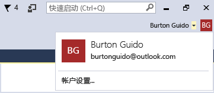

# 使用多个用户帐户
如果有多个 Microsoft 帐户和/或工作或学校帐户，可将它们全部添加到 Visual Studio，以便可从任何帐户访问资源，而无需单独登录到这些帐户。 目前，Azure、Application Insights、Team Foundation Server 和 Office 365 服务支持简化的登录体验。 随着时间的推移，可能会提供其他服务。

 将多个帐户添加到一台计算机上之后，如果你在另一台计算机上登录到 Visual Studio，则该组帐户将会随你一起漫游。 请务必注意，尽管帐户名可漫游，但凭据却不能。 因此，第一次尝试在新的计算机上使用其资源时，将提示你输入这些其他帐户的凭据。  

 本演练显示如何将多个帐户添加到 Visual Studio，以及如何查看可从 **“添加连接的服务”** 对话框、 **“服务器资源管理器”**和 **“团队资源管理器”**等位置反映的帐户访问的资源。  

## 登录 Visual Studio  

- 使用 Microsoft 帐户或组织帐户登录到 Visual Studio。 窗口上方会显示你的用户名，类似于：  

       

### 在服务器资源管理器中访问你的 Azure 帐户  
 按 **“Ctrl + Alt + S”** ，打开 **“服务器资源管理器”**。 选择 Azure 图标，当图标展开时，将显示与用于登录 Visual Studio 的 ID 相关联的 Azure 帐户中的可用资源。 看起来应该如下所示（唯一不同的是，你看到的是自己的资源）。

   

 在任何特定设备上首次使用 Visual Studio 时，对话框都将只显示在你登录 IDE 所用的 ID 下注册的订阅。 通过右键单击 Azure 节点、选择 **“管理和筛选订阅”** 并从帐户选取器控件添加帐户，可以直接从 **“服务器资源管理器”** 访问任何其他帐户的资源。 如果需要，可以通过单击向下箭头，从帐户列表中选择另一个帐户。 选择帐户之后，你可以选择想要帐户下的哪些订阅在服务器资源管理器中显示。  

   

 下次打开服务器资源管理器时，将显示该订阅的资源。  

### 通过“添加连接的服务”对话框，访问你的 Azure 帐户  

1.  用 C# 创建通用应用项目。  

2.  选择解决方案资源管理器中的项目节点，然后选择“添加 -> 连接的服务”。 随即出现“添加连接的服务”向导，其中显示与 Visual Studio 登录 ID 相关联的 Azure 帐户中的服务列表。 请注意：无需单独登录 Azure。 但是，第一次尝试从给定计算机访问其资源时，你需要登录到其他帐户。  

    > [!WARNING]
    >  如果是第一次在特定计算机上的 Visual Studio 中创建应用商店应用，则将提示你通过转到计算机上的“设置 | 更新和安全 | 面向开发人员”来启用设备的开发模式。 有关详细信息，请参阅[启用设备进行开发](https://msdn.microsoft.com/en-us/library/windows/apps/dn706236.aspx)。  

###   在 Web 项目中访问 Azure Active Directory  
 Azure AD 支持 ASP.NET MVC web 应用程序中的最终用户单一登录或 Web API 服务中的 AD 身份验证。 域身份验证不同于单个用户帐户身份验证；有权访问 Active Directory 域的用户可以使用其现有的 Azure AD 帐户连接到你的 web 应用程序。 Office 365 应用还可以使用域身份验证。 为此，创建一个 Web 应用程序（“文件 -> 新建项目 -> C# -> 云 -> ASP.NET Web 应用程序”）。 在“新的 ASP.NET 项目”对话框中，选择 **“更改身份验证”**。 身份验证向导随即显示，你能够选择要在你的应用程序中使用的身份验证类型。  

   

 有关 ASP.NET 中不同种类的身份验证的详细信息，请参阅[在 Visual Studio 2013 中创建 ASP.NET Web 项目](http://www.asp.net/visual-studio/overview/2013/creating-web-projects-in-visual-studio#orgauth)（有关身份验证的信息仍适用于当前版本的 Visual Studio）。  

### 访问你的 Visual Studio Team Services 帐户  
 在主菜单中，选择“团队 -> 连接到 Team Foundation Server”以打开“团队资源管理器”窗口。 单击“选择团队项目” ，在“选择 Team Foundation Server” 下的列表框中，你应该看到你的 Visual Studio Team Services 帐户的 URL。 当你选择 URL 时，无需重新输入你的凭据就可登录。  

## 向 Visual Studio 添加第二个用户帐户  
 在 Visual Studio 上方单击用户名旁的向下箭头。 然后选择“帐户设置”菜单项。 出现 **“帐户管理器”** 对话框并显示你登录所用的帐户。 选择对话框下方的“添加帐户”链接，以添加新的 Microsoft 帐户或新的工作或学校帐户。  

   

 按照提示输入新的帐户凭据。 下图显示用户添加其 Contoso.com 工作帐户后的帐户管理器。  

   

## 重新访问“添加连接的服务”向导和服务器资源管理器  
 现在，再次转到 **“服务器资源管理器”** ，右键单击 Azure 节点并选择 **“管理和筛选订阅”**。 通过单击当前帐户旁的下拉箭头选择新的帐户，然后选择想要在服务器资源管理器中显示的订阅。 你应看到与指定订阅相关联的所有服务。即使你当前不使用第二个帐户登录到 Visual Studio IDE，也可登录到该帐户的服务和资源。 “项目 -> 添加连接的服务”和“团队 -> 连接到 Team Foundation Server”也是如此。

