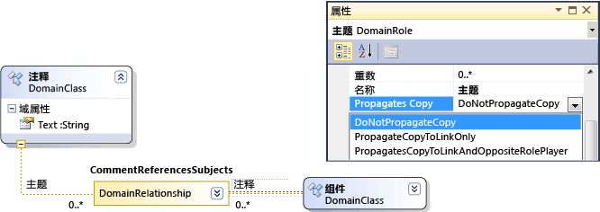
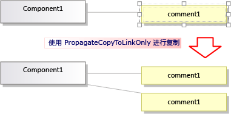
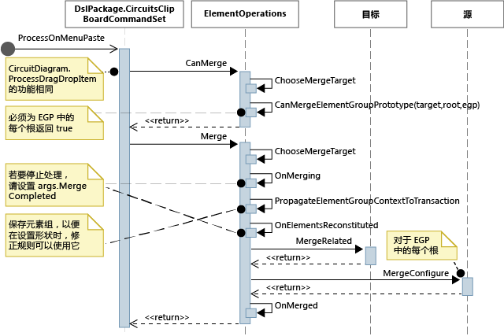

# 自定义复制行为
[!INCLUDE[vs2017banner](../code-quality/includes/vs2017banner.md)]

在使用 [!INCLUDE[vsprvs](../code-quality/includes/vsprvs_md.md)] 可视化和建模 SDK 创建的域特定语言 \(DSL\) 中，你可以更改当用户复制并粘贴元素时所发生的情况。  
  
## 标准的复制和粘贴行为  
 若要启用复制，请在 DSL 资源管理器中设置**“编辑器”**节点的**“启用复制粘贴”**属性。  
  
 默认情况下，当用户将元素复制到剪贴板时，还会复制以下元素：  
  
-   所选元素的嵌入后代。  （即，作为源于复制元素的嵌入关系目标的元素。）  
  
-   复制的元素之间的关系链接。  
  
 此规则将按递归方式应用到复制的元素和链接。  
  
   
  
 复制的元素和链接将进行序列化并存储在位于剪贴板上的 <xref:Microsoft.VisualStudio.Modeling.ElementGroupPrototype> \(EGP\)。  
  
 复制的元素的图像也位于该剪贴板上。  这将允许用户将其粘贴到其他应用程序（如 Word）中。  
  
 用户可以根据 DSL 定义将复制的元素粘贴到可以接受元素的目标上。  例如，在从组件解决方案模板生成的 DSL 中，用户可以将端口复制到组件上，但不能复制到关系图上；并且可以将组件粘贴到关系图上，但不能粘贴到其他组件上。  
  
## 自定义复制和粘贴行为  
 有关通过使用程序代码自定义模型的详细信息，请参阅[在程序代码中导航和更新模型](../modeling/navigating-and-updating-a-model-in-program-code.md)。  
  
 **启用或禁用复制、剪切和粘贴。**  
 在 DSL 资源管理器中，设置**“编辑器”**节点的**“启用复制粘贴”**属性。  
  
 **将链接复制到同一目标。**例如，将复制的注释框链接到相同的使用者元素。  
 将角色的**“传播复制”**属性设置为**“仅将复制传播到链接”**。  有关详细信息，请参阅[自定义链接复制行为](#customizeLinks)。  
  
 复制链接的元素。例如，在复制新元素时，还建立了任何链接的注释框的副本。  
 将角色的**“传播复制”**属性设置为**“将复制传播到链接和相反的角色扮演者”**。  有关详细信息，请参阅[自定义链接复制行为](#customizeLinks)。  
  
 **通过复制和粘贴快速复制元素。**通常，刚复制的项仍处于选中状态，并且你无法将相同类型的元素粘贴到该项上。  
 将元素合并指令添加到域类，并将其设置为向前合并到父类。  这将在拖动操作上产生相同的效果。  有关详细信息，请参阅[自定义元素创建和移动](../modeling/customizing-element-creation-and-movement.md)。  
  
 \- 或 \-  
  
 通过重写 `ClipboardCommandSet.ProcessOnPasteCommand()` 选择关系图，然后再粘贴元素。  在 DslPackage 项目的自定义文件中添加此代码：  
  
```c#  
namespace Company.MyDsl {  
using System.Linq;  
using Microsoft.VisualStudio.Modeling.Diagrams;   
using Microsoft.VisualStudio.Modeling.Shell;  
partial class MyDslClipboardCommandSet  
{  
  protected override void ProcessOnMenuPasteCommand()  
  {  
 // Deselect the current selection after copying:  
 Diagram diagram = (this.CurrentModelingDocView as SingleDiagramDocView).Diagram;  
    this.CurrentModelingDocView  
     .SelectObjects(1, new object[] { diagram }, 0);  
  }  
} }  
  
```  
  
 **当用户粘贴到选定的目标上时创建附加链接。**例如，在将注释框粘贴到元素上时，它们之间即创建一个链接。  
 将元素合并指令添加到目标域类，并将其设置为通过添加链接来处理合并。  这将在拖动操作上产生相同的效果。  有关详细信息，请参阅[自定义元素创建和移动](../modeling/customizing-element-creation-and-movement.md)。  
  
 \- 或 \-  
  
 重写 `ClipboardCommandSet.ProcessOnPasteCommand()` 以在调用基方法后创建附加链接。  
  
 **自定义将元素复制**到外部应用程序时所采用的格式 – 例如，若要将边框添加到位图窗体。  
 在 DslPackage 项目中重写 *MyDsl*`ClipboardCommandSet.ProcessOnMenuCopyCommand()`。  
  
 **自定义通过复制命令（而非采用拖动操作）将元素复制到剪贴板的方式。**  
 在 DslPackage 项目中重写 *MyDsl*`ClipboardCommandSet.CopyModelElementsIntoElementGroupPrototype()`。  
  
 **通过复制和粘贴保留形状布局。**  
 当用户复制多个形状时，可以在粘贴它们时保留其相对位置。  [VMSDK：电路图示例](http://go.microsoft.com/fwlink/?LinkId=213879)上的示例演示了此技术。  
  
 若要获得此效果，请将形状和连接符添加到复制的 ElementGroupPrototype。  重写的最简便方法是 ElementOperations.CreateElementGroupPrototype\(\)。  为此，请将以下代码添加到 DSL 项目：  
  
```c#  
  
public class MyElementOperations : DesignSurfaceElementOperations  
{  
  // Create an EGP to add to the clipboard.  
  // Called when the elements to be copied have been  
  // collected into an ElementGroup.  
 protected override ElementGroupPrototype CreateElementGroupPrototype(ElementGroup elementGroup, ICollection<ModelElement> elements, ClosureType closureType)  
  {  
 // Add the shapes and connectors:  
 // Get the elements already in the group:  
    ModelElement[] mels = elementGroup.ModelElements  
        .Concat(elementGroup.ElementLinks) // Omit if the paste target is not the diagram.  
        .ToArray();  
 // Get their shapes:  
    IEnumerable<PresentationElement> shapes =   
       mels.SelectMany(mel =>   
            PresentationViewsSubject.GetPresentation(mel));  
    elementGroup.AddRange(shapes);  
  
 return base.CreateElementGroupPrototype  
           (elementGroup, elements, closureType);  
  }  
  
 public MyElementOperations(IServiceProvider serviceProvider, ElementOps1Diagram diagram)  
      : base(serviceProvider, diagram)  
  { }  
}  
  
// Replace the standard ElementOperations  
// singleton with your own:  
partial class MyDslDiagram // EDIT NAME  
{  
 /// <summary>  
 /// Singleton ElementOperations attached to this diagram.  
 /// </summary>  
 public override DesignSurfaceElementOperations ElementOperations  
  {  
 get  
    {  
 if (singleton == null)  
      {  
        singleton = new MyElementOperations(this.Store as IServiceProvider, this);  
      }  
 return singleton;  
    }  
  }  
 private MyElementOperations singleton = null;  
}  
  
```  
  
 **在所选位置（例如当前光标位置）粘贴形状。**  
 当用户复制多个形状时，可以在粘贴它们时保留其相对位置。  [VMSDK：电路图示例](http://go.microsoft.com/fwlink/?LinkId=213879)上的示例演示了此技术。  
  
 为实现此效果，请重写 `ClipboardCommandSet.ProcessOnMenuPasteCommand()`，以使用特定于位置的版本的 `ElementOperations.Merge()`。  为此，请在 DslPackage 项目中添加以下代码：  
  
```c#  
  
partial class MyDslClipboardCommandSet // EDIT NAME  
{  
   /// <summary>  
    /// This method assumes we only want to paste things onto the diagram  
    /// - not onto anything contained in the diagram.  
    /// The base method pastes in a free space on the diagram.  
    /// But if the menu was used to invoke paste, we want to paste in the cursor position.  
    /// </summary>  
    protected override void ProcessOnMenuPasteCommand()  
    {  
  
  NestedShapesSampleDocView docView = this.CurrentModelingDocView as NestedShapesSampleDocView;  
  
      // Retrieve data from clipboard:  
      System.Windows.Forms.IDataObject data = System.Windows.Forms.Clipboard.GetDataObject();  
  
      Diagram diagram = docView.CurrentDiagram;  
      if (diagram == null) return;  
  
      if (!docView.IsContextMenuShowing)  
      {  
        // User hit CTRL+V - just use base method.  
  
        // Deselect anything that's selected, otherwise  
        // pasted item will be incompatible:  
        if (!this.IsDiagramSelected())  
        {  
          docView.SelectObjects(1, new object[] { diagram }, 0);  
        }  
  
        // Paste into a convenient spare space on diagram:  
    base.ProcessOnMenuPasteCommand();  
      }  
      else  
      {  
        // User right-clicked - paste at mouse position.  
  
        // Utility class:  
        DesignSurfaceElementOperations op = diagram.ElementOperations;  
  
        ShapeElement pasteTarget = diagram;  
  
        // Check whether what's in the paste buffer is acceptable on the target.  
        if (pasteTarget != null && op.CanMerge(pasteTarget, data))  
        {  
  
        // Although op.Merge would be a no-op if CanMerge failed, we check CanMerge first  
          // so that we don't create an empty transaction (after which Undo would be no-op).  
          using (Transaction t = diagram.Store.TransactionManager.BeginTransaction("paste"))  
          {  
            PointD place = docView.ContextMenuMousePosition;  
            op.Merge(pasteTarget, data, PointD.ToPointF(place));  
            t.Commit();  
          }  
        }  
      }  
    }  
  }  
```  
  
 **让用户拖放元素。**  
 请参阅[如何：添加拖放处理程序](../modeling/how-to-add-a-drag-and-drop-handler.md)。  
  
##  <a name="customizeLinks"></a> 自定义链接复制行为  
 当用户复制元素时，标准行为是还会复制所有嵌入元素。  可以修改标准复制行为。  在 DSL 定义中，在关系的一边选择某个角色，然后在“属性”窗口中设置**“传播复制”**值。  
  
   
  
 有三个值：  
  
-   不传播复制  
  
-   仅将复制传播到链接 \- 在粘贴该组时，此链接的新副本将引用链接另一端上的现有元素。  
  
-   将复制传播到链接和相反的角色扮演者 \- 复制的组包括位于链接另一端上的元素的副本。  
  
   
  
 所进行的更改将同时影响元素和复制的图像。  
  
## 编程复制和粘贴行为  
 与复制、粘贴、创建和删除对象有关的 DSL 行为的许多方面都由耦合到关系图的 <xref:Microsoft.VisualStudio.Modeling.ElementOperations> 的实例控制。  通过从 <xref:Microsoft.VisualStudio.Modeling.ElementOperations> 中派生自己的类并重写关系图类的 <xref:Microsoft.VisualStudio.Modeling.Diagrams.Diagram.ElementOperations%2A> 属性，可修改 DSL 的行为。  
  
> [!TIP]
>  有关通过使用程序代码自定义模型的详细信息，请参阅[在程序代码中导航和更新模型](../modeling/navigating-and-updating-a-model-in-program-code.md)。  
  
   
  
   
  
#### 定义自己的 ElementOperations  
  
1.  在 DSL 项目的新文件中，创建派生自 <xref:Microsoft.VisualStudio.Modeling.Diagrams.DesignSurfaceElementOperations> 的类。  
  
2.  为关系图类添加分部类定义。  该类的名称可以在 **Dsl\\GeneratedCode\\Diagrams.cs** 中找到。  
  
     在关系图类中，重写 <xref:Microsoft.VisualStudio.Modeling.Diagrams.Diagram.ElementOperations%2A> 以返回 ElementOperations 子类的实例。  应在每次调用时返回同一个实例。  
  
 在 DslPackage 项目的自定义代码文件中添加此代码：  
  
```c#  
  
using Microsoft.VisualStudio.Modeling;  
using Microsoft.VisualStudio.Modeling.Diagrams;  
using Microsoft.VisualStudio.Modeling.Diagrams.ExtensionEnablement;  
  
  public partial class MyDslDiagram  
  {  
    public override DesignSurfaceElementOperations ElementOperations  
    {  
      get  
      {  
        if (this.elementOperations == null)  
        {  
          this.elementOperations = new MyElementOperations(this.Store as IServiceProvider, this);  
        }  
        return this.elementOperations;  
      }  
    }  
    private MyElementOperations elementOperations = null;  
  }  
  
  public class MyElementOperations : DesignSurfaceElementOperations  
  {  
    public MyElementOperations(IServiceProvider serviceProvider, MyDslDiagram diagram)  
      : base(serviceProvider, diagram)  
    { }  
    // Overridden methods follow  
  }  
  
```  
  
## 接收从其他模型拖动的项  
 ElementOperations 还可用于定义复制、移动、删除和拖放行为。  作为 ElementOperations 用法的演示，此处提供的示例将定义自定义拖放行为。  但是对于此目的，你可以考虑 [如何：添加拖放处理程序](../modeling/how-to-add-a-drag-and-drop-handler.md) 中所述的替代方法，该方法具有更强的可扩展性。  
  
 在 ElementOperations 类中定义两个方法：  
  
-   `CanMerge(ModelElement targetElement, System.Windows.Forms.IDataObject data)`，用于确定是否可将源元素拖动到目标形状、连接符或关系图上。  
  
-   `MergeElementGroupPrototype(ModelElement targetElement, ElementGroupPrototype sourcePrototype)`，用于将源元素合并到目标中。  
  
### CanMerge\(\)  
 调用 `CanMerge()`，以确定当鼠标在关系图上移动时应向用户提供的反馈。  该方法的参数是在其上鼠标悬停的元素，以及有关源的数据（拖动操作从该源执行）。  用户可以从屏幕上的任何位置进行拖动。  因此，源对象可以为多种不同类型，并且可以采用不同的格式进行序列化。  如果源是 DSL 或 UML 模型，则数据参数是 <xref:Microsoft.VisualStudio.Modeling.ElementGroupPrototype> 的序列化。  拖动、复制和工具箱操作使用 ElementGroupPrototypes 来表示模型的片段。  
  
 元素组原型可以包含任意数目的元素和链接。  元素类型可由其 GUID 标识。  GUID 属于已拖动的形状，而不属于基础模型元素。  在以下示例中，如果将来自 UML 关系图的类形状拖动到此关系图上，则 `CanMerge()` 将返回 True。  
  
```c#  
public override bool CanMerge(ModelElement targetShape, System.Windows.Forms.IDataObject data)  
 {  
  // Extract the element prototype from the data.  
  ElementGroupPrototype prototype = ElementOperations.GetElementGroupPrototype(this.ServiceProvider, data);  
  if (targetShape is MyTargetShape && prototype != null &&  
        prototype.RootProtoElements.Any(rootElement =>   
          rootElement.DomainClassId.ToString()   
          ==  "3866d10c-cc4e-438b-b46f-bb24380e1678")) // Guid of UML Class shapes  
          // or SourceClass.DomainClassId  
        return true;  
   return base.CanMerge(targetShape, data);  
 }  
  
```  
  
## MergeElementGroupPrototype\(\)  
 当用户将元素放置在关系图、形状或连接符上时，将调用此方法。  它应将拖动的内容合并到目标元素中。  在此示例中，该代码将确定它是否可识别目标和原型类型的组合；如果识别，则该方法可将拖动的元素转换到应添加到模型的元素的原型中。  调用基方法来执行转换或未转换的元素的合并。  
  
```c#  
public override void MergeElementGroupPrototype(ModelElement targetShape, ElementGroupPrototype sourcePrototype)  
{  
  ElementGroupPrototype prototypeToMerge = sourcePrototype;  
  MyTargetShape pel = targetShape as MyTargetShape;  
  if (pel != null)  
  {  
    prototypeToMerge = ConvertDraggedTypeToLocal(pel, sourcePrototype);  
  }  
  if (prototypeToMerge != null)  
    base.MergeElementGroupPrototype(targetShape, prototypeToMerge);  
}  
  
```  
  
 此示例将处理从 UML 类关系图中拖动的 UML 类元素。  DSL 的设计目的不是直接存储 UML 类，而是为每个拖动的 UML 类创建 DSL 元素。  例如，如果 DSL 是实例关系图，则这将十分有用。  用户可以将类拖动到关系图上来创建这些类的实例。  
  
```c#  
  
private ElementGroupPrototype ConvertDraggedTypeToLocal (MyTargetShape snapshot, ElementGroupPrototype prototype)  
{  
  // Find the UML project:  
  EnvDTE.DTE dte = snapshot.Store.GetService(typeof(EnvDTE.DTE)) as EnvDTE.DTE;  
  foreach (EnvDTE.Project project in dte.Solution.Projects)  
  {  
    IModelingProject modelingProject = project as IModelingProject;  
    if (modelingProject == null) continue; // not a modeling project  
    IModelStore store = modelingProject.Store;  
    if (store == null) continue;  
    // Look for the shape that was dragged:  
    foreach (IDiagram umlDiagram in store.Diagrams())  
    {  
      // Get modeling diagram that implements UML diagram:  
      Diagram diagram = umlDiagram.GetObject<Diagram>();  
      Guid elementId = prototype.SourceRootElementIds.FirstOrDefault();  
      ShapeElement shape = diagram.Partition.ElementDirectory.FindElement(elementId) as ShapeElement;  
      if (shape == null) continue;  
      IClass classElement = shape.ModelElement as IClass;  
      if (classElement == null) continue;  
  
      // Create a prototype of elements in my DSL, based on the UML element:  
      Instance instance = new Instance(snapshot.Store);  
      instance.Type = classElement.Name;  
      // Pack them into a prototype:  
      ElementGroup group = new ElementGroup(instance);  
      return group.CreatePrototype();  
    }  
  }  
  return null;  
}  
  
```  
  
## 标准复制行为  
 此部分中的代码将显示可进行重写以更改复制行为的方法。  为了帮助你了解如何实现自己的自定义，此部分显示了可重写涉及复制的方法但不更改标准行为的代码。  
  
 当用户按 CTRL\+C 或使用“复制”菜单命令时，将调用方法 <xref:Microsoft.VisualStudio.Modeling.Shell.ClipboardCommandSet.ProcessOnMenuCopyCommand%2A>。  你可以查看在 **DslPackage\\Generated Code\\CommandSet.cs** 中设置此命令的方式。  有关如何设置命令的详细信息，请参阅[如何：向快捷菜单中添加命令](../Topic/How%20to:%20Add%20a%20Command%20to%20the%20Shortcut%20Menu.md)。  
  
 通过在 DslPackage 项目中添加 *MyDsl*`ClipboardCommandSet` 的分部类定义，可重写 ProcessOnMenuCopyCommand。  
  
```c#  
using System.Collections.Generic;  
using System.Drawing;  
using System.Windows.Forms;  
using Microsoft.VisualStudio.Modeling;  
using Microsoft.VisualStudio.Modeling.Diagrams;  
  
partial class MyDslClipboardCommandSet  
{  
  /// <summary>  
  /// Override ProcessOnMenuCopyCommand() to copy elements to the  
  /// clipboard in different formats, or to perform additional tasks  
  /// before or after copying – for example deselect the copied elements.  
  /// </summary>  
  protected override void ProcessOnMenuCopyCommand()  
  {  
    IList<ModelElement> selectedModelElements = this.SelectedElements;  
    if (selectedModelElements.Count == 0) return;  
  
    // System container for clipboard data.  
    // The IDataObject can contain data in several formats.  
    IDataObject dataObject = new DataObject();  
  
    Bitmap bitmap = null; // For export to other programs.  
    try  
    {  
      #region Create EGP for copying to a DSL.  
      this.CopyModelElementsIntoElementGroupPrototype  
                     (dataObject, selectedModelElements);  
      #endregion  
  
      #region Create bitmap for copying to another application.   
      // Find all the shapes associated with this selection:  
      List<ShapeElement> shapes = new List<ShapeElement>(  
        this.ResolveExportedShapesForClipboardImages  
              (dataObject, selectedModelElements));  
  
      bitmap = this.CreateBitmapForClipboard(shapes);  
      if (bitmap != null)  
      {  
        dataObject.SetData(DataFormats.Bitmap, bitmap);  
      }  
      #endregion   
  
      // Add the data to the clipboard:  
      Clipboard.SetDataObject(dataObject, true, 5, 100);  
    }  
    finally  
    {  
      // Dispose bitmap after SetDataObject:  
      if (bitmap != null) bitmap.Dispose();  
    }  
  }  
/// <summary>  
/// Override this to customize the element group that is copied to the clipboard.  
/// </summary>  
protected override void CopyModelElementsIntoElementGroupPrototype(IDataObject dataObject, IList<ModelElement> selectedModelElements)  
{  
  return this.ElementOperations.Copy(dataObject, selectedModelElements);  
}  
}  
```  
  
 每个关系图都具有 ElementOperations 的单一实例。  你可以提供自己的派生。  此文件（可放置在 DSL 项目中）的行为将与它重写的代码相同：  
  
```c#  
using System;  
using System.Collections.Generic;  
using System.Linq;  
using Microsoft.VisualStudio.Modeling;  
using Microsoft.VisualStudio.Modeling.Diagrams;  
  
namespace Company.MyDsl  
{  
  partial class MyDslDiagram  
  {  
    /// <summary>  
    /// Singleton ElementOperations attached to this diagram.  
    /// </summary>  
    public override DesignSurfaceElementOperations ElementOperations  
    {  
      get  
      {  
        if (this.elementOperations == null)  
        {  
          this.elementOperations = new MyElementOperations(this.Store as IServiceProvider, this);  
        }  
        return this.elementOperations;  
      }  
    }  
    private MyElementOperations elementOperations = null;  
  }  
  
  // Our own version of ElementOperations so that we can override:  
  public class MyElementOperations : DesignSurfaceElementOperations  
  {  
    public MyElementOperations(IServiceProvider serviceProvider, ElementOps1Diagram diagram)  
      : base(serviceProvider, diagram)  
    { }  
  
    /// <summary>  
    /// Copy elements to the clipboard data.  
    /// Provides a hook for adding custom data.  
    /// </summary>  
    public override void Copy(System.Windows.Forms.IDataObject data,   
      ICollection<ModelElement> elements,   
      ClosureType closureType,   
      System.Drawing.PointF sourcePosition)  
    {  
      if (CanAddElementGroupFormat(elements, closureType))  
      {  
        AddElementGroupFormat(data, elements, closureType);   
      }  
  
      // Override these to store additional data:  
      if (CanAddCustomFormat(elements, closureType))  
      {  
        AddCustomFormat(data, elements, closureType, sourcePosition);  
      }  
    }  
  
    protected override void AddElementGroupFormat(System.Windows.Forms.IDataObject data, ICollection<ModelElement> elements, ClosureType closureType)  
    {  
      // Add the selected elements and those implied by the propagate copy rules:  
      ElementGroup elementGroup = this.CreateElementGroup(elements, closureType);  
  
      // Mark all the elements that are not embedded under other elements:  
      this.MarkRootElements(elementGroup, elements, closureType);  
  
      // Store in the clipboard data:  
      ElementGroupPrototype elementGroupPrototype = this.CreateElementGroupPrototype(elementGroup, elements, closureType);  
      data.SetData(ElementGroupPrototype.DefaultDataFormatName, elementGroupPrototype);  
    }  
  
    /// <summary>  
    /// Override this to store additional elements in the element group:  
    /// </summary>  
    protected override ElementGroupPrototype CreateElementGroupPrototype(ElementGroup elementGroup, ICollection<ModelElement> elements, ClosureType closureType)  
    {  
      ElementGroupPrototype prototype = new ElementGroupPrototype(this.Partition, elementGroup.RootElements, elementGroup);  
      return prototype;  
    }  
  
    /// <summary>  
    /// Create an element group from the given starting elements, using the   
    /// copy propagation rules specified in the DSL Definition.  
    /// By default, this includes all the embedded descendants of the starting elements,  
    /// and also includes reference links where both ends are already included.  
    /// </summary>  
    /// <param name="startElements">model elements to copy</param>  
    /// <param name="closureType"></param>  
    /// <returns></returns>  
    protected override ElementGroup CreateElementGroup(ICollection<ModelElement> startElements, ClosureType closureType)  
    {  
      // ElementClosureWalker finds all the connected elements,   
      // according to the propagate copy rules specified in the DSL Definition:  
      ElementClosureWalker walker = new ElementClosureWalker(this.Partition,   
        closureType, // Normally ClosureType.CopyClosure  
        startElements,   
        true, // Do not load other models.  
        null, // Optional list of domain roles not to traverse.  
        true); // Include relationship links where both ends are already included.  
  
      walker.Traverse(startElements);  
      IList<ModelElement> closureList = walker.ClosureList;  
      Dictionary<object, object> closureContext = walker.Context;  
  
      // create a group for this closure  
      ElementGroup group = new ElementGroup(this.Partition);  
      group.AddRange(closureList, false);  
  
      // create the element group prototype for the group  
      foreach (object key in closureContext.Keys)  
      {  
        group.SourceContext.ContextInfo[key] = closureContext[key];  
      }  
  
      return group;  
    }  
  }  
}  
  
```  
  
## 请参阅  
 [自定义元素创建和移动](../modeling/customizing-element-creation-and-movement.md)   
 [如何：添加拖放处理程序](../modeling/how-to-add-a-drag-and-drop-handler.md)   
 [自定义删除行为](../modeling/customizing-deletion-behavior.md)   
 [示例：VMSDK 电路图示例](http://go.microsoft.com/fwlink/?LinkId=213879)