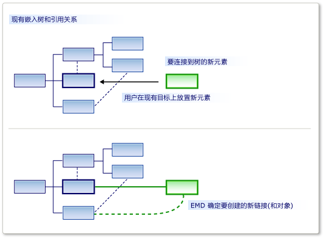

# 自定义元素创建和移动
[!INCLUDE[vs2017banner](../code-quality/includes/vs2017banner.md)]

你可以允许将拖动到另一个字符串，从工具箱中，也可在粘贴或移动操作中的元素。 你可以移动的元素链接到目标元素中，使用你指定的关系。  
  
 一个元素合并指令 (EMD) 指定一个模型元素时，会发生什么情况 *合并* 到另一个模型元素。 发生这种情况时︰  
  
-   用户将从工具箱中拖动到关系图或形状拖动。  
  
-   用户通过使用资源管理器或隔离舱形状中的添加菜单创建一个元素。  
  
-   用户将从一个泳道的项移到另一个。  
  
-   用户将粘贴到一个元素。  
  
-   你的程序代码调用的元素合并指令。  
  
 尽管可能看似创建操作，使其不同于复制操作，它们的实际工作方式相同。 当添加的元素时，例如从工具箱的原型复制。 原型合并到模型中与已复制的模型另一部分中的元素相同的方式。  
  
 EMD 的责任是确定如何对象或组的对象应被合并到模型中的特定位置。 具体而言，它决定应实例化哪些关系，以将合并的组链接到模型。 你还可以自定义设置属性，以及创建其他对象。  
  
   
一个元素合并指令角色  
  
 定义嵌入关系时，将自动生成 EMD。 当用户将新的子实例添加到父，此默认设置 EMD 创建关系的实例。 你可以通过添加自定义代码，例如修改这些默认 EMDs。  
  
 DSL 定义，以使用户可以拖动或粘贴合并和接收类的不同组合中，你还可以添加你自己 EMDs。  
  
## <a name="defining-an-element-merge-directive"></a>定义元素合并指令  
 可以将元素合并指令添加到域类、 域关系、 形状、 连接器和关系图。 你可以添加或接收的域类下 DSL 资源管理器中找到它们。 接收类是元素的已在模型中，和上要合并的新的或复制的元素的域。  
  
   
  
  **索引类** 是可合并到接收的类的成员的元素的域。 索引类的子类的实例将还合并通过此 EMD，除非你设置 **适用于子类** 为 False。  
  
 有两种类型的合并指令︰  
  
-   A **过程合并** 指令指定所依据的新元素应链接到的树的关系。  
  
-   A **转发合并** 指令将新元素重定向到另一个接收元素，通常的父级。  
  
 你可以添加自定义代码，以合并指令︰  
  
-   设置 **使用自定义接受** 添加你自己的代码以确定是否应将索引的元素的特定实例合并到目标元素。 当用户拖动工具箱中时，显示"无效"的指针，是否你的代码将不允许合并。  
  
     例如，你可以仅在接收元素处于特定状态时，才允许合并。  
  
-   设置 **使用自定义合并** 添加提供自己的代码以定义时执行合并对模型所做的更改。  
  
     例如，无法使用其新位置在模型中的数据合并元素中设置属性。  
  
> [!NOTE]
>  如果您编写自定义合并代码，它会影响使用此 EMD 执行的唯一合并。 如果没有合并相同类型的对象，其他 EMDs 或者如果没有其他自定义代码，而无需使用 EMD 创建这些对象，然后它们将不会影响你自定义合并的代码。  
>   
>  如果你想要确保，新元素或新的关系始终由处理自定义代码，请考虑定义 `AddRule` 嵌入关系和 `DeleteRule` 上元素的域类。 有关详细信息，请参阅 [规则传播更改内模型](../modeling/rules-propagate-changes-within-the-model.md)。  
  
## <a name="example-defining-an-emd-without-custom-code"></a>示例︰ 定义 EMD 而无需自定义代码  
 下面的示例允许用户通过从工具箱拖到现有的形状拖动在同一时间创建元素和连接器。 该示例向 DSL 定义添加 EMD。 此修改之前用户可以将拖动工具拖动到关系图，但不是到现有的形状。  
  
 用户还可以粘贴到其他元素的元素。  
  
#### <a name="to-let-users-create-an-element-and-a-connector-at-the-same-time"></a>以允许用户在同一时间创建元素和连接器  
  
1.  通过创建新的 DSL **最小语言** 解决方案模板。  
  
     运行此 DSL 时，它允许你创建形状和形状之间的连接器。 不能将一个新 **ExampleElement** 从工具箱拖到现有的形状的形状。  
  
2.  若要允许用户将元素拖到合并 `ExampleElement` 形状，创建在新 EMD `ExampleElement` 域类︰  
  
    1.  在 **DSL 资源管理器**, ，展开 **域类**。 右键单击 `ExampleElement` ，然后单击 **添加新元素合并指令**。  
  
    2.  请确保 **DSL 详细信息** 窗口已打开，以便你可以看到新 EMD 的详细信息。 (菜单︰ **查看**, ，**其他 Windows**, ，**DSL 详细信息**。)  
  
3.  设置 **索引类** 在 DSL 详细信息窗口中，若要定义哪一类别的元素可以合并到 `ExampleElement` 对象。  
  
     对于此示例中，选择 `ExampleElements`, ，以便用户可以将新元素拖到现有元素。  
  
     请注意索引类将成为 EMD DSL 资源管理器中的名称。  
  
4.  下 **通过创建链接的过程合并**, ，添加两个路径︰  
  
    1.  一个路径将新元素链接到父模型。 你需要输入的路径表达式从现有元素，向上浏览通过嵌入关系到父模型。 最后，它指定要向其分配的新元素的新链接中的角色。 该路径为，如下所示︰  
  
         `ExampleModelHasElements.ExampleModel/!ExampleModel/.Elements`  
  
    2.  另一条路径将新元素链接到现有元素。 路径表达式指定的引用关系和要向其分配的新元素的角色。 此路径为，如下所示︰  
  
         `ExampleElementReferencesTargets.Sources`  
  
     路径导航工具可用于创建每个路径︰  
  
    1.  下 **通过在路径创建链接的过程合并**, ，单击 **\< 将路径添加>**。  
  
    2.  单击右侧的列表项的下拉箭头。 树视图显示。  
  
    3.  展开树，以形成您想要指定的路径中的节点。  
  
5.  测试 DSL:  
  
    1.  按 f5 键以重新生成并运行解决方案。  
  
         重新生成将所需时间比平常长因为生成的代码将从文本模板，以符合新的 DSL 定义更新。  
  
    2.  时的实验实例 [!INCLUDE[vsprvs](../code-quality/includes/vsprvs_md.md)] 已启动，打开 DSL 模型文件。 创建一些示例元素。  
  
    3.  请从拖动 **示例元素** 拖到现有的形状的工具。  
  
         将显示为新形状，并链接到与连接器现有的形状。  
  
    4.  复制现有的形状。 选择另一种形状并粘贴。  
  
         创建第一个形状的副本。  它具有新名称，以及链接到与连接器的第二个形状。  
  
 请注意此过程从以下几点︰  
  
-   通过创建元素合并指令，您可以允许要接受任何其他元素的任何类。 在接收的域类中，创建了 EMD 并接受的域类指定在 **Index 类** 字段。  
  
-   通过定义路径，你可以指定链接应可用于连接到现有模型的新元素。  
  
     你指定的链接应包括一个嵌入的关系。  
  
-   EMD 影响这两种创建从工具箱以及粘贴操作。  
  
     如果您编写创建新元素的自定义代码，可以通过显式调用 EMD `ElementOperations.Merge` 方法。 这将确保你的代码链接到模型新元素其他操作的方式相同。 有关详细信息，请参阅 [自定义复制行为](../modeling/customizing-copy-behavior.md)。  
  
## <a name="example-adding-custom-accept-code-to-an-emd"></a>示例︰ 将接受自定义代码添加到 EMD  
 通过将自定义代码添加到 EMD，你可以定义更复杂的合并行为。 这个简单的示例可防止用户将添加到关系图的多个固定数量的元素。 该示例修改默认 EMD 随附的嵌入的关系。  
  
#### <a name="to-write-custom-accept-code-to-restrict-what-the-user-can-add"></a>编写自定义接受用于限制用户可添加的代码  
  
1.  通过创建 DSL **最小语言** 解决方案模板。 打开 DSL 定义关系图。  
  
2.  DSL 资源管理器，展开 **域类**, ，`ExampleModel`, ，**元素合并指令**。 选择名为的元素合并指令 `ExampleElement`。  
  
     此 EMD 控制用户可以创建新 `ExampleElement` 在模型中，例如通过从工具箱中拖动的对象。  
  
3.  在 **DSL 详细信息** 窗口中，选择 **使用自定义接受**。  
  
4.  重新生成解决方案。 这将需要比平常长，因为生成的代码将从模型进行更新。  
  
     生成错误将报告，类似于:"Company.ElementMergeSample.ExampleElement 未包含定义 CanMergeExampleElement..."  
  
     必须实现的方法 `CanMergeExampleElement`。  
  
5.  创建新的代码文件中 **Dsl** 项目。 替换为以下代码替换其中的内容并将命名空间更改为你的项目的命名空间。  
  
    ```c#  
    using Microsoft.VisualStudio.Modeling;  
  
    namespace Company.ElementMergeSample // EDIT.  
    {  
      partial class ExampleModel  
      {  
        /// <summary>  
        /// Called whenever an ExampleElement is to be merged into this ExampleModel.  
        /// This happens when the user pastes an ExampleElement  
        /// or drags from the toolbox.  
        /// Determines whether the merge is allowed.  
        /// </summary>  
        /// <param name="rootElement">The root element in the merging EGP.</param>  
        /// <param name="elementGroupPrototype">The EGP that the user wants to merge.</param>  
        /// <returns>True if the merge is allowed</returns>  
        private bool CanMergeExampleElement(ProtoElementBase rootElement, ElementGroupPrototype elementGroupPrototype)  
        {  
          // Allow no more than 4 elements to be added:  
          return this.Elements.Count < 4;  
        }  
      }  
    }  
  
    ```  
  
     这个简单的示例将限制可合并到父模型中的元素的数目。 对于更值得关注的条件，该方法可以检查任何属性和在接收对象的链接。 它也可通过检查中携带了合并元素的属性 <xref:Microsoft.VisualStudio.Modeling.ElementGroupPrototype>。 有关详细信息 `ElementGroupPrototypes`, ，请参阅 [自定义复制行为](../modeling/customizing-copy-behavior.md)。 有关如何编写代码，读取模型的详细信息，请参阅 [导航和更新程序代码中的模型](../modeling/navigating-and-updating-a-model-in-program-code.md)。  
  
6.  测试 DSL:  
  
    1.  按 f5 键以重新生成解决方案。 时的实验实例 [!INCLUDE[vsprvs](../code-quality/includes/vsprvs_md.md)] 打开时，打开的 DSL 实例。  
  
    2.  以下几种方式创建新的元素︰  
  
        1.  请从拖动 **示例元素** 拖动到关系图的工具。  
  
        2.  在 **示例模型资源管理器**, ，右键单击根节点，然后单击 **添加新示例元素**。  
  
        3.  复制并粘贴关系图上的元素。  
  
    3.  验证无法使用下列任一方法来将多个四个元素添加到模型。 这是因为它们都使用元素合并指令。  
  
## <a name="example-adding-custom-merge-code-to-an-emd"></a>示例︰ 将自定义合并的代码添加到 EMD  
 在自定义合并代码中，你可以定义在用户拖动一个工具，或粘贴到元素上时，会发生什么情况。 有两种方法来定义自定义合并︰  
  
1.  设置 **使用自定义合并** 并提供所需的代码。 你的代码替换生成的合并代码。 如果你想要完全重新定义合并的用途，请使用此选项。  
  
2.  重写 `MergeRelate` 方法，并选择性地 `MergeDisconnect` 方法。 若要执行此操作，必须设置 **生成 Double 派生** 域类的属性。 你的代码可以调用基类中生成的合并代码。 如果你想要执行合并后执行其他操作，请使用此选项。  
  
 这些方法只会影响合并通过使用此 EMD 执行。 如果你想要影响可在其中创建合并的元素的所有方法，一种替代方法是定义 `AddRule` 嵌入关系和 `DeleteRule` 合并的域类上。 有关详细信息，请参阅 [规则传播更改内模型](../modeling/rules-propagate-changes-within-the-model.md)。  
  
#### <a name="to-override-mergerelate"></a>若要重写 MergeRelate  
  
1.  在 DSL 定义，请确保你已经定义你想要将代码添加的 EMD。 如果你想，你可以将路径添加和定义自定义接受代码，如前面的部分中所述。  
  
2.  在 DslDefinition 图中，选择的合并接收类。 通常它是嵌入关系的源端的类。  
  
     例如，从最小语言解决方案中生成的 DSL，在选择 `ExampleModel`。  
  
3.  在 **属性** 窗口中，设置 **生成 Double 派生** 到 **true**。  
  
4.  重新生成解决方案。  
  
5.  检查的内容 **Dsl\Generated Files\DomainClasses.cs**。 命名方法搜索 `MergeRelate` 并检查其内容。 这将帮助你编写您自己的版本。  
  
6.  在新代码文件中，编写一个分部类，接收的类，并重写 `MergeRelate` 方法。 请记住要调用基方法。 例如：  
  
    ```c#  
    partial class ExampleModel  
    {  
      /// <summary>  
      /// Called when the user drags or pastes an ExampleElement onto the diagram.  
      /// Sets the time of day as the name.  
      /// </summary>  
      /// <param name="sourceElement">Element to be added</param>  
      /// <param name="elementGroup">Elements to be merged</param>  
      protected override void MergeRelate(ModelElement sourceElement, ElementGroup elementGroup)  
      {  
        // Connect the element according to the EMD:  
        base.MergeRelate(sourceElement, elementGroup);  
  
        // Custom actions:   
        ExampleElement mergingElement = sourceElement as ExampleElement;  
        if (mergingElement != null)  
        {  
          mergingElement.Name = DateTime.Now.ToLongTimeString();  
        }  
      }  
    }  
  
    ```  
  
#### <a name="to-write-custom-merge-code"></a>若要编写自定义合并的代码  
  
1.  在 **Dsl\Generated Code\DomainClasses.cs**, ，检查方法名为 `MergeRelate`。 这些方法创建一个新的元素和现有模型之间的链接。  
  
     此外，检查方法名为 `MergeDisconnect`。 这些方法取消链接从模型元素时要删除它。  
  
2.  在 **DSL 资源管理器**, ，选择或创建你想要自定义元素合并指令。 在 **DSL 详细信息** 窗口中，设置 **使用自定义合并**。  
  
     当设置此选项， **过程合并** 和 **转发合并** 选项会被忽略。 改为使用你的代码。  
  
3.  重新生成解决方案。 因为生成的代码文件将更新从模型需要比平常长。  
  
     将显示错误消息。 双击要查看生成的代码中的说明进行操作的错误消息。 这些说明要求你提供两种方法， `MergeRelate`*YourDomainClass* 和 `MergeDisconnect`*YourDomainClass*  
  
4.  编写单独的代码文件中的分部类定义中的方法。 你检查前面的示例应建议你的需要。  
  
 自定义合并代码将不会影响直接创建对象和关系的代码和它将不会影响其他 EMDs。 若要确保无论元素的创建方式实现其他更改，请考虑编写 `AddRule` 和 `DeleteRule` 相反。 有关详细信息，请参阅 [规则传播更改内模型](../modeling/rules-propagate-changes-within-the-model.md)。  
  
## <a name="redirecting-a-merge-operation"></a>重定向合并操作  
 正向合并指令将重定向合并操作的目标。 通常情况下，新的目标是嵌入的初始目标父级。  
  
 例如，在使用组件图模板创建 DSL，端口都嵌入到组件。 端口显示为小组件形状的边缘上的形状。 用户通过将端口工具拖动到组件形状创建端口。 但有时，用户错误地将端口工具拖动到现有的端口，而不是组件，从而导致操作失败。 有几个现有的端口时，这是易犯错误。 若要帮助用户若要避免此干扰，可以允许端口拖动到现有的端口，但具有重定向到父组件的操作。 操作作用就像目标元素是该组件。  
  
 组件模型解决方案中，可以创建向前合并指令。 如果编译并运行原始解决方案时，你应看到用户可以将任意数量的 **输入端口** 或 **输出端口** 元素从 **工具箱** 到 **组件** 元素。 但是，它们不能将一个端口拖到现有的端口。 不可用指针警报它们不支持此移动。 但是，你可以创建向前合并指令，以便端口，是无意中删除在现有 **输入端口** 转发到 **组件** 元素。  
  
#### <a name="to-create-a-forward-merge-directive"></a>若要创建转发合并指令  
  
1.  创建 [!INCLUDE[dsl](../modeling/includes/dsl_md.md)] 解决方案通过使用组件模型模板。  
  
2.  显示 **DSL 资源管理器** 通过打开 DslDefinition.dsl。  
  
3.  在 **DSL 资源管理器**, ，展开 **域类**。  
  
4.   **ComponentPort** 抽象域类是这两者的基类 **InPort** 和 **OutPort**。 右键单击 **ComponentPort** ，然后单击 **添加新元素合并指令**。  
  
     一个新 **元素合并指令** 节点显示在 **元素合并指令** 节点。  
  
5.  选择 **元素合并指令** 节点，然后打开 **DSL 详细信息** 窗口。  
  
6.  在索引类列表中，选择 **ComponentPort**。  
  
7.  选择 **转发到不同的域类合并**。  
  
8.  在路径选择列表中，展开 **ComponentPort**, ，展开 **ComponentHasPorts**, ，然后选择 **组件**。  
  
     新路径应类似于此︰  
  
     **ComponentHasPorts.Component/!Component**  
  
9. 保存该解决方案，然后通过单击最右侧的按钮中转换模板 **解决方案资源管理器** 工具栏。  
  
10. 生成和运行解决方案。 新实例 [!INCLUDE[vsprvs](../code-quality/includes/vsprvs_md.md)] 显示。  
  
11. 在 **解决方案资源管理器**, ，打开 Sample.mydsl。 关系图和 **ComponentLanguage 工具箱** 显示。  
  
12. 拖动 **输入端口** 从 **工具箱** 到另一个 **输入端口。** 接下来，拖动 **OutputPort** 到 **InputPort** ，然后到另一 **OutputPort**。  
  
     你不应看到不可用的指针，并且你应能够删除新 **输入端口** 基于现有。 选择新 **输入端口** 和将其拖到另一个点 **组件**。  
  
## <a name="see-also"></a>请参阅  
 [导航和更新程序代码中的模型](../modeling/navigating-and-updating-a-model-in-program-code.md)   
 [自定义工具和工具箱](../modeling/customizing-tools-and-the-toolbox.md)   
 [线路关系图示例 DSL](http://code.msdn.microsoft.com/Visualization-Modeling-SDK-763778e8)