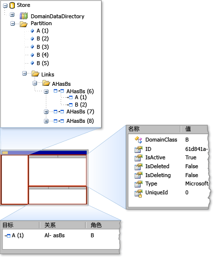

# <a name="debugging-by-using-the-store-viewer"></a>使用存储查看器进行调试
使用存储查看器中，你可以检查的状态*存储*由[!INCLUDE[dsl](../modeling/includes/dsl_md.md)]。 存储查看器显示所有在特定的存储区，以及元素的属性和元素之间的链接中的域模型元素。  
  
## <a name="opening-store-viewer"></a>打开存储区查看器  
 当你位于[!INCLUDE[vsprvs](../code-quality/includes/vsprvs_md.md)]实验性生成，请停止在断点处代码的存储区实例其中包含模型的信息。 然后，通过键入以下命令包含在中打开应用商店查看器**即时**窗口：  
  
```  
Microsoft.VisualStudio.Modeling.Diagnostics.StoreViewer.Show(mystore);  
```  
  
> [!NOTE]
>  必须将`mystore`与存储实例的名称。 此外，如果你将命名空间添加到你的代码时，你可以键入完全限定的命名空间不显示应用商店查看器的命令：  
>   
>  `using Microsoft.VisualStudio.Modeling.Diagnostics;`  
>   
>  `...`  
>   
>  `StoreViewer.Show(mystore);`  
  
 `Show`方法有多个重载。 你可以指定应用商店或分区的实例作为参数。  
  
 作为替代方法，你可以放置的任何位置显示应用商店查看器，代码中的代码行，将传递给参数`Show`方法是在作用域中。 当作为存储的内容的快照执行的代码行时，执行此操作将显示存储查看器。  
  
### <a name="using-store-viewer"></a>使用应用商店查看器  
 当存储查看器打开时，无模式 Windows 窗体将显示一个窗口，如下图所示。  
  
   
应用商店查看器  
  
 应用商店查看器有三个窗格： 右上窗格中，左窗格中，右下方窗格。 左窗格中是树视图中的类型`DomainDataDirectory`存储区的成员。 如果你扩展分区节点并单击一个元素，在右上窗格中会显示元素的属性。 如果该元素已链接到其他元素，右下方窗格中出现的其他元素。 如果双击右下方窗格中的某个元素时，在左窗格中会突出显示元素。  
  
## <a name="see-also"></a>另请参阅  
 [在程序代码中导航和更新模型](../modeling/navigating-and-updating-a-model-in-program-code.md)
