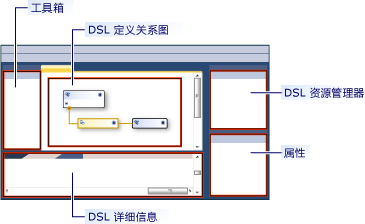
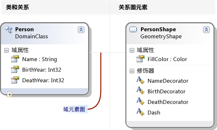
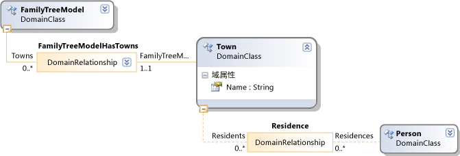
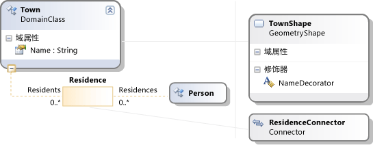

# <a name="getting-started-with-domain-specific-languages"></a>域特定语言入门
本主题介绍在定义和使用 Visual Studio 创建的建模 SDK 的域特定语言 (DSL) 的基本概念。  


[!INCLUDE[modeling_sdk_info](includes/modeling_sdk_info.md)]

  
 如果您是新手 Dsl，我们建议您通读**DSL 工具实验室**，您可在此站点中找到︰[可视化和建模 SDK](http://go.microsoft.com/fwlink/?LinkID=186128)  
  
## <a name="what-can-you-do-with-a-domain-specific-language"></a>使用域特定语言，您可以做什么？  
 域特定语言是一个符号，通常为图形，用于针对特定用途而设计。 与此相反，如 UML 的语言是通用的。 在 DSL 中，可以定义模型元素和它们之间的关系，以及如何在屏幕上显示的类型。  
  
 当设计 DSL 时，可以将其作为 Visual Studio 集成扩展 (VSIX) 包的一部分进行分发。 用户使用的 DSL [!INCLUDE[vsprvs](../code-quality/includes/vsprvs_md.md)]:  
  
   
  
 表示法是只有 DSL 的一部分。 表示法，以及 VSIX 包包括工具，用户可以应用以帮助他们编辑和从其模型生成材料。  
  
 Dsl 的主体应用程序之一是生成程序代码、 配置文件和其他项目。 特别是在大型项目和产品系列，其中将创建几个变体产品，从 Dsl 生成多个可变方面可以提供显著增加在可靠性和快速响应要求更改。  
  
 本概述的其余部分是引入了创建和使用中的域特定语言的基本操作的演练[!INCLUDE[vsprvs](../code-quality/includes/vsprvs_md.md)]。  
  
## <a name="prerequisites"></a>先决条件  
 若要定义 DSL，必须安装以下组件：  
  
|||  
|-|-|  
|[!INCLUDE[vsprvs](../code-quality/includes/vsprvs_md.md)]|[http://go.microsoft.com/fwlink/?LinkId=185579](http://go.microsoft.com/fwlink/?LinkId=185579)|  
|[!INCLUDE[vssdk_current_short](../modeling/includes/vssdk_current_short_md.md)]|[http://go.microsoft.com/fwlink/?LinkId=185580](http://go.microsoft.com/fwlink/?LinkId=185580)|  
|Visual Studio 的建模 SDK||  


[!INCLUDE[modeling_sdk_info](includes/modeling_sdk_info.md)]

  
## <a name="creating-a-dsl-solution"></a>创建 DSL 解决方案  
 若要创建新的域特定语言，您创建一个新[!INCLUDE[vsprvs](../code-quality/includes/vsprvs_md.md)]使用域特定语言项目模板的解决方案。  
  
#### <a name="to-create-a-dsl-solution"></a>创建 DSL 解决方案  
  
1.  在 **“文件”** 菜单上，指向 **“新建”**，然后单击 **“项目”**。  
  
2.  在下**项目类型**，展开**其他项目类型**节点，然后单击**扩展性**。  
  
3.  单击**域特定语言设计器**。  
  
       
  
4.  在**名称**框中，键入**FamilyTree**。 单击“确定”。  
  
     **域特定语言向导**将打开，并显示模板 DSL 解决方案的列表。  
  
     单击每个模板以查看的描述  
  
     模板很有用的起点。 每个提供完成工作 DSL，你可以对其进行编辑以满足您的需要。 通常，您可选择最接近您想要创建的模板。  
  
5.  对于本演练中，选择**最小语言**模板。  
  
6.  在相应的向导页中输入 DSL 的文件扩展名。 这是包含 DSL 的实例的文件将使用的扩展名。  
  
    -   选择一种扩展，与任何应用程序在您的计算机，或想要安装 DSL 的任何计算机都不关联。 例如， **docx**和**htm**将不可接受的文件扩展名。  
  
    -   如果你输入的扩展名已用作 DSL，则该向导将向你发出警告。 请考虑使用不同的文件扩展名。 还可以重置 Visual Studio SDK 实验实例以清除旧的实验设计器。 单击**启动**，请单击**所有程序**， **Microsoft Visual Studio 2010 SDK**，**工具**，然后**重置 Microsoft Visual Studio 2010 实验实例**。  
  
7.  检查其他两个页面，然后单击**完成**。  
  
     一种解决方案将生成包含两个项目。 它们的名称 Dsl 和 DslPackage。 关系图文件，它是打开命名的 DslDefinition.dsl。  
  
    > [!NOTE]
    >  从 DslDefinition.dsl 生成大部分代码，您可以看到两个项目中的文件夹中。 出于此原因，对你的 DSL 的大多数修改都在此文件中。  
  
 用户界面现在类似于下图。  
  
   
  
 此解决方案将定义域特定语言。 有关详细信息，请参阅[域特定语言工具用户界面概述](../modeling/overview-of-the-domain-specific-language-tools-user-interface.md)。  
  
## <a name="the-important-parts-of-the-dsl-solution"></a>DSL 解决方案的重要的部分  
 请注意新的解决方案的以下方面。  
  
-   **Dsl\DslDefinition.dsl**这是您看到创建 DSL 解决方案时的文件。 在解决方案中的几乎所有代码从该文件中，都生成和此处所做的大部分 DSL 定义进行的更改。 有关详细信息，请参阅使用[使用 DSL 定义关系图](../modeling/working-with-the-dsl-definition-diagram.md)。  
  
-   **Dsl 项目**此项目包含用于定义特定于域的语言代码。  
  
-   **DslPackage 项目**此项目包含允许的打开和编辑的 DSL 实例的代码[!INCLUDE[vsprvs](../code-quality/includes/vsprvs_md.md)]。  
  
##  <a name="a-namedebugginga-running-the-dsl"></a><a name="Debugging"></a>运行 DSL  
 一旦您已创建，您可以运行 DSL 解决方案。 更高版本，您可以修改 DSL 定义逐渐，每次更改之后再次运行该解决方案。  
  
#### <a name="to-experiment-with-the-dsl"></a>尝试使用 DSL  
  
1.  单击**转换所有模板**解决方案资源管理器工具栏中。 此时将重新生成大部分来自 DslDefinition.dsl 的源代码。  
  
    > [!NOTE]
    >  只要您更改 DslDefinition.dsl，必须单击**转换所有模板**重新生成解决方案之前。 可以自动化执行此步骤。 有关详细信息，请参阅[如何实现自动化转换所有模板](http://msdn.microsoft.com/en-us/b63cfe20-fe5e-47cc-9506-59b29bca768a)。  
  
2.  按 F5，或在**调试**菜单上，单击**开始调试**。  
  
     DSL 生成并已安装在实验实例中的[!INCLUDE[vsprvs](../code-quality/includes/vsprvs_md.md)]。  
  
     此时将启动 [!INCLUDE[vsprvs](../code-quality/includes/vsprvs_md.md)] 的实验实例。 实验实例中将其设置从单独的子树的注册表中，其中[!INCLUDE[vsprvs](../code-quality/includes/vsprvs_md.md)]出于调试目的注册的扩展。 正常实例[!INCLUDE[vsprvs](../code-quality/includes/vsprvs_md.md)]身边没有那里注册的扩展。  
  
3.  在实验实例中的[!INCLUDE[vsprvs](../code-quality/includes/vsprvs_md.md)]，打开名为的模型文件**测试**从**解决方案资源管理器**。  
  
     \- 或 -  
  
     右键单击的调试项目，指向**添加**，然后单击**项**。 在**添加项**对话框中，选择你的 DSL 的文件类型。  
  
     与空白关系图将打开模型文件。  
  
     工具箱中打开并显示适合于关系图类型的工具。  
  
4.  使用这些工具在关系图上创建形状和连接线。  
  
    1.  若要创建形状，将从示例形状工具拖动到关系图。  
  
    2.  若要连接两个形状，单击示例连接器工具，请单击第一个形状，，然后单击第二个形状。  
  
5.  单击要更改它们的形状的标签。  
  
 实验[!INCLUDE[vsprvs](../code-quality/includes/vsprvs_md.md)]将类似于下面的示例︰  
  
   
  
### <a name="the-content-of-a-model"></a>模型的内容  
 DSL 的实例的文件的内容被称为*模型*。 该模型包含*模型**元素*和*链接*元素之间。 DSL 定义中指定哪些类型的模型元素，并可以存在于模型中的链接。 例如，在从最小语言模板创建 DSL，没有一种类型的模型元素和一种类型的链接。  
  
 DSL 定义中可以指定模型关系图上的显示方式。 您可以从各种形状和连接线的样式选择。 您可以指定某些形状出现在其他形状内。  
  
 您可以在目录树形式查看模型**资源管理器**正在编辑模型时查看。 在形状添加到关系图中，模型元素也显示在资源管理器。 即使没有关系图，可以使用资源管理器。  
  
 如果您不能看到的调试实例中的资源管理器[!INCLUDE[vsprvs](../code-quality/includes/vsprvs_md.md)]，请在**视图**菜单中的指向**其他窗口**，然后单击*\<您语言&1;>* **资源管理器**。  
  
### <a name="the-api-of-your-dsl"></a>你的 DSL 的 API  
 你的 DSL 将生成一个 API，使您可以读取和更新 DSL 实例模型。 一个应用程序的 api 是从模型生成文本文件。 有关详细信息，请参阅[使用 T4 文本模板生成设计时代码](../modeling/design-time-code-generation-by-using-t4-text-templates.md)。  
  
 在调试解决方案中，扩展名为".tt"中打开模板文件。 这些示例演示如何从模型中，生成文本，并允许您测试你的 DSL 的 API。 其中一个示例用编写[!INCLUDE[vbprvb](../code-quality/includes/vbprvb_md.md)]，则在其他[!INCLUDE[csprcs](../data-tools/includes/csprcs_md.md)]。  
  
 在每个模板文件是它所生成的文件。 展开解决方案资源管理器中的模板文件并打开生成的文件。  
  
 模板文件包含简短的一段代码，它列出了在模型中的所有元素。  
  
 生成的文件中包含的结果。  
  
 更改模型文件时，您将看到生成的文件中的相应更改后重新生成文件。  
  
##### <a name="to-regenerate-text-files-after-you-change-the-model-file"></a>若要更改模型文件之后重新生成文本文件  
  
1.  在实验实例中的[!INCLUDE[vsprvs](../code-quality/includes/vsprvs_md.md)]，保存模型文件。  
  
2.  请确保每个.tt 文件中的文件名称参数指用于进行试验的模型文件。 保存.tt 文件。  
  
3.  单击**转换所有模板**的工具栏中的**解决方案资源管理器**。  
  
     \- 或 -  
  
     右键单击你想要重新生成，然后单击模板**运行自定义工具**。  
  
 可以将任意数量的文本模板文件添加到项目。 每个模板都生成一个结果文件。  
  
> [!NOTE]
>  当您更改 DSL 定义时，示例文本模板代码才会生效，您更新。  
  
 有关详细信息，请参阅[来自域特定语言生成代码](../modeling/generating-code-from-a-domain-specific-language.md)和[编写代码以自定义 Domain-specific Language](../modeling/writing-code-to-customise-a-domain-specific-language.md)。  
  
## <a name="customizing-the-dsl"></a>自定义 DSL  
 当您想要修改 DSL 定义中时，关闭实验实例并更新主定义[!INCLUDE[vsprvs](../code-quality/includes/vsprvs_md.md)]实例。  
  
> [!NOTE]
>  已修改 DSL 定义后，您可能会丢失已使用早期版本创建的测试模型中的信息。  例如，调试解决方案包含一个名为示例中，其中包含一些形状和连接线的文件。 开始开发 DSL 定义后，它们将不可见，并保存文件时将丢失。  
  
 各种各样的扩展可使你的 DSL。 下面的示例会让您展示了可能的匹配项。  
  
 每次更改，保存 DSL 定义中之后, 单击**转换所有模板**中**解决方案资源管理器**，然后按**F5**尝试使用已更改的 DSL。  
  
### <a name="rename-the-types-and-tools"></a>重命名类型和工具  
 重命名现有的域类和关系。 例如，从最小语言模板创建的 Dsl 定义开始，您可以执行以下重命名操作，以使表示家族树的 DSL。  
  
##### <a name="to-rename-domain-classes-relationships-and-tools"></a>若要重命名域类、 关系和工具  
  
1.  在 DslDefinition 图中，重命名**ExampleModel**到**FamilyTreeModel**， **ExampleElement**到**人**，**目标**到**父级**，和**源**到**子级**。 您可以单击每个标签以更改它。  
  
       
  
2.  重命名的元素和连接器工具。  
  
    1.  通过在解决方案资源管理器下单击选项卡中打开 DSL 资源管理器窗口中。 如果看不到它，在**视图**菜单中的指向**其他窗口**，然后单击**DSL 资源管理器**。 仅在 DSL 定义关系图是活动窗口时，DSL 资源管理器是可见的。  
  
    2.  打开属性窗口并将其置于，以便可以同时看到 DSL 资源管理器和属性。  
  
    3.  在 DSL 资源管理器中，展开**编辑器**，**工具箱选项卡**， * \<DSL&1;>*，然后**工具**。  
  
    4.  单击**ExampleElement**。 这是用来创建元素的工具箱项。  
  
    5.  在属性窗口中，将更改**名称**属性设置为**人**。  
  
         请注意，**标题**属性也会更改。  
  
    6.  在相同的方式，将名称更改**ExampleConnector**工具到**ParentLink**。 Alter**标题**属性，以便它不是 Name 属性的副本。 例如，输入**父链接**。  
  
3.  重新生成 DSL。  
  
    1.  保存 DSL 定义文件。  
  
    2.  单击**转换所有模板**的工具栏中的解决方案资源管理器  
  
    3.  按 F5。 等到的实验实例[!INCLUDE[vsprvs](../code-quality/includes/vsprvs_md.md)]出现。  
  
4.  中的实验实例中的调试解决方案[!INCLUDE[vsprvs](../code-quality/includes/vsprvs_md.md)]，打开测试模型文件。 从工具箱中拖放到它上面的元素。 请注意，工具标题和 DSL 资源管理器中的类型名称已更改。  
  
5.  保存模型文件。  
  
6.  打开一个.tt 文件和旧类型和属性名称的匹配项替换为新名称。  
  
7.  请确保在.tt 文件中指定的文件名指定测试模型。  
  
8.  保存.tt 文件。 打开生成的文件以查看运行.tt 文件中的代码的结果。 验证正确。  
  
### <a name="add-domain-properties-to-classes"></a>将域属性添加到类  
 将属性添加到域类，例如要表示的年数出生和死亡的人员。  
  
 若要使新的属性关系图上可见，必须添加*修饰器*为显示模型元素的形状。 此外必须将属性映射到修饰器。  
  
##### <a name="to-add-properties-and-display-them"></a>若要添加属性，并将其显示  
  
1.  添加属性。  
  
    1.  在 DSL 定义关系图中，右键单击**人**域类中，依次指向**添加**，然后单击**域属性**。  
  
    2.  键入新的属性名称的列表，如**出生**和**死亡**。 按**Enter**后每个。  
  
2.  添加将在形状中显示的属性的修饰器。  
  
    1.  按照从 Person 域类扩展到关系图的另一端的灰色线条。 这是关系图元素映射。 它链接到形状类的域类。  
  
    2.  右键单击该形状类，指向**添加**，然后单击**文本修饰器**。  
  
    3.  添加两个修饰器名称，例如**BirthDecorator**和**DeathDecorator**。  
  
    4.  选择每个新的修饰器，并在属性窗口中设置**位置**字段。 这可确定将在形状中显示域属性值。 例如，设置**InnerBottomLeft**和**InnerBottomRight**。  
  
           
  
3.  修饰器映射到的属性。  
  
    1.  打开 DSL 详细信息窗口中。 它通常是输出窗口的旁边的选项卡中。 如果看不到它，在**视图**菜单上，指向**其他窗口**，然后单击**DSL 详细信息**。  
  
    2.  在 DSL 定义关系图中，单击连接的连线**人**到 shape 类的域类。  
  
    3.  在**DSL 详细信息**，请在**修饰器映射**选项卡上，单击上未映射的修饰器的复选框。 在**显示属性**，选择所需其映射的域属性。 例如，映射**BirthDecorator**到**出生**。  
  
4.  保存 DSL，单击转换所有模板并按 F5。  
  
5.  在示例模型关系图中，验证，现在可以单击您选择的位置并向其中键入值。 此外，选择**人**形状，属性窗口将显示新的属性出生和死亡。  
  
6.  在.tt 文件中，您可以添加代码来获取每个 person 的属性。  
  
   
  
### <a name="define-new-classes"></a>定义新类  
 可以向模型添加域类和关系。 例如，您可以创建一个新类来表示城镇和一个新的关系来表示某个人居住在城镇。  
  
 若要在模型关系图上，使不同的类型不同，可以对不同类型的形状，或使用不同的几何图形和颜色的形状映射的域类。  
  
##### <a name="to-add-and-display-a-new-domain-class"></a>可以添加和显示新的域类  
  
1.  添加域类，并使其成为子模型根。  
  
    1.  在 DSL 定义关系图中，单击**嵌入关系**工具中，单击根类**FamilyTreeModel**，然后单击关系图的空白部分中。  
  
         新的域类将出现，连接到具有嵌入关系 FamilyTreeModel。  
  
         设置其名称，例如**城镇**。  
  
        > [!NOTE]
        >  除了根模型的每个域类必须是至少一个嵌入关系的目标，或者它必须从目标的一个嵌入的类继承。 出于此原因，是经常很方便地使用嵌入关系工具创建域类。  
  
    2.  将域属性添加到新类，例如**名称**。  
  
2.  添加 Person 和城市之间的引用关系。  
  
    1.  单击**引用关系**工具、 单击人员，然后单击闪亮登场。  
  
           
  
        > [!NOTE]
        >  引用关系表示从模型树的一部分到另一部分的交叉引用。  
  
3.  添加形状以表示城镇模型关系图上。  
  
    1.  拖动**几何形状**从工具箱拖到关系图和其重命名，例如**TownShape**。  
  
    2.  在属性窗口中，将设置新的形状，如填充颜色和 Geometry 的外观字段。  
  
    3.  添加修饰器来显示，标语在城镇的名称，并将其重命名 NameDecorator。 设置其位置属性。  
  
4.  映射到 TownShape 城镇域类。  
  
    1.  单击**关系图元素映射**工具，然后单击城镇域类中，然后 TownShape 形状类。  
  
    2.  在**修饰器映射**的选项卡上**DSL 详细信息**选定窗口与地图连接器、 检查 NameDecorator 并设置**显示属性**为名称。  
  
5.  创建连接器，以显示 Person 和城镇之间的关系。  
  
    1.  将连接线从工具箱拖到关系图。 将其重命名并设置其外观属性。  
  
    2.  使用**关系图元素映射**工具以将新连接符链接到 Person 和城市之间的关系。  
  
           
  
6.  创建一种元素工具使新建闪亮登场。  
  
    1.  在**DSL 资源管理器**，展开**编辑器**然后**工具箱选项卡**。  
  
    2.  用鼠标右键单击* \<DSL&1;>* ，然后单击**添加新元素工具**。  
  
    3.  设置**名称**属性的新工具，并设置其**类**城镇的属性。  
  
    4.  设置**工具箱图标**属性。 Click **[...]**并在**文件名**字段中，选择一个图标文件。  
  
7.  创建连接符工具使城镇与人之间的链接。  
  
    1.  用鼠标右键单击* \<DSL&1;>* ，然后单击**添加新的连接器工具**。  
  
    2.  设置新的工具的 Name 属性。  
  
    3.  在**ConnectionBuilder**属性中，选择包含 Person-town 关系的名称生成器。  
  
    4.  设置**工具箱图标**。  
  
8.  保存 DSL 定义，请单击**转换所有模板**，然后按**F5**。  
  
9. 在实验实例中的[!INCLUDE[vsprvs](../code-quality/includes/vsprvs_md.md)]，打开测试模型文件。 使用新工具来创建城镇和城镇和人员之间的链接。 请注意，您可以只创建正确类型的元素之间的链接。  
  
10. 创建代码，其中列出了在其中的每个人居住的标语在城镇。 文本模板是一种可以运行此类代码的位置的位置。 例如，可以修改调试解决方案中的现有 Sample.tt 文件，以使其包含以下代码︰  
  
    ```  
    <#@ template inherits="Microsoft.VisualStudio.TextTemplating.VSHost.ModelingTextTransformation" debug="true" #>  
    <#@ output extension=".txt" #>  
    <#@ FamilyTree processor="FamilyTreeDirectiveProcessor" requires="fileName='Sample.ftree'" #>  
  
    <#  
      foreach (Person person in this.FamilyTreeModel.People)  
      {  
    #>  
        <#= person.Name #><#if (person.Town != null) {#> of <#= person.Town.Name #> <#}#>  
  
    <#  
          foreach (Person child in person.Children)  
      {  
    #>  
                <#= child.Name #>  
    <#  
      }  
      }  
    #>  
  
    ```  
  
     当您保存 *.tt 文件时，它将创建一个附属文件，其中包含的人员和其派驻服务的列表。 有关详细信息，请参阅[从域特定语言生成代码](../modeling/generating-code-from-a-domain-specific-language.md)。  
  
## <a name="validation-and-commands"></a>验证和命令  
 您可以通过添加验证约束来开发此 DSL 进一步。 这些约束是您可以定义，请确保该模型处于正确状态的方法。 例如，您可以孩子的出生日期晚于其父项的定义一个约束以确保。 如果 DSL 用户尝试保存中断的任何约束的模型，验证功能将显示一个警告。 有关详细信息，请参阅[域特定语言中的验证](../modeling/validation-in-a-domain-specific-language.md)。  
  
 您还可以定义用户可以调用的菜单命令。 命令可以修改模型。 此外可以与中的其他模型进行交互它们[!INCLUDE[vsprvs](../code-quality/includes/vsprvs_md.md)]和外部资源。 有关详细信息，请参阅[如何︰ 修改标准的菜单命令](../modeling/how-to-modify-a-standard-menu-command-in-a-domain-specific-language.md)。  
  
## <a name="deploying-the-dsl"></a>部署 DSL  
 若要允许其他用户使用域特定语言，您将分发[!INCLUDE[vsprvs](../code-quality/includes/vsprvs_md.md)]扩展 (VSIX) 文件。 生成 DSL 解决方案时，这被创建。  
  
 您的解决方案的 bin 文件夹中找到的.vsix 文件。 将其复制到您想要将其安装的计算机。 在该计算机上双击该 VSIX 文件。 可以在所有情况下的使用 DSL[!INCLUDE[vsprvs](../code-quality/includes/vsprvs_md.md)]在该计算机上。  
  
 可以使用相同的过程可以在您自己的计算机上安装 DSL，这样，不需要使用的实验实例[!INCLUDE[vsprvs](../code-quality/includes/vsprvs_md.md)]。  
  
 有关详细信息，请参阅[部署域特定语言解决方案](../modeling/deploying-domain-specific-language-solutions.md)。  
  
##  <a name="a-namereseta-removing-old-experimental-dsls"></a><a name="Reset"></a>删除旧的实验性 Dsl  
 如果您创建了实验 Dsl，您不再希望，您可以从您的计算机通过删除重置[!INCLUDE[vsprvs](../code-quality/includes/vsprvs_md.md)]实验实例。  
  
 这将从计算机中删除所有实验 Dsl 和其他实验[!INCLUDE[vsprvs](../code-quality/includes/vsprvs_md.md)]扩展。 这些是在调试模式下执行的扩展。  
  
 此过程不会删除 Dsl 或其他[!INCLUDE[vsprvs](../code-quality/includes/vsprvs_md.md)]已经通过执行 VSIX 文件的完全安装的扩展。  
  
#### <a name="to-reset-the-visual-studio-experimental-instance"></a>若要重置 Visual Studio 实验实例  
  
1.  单击**启动**，请单击**所有程序**， **Microsoft Visual Studio 2010 SDK**，**工具**，然后**重置 Microsoft Visual Studio 2010 实验实例**。  
  
2.  重新生成任何实验 Dsl 或其他实验[!INCLUDE[vsprvs](../code-quality/includes/vsprvs_md.md)]您仍想要使用的扩展。  
  
## <a name="see-also"></a>另请参阅  
 [了解模型、 类和关系](../modeling/understanding-models-classes-and-relationships.md)   
 [如何定义域特定语言](../modeling/how-to-define-a-domain-specific-language.md)   

[!INCLUDE[modeling_sdk_info](includes/modeling_sdk_info.md)]


