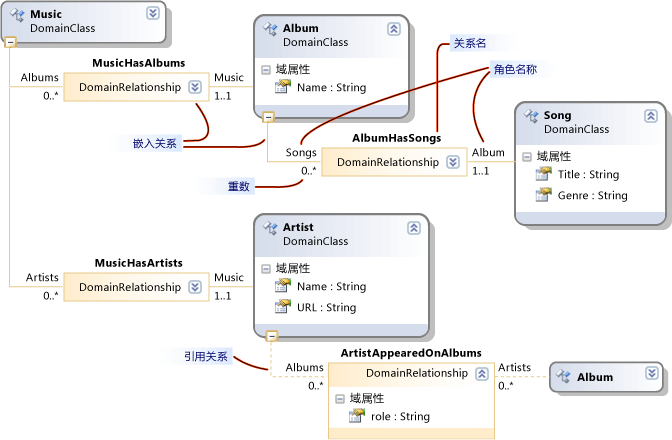
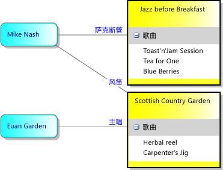
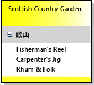

# 如何定义域特定语言
若要定义域特定语言 (DSL)，请从模板创建 [!INCLUDE[vsprvs](../code-quality/includes/vsprvs_md.md)] 解决方案。 解决方案的重要组成部分是 DSL 定义关系图，它存储在 DslDefinition.dsl 中。 DSL 定义将定义 DSL 的类和形状。 在进行修改并将所做修改添加到这些元素后，可以添加程序代码以更详细地自定义 DSL。  
  
 如果你不熟悉 Dsl，我们建议你通读**DSL 工具实验室**，你可以在此站点中查找： [Visualizaton 和建模 SDK](http://go.microsoft.com/fwlink/?LinkID=186128)  

[!INCLUDE[modeling_sdk_info](includes/modeling_sdk_info.md)]

  
##  选择模板解决方案  
 若要定义 DSL，必须安装以下组件：  
  
|||  
|-|-|  
|[!INCLUDE[vsprvs](../code-quality/includes/vsprvs_md.md)]|[http://go.microsoft.com/fwlink/?LinkId=185579](http://go.microsoft.com/fwlink/?LinkId=185579)|  
|[!INCLUDE[vssdk_current_short](../modeling/includes/vssdk_current_short_md.md)]|[http://go.microsoft.com/fwlink/?LinkId=185580](http://go.microsoft.com/fwlink/?LinkId=185580)|  
|Visual Studio 可视化和建模 SDK||  

[!INCLUDE[modeling_sdk_info](includes/modeling_sdk_info.md)]

  
 若要创建新的域特定语言，请使用域特定语言项目模板创建新的 [!INCLUDE[vsprvs](../code-quality/includes/vsprvs_md.md)] 解决方案。  
  
#### 创建 DSL 解决方案  
  
1.  创建与解决方案**域特定语言**模板，可以下找到**其他项目类型/扩展性**中**新项目**对话框。  
  
       
  
     当你单击**确定**、**域特定语言向导**将打开并显示模板 DSL 解决方案的列表。  
  
2.  单击每个模板以查看说明。 选择最近似你想要创建的解决方案。  
  
     每个 DSL 模板都将定义一种基本工作 DSL。 你将编辑此 DSL 来符合你自己的要求。  
  
     单击每个示例以获取详细信息。  
  
    -   选择**任务流**创建具有泳道的 DSL。 泳道是关系图的垂直或水平分区。  
  
    -   选择**组件模型**创建 DSL，它具有端口。 端口是较大形状边缘上的较小形状。  
  
    -   选择**类关系图**定义 DSL 具有隔离舱形状。 隔离舱形状包含项列表。  
  
    -   选择**最小语言**在其他情况下，或如果你不确定。  
  
    -   选择**最小 WinForm 设计器**或**最小的 WPF 设计器**创建 Windows 窗体或 WPF 面将显示 DSL。 必须编写代码，才能定义编辑器。 有关详细信息，请参阅下列主题：  
  
         [创建基于 Windows 窗体的域特定语言](../modeling/creating-a-windows-forms-based-domain-specific-language.md)  
  
         [创建基于 WPF 的域特定语言](../modeling/creating-a-wpf-based-domain-specific-language.md)  
  
3.  在相应的向导页中输入 DSL 的文件扩展名。 这是包含 DSL 的实例的文件将使用的扩展名。  
  
    -   选择不与你的计算机（或想要在其中安装 DSL 的任何计算机）中的任何应用程序关联的文件扩展名。 例如， **docx**和**htm**是不可接受的文件扩展名。  
  
    -   如果你输入的扩展名已用作 DSL，则该向导将向你发出警告。 请考虑使用不同的文件扩展名。 还可以重置 Visual Studio SDK 实验实例以清除旧的实验设计器。 单击**启动**，单击**所有程序**， **Microsoft Visual Studio 2010 SDK**，**工具**，，然后**重置 MicrosoftVisual Studio 2010 实验实例**。  
  
4.  可以调整其他页面上的设置，或保留默认值。  
  
5.  单击 **“完成”**。  
  
     该向导将创建包含两个或三个项目的解决方案，并从 DSL 定义生成代码。  
  
 用户界面现在类似于下图。  
  
   
  
 此解决方案将定义域特定语言。 有关详细信息，请参阅[的域特定语言工具用户界面概述](../modeling/overview-of-the-domain-specific-language-tools-user-interface.md)。  
  
### 测试解决方案  
 模板解决方案提供了一个工作 DSL，你可以对其进行修改或按原样使用。  
  
 若要测试解决方案，请按 F5 或 CTRL+F5。 一个新的 [!INCLUDE[vsprvs](../code-quality/includes/vsprvs_md.md)] 实例将以实验模式打开。  
  
 在新的 [!INCLUDE[vsprvs](../code-quality/includes/vsprvs_md.md)] 实例中，在“解决方案资源管理器”中，打开“Sample”文件。 它将打开为关系图，并带有一个工具箱。  
  
 如果运行的解决方案具有从创建**最小语言**模板，你实验[!INCLUDE[vsprvs](../code-quality/includes/vsprvs_md.md)]将类似于下面的示例：  
  
   
  
 试验这些工具。 创建元素并连接它们。  
  
 关闭 [!INCLUDE[vsprvs](../code-quality/includes/vsprvs_md.md)] 的实验实例。  
  
> [!NOTE]
>  已修改 DSL 后，你将不再能够查看“Sample”测试文件上的形状。 但是，将能够创建新元素。  
  
### 修改模板 DSL  
 重命名并保留模板 DSL 定义中的某些或全部域类和形状类。 新的类名应为有效的 CLR 名称，不带有空格或标点。  
  
 它在保留以下类时将尤其有用：  
  
-   根类下将出现在左上方 DSL 定义关系图中，**类和关系**。 将它重命名为与 DSL 不同的名称。 例如，名为 DSL **MusicLibrary**可能具有一个名为的根类**音乐**。  
  
-   在关系图类的 DSL 定义关系图中，较低的右侧会显示**图表元素**列。 可能必须滚动到右侧才能看到它。 通常命名为*YourDsl***图**。  
  
-   如果你使用**任务流**模板，并且想要创建具有泳道的关系图、 保留和重命名的 Actor 域类和 ActorSwimlane 形状。  
  
 删除或重命名其他类以满足你的要求。  
  
##  用于定义 DSL 模式  
 建议通过一次添加或调整一个或两个功能来开发 DSL。 添加功能、运行 DSL 并对其进行测试，然后再多添加一个或两个功能。 你的 DSL 的典型功能可能是：  
  
-   域类、将元素连接到模型的嵌入关系、在关系图上显示该类的元素所需的形状，以及允许用户创建元素的元素工具。  
  
-   域类的域属性和在形状上显示它们的修饰器。  
  
-   引用关系和在关系图上显示它的连接符，以及允许用户创建链接的连接符工具。  
  
-   需要程序代码的自定义，例如验证约束或菜单命令。  
  
 以下部分将介绍如何构造几种最有用的 DSL 功能。 存在许多可以用来构造 DSL 的其他模式，但这些模式是最常用的。  
  
> [!NOTE]
>  在添加一项功能之后, 不要忘记单击**转换所有模板**之前你的解决方案资源管理器工具栏中生成并运行 DSL。  
  
 下图显示了用作本主题中的示例的 DSL 的类和关系部分。  
  
   
  
 下图是此 DSL 的示例模型：  
  
   
  
> [!NOTE]
>  “模型”是指用户创建的 DSL 的实例，并且通常显示为关系图。 本主题讨论了 DSL 定义关系图和在使用 DSL 时显示的模型关系图。  
  
##  定义域类  
 域类表示 DSL 的概念。 两个实例*模型元素*。 例如在**MusicLibrary** DSL 可具有名为的域类**唱片集**和**首歌曲**。  
  
 若要创建域类时，可以将从**名为域类**到关系图中，工具，然后将类重命名。  
  
 有关详细信息，请参阅[属性的域类](../modeling/properties-of-domain-classes.md)。  
  
### 为每个域类创建嵌入关系  
 每个域类（根类除外）都必须至少是一个嵌入关系的目标，或必须继承自作为嵌入关系目标的类。  
  
 在模型中，每个模型元素都是嵌入关系的单个树中的节点。 嵌入关系的源和目标通常称为父级和子级。  
  
 域类的父级的选择取决于你希望其元素的生存期如何取决于其他元素。 如果删除树的节点，则通常也将删除其子树。 因此，独立存在的元素的类将直接嵌入在根类下。  
  
 通常，如果将一个元素显示在另一个元素内，则你希望指示所有者关系。 在这种情况下，最合适的父类是容器的类。 当你在容器内看到的项实际只是指向独立元素的引用链接时除外。 在这种情况下，删除容器将删除引用但不删除其目标。  
  
 在本主题所述的 DSL 定义的模式中，将假设当删除容器时也将删除显示在容器内的元素。 可以使用更为复杂的架构，并且可以通过定义规则来实现这些架构。  
  
|元素的显示方式|父（嵌入）类|DSL 解决方案模板中的示例|  
|------------------------------|--------------------------------|--------------------------------------|  
|关系图上的形状。   泳道。|DSL 的根类。|最小语言。   任务流：Actor 类。|  
|泳道中的形状。|显示为泳道的元素的域类。|任务流：Task 类。|  
|形状中的列表中的项，其中项会随着容器的删除被一并删除。   形状边缘上的端口。|映射到容器形状的域类。|类图：Attribute 类。   组件图：Port 类。|  
|列表中的项，删除容器时并不会删除项。|DSL 的根类。   该列表将显示引用链接。||  
|不直接显示。|由类作为一部分所组成的类。||  
  
 在“音乐库”示例中，Album 将显示为在其中列出 Song 的标题的矩形。 因此，Album 的父级是根类 Music，而 Song 的父级是 Album。  
  
 若要创建域类和其嵌入在同一时间，请单击**嵌入关系**工具，然后单击的父类、，然后单击图的空白部分。  
  
 通常不必调整嵌入关系及其角色的名称，因为它们将自动跟踪类名。  
  
 有关详细信息，请参阅[属性的域关系](../modeling/properties-of-domain-relationships.md)和[域角色的属性](../modeling/properties-of-domain-roles.md)。  
  
> [!NOTE]
>  嵌入与继承不同。 嵌入关系中的子级不会从其父级继承功能。  
  
### 将域属性添加到每个域类  
 域属性存储值。 示例为：Name、Title、Publication Date。  
  
 单击**域属性**在类中，按 ENTER 键，然后键入属性的名称。 域属性的默认类型是 String。 如果你想要更改的类型，选择域属性，并设置**类型**中**属性**窗口。 如果你想要的类型不在下拉列表中，请参阅[添加属性类型](#addTypes)。  
  
 **将元素名称属性的设置。** 选择一个域属性，用于标识的语言资源管理器中的元素。 例如，在 Song 域类中可以选择 Title 域属性。 在**属性**窗口中，设置**是元素名称**到`true`。  
  
### 创建派生的域类  
 如果希望域类具有继承其属性和关系的变量，则创建从它派生的类。 例如，Album 可能具有派生类 WMA 和 MP3。  
  
 创建派生的类使用**域类**工具。  
  
 单击**继承**工具，单击派生的类，然后单击的基类。  
  
 请考虑设置**继承修饰符**的到基类**抽象**。 如果你认为可能需要基类的实例，则请考虑为它们创建单独的派生类。  
  
 派生类继承其基类的属性和角色。  
  
### 整理 DSL 定义关系图  
 在添加关系时，某些类将显示在多个地方。 要减少出现次数和使更宽的图表，右键单击一种关系，目标类，然后单击**此处使树**。 对于相反的效果，右键单击目标类的关系，然后单击**拆分树**。 如果未看见这些菜单命令，则确保只选中域类。  
  
 使用 CTRL+Up 和 CTRL+Down 来移动域类和形状类。  
  
### 测试域类  
  
##### 测试新的域类  
  
1.  **单击转换所有模板**的工具栏中的解决方案资源管理器，生成的 DSL 设计器代码。 可以自动化执行此步骤。 有关详细信息，请参阅[如何自动转换所有模板](http://msdn.microsoft.com/en-us/b63cfe20-fe5e-47cc-9506-59b29bca768a)。  
  
2.  **生成并运行 DSL。** 按 F5 或 CTRL + F5 运行的新实例[!INCLUDE[vsprvs](../code-quality/includes/vsprvs_md.md)]在实验模式下。 在 [!INCLUDE[vsprvs](../code-quality/includes/vsprvs_md.md)] 的实验实例中，打开或创建具有 DSL 的文件扩展名的文件。  
  
3.  **打开资源管理器。** 在关系图的一端是语言资源管理器窗口中，通常名为*YourLanguage*资源管理器。 如果未看见此窗口，则它可能位于“解决方案资源管理器”下方的选项卡上。 如果找不到它，在**视图**菜单上，指向**其他窗口**，然后单击*YourLanguage***资源管理器**。  
  
     资源管理器将呈现模型的树视图。  
  
4.  **创建新的元素。** 右键单击顶部的根节点，然后单击**添加新***YourClass*。  
  
     类的新实例显示在语言资源管理器中。  
  
5.  在创建新实例时验证每个实例是否都具有不同名称。 发生此情况仅当你设置**是元素名称**域属性的标志。  
  
6.  **检查域属性。与选择，在类的实例**检查属性窗口。 它应显示在此域类上定义的域属性。  
  
7.  **保存该文件，请关闭它，并重新打开它**。 在展开节点后，你创建的所有实例都应在资源管理器中可见。  
  
##  关系图上定义形状  
 可以将显示在关系图上的元素的类定义为矩形、椭圆或图标。  
  
#### 定义显示为关系图上的形状的元素的类  
  
1.  **定义和中所述测试的域类**[定义域类](#classes) **。**   
  
    -   该类的父级应为根类。 即根类和新域类之间应存在嵌入关系。  
  
    -   如果关系图具有泳道，则父级可以是映射到泳道的域类。 在继续之前使用此过程，请参阅[定义具有泳道的 DSL](#swimlanes)。  
  
2.  **添加形状类**来表示模型关系图上的元素。 从以下工具之一拖到 DSL 定义关系图上：  
  
    -   **几何形状**提供矩形或椭圆。  
  
    -   **图像形状**显示你提供的映像。  
  
    -   **隔离舱形状**是一个矩形，包含的项的一个或多个列表。  
  
     重命名形状类，它将显示在“形状”和“连接符”下的 DSL 定义关系图的右侧。  
  
3.  **定义一个映像，如果你创建映像形状**。  
  
    1.  创建任意大小的图像文件。 支持 BMP、JPEG、GIF 和 EMF 格式。  
  
    2.  在“解决方案资源管理”中，将文件添加到 Dsl\Resources 下的解决方案。  
  
    3.  返回到 DSL 定义关系图，然后选择新的图像形状类。  
  
    4.  在属性窗口中，单击**映像**属性。  
  
    5.  在**选择映像**对话框框中，单击下的下拉列表菜单**文件名**，选择的映像。  
  
4.  **将文本修饰器添加到形状，以显示域属性。**  
  
     若要显示模型元素的名称或标题，将可能需要至少一个文本修饰器。  
  
     右击形状类的标头，指向**添加**，然后单击**文本修饰器**。 设置名称的修饰器，并在属性窗口设置其**位置**。  
  
5.  **使用关系图元素映射到它应该会显示的域类连接每个形状**。  
  
     单击**关系图元素映射**工具，然后单击域类中，然后单击形状类。  
  
6.  **将属性映射到文本修饰器。**  
  
    1.  选中域类和形状类之间表示关系图元素映射的灰色线。  
  
    2.  在**DSL 详细信息**窗口中，单击**修饰器地图**选项卡。如果看不到**DSL 详细信息**窗口，请在**视图**菜单上，指向**其他窗口**，然后单击**DSL 详细信息**。 通常需要提升此窗口的顶部以查看它的所有内容。  
  
    3.  选择修饰器的名称。 下**显示属性**，选择域类的属性的名称。 为每个修饰器重复此过程。  
  
         如果你想要显示的一个相关的元素的属性，请单击下的下拉列表树导航器**路径以显示属性**。  
  
    4.  确保复选标记出现在每个修饰器名称旁边。  
  
       
  
7.  **请创建的域类的元素的工具箱项。**  
  
    1.  在**DSL 资源管理器**，展开**编辑器**节点及其所有子节点。  
  
    2.  右键单击下的节点**工具箱选项卡**具有与 DSL，例如 MusicLibrary 相同的名称。 单击**添加元素工具**。  
  
        > [!NOTE]
        >  如果你右键单击**工具**节点，你将看不到**添加元素工具**。 应改为单击其上方的节点。  
  
    3.  在新的元素工具处于选定状态的属性窗口中，设置**类**与你最近添加了域类。  
  
    4.  设置**标题**和**工具提示**。  
  
    5.  设置**工具箱图标**图标将出现在工具箱。 可以将它设置为新图标或已用于其他工具的图标。  
  
         若要创建新的图标，打开在 Dsl\Resources**解决方案资源管理器**。 复制并粘贴现有元素工具 BMP 文件之一。 重命名粘贴的副本，然后双击以对其进行编辑。  
  
         返回到 DSL 定义关系图，选择工具，然后在属性窗口中单击**[…]**中**工具箱图标**。 在**选择位图**对话框中，选择你。从下拉列表菜单 BMP 文件。  
  
 有关详细信息，请参阅[几何形状属性](../modeling/properties-of-geometry-shapes.md)和[映像形状属性](../modeling/properties-of-image-shapes.md)。  
  
#### 测试形状  
  
1.  **单击转换所有模板**的工具栏中的解决方案资源管理器，生成的 DSL 设计器代码。  
  
2.  **生成并运行 DSL。** 按 F5 或 CTRL + F5 运行的新实例[!INCLUDE[vsprvs](../code-quality/includes/vsprvs_md.md)]在实验模式下。 在 [!INCLUDE[vsprvs](../code-quality/includes/vsprvs_md.md)] 的实验实例中，打开或创建具有 DSL 的文件扩展名的文件。  
  
3.  **验证元素工具显示在工具箱。**  
  
4.  **创建形状**通过拖动从拖动到模型图的工具。  
  
5.  **验证是否每个文本修饰器出现**并且：  
  
    1.  你可以编辑它，除非已将设置**只是 UI 读取**上的 domain 属性的标志。  
  
    2.  当在“属性”窗口或在修饰器中编辑属性时，将更新其他视图。  
  
 在首次测试形状后，你可能想要调整它的某些属性并添加一些更高级的功能。 有关详细信息，请参阅[自定义和扩展的域特定语言](../modeling/customizing-and-extending-a-domain-specific-language.md)。  
  
##  定义引用关系  
 可以在任何源域类和任何目标域类之间定义引用关系。 引用关系通常在关系图上显示为连接符，它们是形状之间的线条。  
  
 例如，如果音乐 Album 和 Artist 在关系图上显示为形状，则可以定义名为 ArtistsAppearedOnAlbums 的关系，该关系可将 Artist 链接到所参与的 Album。 请参阅图中的示例。  
  
   
  
 引用关系还可以链接相同类型的元素。 例如，在表示家族树的 DSL 中，父级及其子级之间的关系是从 Person 到 Person 的关系。  
  
### 定义引用关系  
 单击“引用关系”工具、单击该关系的源域类，然后单击目标域类。 目标类可以与源类相同。  
  
 每个关系具有两个角色，这些角色由关系框两侧上的线条表示。 可以选择每个角色并在“属性”窗口中设置其属性。  
  
 **请考虑重命名角色**。 例如，在 Person 和 Person 之间的关系中，你可能想要将默认名称更改为 Parents 和 Children、Manager 和 Subordinates、Teacher 和 Student 等等。  
  
 **调整每个角色的多重性**，如有必要。 如果希望每个 Person 最多只有一个 Manager，则将显示在关系图上的 Manager 标签下的重数设置为 0..1。  
  
 **将域属性添加到关系。** 在图中，艺术家唱片集关系具有角色的属性。  
  
 **设置的关系，允许复制属性**如果同一个类的多个链接的模型元素相同的对之间只能存在。 例如，可以允许 Teacher 向相同的 Student 教授多个 Subject。  
  
   
  
 有关详细信息，请参阅[属性的域关系](../modeling/properties-of-domain-relationships.md)和[域角色的属性](../modeling/properties-of-domain-roles.md)。  
  
### 定义连接符以显示关系  
 连接符将在模型关系图上的两个形状之间显示一个线条。  
  
 拖动**连接器**拖至 DSL 定义关系图的工具。  
  
 如果想要在连接符上显示标签，则添加文本修饰器。 设置其位置。 若要让用户移动文本修饰器，设置其**是可移动**属性。  
  
 使用**关系图元素映射**工具将连接器链接到的引用关系。  
  
 使用所选的关系图元素映射中，打开**DSL 详细信息**窗口中，并打开**修饰器地图**选项卡。  
  
 选择每个**修饰器**并设置**显示属性**到正确的域属性。  
  
 请确保在每个项旁边显示一个复选标记**修饰符**列表。  
  
### 定义“连接生成器”工具  
 在**DSL 资源管理器**窗口中，展开**编辑器**节点及其所有子节点。  
  
 右键单击具有与 DSL，相同的名称的节点，然后单击**添加新连接工具**。  
  
 在新工具处于选中状态的同时，请在“属性”窗口中执行以下操作：  
  
-   设置**标题**和**工具提示**。  
  
-   单击**连接生成器**并选择新的关系的适当生成器。  
  
-   设置**工具箱图标**你想要在工具箱中显示的图标。 可以将它设置为新图标或已用于其他工具的图标。  
  
     若要创建新的图标，打开在 Dsl\Resources**解决方案资源管理器**。 复制并粘贴现有元素工具 BMP 文件之一。 重命名粘贴的副本，然后双击以对其进行编辑。  
  
     返回到 DSL 定义关系图，选择工具，然后在属性窗口中单击**[…]**中**工具箱图标**。 在**选择位图**对话框中，选择你。从下拉列表菜单 BMP 文件。  
  
##### 测试引用关系和连接符  
  
1.  **单击转换所有模板**的工具栏中的解决方案资源管理器，生成的 DSL 设计器代码。  
  
2.  **生成并运行 DSL。** 按 F5 或 CTRL + F5 运行的新实例[!INCLUDE[vsprvs](../code-quality/includes/vsprvs_md.md)]在实验模式下。 在 [!INCLUDE[vsprvs](../code-quality/includes/vsprvs_md.md)] 的实验实例中，打开或创建具有 DSL 的文件扩展名的文件。  
  
3.  **验证连接工具出现在工具箱。**  
  
4.  **创建形状**通过拖动从拖动到模型图的工具。  
  
5.  **创建连接**形状之间。 依次单击连接符工具、形状，然后单击另一个形状。  
  
6.  **验证，不能创建不适合的类之间的连接。** 例如，如果您的关系是专辑和艺术家之间，验证不能将艺术家链接到艺术家。  
  
7.  **验证重数正确。例如，验证你无法将个人连接到多个管理器。**  
  
8.  **验证是否每个文本修饰器出现**并且：  
  
    1.  你可以编辑它，除非已将设置**只是 UI 读取**上的 domain 属性的标志。  
  
    2.  当在“属性”窗口或在修饰器中编辑属性时，将更新其他视图。  
  
 在首次测试连接符后，你可能想要调整它的某些属性并添加一些更高级的功能。 有关详细信息，请参阅[自定义和扩展的域特定语言](../modeling/customizing-and-extending-a-domain-specific-language.md)。  
  
##  定义包含列表的形状： 隔离舱形状  
 隔离舱形状包含一个或多个项列表。 例如，在“音乐库”DSL 中，可以使用隔离舱形状来表示音乐 Album。 在每个 Album 中，存在一个 Song 列表。  
  
   
  
 采用在 DSL 定义中实现此效果的最简单方法，为容器定义一个域类，并为每个列表定义一个域类。 将容器类映射到隔离舱形状。  
  
   
  
 有关详细信息，请参阅[属性的隔离舱形状](../modeling/properties-of-compartment-shapes.md)。  
  
#### 定义隔离舱形状  
  
1.  **创建容器域类**。 单击**嵌入关系**工具，单击该模型的根类，然后单击 DSL 定义关系图的空白部分。 这将创建在示例图中名为 Album 的域类。  
  
     另外，你可以将容器嵌入在映射到泳道的域类中，而不是嵌入在根域中。  
  
     将域属性，如名称添加到类，并设置其**是元素名称**属性窗口中的标志。  
  
2.  **创建列表项域类**。 单击**嵌入关系**工具，单击容器类 （唱片集），然后单击关系图的空白部分。 这将创建在示例图中名为 Song 的域类。  
  
     添加域属性如标题为类别，并设置其**是元素名称**标志。  
  
     添加其他域属性。  
  
     为想要显示的每个列表添加其他列表项域类。  
  
3.  **混合使用几种类型的列表中项**，创建从列表类继承的类。 使列表类成为抽象状态，通过设置其**继承修饰符**。  
  
     例如，如果希望古典音乐按作曲家而不是艺术家进行排序，则可以创建 Song 的两个子类：ClassicalSong 和 NonClassicalSong。  
  
4.  **创建的隔离舱形状**。 请从拖动**隔离舱形状**拖至 DSL 定义关系图的工具。  
  
     添加文本修饰器并设置其名称。  
  
     添加隔离舱并设置其名称。  
  
5.  若要让用户隐藏列表的隔离舱中，右键单击隔离舱形状类，指向**添加**，然后单击**展开/折叠修饰器**。 在“属性”窗口中，设置修饰器的位置。  
  
6.  单击**关系图元素映射**工具，单击容器域类，然后单击隔离舱形状。  
  
7.  选中域类和形状之间的关系图元素映射链接。 在**DSL 详细信息**窗口：  
  
    1.  单击**修饰符**选项卡。单击修饰器的名称，然后选择下的相应项**显示属性**。 确保复选标记出现在修饰器的名称旁边。  
  
    2.  单击**隔离舱地图**选项卡。  
  
         单击隔离舱的名称。  
  
         下**显示元素集合路径**，导航到列表元素类 （首歌曲）。 单击下拉箭头以使用导航器工具。  
  
         下**显示属性**，选择应显示在列表中的属性。 在该示例中，此属性是 Title。  
  
> [!NOTE]
>  通过使用“修饰器映射和隔离舱”映射字段中的“路径”字段，可以在域类和隔离舱形状之间建立更复杂的关系。  
  
#### 定义用于创建形状的工具  
  
1.  **请创建的域类的元素的工具箱项。**  
  
2.  在**DSL 资源管理器**，展开**编辑器**节点及其所有子节点。  
  
3.  右键单击下的节点**工具箱选项卡**具有与 DSL，例如 MusicLibrary 相同的名称。 单击**添加元素工具**。  
  
    > [!NOTE]
    >  如果你右键单击**工具**节点，你将看不到**添加元素工具**。 应改为单击其上方的节点。  
  
4.  在新的元素工具处于选定状态的属性窗口中，设置**类**与你最近添加了域类。  
  
5.  设置**标题**和**工具提示**。  
  
6.  设置**工具箱图标**图标将出现在工具箱。 可以将它设置为新图标或已用于其他工具的图标。  
  
     若要创建新的图标，打开在 Dsl\Resources**解决方案资源管理器**。 复制并粘贴现有元素工具 .BMP 文件之一。 重命名粘贴的副本，然后双击以对其进行编辑。  
  
     返回到 DSL 定义关系图，选择工具，然后在属性窗口中单击**[…]**中**工具箱图标**。 在**选择位图**对话框框中，从下拉菜单中选择你 BMP 文件。  
  
#### 测试隔离舱形状  
  
1.  **单击转换所有模板**的工具栏中的解决方案资源管理器，生成的 DSL 设计器代码。  
  
2.  **生成并运行 DSL。** 按 F5 或 CTRL + F5 运行的新实例[!INCLUDE[vsprvs](../code-quality/includes/vsprvs_md.md)]在实验模式下。 在 [!INCLUDE[vsprvs](../code-quality/includes/vsprvs_md.md)] 的实验实例中，打开或创建具有 DSL 的文件扩展名的文件。  
  
3.  **验证工具出现在工具箱。**  
  
4.  将工具拖到模型关系图上。 随即创建一个形状。  
  
     验证是否显示元素的名称并且是否将其自动设置为默认值。  
  
5.  右键单击新形状的标头，然后单击添加*你列表项。* 在该示例中，该命令是“添加 Song”。  
  
     验证项是否显示在列表中以及是否具有新名称。  
  
6.  单击其中一个列表项，然后检查“属性”窗口。 应看到列表项的属性。  
  
7.  打开语言资源管理器。 验证是否可以看到内部具有列表项节点的容器节点。  
  
   
  
 在首次测试隔离舱形状后，你可能想要调整它的某些属性并添加一些更高级的功能。 有关详细信息，请参阅[自定义和扩展的域特定语言](../modeling/customizing-and-extending-a-domain-specific-language.md)。  
  
### 在隔离舱中显示引用链接  
 通常，在隔离舱中显示的元素是由隔离舱形状表示的元素的子级。 但是有时你可能想要显示使用引用关系链接到它的元素。  
  
 例如，可以将第二个隔离舱添加到 AlbumShape，它将显示链接到 Album 的 Artist 列表。  
  
 在这种情况下，隔离舱应显示链接而不是引用的元素。 这是因为当用户选中隔离舱中的项并按 DELETE 时，你会希望删除链接而不是引用的元素。  
  
 然而，你可以使引用的元素的名称显示在隔离舱中。  
  
 以下过程假设你已创建域类、引用关系、隔离舱形状和关系图元素映射，如本部分前面所述。  
  
##### 在隔离中显示引用链接  
  
1.  **将隔离舱添加到的隔离舱形状**。 在 DSL 定义关系图中，右键单击隔离舱形状类，指向**添加**，然后单击**隔离舱**。  
  
2.  设置**显示元素集合路径**以导航到该链接，而不是其目标元素。 单击下拉菜单并使用树视图来选择引用关系而不是其目标。 在示例中，关系是**ArtistAppearedOnAlbums**。  
  
3.  设置**显示属性路径**从链接导航到的目标元素。 在示例中，这是**艺术家**。  
  
4.  设置**显示属性**到适当的属性的目标元素，例如**名称**。  
  
5.  **转换所有模板**、 生成和运行 DSL，和打开测试模型。  
  
6.  在模型关系图中，创建形状的相应类、设置它们的名称并在它们之间创建链接。 在隔离舱形状中，应显示链接元素的名称。  
  
7.  在隔离舱形状中选择链接或项。 链接和项都应消失。  
  
##  另一种形状的边界上定义的端口  
 端口是位于另一个形状的边界上的形状。  
  
 端口可以用于在另一个形状上提供固定连接点，用户可以将连接符绘制到端口。 在这种情况下，可以使端口形状变为透明。  
  
 若要查看的示例，使用端口，选择**组件图**时创建新的 DSL 解决方案的模板。 此示例显示在定义端口时可以考虑的主要几点：  
  
-   存在一个表示端口的容器的域类：`Component`。  
  
-   存在一个表示端口的域类。 在该示例中，此域类是 `ComponentPort`。  
  
-   存在一个从容器域类到端口域类的嵌入关系。 有关详细信息，请参阅[定义域类](#classes)。  
  
-   如果你想要将不同类型的端口混合在同一容器上，则可以创建端口域类的子类。 在该示例中，`InPort` 和 `OutPort` 继承自 `ComponentPort`。  
  
-   容器域类可以映射到任何类型的形状。 在该示例中，它是 `ComponentShape`。 有关详细信息，请参阅[定义形状](#shapes)。  
  
-   端口域类可映射到端口形状。 可以将派生类映射到单独的端口形状类，或将基类映射到一个端口形状类。  
  
 在其他方面，端口形状的行为中所述[定义形状](#shapes)。  
  
 有关详细信息，请参阅[端口形状属性](../modeling/properties-of-port-shapes.md)。  
  
##  定义具有泳道的 DSL  
 泳道是关系图中的水平或垂直分区。 每个泳道都对应于一个模型元素。 DSL 定义需要一个用于泳道元素的域类。  
  
 创建具有泳道的 DSL 的最佳方式是创建新 DSL 解决方案并选择“任务流”解决方案模板。 在 DSL 定义中，Actor 类是映射到泳道的域类。 重命名此类和其他类以符合你的项目。  
  
 若要添加将显示为泳道内的形状的类，请在泳道类和新类之间创建嵌入关系。 用户能够将元素从一个泳道拖到另一个泳道，但每个元素都将始终位于特定泳道内。 在“任务流”解决方案模板中，FlowElement 是泳道类的子级。  
  
 若要添加将显示为独立于泳道的形状的类，请在根类和新类之间创建嵌入关系。 用户能够将这些形状放置在关系图上的任意位置，包括跨泳道的边界和在泳道之外。 在“任务流”解决方案模板中，Comment 是根类的子级。  
  
 有关详细信息，请参阅[泳道属性](../modeling/properties-of-swimlanes.md)。  
  
##  添加属性类型  
  
### 域枚举和文本  
 域枚举是具有多种文本值的类型。  
  
 若要添加的域枚举，右键单击在模型的根**DSL 资源管理器**，然后单击**添加新域枚举**。 则元素将出现在**DSL 资源管理器**下**域类型**节点。 此元素不会显示在关系图上。  
  
 将枚举文本添加到域枚举中，右键单击中的域枚举**DSL 资源管理器**，然后单击**添加新枚举文本**。  
  
 默认情况下，一次只能将具有枚举类型的属性设置为一个枚举值。 如果你想要能够设置的值的任意组合的用户和程序员"位域的"设置**IsFlags**枚举的属性。  
  
### 外部类型  
 当你设置域属性的类型，如果您找不到类型时要**类型**下拉列表中，你可以添加为外部类型。 例如，可以添加**System.Drawing.Color**到列表的类型。  
  
 要添加一种类型，请右键单击在 DSL 资源管理器，模型的根，然后单击**添加新的外部类型**。 在属性窗口中，将名称设置为**颜色**和命名空间到**System.Drawing**。 这种类型现在显示在 DSL 资源管理器下**域类型**。 无论何时设置域属性的类型，你都可以选择此类型。  
  
##  自定义 DSL  
 使用本主题中所述的技术，可以通过关系图表示法、可读 XML 格式以及生成代码和其他项目所需的基础工具快速创建 DSL。  
  
 有两种扩展 DSL 定义的方法：  
  
1.  使用 DSL 定义的更多功能微调 DSL。 例如，你可以生成可创建多种类型的连接符的单个连接符工具，也可以通过删除一个元素也将删除相关元素的方式来控制规则。 这些技术主要通过在 DSL 定义中设置值来实现，而有些技术则需要几行程序代码。  
  
     有关详细信息，请参阅[自定义和扩展的域特定语言](../modeling/customizing-and-extending-a-domain-specific-language.md)。  
  
2.  通过使用程序代码扩展模型工具以实现更高级的效果。 例如，你可以创建可更改模型的菜单命令，也可以创建集成两个或多个 DSL 的工具。 VMSDK 专门用于轻松将扩展和从 DSL 定义生成的代码相集成。  有关详细信息，请参阅[编写代码，以自域特定语言](../modeling/writing-code-to-customise-a-domain-specific-language.md)。  
  
### 更改 DSL 定义  
 当在 DSL 定义中创建任何项时，将自动设置许多默认值。 设置完这些值后，你可以更改它们。 这将简化 DSL 的开发，同时仍允许强大的自定义。  
  
 例如，在将形状映射到元素时，将根据域类的嵌入关系自动设置映射的“父元素路径”。 但是，如果之后更改了嵌入关系，则父元素路径将不会进行自动更改。  
  
 因此请注意，更改 DSL 定义中的某些关系后，如果你保存了该定义或“转换所有模板”，则收到错误报告可能很正常。 大多数错误都易于修复。 双击错误报告来查看错误的位置。  
  
 另请参阅[如何： 更改域特定语言的 Namespace](../modeling/how-to-change-the-namespace-of-a-domain-specific-language.md)。  
  
##  故障排除  
 下表列出了在设计 DSL 时遇到的一些最常见问题，以及其解决方案的建议。 获取更多建议位于[可视化工具 Extensibililty 论坛](http://go.microsoft.com/fwlink/?LinkId=186074)。  
  
|问题|建议|  
|-------------|----------------|  
|在 DSL 定义文件中进行的更改不起作用。|单击**转换所有模板**解决方案资源管理器，然后重新生成解决方案的上方的工具栏中。|  
|形状显示了修饰器的名称而不是属性值。|设置修饰器映射。 在 DSL 定义关系图上，单击“关系图元素映射”，它是域类和形状类之间的灰色线条。   打开**DSL 详细信息**窗口。 如果你不能看到它，在视图菜单上，指向**其他窗口**，然后单击**DSL 详细信息**。   单击**修饰器地图**选项卡。选择修饰器的名称。 确保选中它旁边的框。 下**显示属性**，选择域属性的名称。   有关详细信息，请参阅[关系图上的形状](#shapes)。|  
|在 DSL 资源管理器中，无法添加到集合。 例如，当右键单击“工具”时，菜单中没有“添加工具”命令。   在 DSL 的资源管理器中，无法将元素添加到列表。|右键单击你正在尝试的节点上方的项。 当你想要添加到列表中时，“添加”命令不在列表节点中，而在其所有者中。|  
|已创建域类，但无法在语言资源管理器中创建实例。|每个域类（根除外）都必须是嵌入关系的目标。|  
|在 DSL 的资源管理器中，只显示元素及其类型名称。|在 DSL 定义中，选择类的一个域属性，在属性窗口中，设置**是元素名称**为 true。|  
|始终在 XML 编辑器中打开 DSL。|发生这种情况是由于在读取文件的同时出现一个错误。 但是，即使在修复该错误后，也必须显式将该编辑器重置为 DSL 设计器。   右键单击项目项，单击**打开**和选择*YourLanguage***设计器 （默认值）**。|  
|在更改程序集名称后，不会显示 DSL 的工具箱。|检查并更新**DslPackage\GeneratedCode\Package.tt**详细信息，请参阅[如何： 更改域特定语言的 Namespace](../modeling/how-to-change-the-namespace-of-a-domain-specific-language.md)。|  
|不会显示 DSL 的工具箱，但并未更改程序集名称。   或者，显示一个报告加载扩展失败的消息框。|重置实验实例，并重新生成解决方案。   1.在 Windows 开始菜单上，在**所有程序**，展开[!INCLUDE[vssdk_current_long](../misc/includes/vssdk_current_long_md.md)]，然后**工具**，然后单击**重置 Microsoft Visual Studio 实验实例**。 2.上[!INCLUDE[vsprvs](../code-quality/includes/vsprvs_md.md)]**生成**菜单上，单击**重新生成解决方案**。|  
  
## 另请参阅  
 [Getting Started with 域特定语言](../modeling/getting-started-with-domain-specific-languages.md)   
 [创建 Windows 基于窗体的域特定语言](../modeling/creating-a-windows-forms-based-domain-specific-language.md)   
 [创建基于 WPF 的域特定语言](../modeling/creating-a-wpf-based-domain-specific-language.md)

[!INCLUDE[modeling_sdk_info](includes/modeling_sdk_info.md)]

