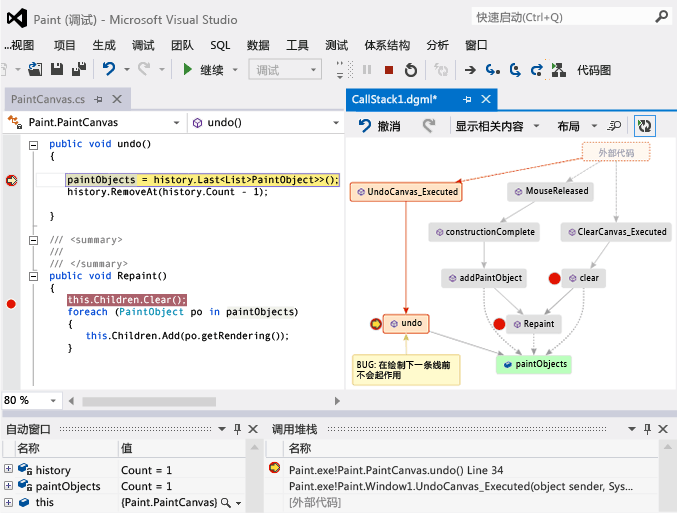
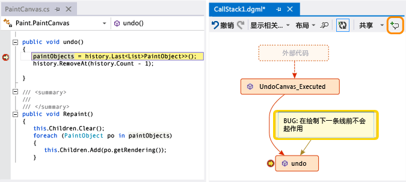
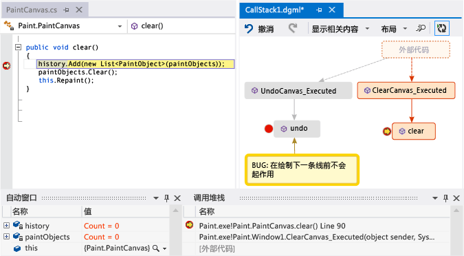
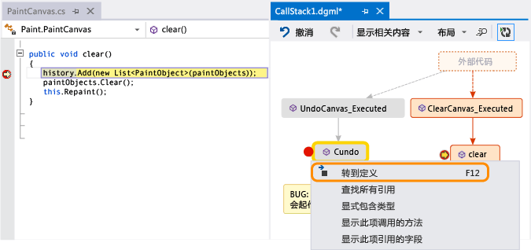
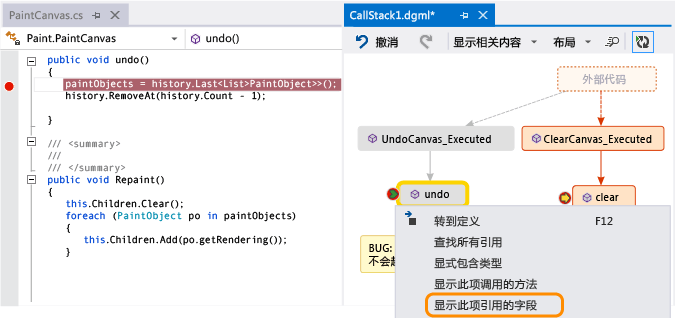
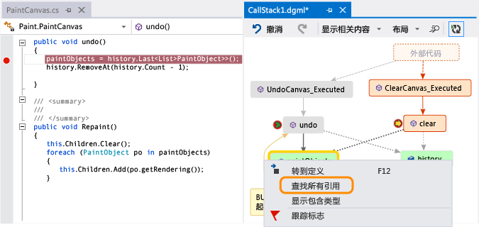
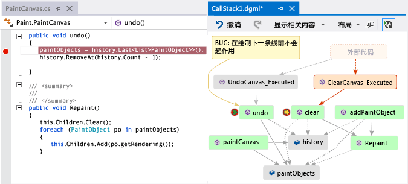
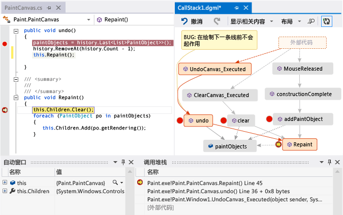
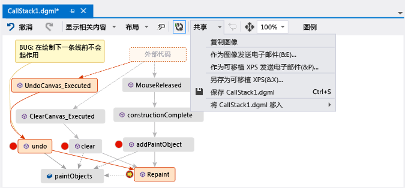
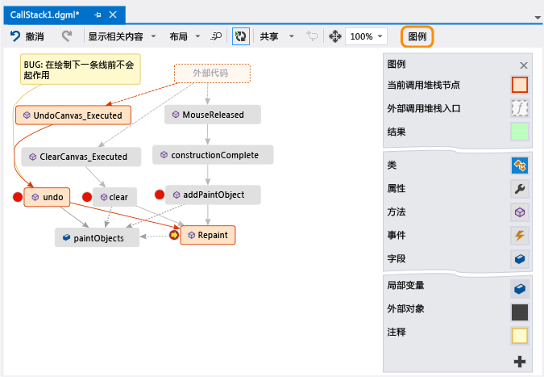

# 在 Visual Studio 中调试时映射调用堆栈上的方法
[!INCLUDE[vs2017banner](../code-quality/includes/vs2017banner.md)]

创建代码图，以便在调试时对调用堆栈进行可视化跟踪。  你可以在图中进行标注以跟踪代码执行的操作，以便专注于查找 Bug。  
  
   
  
 你将需要：  
  
-   [Visual Studio Enterprise](https://www.visualstudio.com/downloads/download-visual-studio-vs)  
  
-   可调试的代码，例如 Visual C\# .NET、Visual Basic .NET、C\+\+、JavaScript 或 X\+\+  
  
 请参阅：[视频：利用代码图调试器集成实现可视化调试（第 9 频道）](http://go.microsoft.com/fwlink/?LinkId=293418) • [生成调用堆栈图](#MapStack) • [对代码进行标注](#MakeNotes) • [使用下一个调用堆栈更新图](#UpdateMap) • [向图中添加相关代码](#AddRelatedCode) • [使用图查找 Bug](#FindBugs) • [问题解答](#QA)  
  
 有关使用代码图时你可以使用的命令和操作的详细信息，请参阅[浏览和重新排列代码图](../modeling/browse-and-rearrange-code-maps.md)。  
  
##   生成调用堆栈图  
  
1.  开始调试。  （键盘：**“F5”**）  
  
2.  在你的应用进入中断模式或你单步执行某一函数之后，请选择**“代码图”**。  （键盘：**Ctrl** \+ **Shift** \+ **\`**）  
  
       
  
     当前的调用堆栈在新代码图上显示为橙色：  
  
       
  
     在你继续调试时，该代码图将自动更新。  请参阅[使用下一个调用堆栈更新图](#UpdateMap)。  
  
##   对代码进行标注  
 添加注释以跟踪代码发生的情况。  若要在注释中添加新行，请按 **Shift \+ Return**。  
  
   
  
##   使用下一个调用堆栈更新图  
 运行你的应用到下一个断点或单步执行某一函数。  此图将添加新的调用堆栈。  
  
   
  
##   向图中添加相关代码  
 现在你已生成一个图，下一步做什么？  如果你正在使用 Visual C\# .NET 或 Visual Basic .NET，请添加诸如字段、属性和其他方法等项，以便跟踪代码发生的情况。  
  
 双击某个方法以查看其代码定义，或者使用该方法的快捷菜单。  （键盘：在图上选择该方法，然后按 **F12**）  
  
   
  
 添加要在图上跟踪的项。  
  
   
  
> [!NOTE]
>  默认情况下，向图添加项还会添加父组节点（如类、命名空间和程序集）。  尽管这很有用，不过可以通过使用图工具栏上的**“包括父级”**按钮关闭此功能，或通过在添加项时按 **CTRL**，来仅仅保留图。  
  
   
  
 在这里，你可以轻松查看哪些方法使用了相同的字段。  最近添加的项显示为绿色。  
  
 继续生成图以查看更多代码。  
  
   
  
   
  
##   使用图查找 Bug  
 通过代码可视化，可帮助你更快发现 Bug。  例如，假设你正在一个绘图程序中调查 Bug。  当你绘制一条线并尝试撤消该操作时，直到你绘制另一条线后才会发生变化。  
  
 因此，可在 `clear`、`undo` 和 `Repaint` 方法中设置断点，启动调试，然后生成如下所示的图：  
  
   
  
 你注意到图中所有用户笔势均调用 `Repaint`，但 `undo` 除外。  这可能解释了 `undo` 为何不立即发挥作用。  
  
 在修复此 Bug 并继续运行程序后，图中增加了从 `undo` 到 `Repaint` 的新调用：  
  
   
  
##   问题解答  
  
-   **并非所有调用都会显示在图中。  为什么?**  
  
     默认情况下，只有你自己的代码会显示在图中。  若要查看外部代码，请在**”调用堆栈“**窗口中打开它：  
  
       
  
     或在 Visual Studio 调试选项中关闭**“启用‘仅我的代码’”**：  
  
       
  
-   **更改图是否会影响代码？**  
  
     更改图不会对代码造成任何影响。  你可随意在图上重命名、移动或移除任何内容。  
  
-   **这个消息是什么意思：“关系图可能基于旧版本的代码”？**  
  
     在你上次更新图后，代码可能已发生更改。  例如，图中的某个调用可能已在代码中不存在了。  请关闭此消息，然后在再次更新图之前，尝试重新生成解决方案。  
  
-   **我如何控制图的布局？**  
  
     打开图工具栏上的**“布局”**菜单：  
  
    -   更改默认布局。  
  
    -   若要停止自动重新排列图，请关闭**“调试时自动布局”**。  
  
    -   若要在添加新项时尽可能少地重新排列图，请关闭**“增量布局”**。  
  
-   **我能否与他人共享此图？**  
  
     你可以导出映射，将其发送给他人（如果你有 Microsoft Outlook）或保存到你的解决方案中，以便你将其签入 Team Foundation 版本控制。  
  
       
  
-   **我如何停止此图自动添加新的调用堆栈？**  
  
     选择图工具栏上的 。  若要手动向图中添加当前的调用堆栈，请按 **Ctrl** \+ **Shift** \+ **\`**。  
  
     在你进行调试时，图中将继续突出显示现有调用堆栈。  
  
-   **项图标和箭头代表什么？**  
  
     若要获取有关某个项的详细信息，请将鼠标指针移动到它上方，然后查看该项的工具提示。  你还可以查看**“图例”**来了解每个图标的含义。  
  
       
  
 请参阅：[生成调用堆栈图](#MapStack) • [对代码进行标注](#MakeNotes) • [使用下一个调用堆栈更新图](#UpdateMap) • [向图中添加相关代码](#AddRelatedCode) • [使用图查找 Bug](#FindBugs)  
  
## 请参阅  
 [映射解决方案中的依赖项](../modeling/map-dependencies-across-your-solutions.md)   
 [使用代码图调试你的应用程序](../modeling/use-code-maps-to-debug-your-applications.md)   
 [使用代码图分析器查找潜在问题](../modeling/find-potential-problems-using-code-map-analyzers.md)   
 [浏览和重新排列代码图](../modeling/browse-and-rearrange-code-maps.md)