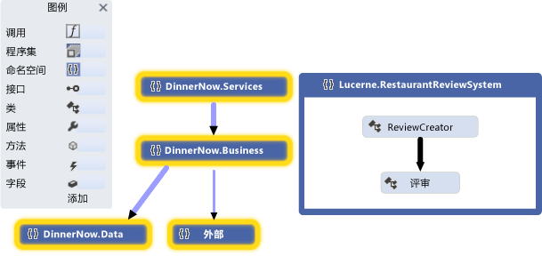
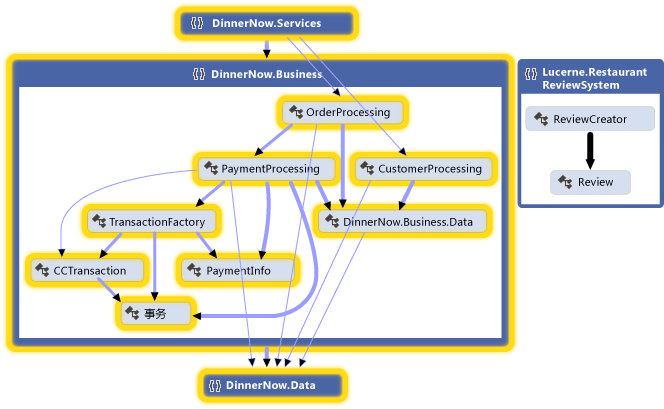
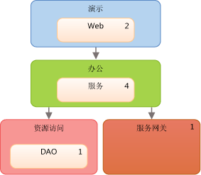
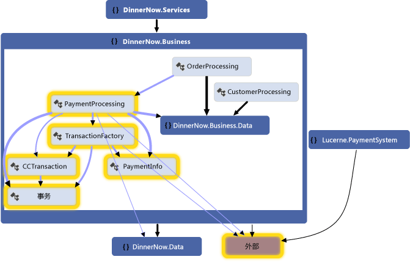
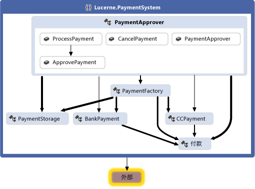
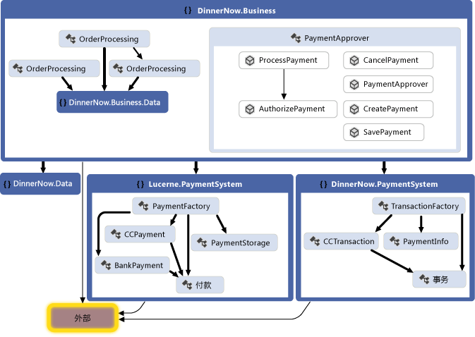
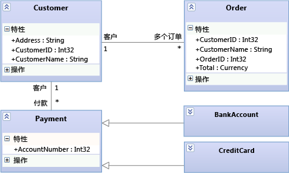
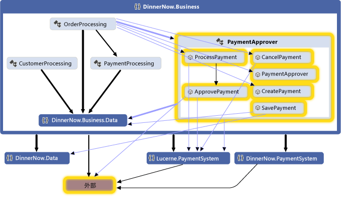
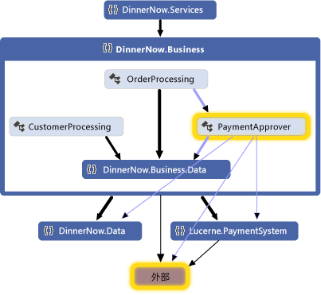

# 方案：使用可视化和建模更改设计
通过使用 Visual Studio 中的可视化和建模工具，确保你的软件系统满足用户的需求。
使用代码图、 依赖项关系图和类图等工具：  
  
 若要查看支持每个工具的 Visual Studio 版本，请参阅 [Version support for architecture and modeling tools](../modeling/what-s-new-for-design-in-visual-studio.md#VersionSupport)。  
  
-   阐明用户需求和业务流程。  
  
-   可视化和浏览现有代码。  
  
-   描述对现有系统所做的更改。  
  
-   验证系统是否满足其要求。  
  
-   使代码与设计保持一致。  
  
 本演练：  
  
-   介绍这些工具可为软件项目带来的好处。  
  
-   演示如何在示例方案中使用这些工具（无论你的开发方法如何）。  
  
 要了解有关这些工具及其支持的方案的详细信息，请参阅：  
  
-   [体系结构分析和建模](../modeling/analyze-and-model-your-architecture.md)  
  
-   [代码可视化](../modeling/visualize-code.md)  
  
##   方案概述  
 本方案介绍了 Dinner Now 和 Lucerne Publishing 这两家虚构公司的软件开发周期中的各个阶段。 Dinner Now 在西雅图提供基于 Web 的送餐服务。 客户可以在 Dinner Now 网站上订餐和付费。 订单随后会发送给相应的本地餐馆以便其配送餐点。 Lucerne Publishing 是一家位于纽约的公司，在网上和网下经营了多项业务。 例如，他们运营了一家网站，客户可以在这个网站上发表自己对餐馆的评论。  
  
 Lucerne 最近收购了 Dinner Now，并希望进行以下变革：  
  
-   通过将餐馆评论功能添加到 Dinner Now 来整合其网站。  
  
-   将 Dinner Now 的支付系统更换为 Lucerne 的系统。  
  
-   将 Dinner Now 服务推广到整个区域。  
  
 Dinner Now 使用 SCRUM 和 eXtreme Programming。 他们的测试覆盖率非常高，不受支持的代码非常少。 他们通过创建小巧而有效的系统版本，然后逐步添加功能，从而最大程度地减小风险。 他们通过短期而频繁的迭代来开发代码。 这样一来，他们便自信地接受更改、经常重构代码并避免“初期进行大量设计”。  
  
 Lucerne 保留了一组很复杂的大型系统，其中有一些系统已有 40 年以上的历史。 由于旧版代码很复杂且涉及范围很广，因此他们对更改非常谨慎。 他们遵循一个更严格的开发过程，希望设计详细的解决方案并记录开发过程中进行的设计和更改。  
  
 这两个团队都使用 Visual Studio 中的建模图来帮助自己开发满足用户需求的系统。 他们借助 Team Foundation Server 和其他工具来计划、整理和管理其工作。  
  
 有关 Team Foundation Server 的详细信息，请参阅：  
  
-   [计划和跟踪工作](#PlanningTracking)  
  
-   [测试、验证和签入更新的代码](#TestValidateCheckInCode)  
  
##   体系结构关系图和建模图在软件开发中的角色  
 下表描述了这些工具在软件开发生命周期的各个阶段中可扮演的角色：  
  
||**用户需求建模**|**业务流程建模**|**系统体系结构和设计**|**代码可视化和浏览**|**确认**|  
|------|------------------------------------|-----------------------------------|--------------------------------------|------------------------------------------|----------------------|  
|域特定语言 (DSL) 图|是|是|是|||  
|依赖项关系图，层验证|||是|是|是|  
|代码图|||是|是|是|  
|类设计器（基于代码）||||是||  
  
若要绘制依赖项关系图，必须创建一个建模项目作为现有解决方案或一个新的一部分。 这些关系图必须在建模项目内创建。
依赖项关系图上的项位于建模项目中，但它们并不存储在常见模型。 根据代码创建的代码图和 .NET 类图存在于建模项目外部。  
  
 请参阅：  
  
-   [从代码创建依赖项关系图](../modeling/create-layer-diagrams-from-your-code.md)  
  
-   [映射解决方案中的依赖项](../modeling/map-dependencies-across-your-solutions.md)  
  
-   [如何：向项目中添加类图（类设计器）](../ide/how-to-add-class-diagrams-to-projects-class-designer.md)  
  
-   [Visual Studio 的建模 SDK - 特定于域的语言](../modeling/modeling-sdk-for-visual-studio-domain-specific-languages.md)  

[!INCLUDE[modeling_sdk_info](includes/modeling_sdk_info.md)]
  
 这两个团队还使用依赖项验证来确保正在开发的代码保持与设计保持一致。  
  
 请参阅：  
  
-   [使代码与设计保持一致](#ValidatingCode)  
  
-   [描述逻辑体系结构： 依赖项关系图](#DescribeLayers)  
  
-   [使用依赖项关系图验证代码](../modeling/validate-code-with-layer-diagrams.md)  
  
    > [!NOTE]
    >  某些版本的 Visual Studio 支持依赖项验证以及代码图的只读版本以进行可视化和建模。 若要查看支持此功能的 Visual Studio 的版本，请参阅 [Version support for architecture and modeling tools](../modeling/what-s-new-for-design-in-visual-studio.md#VersionSupport)。  
  
##   了解和传达系统相关信息  
 由于没有规定 Visual Studio 建模图的使用顺序，因此你可以根据自己的需求和方法来使用它们。 通常，团队会在整个项目中反复而频繁地重新访问其模型。 每个关系图都有自己的长处，可帮助你理解、描述和沟通正在开发的系统的各方面问题。  
  
 Dinner Now 和 Lucerne 通过将关系图作为其公共语言来互相沟通以及与项目利益干系人沟通。 例如，Dinner Now 使用关系图执行以下任务：  
  
-   可视化现有代码。  
  
-   就新的用户情景或更新的用户情景与 Lucerne 进行沟通。  
  
-   确定支持新的用户情景或更新的用户情景必需的更改。  
  
 Lucerne 使用关系图执行以下任务：  
  
-   了解 Dinner Now 的业务流程。  
  
-   了解系统的设计。  
  
-   就新的用户需求或更新的用户需求与 Dinner Now 进行沟通。  
  
-   记录对系统进行的更新。  
  
 关系图与 Team Foundation Server 集成在一起，方便团队更轻松地计划、管理和跟踪其工作。 例如，他们使用模型来确定测试用例和开发任务以及估算其工作量。 Lucerne 将 Team Foundation Server 工作项链接到模型元素，以便能监视进度并确保系统满足用户需求。 例如，他们将用例链接到测试用例工作项，这样在所有测试都通过时，他们便能知道用例满足要求。  
  
 团队在签入其更改之前，会运行包含依赖项验证和自动的测试的生成来验证对测试和设计代码。 这有助于确保更新的代码不会与设计发生冲突且不会中断之前运行的功能。  
  
 请参阅：  
  
-   [标识对现有系统所做的更改](#DeterminingChanges)  
  
-   [Keeping code consistent with the design](#ValidatingCode)  
  
-   [创建和使用模型的一般提示](#GeneralTips)  
  
-   [计划和跟踪工作](#PlanningTracking)  
  
-   [测试、验证和签入更新的代码](#TestValidateCheckInCode)  

###   Identifying Changes to the Existing System  
 Dinner Now 必须估计满足新的需求所需的成本。 这部分取决于此更改将对系统的其他部件造成的影响的程度。 为了帮助他们了解这一点，Dinner Now 的一位开发人员根据现有代码创建了以下代码图和关系图：  
  
|**代码图或关系图**|**显示**|  
|------------------------|---------------|  
|*代码图*   请参阅：   -   [映射解决方案中的依赖关系](../modeling/map-dependencies-across-your-solutions.md) -   [浏览和重新排列代码图](../modeling/browse-and-rearrange-code-maps.md) -   [通过编辑 DGML 文件自定义代码图](../modeling/customize-code-maps-by-editing-the-dgml-files.md)|代码中的依赖关系以及其他关系。   例如，Dinner Now 首先会查看程序集代码图，大致了解这些程序集及其依赖关系。 他们可以深入探讨代码图，浏览这些程序集中的命名空间和类。   Dinner Now 还可以创建代码图来浏览特定区域和代码中其他类型的关系。 他们借助解决方案资源管理器来帮助查找和选择感兴趣的区域和关系。|  
|*基于代码的类图*   请参阅 [How to: Add Class Diagrams to Projects (Class Designer)](../ide/how-to-add-class-diagrams-to-projects-class-designer.md)。|代码中的现有类|  
  
 例如，开发人员创建一个代码图。 她调整了该代码图的范围，以侧重于将受到新方案影响的区域。 代码图上选中并突出显示了这些区域：  
  
   
  
 **命名空间代码图**  
  
 开发人员展开选定命名空间以查看其类、方法和关系：  
  
   
  
 **带可见跨组链接的已展开的命名空间代码图**  
  
 开发人员检查代码以查找受影响的类和方法。 要在进行更改的同时查看所做每项更改的影响，请在做出每项更改后重新生成代码图。 请参阅[可视化代码](../modeling/visualize-code.md)。  
  
 要描述对系统其他部分（如组件或交互）进行的更改，团队可以在白板上绘制这些元素。 这两个团队还可以在 Visual Studio 中绘制以下关系图，以捕获、管理和了解详细信息：  
  
|**关系图**|**描述**|  
|------------------|-------------------|  
|*基于代码的类图*   请参阅 [How to: Add Class Diagrams to Projects (Class Designer)](../ide/how-to-add-class-diagrams-to-projects-class-designer.md)。|代码中的现有类。|  
  
###   使代码与设计保持一致  
 Dinner Now 必须确保更新的代码与设计保持一致。 他们创建的功能层的描述系统中，指定的依赖关系，并将解决方案项目关联到这些层之间的依赖项关系图。  
  
|**关系图**|**描述**|  
|-----------------|-------------------|  
|*依赖项关系图*   请参阅：   -   [在代码中创建依赖项关系图](../modeling/create-layer-diagrams-from-your-code.md) -   [依赖项关系图： 参考](../modeling/layer-diagrams-reference.md) -   [依赖项关系图： 准则](../modeling/layer-diagrams-guidelines.md) -   [使用依赖项关系图验证代码](../modeling/validate-code-with-layer-diagrams.md)|代码的逻辑体系结构。   依赖项关系图整理并映射中的项目[!INCLUDE[vsprvs](../code-quality/includes/vsprvs_md.md)]解决方案抽象组调用*层*。 这些层可标识这些项目在系统中执行的角色、任务或功能。   层关系图可用于描述系统的预期设计并对该设计验证相关代码。   要创建层，请从解决方案资源管理器、代码图、类视图和对象浏览器中拖动项。 要绘制新层，请使用工具箱或右键单击关系图图面。   要查看现有依赖关系，请右键单击层关系图图面，然后单击 “生成依赖项”。 要指定预期的依赖关系，请绘制新的依赖关系。|  
  
 例如，以下依赖项关系图描述层和与每个图层关联的项目数之间的依赖关系：  
  
   
  
 **依赖项关系图**  
  
 若要确保代码开发过程执行不发生与设计发生冲突，团队生成的使用了依赖项验证，对 Team Foundation Build 上运行。 他们还创建了自定义 MSBuild 任务以要求在其签入操作中的依赖项验证。 他们使用生成报告来收集验证错误。  
  
 请参阅：  
  
-   [定义生成过程](http://msdn.microsoft.com/Library/61593e10-d24b-492f-b19a-af4d85abea6b)  
  
-   [使用封闭签入生成过程以验证更改](http://msdn.microsoft.com/Library/9cfc8b9c-1023-40fd-8ab5-1b1bd9c172ec)  
  
-   [自定义生成过程模板](http://msdn.microsoft.com/Library/b94c58f2-ae6f-4245-bedb-82cd114f6039)  
  
###   General Tips for Creating and Using Models  
  
-   大多数关系图都是由用线连接的节点组成的。 对于每种关系图类型，工具箱提供了不同类型的节点和线。  
  
     要打开工具箱，请在“视图”  菜单上单击“工具箱” 。  
  
-   要创建节点，请将它从工具箱拖动到关系图上。 必须将某些类型的节点拖动到现有节点上。 例如，在组件图上，必须将新端口添加到现有组件。  
  
-   要创建线或连接，请在工具箱中单击相应的工具，再单击源节点，然后单击目标节点。 有些线只能在某些类型的节点之间创建。 当你将指针移动到可能的源或目标上方时，指针会指示你是否能创建连接。  
  
###   Planning and Tracking Work  
 Visual Studio 建模图与 Team Foundation Server 集成在一起，方便你更轻松地计划、管理和跟踪工作。 两个团队使用模型来确定测试用例和开发任务以及估算其工作量。 Lucerne 创建了 Team Foundation Server 工作项并将其链接到模型元素（如用例或组件）。 这有助于他们监视进度和跟踪为满足用户需求所做的工作。 这有助于他们确保所做的更改仍能满足这些需求。  
  
 在开展工作时，团队会更新其工作项以反映他们在各自的任务上所花费的时间。 他们还会使用以下 Team Foundation Server 功能来监视和报告工作状态：  
  
-   每日 *“燃尽报表”* ，显示他们是否将在预期时间完成计划的工作。 他们会从 Team Foundation Server 生成其他类似的报表以跟踪 Bug 的进度。  
  
-   *“迭代工作表”* ，使用 Microsoft Excel 来帮助团队监视和权衡其成员的工作负荷。 此工作表链接到 Team Foundation Server，并提出团队日常进度会议上讨论的重点。  
  
-   *“开发仪表板”* ，使用 Office Project 来告知团队重要的项目信息。  
  
 请参阅：  
  
-   [使用 Visual Studio Team Services 或 Team Foundation Server 跟踪工作](http://msdn.microsoft.com/Library/52aa8bc9-fc7e-4fae-9946-2ab255ca7503)  
  
-   [适用于 Visual Studio ALM 的图表、仪表板和报表](http://msdn.microsoft.com/Library/1f28ba6c-c5e5-46d3-9209-ede24ae78e48)  
  
-   [使用 Project 创建积压工作 (backlog) 和任务](http://msdn.microsoft.com/Library/be5cef4f-755f-4ffe-8dd7-876d1e02c330)  
  
###   测试、验证和签入代码  
 当团队完成每个任务时，他们会将其代码签入 Team Foundation 版本控制，如果他们忘记这样做，则会收到来自 Team Foundation Server 的提醒。 Team Foundation Server 接受的签入前，团队会运行单元测试和依赖项验证，以验证对它们的测试用例和设计代码。 他们使用 Team Foundation Server 来运行生成、 自动的单元测试和定期依赖项验证。 这有助于确保代码满足以下条件：  
  
-   有效。  
  
-   不会中断之前运行的代码。  
  
-   不会与设计发生冲突。  
  
 Dinner Now 提供了大批自动测试，Lucerne 可以重用这些测试，因为它们几乎都仍适用。 Lucerne 也可以基于这些测试进行生成并添加新测试以涵盖新的功能。 两个均使用 Visual Studio 运行手动测试。  
  
 若要确保代码与设计保持一致，团队需在 Team Foundation Build 以包含依赖项验证中配置生成。 如果发生任何冲突，系统会生成包含详细信息的报告。  
  
 请参阅：  
  
-   [测试应用程序](https://www.visualstudio.com/docs/test/overview)  
  
-   [在开发过程中验证系统](../modeling/validate-your-system-during-development.md)  
  
-   [使用版本控制](http://go.microsoft.com/fwlink/?LinkID=525605)  
  
-   [生成应用程序](http://msdn.microsoft.com/Library/a971b0f9-7c28-479d-a37b-8fd7e27ef692)  
  
##   Updating the System Using Visualization and Modeling  
 Lucerne 和 Dinner Now 必须集成其支付系统。 以下各部分介绍了可帮助团队执行此任务的 Visual Studio 建模图:  
  
-   [可视化现有代码：代码图](#VisualizeCode)  
  
-   [定义类型的术语表：类图](#DefineClasses)  
  
-   [描述逻辑体系结构： 依赖项关系图](#DescribeLayers)  
  
 请参阅：  
  
-   [代码可视化](../modeling/visualize-code.md)  
  
-   [在你的开发过程中使用模型](../modeling/use-models-in-your-development-process.md)  
  
-   [应用体系结构建模](../modeling/model-your-app-s-architecture.md)  
 
###   可视化现有代码：代码图  
 代码图显示代码中的当前组织和关系。 项由代码图上的 *“节点”* 表示，而关系由 *“链接”*表示。 代码图可帮助你执行以下各类任务：  
  
-   探究不熟悉的代码。  
  
-   了解建议的更改发生的位置以及这些更改可能对现有代码产生的影响的程度。  
  
-   查找的复杂性、 自然的依赖关系或模式的区域或者其他可能从改进中受益的区域。  
  
 例如，Dinner Now 必须估计更新 PaymentProcessing 组件所需的成本。 这部分取决于此更改将对系统的其他部件造成的影响的程度。 为了帮助他们了解这一点，Dinner Now 的一位开发人员根据代码生成了代码图，并调整了范围以侧重于可能受更改影响的区域。  
  
 下面的代码图显示了 PaymentProcessing 类和 Dinner Now 系统的其他部件之间的依赖关系，这些关系显示为选定状态：  
  
   
  
 **Dinner Now 支付系统的代码图**  
  
 开发人员通过扩展 PaymentProcessing 类并选择其成员来浏览代码图，以查看可能受影响的区域：  
  
   
  
 **PaymentProcessing 类中的方法及其依赖关系**  
  
 他们为 Lucerne 支付系统生成以下代码图，以检查其类、方法和依赖关系。 团队发现，Lucerne 系统可能也需要与 Dinner Now 的其他部件进行交互：  
  
   
  
 **Lucerne 支付系统的代码图**  
  
 两个团队一起确定了集成两个系统所必需的更改。 他们决定重构某些代码以使其更易于更新。 PaymentApprover 类将移动到 DinnerNow.Business 命名空间并需要某些新方法。 处理事务的 Dinner Now 类将有自己的命名空间。 团队创建并使用工作项来计划、整理和跟踪其工作。 必要时，他们会将工作项链接到模型元素。  
  
 在重组代码后，团队生成了一个新的代码图以查看更新的结构和关系：  
  
   
  
 **带有重组代码的代码图**  
  
 此代码图显示 PaymentApprover 类现在位于 DinnerNow.Business 命名空间中，并且此类具有一些新的方法。 Dinner Now 事务类现在有了自己的 PaymentSystem 命名空间，这样它稍后便能更轻松地处理代码了。  
  
#### 创建代码图  
  
-   通过按照以下步骤进行操作来生成一个代码图，可以快速了解源代码：  
  
     在“体系结构”  菜单上，单击“针对解决方案生成代码图” 。  
  
     要快速了解编译的代码，请创建一个空白代码图，然后将程序集文件或二进制文件拖动到该代码图图面上。  
  
-   要了解特定代码或解决方案项，请使用解决方案资源管理器来选择要可视化的项和关系。 然后，你可以生成新的代码图或向现有代码图添加选定项。 请参阅[映射解决方案中的依赖关系](../modeling/map-dependencies-across-your-solutions.md)。  
  
-   为了帮助你浏览代码图，请重新排列布局，使其适合你要执行的各类任务。  
  
     例如，要要可视化代码中的分层，请选择树布局。 请参阅[浏览和重新排列代码图](../modeling/browse-and-rearrange-code-maps.md)。  
  
#### 摘要：代码图的优点  
 代码图可帮助你：  
  
-   了解现有代码中的组织和关系。  
  
-   标识可能受建议的更改影响的区域。  
  
-   查找复杂区域、模式、层或其他可以通过改进来使代码更易于维护、更改和重用的区域。  
  
#### 与其他关系图的关系  
  
|**关系图**|**描述**|  
|-----------------|-------------------|  
|依赖项关系图|系统的逻辑体系结构。 使用依赖项验证来确保代码保持与设计保持一致。   为了有助于标识现有 dependencys 或预期的 dependencys，请创建代码图和相关的项进行分组。 若要创建依赖项关系图，请参阅：   -   [在代码中创建依赖项关系图](../modeling/create-layer-diagrams-from-your-code.md) -   [依赖项关系图： 准则](../modeling/layer-diagrams-guidelines.md)|  
|类图（基于代码）|针对某个特定项目的代码中的现有类。   要可视化和修改代码中的现有类，请使用类设计器。   请参阅 [How to: Add Class Diagrams to Projects (Class Designer)](../ide/how-to-add-class-diagrams-to-projects-class-designer.md)。|  
  
###   定义类型的术语表：类图  
 类图定义参与系统的实体、术语或概念以及它们之间的关系。 例如，可以在开发过程中使用这些关系图来描述每个类的属性和操作，无论其实现语言或样式如何。  
  
 为了帮助 Lucerne 描述和讨论参与“处理付款”用例的实体，他们绘制了以下类图：  
  
   
  
 **类图中的“处理付款”实体**  
  
 此关系图显示一个“客户”可以有多个订单和不同的订单支付方式。 BankAccount 和 CreditCard 都继承自“付款”。  
  
 在开发过程中，Lucerne 使用以下类图来描述和讨论每个类的详细信息：  
  
   
  
 **类图中的“处理付款”详细信息**  
    
#### 绘制类图  
 类图具有以下主要功能：  
  
-   类、接口和枚举等类型：  
  
    -   *“类”* ，它是拥有相同的特定结构特征或行为特征的对象的定义。  
  
    -   *“接口”* ，可定义对象的外部可见行为的一部分。  
  
    -   *“枚举”* ，它是包含一个文本值列表的分类器。  
  
-   *“属性”* ，它是描述 *“分类器”*的每个实例的某个类型的值。 分类器是类型、组件、用例甚至参与者的一般名称。  
  
-   *“操作”* ，它是分类器的实例可执行的方法或函数。  
  
-   *“关联”* ，指示两个分类器之间的某种关系。  
  
    -   *“聚合”* ，它是指示两个分类器之间的共享所有权的关联。  
  
    -   *“复合”* ，它是指示分类器之间的整体-部分关系的关联。  
  
     要显示聚合或复合，请设置关联上的“聚合”  属性。 “共享” 可显示聚合，“复合”  可显示复合。  
  
-   *“依赖关系”* ，指示更改一个分类器的定义可能会更改另一个分类器的定义。  
  
-   *“泛化”* ，指示特定分类器从通用分类器继承部分定义。 *“实现”* ，指示类将实现由接口提供的操作和属性。  
  
     要创建这些关系，请使用“继承”  工具。 也可以将实现表示为 *“棒糖形”*。  
  
-   *“包”* ，它是一组分类器、关联、生命线、组件和其他包。 *“导入”* 关系，指示一个包中包括另一个包的所有定义。  
  
 作为探究和讨论现有类的第一步，你可以使用类设计器来根据代码创建类图。  
  
-   [如何：向项目中添加类图（类设计器）](../ide/how-to-add-class-diagrams-to-projects-class-designer.md)  
  
#### 摘要：类图的优点  
 类图可帮助你定义：  
  
-   一个常用术语词汇表，在讨论用户需求和参与系统的实体时将使用它。 请参阅[建立用户需求模型](../modeling/model-user-requirements.md)。  
  
-   由系统部件使用的类型（如组件），无论其实现如何。 请参阅[建模应用程序的体系结构](../modeling/model-your-app-s-architecture.md)。  
  
-   类型之间的关系，如依赖关系。 例如，你可以指明可将一个类型与另一个类型的多个实例关联。  
  
#### 与其他关系图的关系  
  
|**关系图**|**描述**|  
|-----------------|---------------------|  
|依赖项关系图|定义与类相关的系统的逻辑体系结构。   使用依赖项验证来确保代码保持与设计保持一致。   请参阅：   -   [在代码中创建依赖项关系图](../modeling/create-layer-diagrams-from-your-code.md) -   [依赖项关系图： 参考](../modeling/layer-diagrams-reference.md) -   [依赖项关系图： 准则](../modeling/layer-diagrams-guidelines.md) -   [使用依赖项关系图验证代码](../modeling/validate-code-with-layer-diagrams.md)|  
|代码图|可视化现有代码中的组织和关系。   要标识类、类的关系和类的方法，请创建一个显示这些元素的代码图。   请参阅：   -   [映射解决方案中的依赖关系](../modeling/map-dependencies-across-your-solutions.md)|  
  
###  描述逻辑体系结构： 依赖项关系图  
 依赖项关系图描述系统的逻辑体系结构的解决方案中的项目整理到抽象组或*层*。 项目可以为多种元素，如命名空间、项目、类、方法等。 层可表示和描述项目在系统中扮演的角色或执行的任务。 你也可以将层验证包含在生成和签入操作中，来确保代码与其设计保持一致。  
  
 若要使代码与设计保持一致，Dinner Now 和 Lucerne 使用以下依赖项关系图来验证相关代码，其在演变过程：  
  
   
  
 **Dinner now 与 Lucerne 集成的依赖项关系图**  
  
 此关系图上的层会链接到相应的 Dinner Now 和 Lucerne 解决方案项目。 例如，业务层会链接到 DinnerNow.Business 命名空间及其成员，该层现在包含 PaymentApprover 类。 资源访问层会链接到 DinnerNow.Data 命名空间。 箭头（即 *“依赖关系”*）指定只有业务层可以使用资源访问层中的功能。 在团队更新其代码时，会定期执行层验证以便在发生冲突时进行捕获，并帮助团队快速解决冲突。  
  
 两个团队密切合作，逐步集成并测试这两个系统。 他们在处理 PaymentProcessing 之前，会先确保 PaymentApprover 和 Dinner Now 的其他人员成功协作。  
  
 下面的代码图显示了 Dinner Now 与 PaymentApprover 之间的新调用：  
  
   
  
 **带有更新的方法调用的代码图**  
  
 在确认系统按预期运行后，Dinner Now 会注释掉 PaymentProcessing 代码。 层验证报告未报告错误，生成的代码图显示没有其他 PaymentProcessing 依赖关系：  
  
   
  
 **没有 PaymentProcessing 的代码图**  
  
#### 绘制依赖项关系图  
 依赖项关系图具有以下主要功能：  
  
-   *“层”* ，描述项目的逻辑组。  
  
-   *“链接”* ，它是层和项目之间的关联。  
  
     要根据项目创建层，请从解决方案资源管理器、代码图、类视图或对象浏览器中拖动项。 要绘制新层，然后将它们链接到项目，请使用工具箱或右键单击关系图图面以创建层，然后将项拖动到这些层。  
  
     层上的数字显示链接到该层的项目数。 这些项目可以是命名空间、项目、类、方法等。 在解释层上的项目数时，请记住以下事项：  
  
    -   如果某个层链接到一个包含其他项目的项目，但该层未直接链接到其他项目，则该数字仅包括链接的项目。 但是，在层验证过程中其他项目包括在分析范围内。  
  
         例如，如果一个层链接到单个命名空间，则链接的项目数是 1，即使该命名空间包含类也是如此。 如果该层还链接到命名空间中的每个类，则该数字将包括链接的类。  
  
    -   如果一个层包含链接到项目的其他层，则容器层也链接到这些项目，即使容器层上的数字不包括这些项目。  
  
     若要查看链接到层的项目，右键单击依赖项，，然后单击**查看链接**以打开**层资源管理器**。  
  
-   *“依赖关系”* ，指示某个层可以使用另一个层中的功能，但反过来行不通。 *“双向依赖关系”* ，指示某个层可以使用另一个层中的功能，反之亦然。  
  
     要在依赖项关系图上显示的现有依赖关系，请右键单击关系图面，然后单击**生成依赖项**。 要描述预期的依赖关系，请绘制新的依赖关系。  
  
 请参阅：  
  
-   [从代码创建依赖项关系图](../modeling/create-layer-diagrams-from-your-code.md)  
  
-   [依赖项关系图：参考](../modeling/layer-diagrams-reference.md)  
  
-   [依赖项关系图：指南](../modeling/layer-diagrams-guidelines.md)  
  
-   [使用依赖项关系图验证代码](../modeling/validate-code-with-layer-diagrams.md)  
  
#### 摘要： 依赖项关系图的优点  
 依赖项图可帮助你：  
  
-   根据系统项目的功能描述该系统的逻辑体系结构。  
  
-   确保正在开发的代码与指定的设计保持一致。  
  
#### 与其他关系图的关系  
  
|**关系图**|**描述**|  
|-----------------|---------------------|  
|代码图|可视化现有代码中的组织和关系。   要创建层，请生成一个代码图，然后将该代码图上的项作为可能的层进行分组。 将组从映射拖到依赖项关系图。   请参阅：   -   [映射解决方案中的依赖关系](../modeling/map-dependencies-across-your-solutions.md) -   [浏览和重新排列代码图](../modeling/browse-and-rearrange-code-maps.md)|  
  
## 外部资源  
  
|**类别**|**Links**|  
|------------------|---------------|  
|**论坛**|-   [Visual Studio 可视化和建模工具](http://go.microsoft.com/fwlink/?LinkId=184720) -   [Visual Studio 可视化和建模 SDK（DSL 工具）](http://go.microsoft.com/fwlink/?LinkId=184721)|  
  
## 另请参阅  
 [可视化代码](../modeling/visualize-code.md)   
 [在开发过程中使用模型](../modeling/use-models-in-your-development-process.md)   
 [在敏捷开发中使用模型](http://msdn.microsoft.com/en-us/592ac27c-3d3e-454a-9c38-b76658ed137f)   
 [在开发过程中验证系统](../modeling/validate-your-system-during-development.md)   

[!INCLUDE[modeling_sdk_info](includes/modeling_sdk_info.md)]
 
