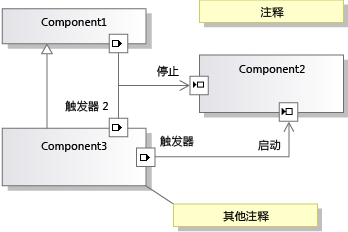

# <a name="understanding-the-dsl-code"></a>了解 DSL 代码
域特定语言 (DSL) 解决方案将生成可用于在 [!INCLUDE[vsprvs](../code-quality/includes/vsprvs_md.md)] 中读取和更新 DSL 实例的 API。 此 API 将定义在从 DSL 定义生成的代码中。 本主题介绍了生成的 API。  
  
## <a name="the-example-solution-component-diagrams"></a>示例解决方案：组件图  
 若要创建的解决方案中的大多数本主题中示例的源，创建从 DSL**组件模型**解决方案模板。 这是在创建新 DSL 解决方案时显示的标准模板之一。  
  
> [!NOTE]
>  组件图 DSL 模板与可以通过使用 Visual Studio 中的体系结构菜单上创建的 UML 组件图无关。 在**新项目**对话框框中，展开**其他项目类型 \ 扩展性**，然后单击**域特定语言设计器**。  
  
 如果你不熟悉此解决方案模板，请按 F5 并进行试验。 特别注意，可通过将端口工具拖动到组件上来创建端口，并可连接端口。  
  
   
  
## <a name="the-structure-of-the-dsl-solution"></a>DSL 解决方案的结构  
 **Dsl**项目定义用于 DSL 的 API。 **DslPackage**项目定义它集成了[!INCLUDE[vsprvs](../code-quality/includes/vsprvs_md.md)]。 还可添加你自己的项目，这些项目还可包含从模型生成的代码。  
  
### <a name="the-code-directories"></a>代码指令  
 从生成中每个项目的代码的大部分**Dsl\DslDefinition.dsl**。 生成的代码位于**生成的代码**文件夹。 若要查看生成的文件，请单击**[+]**旁边生成**.tt**文件。  
  
 建议你检查生成的代码以帮助你了解 DSL。 若要查看生成的文件，请在“解决方案资源管理器”中展开 *.tt 文件。  
  
 \*.Tt 文件包含极少数生成代码。 相反，它们使用 `<#include>` 指令来包括共享的模板文件。 在找不到共享的文件**files\microsoft Visual Studio 10.0\Common7\IDE\Extensions\Microsoft\DSL SDK\DSL Designer\11.0\TextTemplates**  
  
 在将你自己的程序代码添加到 DSL 解决方案时，请将它添加在“生成的代码”文件夹之外的单独文件中。 您可能想要创建**自定义代码**文件夹。 （在向自定义文件夹添加新代码文件时，请记住在初始代码主干中更正命名空间。）  
  
 强烈建议你不要直接编辑生成的代码，因为当重新生成解决方案时你的编辑将会丢失。 相反，若要自定义 DSL，请执行以下操作：  
  
-   调整 DSL 定义中的多个参数。  
  
-   在单独的代码文件中编写分部类，以重写在生成的类中定义的或由生成的类继承的方法。 在某些情况下，您必须设置**生成双派生**类的 DSL 定义中，为了能够重写生成的方法的选项。  
  
-   将 DSL 定义中导致生成的代码的选项设置为向你自己的代码提供“hook”。  
  
     例如，如果您设置**具有自定义构造函数**域类的选项，然后生成解决方案，您将看到错误消息。 在双击其中一个错误消息时，你将在生成的代码中看到注释，阐释了你的自定义代码应提供的内容。  
  
-   编写你自己的文本模板以生成特定于应用程序的代码。 可使用包含文件来共享许多项目通用的模板的各个部分，并可创建 [!INCLUDE[vsprvs](../code-quality/includes/vsprvs_md.md)] 项目模板来设置使用你自己的文件结构初始化的项目。  
  
## <a name="generated-files-in-dsl"></a>DSL 中生成的文件  
 以下生成的文件出现在**Dsl**项目。  
  
 *YourDsl*`Schema.xsd`  
  
 包含 DSL 实例的文件的架构。 此文件复制到编译 (**bin**) 目录。 安装 DSL 时，可以将复制到此文件**files\microsoft Visual Studio 11.0\Xml\Schemas** ，以便可以验证模型文件。 有关详细信息，请参阅[部署域特定语言解决方案](../modeling/deploying-domain-specific-language-solutions.md)。  
  
 如果通过在 DSL 资源管理器中设置选项来自定义序列化，则该架构将进行相应的更改。 但是，如果编写自己的序列化代码，则此文件可能不再表示实际架构。 有关详细信息，请参阅[自定义文件存储和 XML 序列化](../modeling/customizing-file-storage-and-xml-serialization.md)。  
  
 `ConnectionBuilders.cs`  
  
 连接生成器是用于创建关系的类。 它是位于连接工具后面的代码。 此文件包含一对用于每个连接工具的类。 它们的名称派生自域关系和连接工具的名称︰*关系*生成器中，和*ConnectorTool*ConnectAction。  
  
 （在组件解决方案示例中，其中一个连接生成器称为 ConnectionBuilder，这是一个巧合，因为域关系名为 Connection。）  
  
 在创建关系*关系*`Builder.Connect()`方法。 默认版本将验证源和目标模型元素是否为可接受，然后实例化该关系。 例如:   
  
 `CommentReferencesSubject(sourceAccepted, targetAccepted);`  
  
 每个生成器类都生成中的某个节点从**连接生成器**在 DSL 资源管理器中的部分。 一个 `Connect` 方法可在一对或多对域类之间创建关系。 每一对都由链接连接指令定义，可在 DSL 资源管理器中的生成器节点下查找该指令。  
  
 例如，可以为示例 DSL 中三种类型关系的每一种添加一个连接生成器链接连接指令。 这将向用户提供单独的连接工具。 实例化的关系类型将依赖于由用户选择的源和目标元素的类型。  若要添加链接连接指令，请在 DSL 资源管理器中右键单击生成器。  
  
 若要编写在创建特定类型的域关系时运行的自定义代码，请在生成器节点下选择相应的链接连接指令。 在属性窗口中设置**使用自定义连接**。 重新生成解决方案，然后提供代码以更正产生的错误。  
  
 若要编写每当用户使用此连接工具时运行的自定义代码时，将设置**为自定义**连接生成器的属性。 可提供代码来确定是否允许源元素、是否允许特定的源和目标的组合，以及在进行连接时应对模型进行哪些更新。 例如，仅当连接不会在关系图中创建循环时才可允许连接。 可以在源和目标之间实例化多个相关元素的更复杂模式，而不是单一关系链接。  
  
 `Connectors.cs`  
  
 包含连接符的类，它们是通常表示引用关系的关系图元素。 每个类都生成自 DSL 定义中的一个连接符。 每个连接符类派生自<xref:Microsoft.VisualStudio.Modeling.Diagrams.BinaryLinkShape></xref:Microsoft.VisualStudio.Modeling.Diagrams.BinaryLinkShape>  
  
 若要在运行时使颜色和某些其他样式功能变量，用鼠标右键单击 DSL 定义关系图上的类，然后指向**公开添加**。  
  
 若要使其他样式功能变量在运行时，请参阅示例<xref:Microsoft.VisualStudio.Modeling.Diagrams.TextField>和<xref:Microsoft.VisualStudio.Modeling.Diagrams.ShapeElement>。</xref:Microsoft.VisualStudio.Modeling.Diagrams.ShapeElement> </xref:Microsoft.VisualStudio.Modeling.Diagrams.TextField>  
  
 `Diagram.cs`  
  
 包含可定义关系图的类。 派生自<xref:Microsoft.VisualStudio.Modeling.Diagrams.Diagram>。</xref:Microsoft.VisualStudio.Modeling.Diagrams.Diagram>  
  
 若要在运行时使颜色和某些其他样式功能变量，用鼠标右键单击 DSL 定义关系图上的类，然后指向**公开添加**。  
  
 此外，此文件包含 `FixupDiagram` 规则，该规则将在新元素添加到模型时响应。 该规则将添加新的形状并将该形状链接到模型元素。  
  
 `DirectiveProcessor.cs`  
  
 此指令处理器可帮助用户编写读取 DSL 实例的文本模板。 该指令处理器将加载用于 DSL 的程序集 (DLL)，并为命名空间有效地插入 `using` 语句。 这将允许文本模板中的代码使用已在 DSL 中定义的类和关系。  
  
 有关详细信息，请参阅[从域特定语言生成代码](../modeling/generating-code-from-a-domain-specific-language.md)和[创建自定义 T4 文本模板指令处理器](../modeling/creating-custom-t4-text-template-directive-processors.md)。  
  
 `DomainClasses.cs`  
  
 已定义的域类的实现，包括抽象类和模型根类。 源自<xref:Microsoft.VisualStudio.Modeling.ModelElement>。</xref:Microsoft.VisualStudio.Modeling.ModelElement>  
  
 每个域类包含：  
  
-   每个域属性的属性定义和嵌套处理程序类。 可重写 OnValueChanging() 和 OnValueChanged()。 有关详细信息，请参阅[域属性值更改处理程序](../modeling/domain-property-value-change-handlers.md)。  
  
     在示例 DSL 中，`Comment` 类包含属性 `Text` 和处理程序类 `TextPropertyHandler`。  
  
-   此域类参与的关系的访问器属性。 （没有用于角色属性的嵌套类。）  
  
     在示例 DSL 中，`Comment` 类具有通过嵌入关系 `ComponentModelHasComments` 访问其父模型的访问器。  
  
-   构造函数。 如果您想要覆盖这些设置，设置**具有自定义构造函数**域类上。  
  
-   元素组原型 (EGP) 处理程序方法。 这些条目是必需的如果用户可以*合并*（添加） 到此类的实例上的另一个元素。 通常用户通过从元素工具或另一个形状进行拖动或通过粘贴来执行此操作。  
  
     在示例 DSL 中，“输入端口”或“输出端口”可以合并到“组件”上。 此外，“组件”和“注释”可以合并到模型上。 此  
  
     “组件”类中的 EGP 处理程序方法允许“组件”接受“端口”，但不接受“注释”。 根模型类中的 EGP 处理程序可接受“注释”和“组件”，但不接受“端口”。  
  
 `DomainModel.cs`  
  
 表示域模型的类。 派生自<xref:Microsoft.VisualStudio.Modeling.DomainModel>。</xref:Microsoft.VisualStudio.Modeling.DomainModel>  
  
> [!NOTE]
>  这与模型的根类不同。  
  
 “复制”和“删除”闭包定义在复制或删除一个元素时应包含哪些其他元素。 您可以通过设置控制此行为**传播复制**和**传播删除**两侧的每个关系的角色的属性。 如果想要动态确定这些值，则可编写代码来重写“闭包”类的方法。 
  
 `DomainModelResx.resx`  
  
 它包含了诸如域类和属性的说明、属性名称、工具箱标签、标准错误消息等字符串以及可以显示给用户的其他字符串。 它还包含工具图标和用于图像形状的图像。  
  
 此文件将绑定到生成的程序集中，并提供这些资源的默认值。 通过创建包含资源的本地化版本的附属程序集，可对 DSL 进行本地化。 当 DSL 安装在与本地化资源相匹配的区域性时，将使用该版本。 有关详细信息，请参阅[部署域特定语言解决方案](../modeling/deploying-domain-specific-language-solutions.md)。  
  
 `DomainRelationships.cs`  
  
 模型中的两个元素之间的每个链接都由域关系类的实例表示。 从<xref:Microsoft.VisualStudio.Modeling.ElementLink>，后者又派生<xref:Microsoft.VisualStudio.Modeling.ModelElement>。</xref:Microsoft.VisualStudio.Modeling.ModelElement>从</xref:Microsoft.VisualStudio.Modeling.ElementLink>派生类的所有关系类 由于它是 ModelElement，因此关系的实例可以具有属性并且可以是关系的源或目标。  
  
 `HelpKeywordHelper.cs`  
  
 提供当用户按 F1 时使用的函数。  
  
 `MultiplicityValidation.cs`  
  
 在你在其中指定重数为 1..1 或 1..* 的关系角色中，应警告用户至少需要一个关系实例。 此文件提供实现这些警告的验证约束。 指向嵌入父级的 1..1 链接未进行验证。  
  
 要执行这些约束，必须首先设置之一**使用...**中选项**编辑器 \ 验证**在 DSL 资源管理器中的节点。 有关详细信息，请参阅[域特定语言中的验证](../modeling/validation-in-a-domain-specific-language.md)。  
  
 `PropertiesGrid.cs`  
  
 此文件仅在你已将自定义类型描述符附加到域属性时才包含代码。 有关详细信息，请参阅[自定义属性窗口](../modeling/customizing-the-properties-window.md)。  
  
 `SerializationHelper.cs`  
  
-   用于确保同一名字对象没有引用两个元素的验证方法。 有关详细信息，请参阅[自定义文件存储和 XML 序列化](../modeling/customizing-file-storage-and-xml-serialization.md)。  
  
-   SerializationHelper 类，提供了由序列化类共同使用的函数。  
  
 `Serializer.cs`  
  
 用于每个域类、关系、形状、连接符、关系图和模型的序列化程序类。  
  
 许多这些类的功能可以通过在 DSL 资源管理器中的设置控制**Xml 序列化行为**。  
  
 `Shapes.cs`  
  
 用于 DSL 定义中的每个形状类的类。 形状派生自<xref:Microsoft.VisualStudio.Modeling.Diagrams.NodeShape>。</xref:Microsoft.VisualStudio.Modeling.Diagrams.NodeShape> 有关详细信息，请参阅[自定义文件存储和 XML 序列化](../modeling/customizing-file-storage-and-xml-serialization.md)。  
  
 若要重写使用你自己的分部类中的方法生成的方法，请设置**生成双派生**DSL 定义中的连接符。 若要用您自己的代码替换构造函数，将设置**具有自定义构造函数**。  
  
 若要在运行时使颜色和某些其他样式功能变量，用鼠标右键单击 DSL 定义关系图上的类，然后指向**公开添加**。  
  
 若要使其他样式功能变量在运行时，请参阅例如<xref:Microsoft.VisualStudio.Modeling.Diagrams.TextField>和<xref:Microsoft.VisualStudio.Modeling.Diagrams.ShapeElement></xref:Microsoft.VisualStudio.Modeling.Diagrams.ShapeElement></xref:Microsoft.VisualStudio.Modeling.Diagrams.TextField>  
  
 `ToolboxHelper.cs`  
  
 通过将元素组原型安装到元素工具中来设置工具箱。 当用户运行该工具时，这些原型的副本将与目标元素合并。  
  
 可以重写 `CreateElementPrototype()` 来定义用于创建一组多个对象的工具箱项。 例如，你可以定义某个项来表示具有子组件的对象。 更改代码后，重置 [!INCLUDE[vsprvs](../code-quality/includes/vsprvs_md.md)] 的实验实例来清除工具箱缓存。  
  
## <a name="generated-files-in-the-dslpackage-project"></a>DslPackage 项目中生成的文件  
 DslPackage 将 DSL 模型耦合到 [!INCLUDE[vsprvs](../code-quality/includes/vsprvs_md.md)] shell，从而管理窗口、工具箱和菜单命令。 大多数类都是双派生的，以便你可以重写它们的任何方法。  
  
 `CommandSet.cs`  
  
 在关系图上可见的上下文菜单命令。 可以改写此集或向其添加项。 此文件包含命令的代码。 菜单上的命令的位置由 Commands.vsct 文件确定。 有关详细信息，请参阅[编写用户命令和操作](../modeling/writing-user-commands-and-actions.md)。  
  
 `Constants.cs`  
  
 GUID。  
  
 `DocData.cs`  
  
 *YourDsl* `DocData`管理加载和将模型保存到文件，并创建存储实例。  
  
 例如，如果想要将 DSL 保存在数据库而不是文件中，则可以重写 `Load` 和 `Save` 方法。  
  
 `DocView.cs`  
  
 *YourDsl* `DocView`管理窗口中显示关系图。 例如，可以将关系图嵌入在 Windows 窗体内：  
  
 将用户控件文件添加到 DslPackage 项目。 添加可在其中显示关系图的面板。 添加按钮和其他控件。 在窗体的代码视图中，添加以下代码，从而调整名称以适应你的 DSL：  
  
```  
using System;  
using System.Collections.Generic;  
using System.ComponentModel;  
using System.Drawing;  
using System.Data;  
using System.Linq;  
using System.Text;  
using System.Windows.Forms;  
using Microsoft.VisualStudio.Modeling;  
using Microsoft.VisualStudio.Modeling.Shell;  
  
namespace Company.EmbedInForm  
{  
  public partial class UserControl1 : UserControl  
  {  
    public UserControl1()  
    {  
      InitializeComponent();  
    }  
  
    private DiagramDocView docView;  
  
    public UserControl1(DiagramDocView docView, Control content)  
      : this()  
    {  
      this.docView = docView;  
      panel1.Controls.Add(content);  
    }  
  
    private void button1_Click(object sender, EventArgs e)  
    {  
      ExampleModel modelRoot = this.docView.CurrentDiagram.ModelElement as ExampleModel;  
      foreach (ExampleElement element in modelRoot.Elements)  
      {  
       listBox1.Items.Add(element.Name);  
      }  
    }  
  }  
  internal partial class EmbedInFormDocView  
  {  
  
    private ContainerControl container;  
  
    /// <summary>  
    /// Return a User Control instead of the DSL window.   
    /// The user control will contain the DSL window.  
    /// </summary>  
  
    public override System.Windows.Forms.IWin32Window Window  
    {  
      get  
      {  
        if (container == null)  
        {  
          // Put the normal DSL Window inside our control  
          container = new UserControl1(this, (Control)base.Window);  
        }  
        return container;  
      }  
    }  
  }  
  
}  
  
```  
  
 `EditorFactory.cs`  
  
 实例化 `DocData` 和 `DocView`。 它满足 [!INCLUDE[vsprvs](../code-quality/includes/vsprvs_md.md)] 用于在 DSL 程序包启动时打开编辑器的标准接口。 将在 Package.cs 的 `ProvideEditorFactory` 特性中引用它。  
  
 `GeneratedVSCT.vsct`  
  
 在关系图上下文菜单中，如菜单上查找标准菜单命令**编辑**菜单上，依次类推。 命令的代码是 CommandSet.cs。 可以重定位或修改标准命令，并可以添加自己的命令。 有关详细信息，请参阅[编写用户命令和操作](../modeling/writing-user-commands-and-actions.md)。  
  
 `ModelExplorer.cs`  
  
 为 DSL 定义模型资源管理器。 这是用户将在关系图旁边看到的模型的树视图。  
  
 例如，可以重写 `InsertTreeView()` 来更改元素在模型资源管理器中的显示顺序。  
  
 如果想要使模型资源管理器中的选择与关系图选择保持同步，可使用以下代码：  
  
```  
protected override void OnSelectionChanged(global::System.EventArgs e)  
{  
base.OnSelectionChanged(e);  
// get the selected element  
DslModeling::ModelElement selectedElement =   
this.PrimarySelection as DslModeling::ModelElement;  
// Select in the model explorer  
SelectInModelExplorer<YOURLANGUAGEExplorerToolWindow>(selectedElement);  
}  
private void SelectInModelExplorer<T>(DslModeling::ModelElement modelElement)  
where T : DslShell.ModelExplorerToolWindow  
{  
DslShell::ModelingPackage package =   
this.GetService(typeof(VSShell.Package)) as DslShell::ModelingPackage;  
  
if (package != null)  
{  
// find the model explorer window  
T explorerWindow = package.GetToolWindow(typeof(T), true) as T;  
if (explorerWindow != null)  
{  
// get the tree container  
DslShell.ModelExplorerTreeContainer treeContainer =   
explorerWindow.TreeContainer;  
// find the tree node  
DslShell.ExplorerTreeNode treeNode =   
treeContainer.FindNodeForElement(modelElement);  
// select the node  
explorerWindow.TreeContainer.ObjectModelBrowser.SelectedNode = treeNode;  
}  
}  
}  
  
```  
  
 `ModelExplorerToolWindow.cs`  
  
 定义将在其中显示模型资源管理器的窗口。 处理资源管理器中的项的选择。  
  
 `Package.cs`  
  
 此文件定义 DSL 集成到 [!INCLUDE[vsprvs](../code-quality/includes/vsprvs_md.md)] 中的方式。 程序包类上的特性将 DSL 注册为具有文件扩展名的文件的处理程序、定义其工具箱以及定义打开新窗口的方式。 当第一个 DSL 加载到 [!INCLUDE[vsprvs](../code-quality/includes/vsprvs_md.md)] 实例中时，将调用一次 Initialize() 方法。  
  
 `Source.extension.vsixmanifest`  
  
 若要自定义此文件，请编辑 `.tt` 文件。  
  
> [!WARNING]
>  如果编辑 .tt 文件来包括资源（例如图标或图像），请确保该资源包括在 VSIX 生成中。 在解决方案资源管理器中，选择文件，请确保**包含在 VSIX**属性是`True`。  
  
 此文件控制将 DSL 打包到 Visual Studio 集成扩展 (VSIX) 中的方式。 有关详细信息，请参阅[部署域特定语言解决方案](../modeling/deploying-domain-specific-language-solutions.md)。  
  
## <a name="see-also"></a>另请参阅  
 [如何定义特定于域的语言](../modeling/how-to-define-a-domain-specific-language.md)   
 [了解模型、 类和关系](../modeling/understanding-models-classes-and-relationships.md)   
 [自定义和扩展域特定语言](../modeling/customizing-and-extending-a-domain-specific-language.md)   
 [编写代码以自定义域特定语言](../modeling/writing-code-to-customise-a-domain-specific-language.md)

