# 使用代码图调试你的应用程序
[!INCLUDE[vs2017banner](../code-quality/includes/vs2017banner.md)]

代码图有助于防止你在大型基本代码、不熟悉的代码或旧代码中迷失方向。  例如，在调试时，可能需要在很多不同的文件和项目之间查看代码。  使用代码图在这些代码段中导航，了解代码段之间的关系。  这样，你不必在脑海中跟踪此代码，或绘制单独的关系图。  所以，在你的工作中断时，代码图有助于让你回想起你正在处理的代码。  
  
 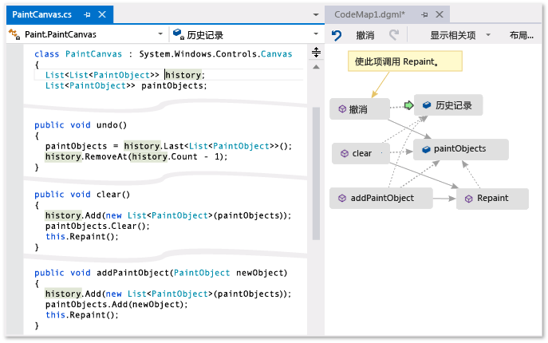  
  
 **绿色的箭头表示你的光标在编辑器中的位置**  
  
 有关使用代码图时你可以使用的命令和操作的详细信息，请参阅[浏览和重新排列代码图](../modeling/browse-and-rearrange-code-maps.md)。  
  
## 了解问题  
 假定你正在处理的绘图程序中有 Bug。  若要重现 Bug，请在 Visual Studio 中打开解决方案并按“F5”开始调试。  
  
 当你绘制了一条线并选择**“撤消上次笔划操作”**后，在你绘制下一条线前什么也没有发生。  
  
 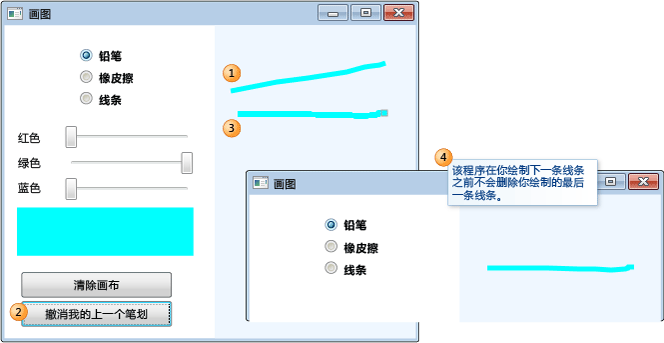  
  
 因此你开始通过搜索 `Undo` 方法来进行调查。  你将会在 `PaintCanvas` 类中找到它。  
  
   
  
## 开始映射代码  
 现在开始映射 `undo` 方法及其关系。  从代码编辑器中，将 `undo` 方法及其引用的字段添加到新的代码图。  创建新的代码图时，可能需要一些时间来为代码编制索引。  这有助于加快后续操作的运行速度。  
  
   
  
> [!TIP]
>  突出显示的绿色部分显示了上次添加到代码图中的项。  绿色箭头显示你的光标在代码中的位置。  各项之间的箭头表示不同的关系。  你可以通过将鼠标悬停在项上并查看相应的工具提示来详细了解有关代码图上各项的详细信息。  
  
 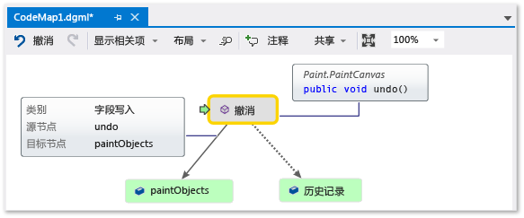  
  
## 浏览并检查映射中的代码  
 若要查看每个字段的代码定义，请在代码图上双击该字段，或选择该字段并按“F12”。  绿色箭头在代码图上的各项之间移动。  代码编辑器中的光标也会自动移动。  
  
 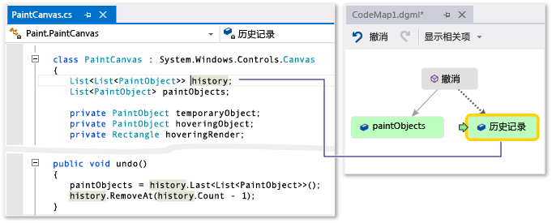  
  
 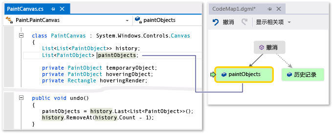  
  
> [!TIP]
>  你还可以通过在代码编辑器中移动光标来移动代码图上的绿色箭头。  
  
## 了解代码部分之间的关系  
 现在你需要知道与 `history` 和 `paintObjects` 字段交互的其他代码。  你可以将引用这些字段的所有方法添加到代码图。  你可以通过代码图或代码编辑器执行此操作。  
  
 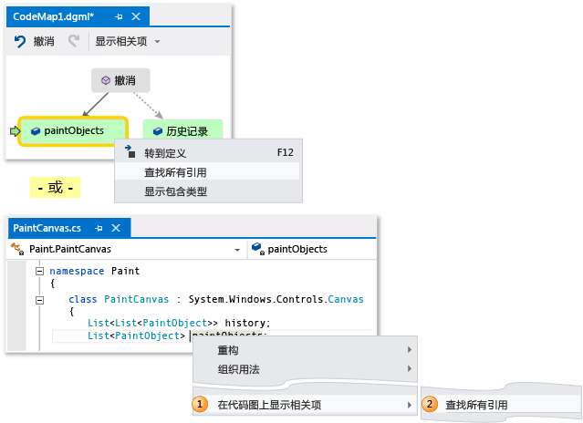  
  
   
  
> [!NOTE]
>  如果你从多个应用（如 Windows Phone 或 Windows 应用商店）之间共享的项目添加项，那么这些项将始终与当前活动的应用程序项目一起显示在代码图上。  因此，如果将上下文更改为另一个应用项目，那么代码图上的上下文也会更改为共享项目中的任何新添加项。  你对代码图上的项执行的操作仅适用于共享相同上下文的项。  
  
 更改布局以重新排列关系流并使代码图更容易阅读。  你还可以通过在代码图上拖动各个项来移动它们。  
  
 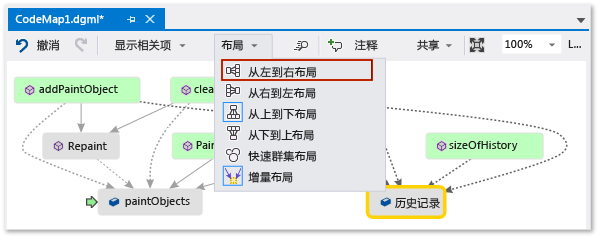  
  
> [!TIP]
>  默认情况下，**“增量布局”**处于打开状态。  当你添加新的项时，这会尽可能少地重新排列代码图。  若要在你每次添加新项时重新排列整个代码图，请关闭**“增量布局”**。  
  
 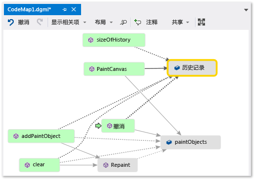  
  
 让我们检查这些方法。  在代码图上，双击“PaintCanvas”方法，或者选择此方法并按“F12”。  你将了解到，此方法将以空列表的形式创建 `history` 和 `paintObjects`。  
  
 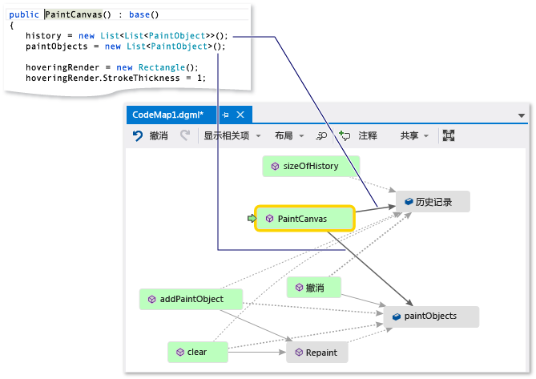  
  
 现在请重复相同的步骤以检查 `clear` 方法定义。  你将了解到，`clear` 会通过 `paintObjects` 和 `history` 执行某些任务，  然后它将调用 `Repaint` 方法。  
  
 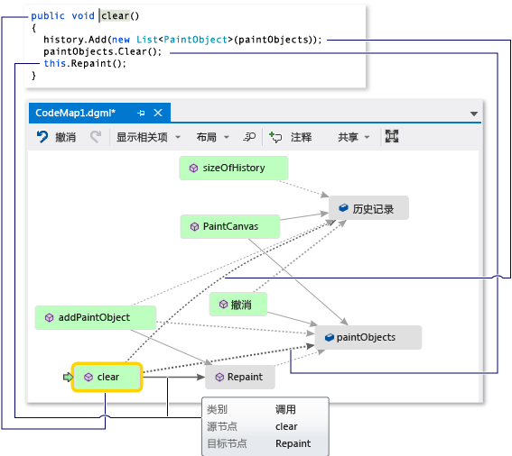  
  
 现在请检查 `addPaintObject` 方法定义。  它也使用 `history` 和 `paintObjects` 执行某些任务，  它还调用 `Repaint`。  
  
 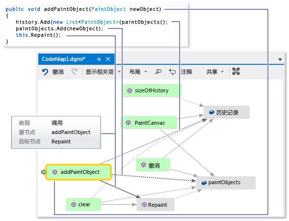  
  
## 通过检查映射找到问题  
 似乎修改 `history` 和 `paintObjects` 的所有方法都会调用 `Repaint`。  但是，`undo` 方法不会调用 `Repaint`，即使 `undo` 修改相同的字段。  因此，你认为可以通过从 `Repaint` 调用 `undo` 来解决此问题。  
  
 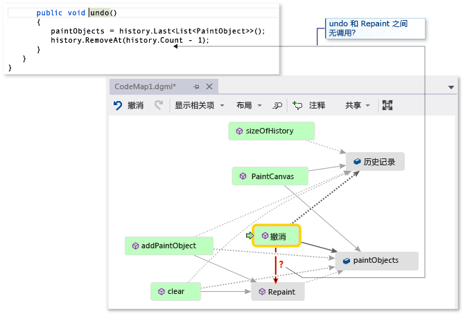  
  
 如果你没有可显示此缺失调用的代码图，要找到此问题或许更加困难，尤其是在具有更复杂的代码时。  
  
## 共享发现和后续步骤  
 在你或其他人修复此 Bug 之前，你可在代码图上针对此问题和解决方法进行注释。  
  
 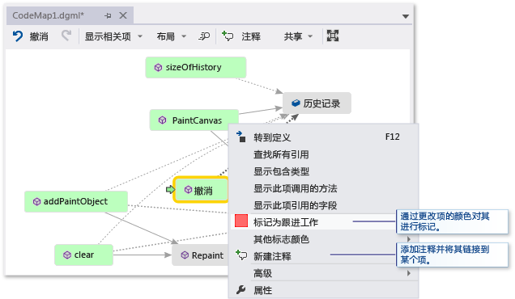  
  
 例如，你可以在代码图上添加注释并使用颜色标记项。  
  
 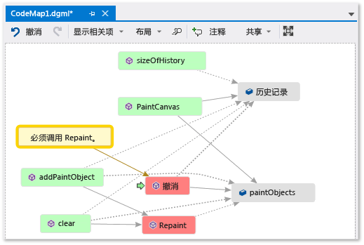  
  
 如果已安装 Microsoft Outlook，则可以将代码图以电子邮件的形式发送给其他人。  还可以将代码图导出为图像或其他格式。  
  
 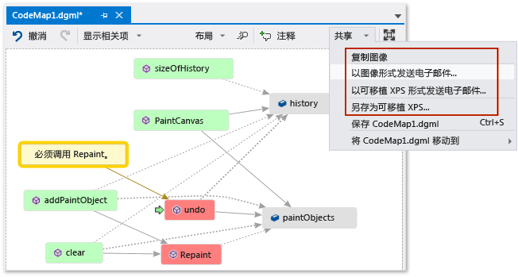  
  
## 解决该问题并显示你所做的工作  
 若要修复此 Bug，你需要将 `Repaint` 的调用添加到 `undo`。  
  
 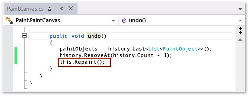  
  
 若要确认你的修复，请重新启动你的调试会话并尝试重现 Bug。  现在，按照预期的方式选择**“撤消上次笔划操作”**，并确认做出了正确修复。  
  
 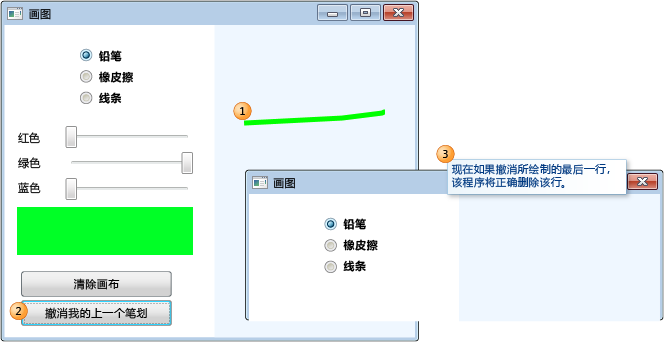  
  
 你可以更新代码图以显示所做的修复。  
  
 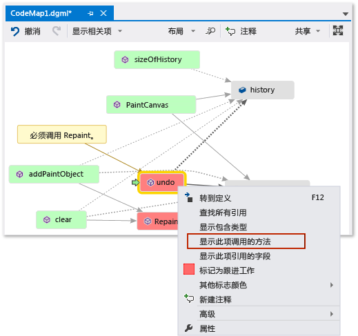  
  
 你的代码图现在会在**“撤消”**和**“重新绘制”**之间显示一个链接。  
  
 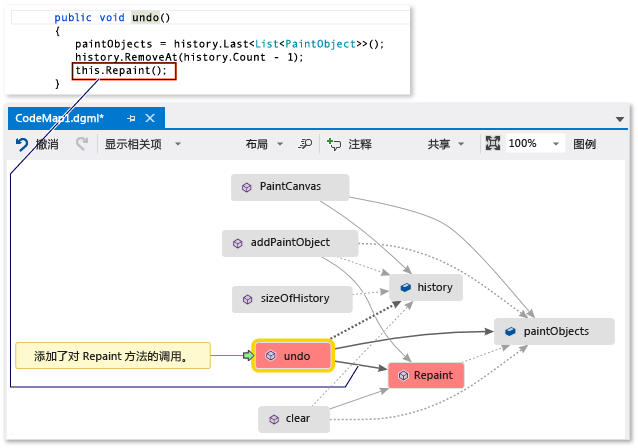  
  
> [!NOTE]
>  更新代码图时，你可能会看到说明用于创建代码图的代码索引已更新的消息。  这意味着有人更改了代码，造成你的代码图与当前代码不匹配。  这不会阻止你更新代码图，但你可能必须重新创建代码图以确认它与代码匹配。  
  
 现在你已完成调查。  你通过映射代码成功找到并解决了问题。  你也拥有可帮助你浏览代码的代码图，请记住你所学的内容并演示你用于解决此问题的步骤。  
  
## 请参阅  
 [调试时映射调用堆栈上的方法](../debugger/map-methods-on-the-call-stack-while-debugging-in-visual-studio.md)   
 [可视化代码](../modeling/visualize-code.md)