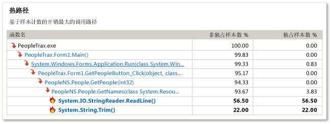
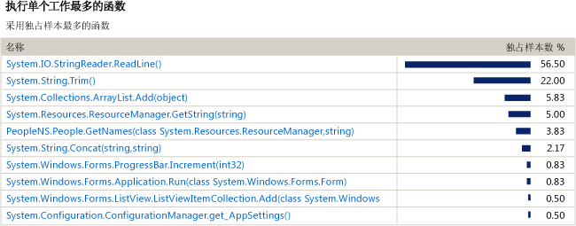
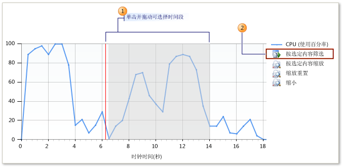

# CPU 采样初学者指南
可使用 Visual Studio 分析工具来分析应用程序中的性能问题。 此过程显示如何使用**采样**数据。

> [!NOTE]
>  建议在“诊断工具”窗口中使用 [CPU 使用率](../profiling/beginners-guide-to-performance-profiling.md) 工具而不使用旧 CPU 采样工具，除非需要检测支持等专业功能。
  
 **采样**是一种统计分析方法，它可显示应用程序中执行大多数用户模式工作的函数。 采样是寻找用于提速应用程序的区域的良好起点。  
  
 **采样**方法以指定的时间间隔收集有关应用程序中正在执行的函数的信息。 完成分析运行后，分析数据的“摘要”视图将显示最活跃的函数调用关系树，即“热路径”，其中执行了应用程序中的大部分工作。 该视图还会列出执行单独工作最多的函数，并提供时间线图，可专用于采样会话的特定部分。  
  
 如果**采样**未提供所需数据，其他分析工具收集方法可提供可能有帮助的不同种类的信息。 有关这些其他方法的详细信息，请参阅[如何：选择收集方法](../profiling/how-to-choose-collection-methods.md)。  
  
> [!TIP]
>  如果分析调用 Windows 函数的代码，应确保具有最新的 .pdb 文件。 如果没有这些文件，报告视图将列出含义隐晦、难以理解的 Windows 函数名称。 若要深入了解如何确保具有所需文件，请参阅[如何：引用 Windows 符号信息](../profiling/how-to-reference-windows-symbol-information.md)。  
  
##  创建并运行性能会话  
 若要获取需要分析的数据，必须先创建性能会话，然后运行会话。 可通过**性能向导**实现这两项操作。  
  
 如果不对 Windows 桌面应用或 ASP.NET 应用进行性能分析，则必须使用一种其他分析工具。 请参阅[分析工具](../profiling/profiling-tools.md)。  
  
#### 创建并运行性能会话  
  
1.  在 Visual Studio 中打开解决方案。 设置要发布的配置。 （在工具栏上找到“解决方案配置”框，默认情况下它设置为“调试”。 将其更改为“发布”。）  
  
    > [!IMPORTANT]
    >  如果你在所使用的计算机上并非管理员身份，则在使用探查器时应以管理员身份运行 Visual Studio。 （右键单击 Visual Studio 应用程序图标，然后单击“以管理员身份运行”。  
  
2.  在“调试”菜单中，选择“探查器”，然后选择“性能探查器”。  
  
3.  检查“性能向导”选项，然后单击“启动”。  
  
4.  检查“CPU 采样(推荐)”选项，并单击“完成”。  
  
5.  应用程序启动且探查器开始收集数据。  
  
6.  演练可能包含性能问题的功能。  
  
7.  像往常一样关闭应用程序。  
  
     完成应用程序运行后，分析数据的“摘要”视图将显示在 Visual Studio 主窗口中，并且新会话的图标将显示在“性能资源管理器”窗口中。  
  
##  步骤 2：分析采样数据  
 完成性能会话运行后，分析报告的“摘要”视图将显示在 Visual Studio 的主窗口中。  
  
 建议通过检查“热路径”开始分析数据，然后检查执行大部分工作的函数列表，最后通过使用“摘要时间线”将重点放在其他函数上。 也可查看“错误列表”窗口中的分析建议和警告。  
  
 注意，采样方法可能无法提供所需的信息。 例如，仅当应用程序正执行用户模式代码时才收集样本。 因此，某些功能（如输入和输出操作）不被采样捕获。 分析工具提供多种使你能够专注于重要数据的收集方法。 有关其他方法的详细信息，请参阅[如何：选择收集方法](../profiling/how-to-choose-collection-methods.md)。  
  
 图中每个带编号的区域都与过程中的一个步骤相关。  
  
   
  
#### 分析采样数据  
  
1.  “摘要”视图中，“热路径”显示了具有最高非独占样本数的应用程序调用关系树的分支。 这是收集数据时最活跃的执行路径。 高非独占值可指示生成调用树的算法可进行优化。 在路径中的最低代码处找到该函数。 注意路径也可包含系统函数或外部模块中的函数。  
  
       
  
    1.  **非独占样本**指示由函数及其调用的任何函数完成的工作量。 高非独占计数指向总体成本最高的函数。  
  
    2.  **独占样本**指示函数体中代码完成的工作量，不包括由它调用的函数完成的工作。 高独占计数可能指示函数自身内部的性能瓶颈。  
  
2.  单击函数名，显示分析数据的“函数详细信息”视图。 “函数详细信息”视图以图形方式呈现所选函数的分析数据，并显示调用该函数的所有函数及所选函数调用的所有函数。  
  
    -   调用和被调用函数的块大小表示调用或被调用函数的相对频率。  
  
    -   可单击调用或被调用函数的名称，使其成为“函数详细信息”视图中的所选函数。  
  
    -   “函数详细信息”窗口的下部窗格显示函数代码本身。 如果检查代码并发现优化其性能的机会，则单击源文件名称以在 Visual Studio 编辑器中打开该文件。  
  
3.  若要继续进行分析，请从“视图”下拉列表选择“摘要”以，返回到“摘要”视图。 然后检查“执行单独工作最多的函数”中的函数。 此列表显示具有最高独占样本数的函数。 这些函数的函数体中的代码执行了大量工作，并且你或许能够对它进行优化。 若要进一步分析特定函数，单击函数名称使其显示在“函数详细信息”视图中。  
  
       
  
     若要继续调查分析运行，可通过使用“摘要”视图中的时间线来显示所选段的“热路径”和“执行单独工作最多的函数”，从而对分析数据的某个段重新进行分析。 例如，将重点放在时间线中较小的峰值可能揭示成本高昂的调用树以及不在整个分析运行的分析中显示的函数。  
  
     若要重新分析段，请在“摘要时间线”框中选择段，然后单击“按选定内容筛选”。  
  
       
  
4.  探查器还使用一组规则来建议改进分析运行的方法并标识可能的性能问题。 如果找到了问题，会在“错误列表”窗口中显示警告。 若要打开“错误列表”窗口，请在“视图”菜单中单击“错误列表”。  
  
    -   若要查看在“函数详细信息”视图中引发了警告的函数，请双击该警告。  
  
    -   若要查看有关该警告的详细信息，请右键单击错误，然后单击“显示错误帮助”  
  
##  步骤 3：修改代码并重新运行会话  
 找到并优化一个或多个函数后，可反复进行分析运行并比较数据，从而查看所做更改使应用程序性能产生的差异。  
  
#### 修改代码并重新运行探查器  
  
1.  更改代码。  
  
2.  若要打开“性能资源管理器”，请在“调试”菜单上单击“探查器”，再单击“性能资源管理器”，然后单击“显示性能资源管理器”。  
  
3.  在“性能资源管理器”中，右键单击想要重新运行的会话，然后单击“启动并启用分析功能”。  
  
4.  重新运行会话后，另一个数据文件便添加到“性能资源管理器”中会话的“报告”文件夹。 选择原始的和新的分析数据，右键单击所选内容，然后单击“比较性能报告”。  
  
     此时将打开新的报告窗口，并显示比较结果。 若要深入了解如何使用比较视图，请参阅[如何：比较性能数据文件](../profiling/how-to-compare-performance-data-files.md)。  
  
## 另请参阅  
 [性能资源管理器](../profiling/performance-explorer.md)   
 [入门](../profiling/getting-started-with-performance-tools.md)   
 [概述](../profiling/overviews-performance-tools.md)
